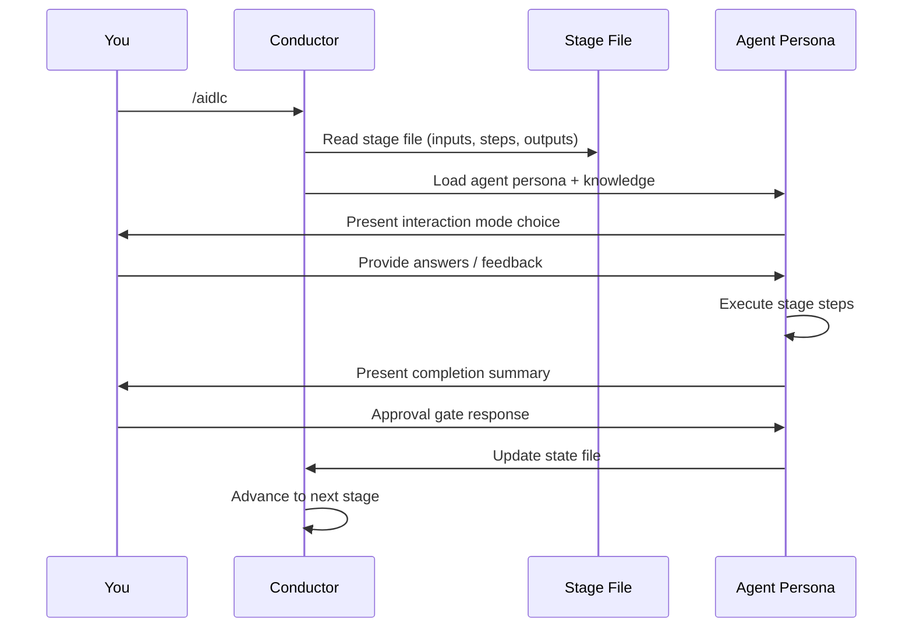
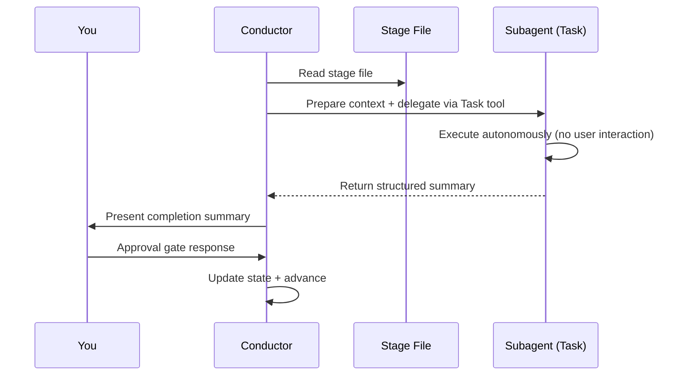

# Your First Workflow

This chapter walks through a complete AI-DLC workflow run, explaining what you see at each step and what decisions you make. The example uses a `feature`-scoped workflow to build a REST API.

---

## Starting the Workflow

```
/aidlc Build a REST API for inventory management
```

At session start, Claude Code renders the AI-DLC welcome message via the `companyAnnouncements` entry in `settings.json`. It explains how AI-DLC works, and shows the stage map and scope options.

```
# Welcome to AI-DLC

**AI-DLC** (AI-Driven Development Life Cycle) is an adaptive methodology that
structures AI-assisted software development into repeatable, traceable phases
while keeping you in control at every decision point.

## How It Works

- **You decide, AI executes.** Every material decision goes through an approval gate.
- **Adaptive scope.** Choose a scope or let AI auto-detect from your intent.
- **Traceable artifacts.** Every stage produces versioned documents in the intent's record dir.
- **11 domain experts.** Specialized agent personas guide each stage.
```

---

## Initialization Phase (Automatic)

The three initialization stages run deterministically inside `aidlc-utility intent-birth`, a single tool call that completes in well under a second. You do not interact with initialization; it auto-births the first intent into the active space and bootstraps its record dir for the workflow.

### Stage 0.1: Workspace Scaffold

The framework births the first intent and creates its record dir at `aidlc/spaces/<space>/intents/<YYMMDD>-<label>/` (the `<space>` is `default` unless you use a named space):

```
Intent born — record dir scaffolded:
  aidlc/spaces/default/intents/<YYMMDD>-<label>/initialization/   (3 stage artifact dirs)
  aidlc/spaces/default/intents/<YYMMDD>-<label>/ideation/         (7 stage artifact dirs)
  ...
Space-level dirs ensured:
  aidlc/spaces/default/knowledge/                             (team knowledge — empty; you add files)
```

### Stage 0.2: Workspace Detection

A deterministic rule-based scanner walks one level deep into the project plus known source directories (`src/`, `app/`, `lib/`, `pages/`, `components/`, `tests/`). It classifies greenfield vs brownfield based on source files, framework configs, and package manifests. When no top-level signal fires, it also descends one level into each arbitrarily-named subdirectory, so a project whose source lives in a container folder (e.g. `wordbook/`, `backend/`) is still detected as brownfield.

### Stage 0.3: State Initialization

The orchestrator writes the intent's `aidlc-state.md` (under its record dir) with the full stage plan based on your scope, depth, test strategy, and the scanner's classification. It also analyzes your input and confirms a scope:

```
─── Scope Detection ───────────────────────────────────────────────────────────
Detected scope: feature (Standard depth, Standard test strategy, all 32 stages)
▸ Approve scope? [Yes / Change scope / Change depth / Change test strategy]
> Yes
```

You can accept the detected scope, change to a different scope (e.g., `mvp`), or adjust the depth level or test strategy. See [Scopes, Depth, and Test Strategy](05-scopes-and-depth.md) for guidance.

---

## Ideation Phase (Interactive)

After Initialization, the workflow enters Ideation. Each stage from here on runs interactively with an approval gate.

### Stage 1.1: Intent Capture (aidlc-product-agent)

The status line at the bottom of your terminal updates:

```
[AIDLC] IDEATION > Intent Capture [▓▓▓▓▓░░░░░] 4/7 -- product
```

This shows: current phase, stage display name, phase progress bar, phase progress ratio, and lead agent. The bar and the ratio share the same scope — both count `[x]` stages within the current phase, so the bar advances every time the ratio does. Remaining context (`ctx:N%`) is always shown on the right, color-coded as it drops.

The aidlc-product-agent asks you to choose an interaction mode:

```
▸ Choose interaction mode:
  (1) Guide Me — agent asks structured questions
  (2) Edit File — write directly to the artifact
  (3) Chat — freeform discussion
```

- **Guide Me** walks you through questions one at a time
- **Edit File** opens the artifact for direct editing
- **Chat** lets you discuss freely; the agent extracts decisions

See [Interaction Modes](07-interaction-modes.md) for details on each mode. You can switch modes mid-stage.

### Approval Gate

After the agent completes its work, you see a completion summary and an approval gate:

```
# Intent Capture & Framing Complete

| Artifact | Contents |
|----------|----------|
| intent-capture.md | Problem statement, target users, success criteria |
| intent-capture-questions.md | 5 questions, all answered |

**Review:** `<record>/ideation/intent-capture/` (the intent's record dir)

▸ How would you like to proceed?
  (1) Approve — Continue to Market Research
  (2) Request Changes — Provide revision feedback
```

Choose **Approve** to continue, or **Request Changes** to provide feedback. See [Interaction Modes](07-interaction-modes.md) for details on the revision process.

After approval, a progress line appears:

```
Progress: 4/32 overall | 1/7 IDEATION stages complete. Next: Market Research
```

### Remaining Ideation Stages

The workflow continues through Market Research, Feasibility & Constraints, Scope Definition, Team Formation, Rough Mockups, and Approval & Handoff. Each follows the same pattern: agent works, you review, you approve.

Some stages are **conditional** — they may be skipped based on your scope. When a stage is skipped, the orchestrator shows why and advances automatically.

---

## Inception Phase

Inception elaborates requirements and designs the solution. Stage 2.1 (Reverse Engineering) is notable because it runs as a **subagent** — the conductor delegates to the aidlc-developer-agent for a code scan, then the aidlc-architect-agent for synthesis. This stage runs only for **brownfield** projects (existing codebases).

```
─── Stage 2.1: Reverse Engineering (subagent) ──────────────────────────────
Delegating to aidlc-developer-agent for code scan...
[Running in background — no interaction needed]
...
Developer scan complete. Delegating to aidlc-architect-agent for synthesis...
...
✓ 9 reverse engineering artifacts produced
```

Remaining Inception stages (Requirements Analysis through Delivery Planning) run inline with you.

---

## Construction Phase

Construction builds the solution **Bolt by Bolt**. A [Bolt](glossary.md) is one pass through stages 3.1–3.5 for a Unit (or small group of dependency-linked Units). Each Bolt ships a reviewable slice; the 2.8 plan decides the sequence and marks the first Bolt as the **walking skeleton** — the smallest end-to-end slice that proves the architecture.

```
─── Construction: Bolt 1 — notification-core (walking skeleton) ───────────
```

The walking skeleton is **always gated** — you review its design artifacts and generated code before any other Bolt runs. Immediately after approval, the **ladder prompt** fires exactly once:

```
The walking skeleton shipped. How should the remaining Bolts run?
  ▸ Continue autonomously
  ▸ Gate every Bolt
```

Your answer is recorded in `aidlc-state.md` as `Construction Autonomy Mode` and governs every remaining Bolt in this workflow (session resume respects it). Stage 3.5 (Code Generation) runs as a subagent for each Unit inside the Bolt; the per-Unit gate in that stage file is suppressed — a single Bolt-level (or batch-level) gate replaces it.

Bolts whose dependencies are satisfied and that don't depend on each other run in a **parallel batch** — the orchestrator issues multiple `Task` calls in a single turn. A failure always halts and asks for retry / skip / abort, even when you've chosen autonomous mode.

After all Bolts complete, stages 3.6 (Build and Test) and 3.7 (CI Pipeline) run once across the whole solution.

---

## Operation Phase

Operation deploys and monitors the solution. All 7 stages are conditional — smaller scopes like `poc` and `bugfix` may skip this entire phase.

After the final stage (4.7 Feedback & Optimization), the workflow is complete.

---

## How Execution Modes Work

Throughout the workflow, you encounter two execution modes:

### Inline Execution

Most stages run inline. The conductor loads the agent persona and executes stage steps directly in your conversation. You interact with the agent in real time.



<!-- Text fallback: You invoke /aidlc. The conductor reads the stage file and loads the agent persona with knowledge. The agent presents an interaction mode, you provide input, the agent executes steps and presents a completion summary. You respond at the approval gate, and the conductor reports the outcome so the engine advances state. -->

### Subagent Delegation

Two stages (2.1 Reverse Engineering, 3.5 Code Generation) run as subagents. The conductor delegates to a background subprocess; you do not interact during execution. Workspace detection (0.2) now runs deterministically inside `aidlc-utility intent-birth` rather than as a subagent.



<!-- Text fallback: The conductor reads the stage file, prepares context, and delegates via the Task tool. The subagent executes autonomously without user interaction and returns a structured summary. The conductor presents the summary to you, you respond at the approval gate, and the conductor reports the outcome so the engine advances state. -->

---

## Artifacts Produced

By the end of a `feature`-scoped workflow, the intent's record dir (`aidlc/spaces/<space>/intents/<YYMMDD>-<label>/`) contains:

```
aidlc/spaces/<space>/intents/<YYMMDD>-<label>/
├── aidlc-state.md          # Workflow state (all stages marked [x])
├── audit/                  # Full decision audit trail (per-clone shards, merged by timestamp)
├── ideation/               # Intent, market research, scope, mockups
├── inception/              # Requirements, stories, design, units
├── construction/           # Per-unit code + test artifacts
├── operation/              # Deployment, observability, incident plans
└── verification/           # Phase boundary verification reports
```

(Team knowledge lives one level up, at the space level in `aidlc/spaces/<space>/knowledge/` — a sibling of `intents/` — so it accumulates across every intent. Team-affirmed practices and learnings live alongside it in the space's memory layer at `aidlc/spaces/<space>/memory/`, where they likewise persist across intents.)

---

## Status Line

Throughout the workflow, the terminal status line shows your current position:

```
[AIDLC] IDEATION > Intent Capture [▓▓▓▓▓░░░░░] 4/7 -- product
```

| Segment | Meaning |
|---------|---------|
| `IDEATION` | Current phase |
| `> Intent Capture` | Current stage display name |
| `[▓▓▓▓▓░░░░░]` | Phase progress bar (10 chars, same scope as the `n/m` ratio) |
| `4/7` | Stage progress within the phase |
| `-- product` | Lead agent for this stage |
| `ctx:N%` | Remaining context (always shown, color-coded as it drops) |

---

## Next Steps

- [Spaces and Intents](03-spaces-and-intents.md) — how the workspace holds many runs, and how to start and switch between them
- [Phases and Stages](04-phases-and-stages.md) — detailed breakdown of all 5 phases and 32 stages
- [Interaction Modes](07-interaction-modes.md) — Guide Me, Edit File, and Chat explained
- [Session Management](11-session-management.md) — resuming, redoing, and jumping between stages
- [Glossary](glossary.md) — terminology reference
