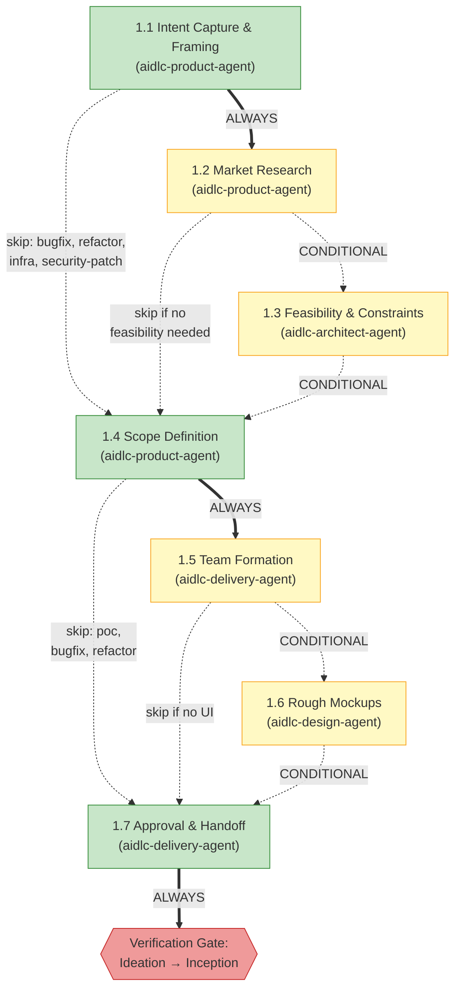
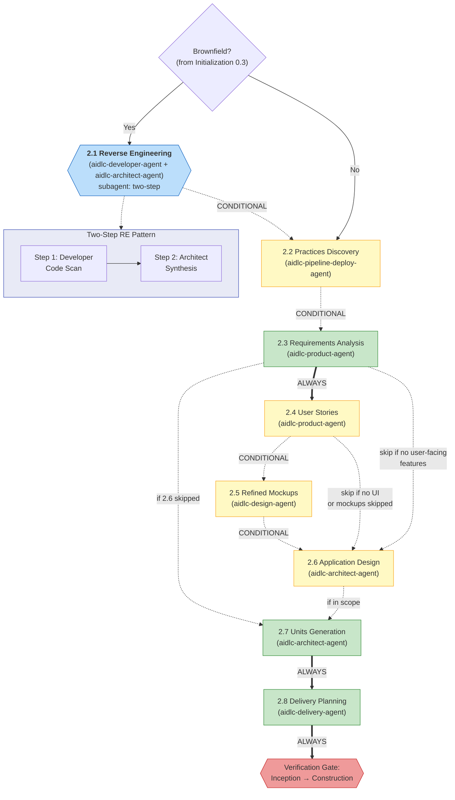
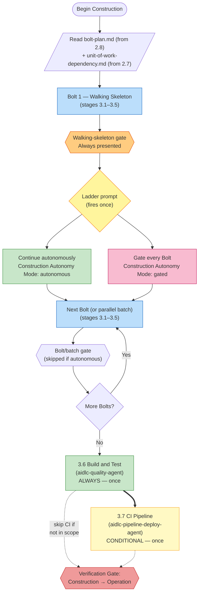
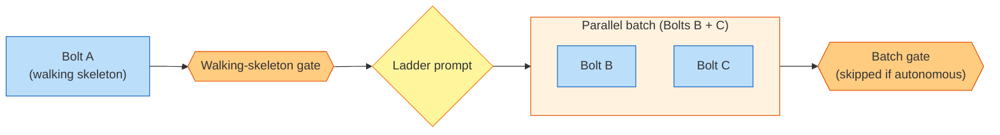
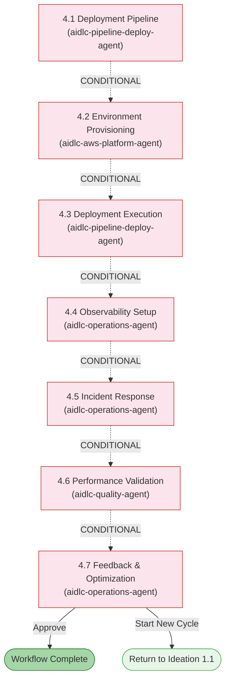

# Phases and Stages

The AI-DLC lifecycle is organized into 5 phases containing 32 stages. This chapter explains each phase, lists its stages, and shows how they connect.

> **Harness note.** The methodology — the phases, stages, agents, and gates this
> guide describes — is identical on every harness. Where a mechanic differs by
> harness (how a gate renders, how a subagent is dispatched, where config lives),
> the difference is called out and tabled in your harness's chapter:
> [Running on other harnesses](harnesses/README.md). Examples here use Claude Code
> unless noted.

---

## Lifecycle Overview

```mermaid
graph LR
    subgraph INITIALIZATION["INITIALIZATION (0.1-0.3)"]
        Z1["Workspace Scaffold"]
        Z4["State Init"]
        Z1 -.->|"3 stages"| Z4
    end

    subgraph IDEATION["IDEATION (1.1-1.7)"]
        I1["Intent Capture"]
        I7["Approval & Handoff"]
        I1 -.->|"7 stages"| I7
    end

    subgraph INCEPTION["INCEPTION (2.1-2.8)"]
        N1["Reverse Engineering"]
        N7["Delivery Planning"]
        N1 -.->|"8 stages"| N7
    end

    subgraph CONSTRUCTION["CONSTRUCTION (3.1-3.7)"]
        C1["Functional Design"]
        C7["CI Pipeline"]
        C1 -.->|"7 stages per unit"| C7
    end

    subgraph OPERATION["OPERATION (4.1-4.7)"]
        O1["Deployment Pipeline"]
        O7["Feedback & Optimization"]
        O1 -.->|"7 stages"| O7
    end

    Z4 -->|"auto-proceed"| I1
    I7 -->|"Verification Gate 1"| N1
    N7 -->|"Verification Gate 2"| C1
    C7 -->|"Verification Gate 3"| O1
    O7 -.->|"Feedback Loop"| I1

    style INITIALIZATION fill:#f3e5f5,stroke:#9c27b0
    style IDEATION fill:#e8f5e9,stroke:#4caf50
    style INCEPTION fill:#e3f2fd,stroke:#2196f3
    style CONSTRUCTION fill:#fff3e0,stroke:#ff9800
    style OPERATION fill:#fce4ec,stroke:#e91e63
```

<!-- Text fallback: Linear flow: INITIALIZATION (0.1-0.3) auto-proceeds to IDEATION (1.1-1.7), which passes through Verification Gate 1 to INCEPTION (2.1-2.8), through Verification Gate 2 to CONSTRUCTION (3.1-3.7), through Verification Gate 3 to OPERATION (4.1-4.7). A feedback loop returns from 4.7 back to 1.1. -->

Phases execute sequentially. At each phase boundary (except Initialization → Ideation), a **verification gate** runs automated traceability checks to catch missing links, orphaned artifacts, or inconsistencies before downstream stages build on them.

---

## Phase 0: Initialization

**Purpose:** Bootstrap the workspace — scaffold the docs directory, detect the workspace, and initialize state. The welcome message is shown at session start via the `companyAnnouncements` entry in `settings.json` (not a stage).

Initialization stages run **automatically** without approval gates. All three execute inside a single deterministic tool call (`aidlc-utility intent-birth`) that completes in well under a second.

| # | Stage | Lead | Key Artifacts | Condition |
|---|-------|------|---------------|-----------|
| 0.1 | Workspace Scaffold | orchestrator | first intent's record dir (`aidlc/spaces/<space>/intents/<YYMMDD>-<label>/`) | ALWAYS |
| 0.2 | Workspace Detection | orchestrator | `aidlc-state.md` (workspace state) | ALWAYS |
| 0.3 | State Initialization | orchestrator | `aidlc-state.md`, `audit/` shards | ALWAYS |

**Execution notes:**
- All three stages run inline inside `aidlc-utility intent-birth` - no LLM subagent delegation, no per-stage prompt.
- Workspace detection is a rule-based scanner (file extensions, known config filenames, package manifests).
- No user interaction is needed during this phase.

---

## Phase 1: Ideation

**Purpose:** Validate the initiative — capture intent, assess feasibility, define scope, form the team, and secure approval to proceed.

<!-- Text fallback: 1.1 Intent Capture (ALWAYS) flows to 1.2 Market Research (CONDITIONAL) or directly to 1.4. 1.2 flows to 1.3 Feasibility (CONDITIONAL) or to 1.4. 1.3 flows to 1.4 Scope Definition (ALWAYS). 1.4 flows to 1.5 Team Formation (CONDITIONAL) or to 1.7. 1.5 flows to 1.6 Rough Mockups (CONDITIONAL, skip if no UI) or to 1.7. 1.6 flows to 1.7 Approval & Handoff (ALWAYS), then Verification Gate 1. -->

| # | Stage | Lead | Supporting | Key Artifacts | Condition |
|---|-------|------|-----------|---------------|-----------|
| 1.1 | Intent Capture & Framing | aidlc-product-agent | aidlc-architect-agent | Intent statement, stakeholder map | ALWAYS |
| 1.2 | Market Research | aidlc-product-agent | — | Competitive analysis, build-vs-buy | CONDITIONAL |
| 1.3 | Feasibility & Constraints | aidlc-architect-agent | aidlc-aws-platform-agent, aidlc-compliance-agent | Feasibility assessment, constraint register, RAID log | CONDITIONAL |
| 1.4 | Scope Definition | aidlc-product-agent | aidlc-delivery-agent | Scope definition, intent backlog | ALWAYS |
| 1.5 | Team Formation | aidlc-delivery-agent | — | Team assessment, mob composition plan | CONDITIONAL |
| 1.6 | Rough Mockups | aidlc-design-agent | aidlc-product-agent | Wireframes, user flows, concept deck | CONDITIONAL |
| 1.7 | Approval & Handoff | aidlc-delivery-agent | aidlc-product-agent | Initiative brief, decision log | ALWAYS |

**Stage colors:** Green = ALWAYS (runs for every scope). Yellow = CONDITIONAL (skipped for some scopes).

---

## Phase 2: Inception

**Purpose:** Elaborate the requirements — analyze the codebase, elicit requirements, design architecture, decompose into units of work, and plan delivery.

<!-- Text fallback: Brownfield check (from stage 0.3). If yes, 2.1 Reverse Engineering runs with two-step delegation (developer code scan then architect synthesis). Then 2.2 Practices Discovery (CONDITIONAL — discovers the team's way of working and promotes it to the team/project rule files at an affirmation gate), 2.3 Requirements Analysis (ALWAYS), optionally 2.4 User Stories, optionally 2.5 Refined Mockups, optionally 2.6 Application Design, 2.7 Units Generation (ALWAYS), and 2.8 Delivery Planning (ALWAYS) passes through Verification Gate 2. -->

| # | Stage | Lead | Supporting | Key Artifacts | Condition |
|---|-------|------|-----------|---------------|-----------|
| 2.1 | Reverse Engineering | aidlc-developer-agent | aidlc-architect-agent | 9 RE artifacts | Brownfield projects |
| 2.2 | Practices Discovery | aidlc-pipeline-deploy-agent | aidlc-quality-agent, aidlc-developer-agent, aidlc-devsecops-agent | `team-practices.md`, `discovered-rules.md`, `evidence.md` (promoted to `aidlc/spaces/<space>/memory/team.md` / `memory/project.md` on affirmation) | CONDITIONAL |
| 2.3 | Requirements Analysis | aidlc-product-agent | — | `requirements.md` | ALWAYS |
| 2.4 | User Stories | aidlc-product-agent | aidlc-design-agent | `stories.md`, `personas.md` | User-facing features |
| 2.5 | Refined Mockups | aidlc-design-agent | aidlc-product-agent | Hi-fi mockups, interaction spec | UI projects |
| 2.6 | Application Design | aidlc-architect-agent | aidlc-aws-platform-agent, aidlc-design-agent | App design artifacts, ADRs | Per execution plan |
| 2.7 | Units Generation | aidlc-architect-agent | aidlc-delivery-agent | `unit-of-work.md`, `unit-of-work-dependency.md` (DAG), `unit-of-work-story-map.md` | ALWAYS |
| 2.8 | Delivery Planning | aidlc-delivery-agent | aidlc-architect-agent | `bolt-plan.md`, `team-allocation.md`, `risk-and-sequencing-rationale.md`, `external-dependency-map.md` | ALWAYS |

**Key behavior:** Stage 2.1 runs as a **subagent** using the two-step Reverse Engineering pattern — first an aidlc-developer-agent code scan, then an aidlc-architect-agent synthesis. It only executes for brownfield (existing codebase) projects.

---

## Phase 3: Construction

**Purpose:** Build the solution — design, implement, and test — in reviewable slices.

### Why Construction works the way it does

Construction used to run stage-by-stage per [unit of work](glossary.md), with an approval gate after every stage. A three-unit project meant fifteen gates before a single line of tested code shipped. Customers called it babysitting.

The first fix batched all questions, all design artifacts, then all code generation across every unit — one review at the end. That swung the pendulum the other way. A 15-unit run could land 15,000 lines of code at the build-and-test gate. Too much to verify in a single review.

The current shape is the middle path: Construction runs **Bolt by Bolt**. Each [Bolt](glossary.md) is one pass through stages 3.1–3.5 for a Unit (or small group of dependency-linked Units). The first Bolt is the **walking skeleton** — gated and interactive: the smallest end-to-end slice that proves the architecture. Once that ships, the **ladder prompt** fires exactly once: "continue autonomously, or gate every Bolt?" Your answer is recorded in state and governs every remaining Bolt in the workflow. Stages 3.6 (Build and Test) and 3.7 (CI Pipeline) run once at the end across everything.

The shape gives you an early confidence checkpoint and a deliberate autonomy choice, with reviewable slices sized to the Bolts 2.8 already planned.

### Construction flow

<!-- Text fallback: Begin Construction → read bolt-plan.md and unit-of-work-dependency.md → execute Bolt 1 (walking skeleton, stages 3.1–3.5) → walking-skeleton gate (always) → ladder prompt (fires once, choose autonomous or gated) → loop executing remaining Bolts (each covers 3.1–3.5) with or without per-Bolt gate depending on mode → once all Bolts are done, run 3.6 Build and Test then optionally 3.7 CI Pipeline → Verification Gate 3. -->

### Parallel Bolt batches

When two Bolts share their dependency prerequisite (for example, Bolts B and C both depend only on A) and don't depend on each other, they run concurrently in a single **batch**. A single gate at the end of the batch covers every Bolt in it.

<!-- Text fallback: Bolt A (walking skeleton) runs first, followed by its gate and the ladder prompt. When B and C both depend only on A, they form a parallel batch that executes concurrently. A single batch-level gate covers both Bolts (or is skipped if the user chose "Continue autonomously"). -->

The conductor (the live `/aidlc` session) dispatches parallel Bolts by issuing multiple `Task` calls in a single turn — Claude Code's built-in parallelism runs the Code Generation stage for each Bolt concurrently. Question collection and design-artifact generation still run per-Bolt (they're cheap, and question answers have to be serialized through the user anyway).

### Halt-and-ask on failure

Failures always stop Construction, even in autonomous mode. That's the one place autonomous mode interrupts.

- If a solo Bolt fails, Construction halts immediately and offers **retry** (re-run just that Bolt), **skip** (mark it `[S]` and continue — dependent Bolts will likely also fail), or **abort** (stop Construction entirely).
- If one Bolt in a parallel batch fails while others succeed, the conductor waits for the whole batch to finish, preserves the successful Bolts' artifacts on disk, and presents the same retry / skip / abort choice for the failed Bolt only.

### Stage reference

| # | Stage | Lead | Supporting | Key Artifacts | Runs |
|---|-------|------|-----------|---------------|------|
| 3.1 | Functional Design | aidlc-architect-agent | aidlc-developer-agent | `business-logic-model.md`, `business-rules.md` | Per Bolt (CONDITIONAL by execution plan) |
| 3.2 | NFR Requirements | aidlc-architect-agent | aidlc-devsecops-agent, aidlc-compliance-agent, aidlc-quality-agent | Security, performance, reliability NFRs | Per Bolt (CONDITIONAL) |
| 3.3 | NFR Design | aidlc-architect-agent | aidlc-aws-platform-agent | NFR design specifications | Per Bolt (CONDITIONAL) |
| 3.4 | Infrastructure Design | aidlc-aws-platform-agent | aidlc-devsecops-agent, aidlc-compliance-agent | Infrastructure specifications, IaC designs | Per Bolt (CONDITIONAL) |
| 3.5 | Code Generation | aidlc-developer-agent | — | Application code + code docs | Per Bolt (ALWAYS, per Unit within the Bolt) |
| 3.6 | Build and Test | aidlc-quality-agent | aidlc-devsecops-agent | Test results, quality report | ALWAYS, once at end |
| 3.7 | CI Pipeline | aidlc-pipeline-deploy-agent | — | CI config, quality gates | CONDITIONAL, once at end |

**Key behaviors:**

- Within each Bolt, questions for stages 3.1–3.4 are collected in a single interactive pass across the Bolt's Units before any artifacts generate. A single Bolt-level answers gate confirms all answers before design artifacts begin.
- The per-Unit approval gate inside `stages/construction/code-generation.md` is **suppressed by the conductor** during normal Bolt execution. A single Bolt-level (or batch-level) gate replaces it.
- The ladder prompt fires exactly once per workflow — after the walking-skeleton gate. Your answer is recorded as `Construction Autonomy Mode` in `aidlc-state.md` and honoured on session resume.
- Parallel batches require multiple `Task`-capable subagent slots to be available — see [Agents](06-agents.md) for concurrency constraints.

---

## Phase 4: Operation

**Purpose:** Deploy and operate — set up deployment pipelines, provision environments, configure observability, and establish feedback loops.

<!-- Text fallback: All Operation stages are CONDITIONAL. 4.1 through 4.7 flow sequentially. Stage 4.7 can either complete the workflow or loop back to start a new Ideation cycle at 1.1. -->

| # | Stage | Lead | Supporting | Key Artifacts | Condition |
|---|-------|------|-----------|---------------|-----------|
| 4.1 | Deployment Pipeline | aidlc-pipeline-deploy-agent | — | CD config, deployment strategy, rollback runbook | CONDITIONAL |
| 4.2 | Environment Provisioning | aidlc-aws-platform-agent | aidlc-devsecops-agent, aidlc-compliance-agent | Environment inventory, validation report | CONDITIONAL |
| 4.3 | Deployment Execution | aidlc-pipeline-deploy-agent | aidlc-developer-agent | Deployment log, smoke tests, health checks | CONDITIONAL |
| 4.4 | Observability Setup | aidlc-operations-agent | — | Dashboards, alarms, SLO config | CONDITIONAL |
| 4.5 | Incident Response | aidlc-operations-agent | — | SSM runbooks, incident plan, escalation matrix | CONDITIONAL |
| 4.6 | Performance Validation | aidlc-quality-agent | — | Load test results, NFR validation matrix | CONDITIONAL |
| 4.7 | Feedback & Optimization | aidlc-operations-agent | aidlc-aws-platform-agent | SLO report, cost analysis, feedback loop doc | CONDITIONAL |

**Key behaviors:**
- All 7 stages are **conditional** — the entire phase may be skipped for `mvp`, `poc`, `bugfix`, and `refactor` scopes
- Stage 4.7 is the **terminal stage** — on approval, the workflow is complete
- The **feedback loop** from 4.7 back to 1.1 enables iterative development cycles

---

## Phase Transitions and Verification Gates

At each phase boundary (Ideation → Inception, Inception → Construction, Construction → Operation), the framework runs **phase boundary verification**. This automated check validates:

- All required artifacts from the completing phase exist
- Traceability links between artifacts are intact (e.g., every requirement maps to a story)
- No orphaned artifacts or missing references
- Consistency between related artifacts

If verification fails, the conductor reports the issues and asks whether to proceed or go back to fix them.

---

## Stage Execution Modes Reference

| Mode | Stages | User Interaction | Description |
|------|--------|-----------------|-------------|
| Inline (auto-proceed) | 0.1, 0.2, 0.3 | None | Run deterministically inside `aidlc-utility intent-birth`, no approval gate |
| Inline | All other stages | Full | Agent works in conversation, approval gate at end |
| Subagent (simple) | 3.5 | Approval gate only | Code generation runs in background |
| Subagent (two-step) | 2.1 | Approval gate only | Developer scan + architect synthesis |

---

## Next Steps

- [Scopes, Depth, and Test Strategy](05-scopes-and-depth.md) — how scopes control which stages execute
- [Agents](06-agents.md) — the 14-agent roster and its domain, review, and composition roles
- [Your First Workflow](02-your-first-workflow.md) — annotated walkthrough
- [Glossary](glossary.md) — terminology reference
