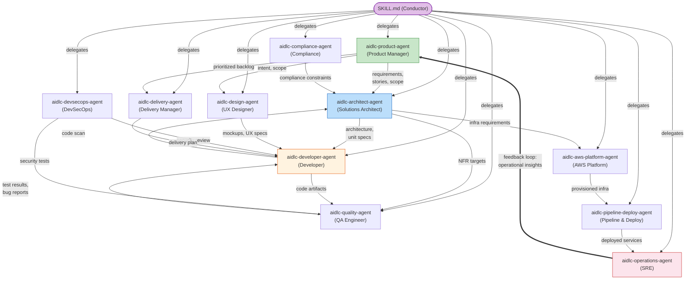

# Agents

AI-DLC ships 14 agent personas: 11 domain experts that execute stage work, 2 review-only agents, and the adaptive-workflows composer. This chapter explains the full roster, beginning with the domain agents and then covering the reviewers and composer.

---

## Philosophy: Small Mob, Broad Agents

Rather than dozens of narrow specialists (which recreates waterfall handoff chains), AI-DLC uses **11 broadly capable agents** that each participate across multiple stages and phases.

### Why 11, not 30?

In human software teams, a mob of 3-5 people covers an entire feature from requirements through deployment. Each person brings a broad skill set spanning several specialties. AI-DLC mirrors this model:

- **Each agent covers a whole domain across many tasks.** The aidlc-architect-agent handles feasibility, application design, units generation, functional design, NFR requirements, and NFR design — six stages across three phases. A narrow specialist model would require six separate agents with nearly identical knowledge bases.

- **Fewer agents means fewer handoffs.** Every agent boundary is a potential information loss point. When the same aidlc-architect-agent leads both Application Design and Functional Design, it retains context naturally instead of requiring an explicit handoff artifact.

- **Support roles enable collaboration without proliferation.** Rather than creating a "security-reviewer-agent" and a "compliance-reviewer-agent" and a "cost-reviewer-agent," the aidlc-devsecops-agent and aidlc-compliance-agent participate as support agents in stages led by others. HOW they participate is the stage's `mode` — its communication topology: on an `inline` stage the conductor adopts each support agent as a persona in its own context; on `subagent` (hub-and-spoke) and `mob` (mesh) stages each support agent is dispatched as a real, independent collaborator that writes its own contribution file for the lead to integrate (everyone writes, the lead owns the final artifacts; user-stories ships as the mob showcase), and on `pipeline` (chain) stages the links advance the artifacts directly in sequence (reverse-engineering is the shipped chain). On every topology the conductor performs every delegation — agents never invoke each other.

- **Knowledge loading is per-agent.** Each agent loads methodology knowledge from `.claude/knowledge/<agent-name>/` and team knowledge from the space-level `aidlc/knowledge/<agent-name>/` (if the team created it). Fewer agents means fewer knowledge directories to manage and fewer opportunities for contradictory guidance.

---

## Agent Collaboration Map

The following diagram shows how agents exchange information during a workflow. Solid arrows indicate primary artifact flows. Dashed arrows indicate advisory or review relationships. The operations-to-product feedback loop closes the full lifecycle.

<!-- Text fallback: The SKILL.md conductor delegates to all 11 agents. Key flows: aidlc-product-agent sends requirements/stories to aidlc-architect-agent, who sends specs to aidlc-developer-agent. aidlc-developer-agent sends code to aidlc-quality-agent, who sends test results back. aidlc-aws-platform-agent provisions infrastructure for aidlc-pipeline-deploy-agent, who deploys for aidlc-operations-agent. The feedback loop: aidlc-operations-agent sends operational insights back to aidlc-product-agent, closing the cycle. -->

---

## The 11 Domain Agents

> **Customizing what a shipped agent knows?** Do not edit the 14 shipped agent files at `.claude/agents/*.md` — they're framework files and get overwritten on upgrade. Add your company standards to the space-level `aidlc/knowledge/<agent-name>/` instead. See [Knowledge](08-knowledge.md) for the full workflow. Teams that want a *new* agent can drop a file at `.claude/agents/<slug>.md` with the required frontmatter — that file is user-owned. See [Contributing: Adding an Agent](../reference/11-contributing.md#adding-an-agent).

Each agent below has a **deep-dive page** — its full responsibilities, the stages it leads and supports, and the knowledge it loads. The [agent deep-dive index](agents/README.md) lists all 11; the per-agent links are inline under each heading.

### [aidlc-product-agent](agents/product-agent.md)

**Domain:** Requirements, user stories, scope, market research

The aidlc-product-agent acts as the product manager and business analyst. It captures intent, conducts market research, defines scope, elicits requirements, and produces user stories. It is the most active agent in the Ideation and Inception phases.

- **Leads:** intent-capture, market-research, scope-definition, requirements-analysis, user-stories
- **Supports:** rough-mockups, approval-handoff, refined-mockups
- **Special tools:** WebSearch (for market research)

### [aidlc-design-agent](agents/design-agent.md)

**Domain:** UX/UI design, wireframes, interaction design, accessibility

The aidlc-design-agent creates wireframes, mockups, and interaction specifications. It works closely with the aidlc-product-agent on user-facing features and with the aidlc-developer-agent to ensure designs are implementable.

- **Leads:** rough-mockups, refined-mockups
- **Supports:** user-stories, application-design
- **Special tools:** WebSearch (for design research)

### [aidlc-delivery-agent](agents/delivery-agent.md)

**Domain:** Team formation, capacity planning, delivery sequencing

The aidlc-delivery-agent acts as the engineering manager. It assesses team capacity, forms the mob composition, plans delivery sequencing, and manages phase handoffs.

- **Leads:** team-formation, approval-handoff, delivery-planning
- **Supports:** scope-definition, units-generation
- **Special tools:** None beyond the shared set

### [aidlc-architect-agent](agents/architect-agent.md)

**Domain:** Application design, domain modelling, NFRs, component decomposition

The aidlc-architect-agent is the central design authority. It has the broadest stage involvement (9 stages across 3 phases) and carries the `judgment` tier — alongside seven other high-judgment agents (product, design, developer, quality, devsecops, compliance, aws-platform). A judgment agent inherits your session's own model and effort, so it is never downgraded below what you chose. Only delivery, pipeline-deploy, and operations carry the `templated` tier (a mid-size model at reduced effort), because their output is dominantly templated planning, CI/CD YAML, and runbook scaffolding.

- **Leads:** feasibility, application-design, units-generation, functional-design, nfr-requirements, nfr-design
- **Supports:** intent-capture, reverse-engineering (synthesis), delivery-planning

### [aidlc-aws-platform-agent](agents/aws-platform-agent.md)

**Domain:** AWS infrastructure, CDK/CloudFormation, cost optimization

The aidlc-aws-platform-agent designs infrastructure, provisions environments, and optimizes costs. It has Bash access for running AWS CLI and CDK commands.

- **Leads:** infrastructure-design, environment-provisioning
- **Supports:** feasibility, application-design, nfr-design, feedback-optimization
- **Special tools:** Bash (for `aws`, `cdk` commands)

### [aidlc-compliance-agent](agents/compliance-agent.md)

**Domain:** Regulatory scanning, data classification, risk assessment

The aidlc-compliance-agent operates purely in an advisory capacity — it has no lead stages. It feeds regulatory constraints into stages led by other agents, particularly the aidlc-architect-agent and aidlc-devsecops-agent.

- **Leads:** None (support only)
- **Supports:** feasibility, nfr-requirements, infrastructure-design, environment-provisioning
- **Special tools:** WebSearch (for regulatory research)

### [aidlc-devsecops-agent](agents/devsecops-agent.md)

**Domain:** Threat modelling, security scanning, DevSecOps pipelines

The aidlc-devsecops-agent reviews designs for security, defines security requirements, and integrates security into CI/CD pipelines. Like the aidlc-compliance-agent, it operates in a support role.

- **Leads:** None (support only)
- **Supports:** practices-discovery, nfr-requirements, infrastructure-design, build-and-test, environment-provisioning
- **Special tools:** Bash (for security scanning)

### [aidlc-developer-agent](agents/developer-agent.md)

**Domain:** Code implementation, code analysis, data modelling

The aidlc-developer-agent spans three phases — from reverse engineering in Inception through deployment support in Operation. It runs code scans of existing codebases and generates implementation code.

- **Leads:** reverse-engineering (code scan), code-generation
- **Supports:** practices-discovery, user-stories, functional-design, deployment-execution

Workspace detection (workspace-detection) used to be a subagent of the aidlc-developer-agent; it now runs deterministically inside `aidlc-utility intent-birth` using rule-based file and manifest detection.
- **Special tools:** Bash (for build and run commands)

### [aidlc-quality-agent](agents/quality-agent.md)

**Domain:** Test strategy, test generation, performance validation

The aidlc-quality-agent defines test strategy, generates test suites, validates quality gates, and runs performance testing.

- **Leads:** build-and-test, performance-validation
- **Supports:** practices-discovery, user-stories, nfr-requirements
- **Special tools:** Bash (for test execution)

### [aidlc-pipeline-deploy-agent](agents/pipeline-deploy-agent.md)

**Domain:** CI/CD pipelines, deployment strategy, release execution

The aidlc-pipeline-deploy-agent configures CI/CD pipelines, plans deployment strategy, and executes releases with rollback capabilities.

- **Leads:** practices-discovery, ci-pipeline, deployment-pipeline, deployment-execution
- **Supports:** None
- **Special tools:** Bash (for pipeline and deployment commands)

### [aidlc-operations-agent](agents/operations-agent.md)

**Domain:** Observability, incident response, SLO tracking, feedback loops

The aidlc-operations-agent sets up monitoring, defines incident response procedures, and closes the lifecycle loop by feeding operational insights back to the aidlc-product-agent for the next iteration.

- **Leads:** observability-setup, incident-response, feedback-optimization
- **Supports:** performance-validation
- **Special tools:** Bash (for observability and monitoring commands)

---

## Phase Participation

This table shows which agents are active in which phases, and whether they serve as lead (L) or support (S).

| Agent | Phase 0 | Phase 1 | Phase 2 | Phase 3 | Phase 4 |
|-------|---------|---------|---------|---------|---------|
| aidlc-product-agent | — | L (intent-capture, market-research, scope-definition), S (rough-mockups, approval-handoff) | L (requirements-analysis, user-stories), S (refined-mockups) | — | — |
| aidlc-design-agent | — | L (rough-mockups) | L (refined-mockups), S (user-stories, application-design) | — | — |
| aidlc-delivery-agent | — | L (team-formation, approval-handoff), S (scope-definition) | L (delivery-planning), S (units-generation) | — | — |
| aidlc-architect-agent | — | L (feasibility), S (intent-capture) | L (application-design, units-generation), S (reverse-engineering, delivery-planning) | L (functional-design, nfr-requirements, nfr-design) | — |
| aidlc-aws-platform-agent | — | S (feasibility) | S (application-design) | L (infrastructure-design), S (nfr-design) | L (environment-provisioning), S (feedback-optimization) |
| aidlc-compliance-agent | — | S (feasibility) | — | S (nfr-requirements, infrastructure-design) | S (environment-provisioning) |
| aidlc-devsecops-agent | — | — | S (practices-discovery) | S (nfr-requirements, infrastructure-design, build-and-test) | S (environment-provisioning) |
| aidlc-developer-agent | — | — | L (reverse-engineering), S (practices-discovery, user-stories) | L (code-generation), S (functional-design) | S (deployment-execution) |
| aidlc-quality-agent | — | — | S (practices-discovery, user-stories) | L (build-and-test), S (nfr-requirements) | L (performance-validation) |
| aidlc-pipeline-deploy-agent | — | — | L (practices-discovery) | L (ci-pipeline) | L (deployment-pipeline, deployment-execution) |
| aidlc-operations-agent | — | — | — | — | L (observability-setup, incident-response, feedback-optimization) |

### Observations

- The **aidlc-architect-agent** has the broadest involvement (9 stages across 3 phases). It carries the `judgment` tier (inherits your session's model and effort), as do seven other high-judgment agents; only **aidlc-delivery-agent**, **aidlc-pipeline-deploy-agent**, and **aidlc-operations-agent** carry the `templated` tier
- The **aidlc-developer-agent** spans 3 phases: Inception, Construction, and Operation
- The **aidlc-compliance-agent** and **aidlc-devsecops-agent** operate purely in support roles, participating in stages led by others
- The **aidlc-operations-agent** closes the lifecycle loop by feeding insights back to the aidlc-product-agent

---

## Agent Tool Access

Every agent inherits the **full session toolset** — all of Claude Code's built-in tools plus any MCP tools provisioned to the session. The one shipped restriction is `disallowedTools: Task` (only the conductor spawns subagents); none of the 14 agents declare a `tools:` allowlist. So the table below is not a set of per-agent grants — it records which tools each persona is *expected* to exercise in its work.

| Tool | Expected to exercise it |
|------|-------------|
| Read, Edit, Write, Glob, Grep, AskUserQuestion | All 14 agents |
| Bash | aidlc-aws-platform-agent, aidlc-devsecops-agent, aidlc-developer-agent, aidlc-quality-agent, aidlc-pipeline-deploy-agent, aidlc-operations-agent |
| WebSearch | aidlc-product-agent, aidlc-design-agent, aidlc-compliance-agent |
| Task | None (blocked on every agent via `disallowedTools: Task`) |

To genuinely narrow a persona, add an optional `tools:` allowlist to its frontmatter — but doing so drops inherited MCP access unless the fully-qualified `mcp__<server>__<tool>` ids are also listed. This implementation ships no such restrictions today.

### MCP servers are shared, not per-agent

The table above shows the built-in tools each persona is expected to use; in practice every agent inherits all of them. MCP servers follow the same inherit-all model: this implementation declares them once in `.mcp.json` at the project root (beside `.claude/`), Claude Code provisions them to the session, and every agent inherits all of them — there is no per-agent grant. Each of the 14 agents can reach every declared server (`context7` and the four AWS servers) with no further configuration, and a server you lack credentials for is simply unavailable rather than a blocker. To stop a specific agent from reaching a server, narrow that agent's `tools:` allowlist to the fully-qualified `mcp__<server>__<tool>` ids it should keep (for example `mcp__context7__<tool>`); this implementation ships no such restrictions today.

See [Getting Started](01-getting-started.md) for the server registry and credentials, and [Harness Primitives Mapping](../reference/14-claude-features.md#mcp-servers) for how MCP maps onto Claude Code's native tool model.

---

## Reviewer Agents

Beyond the 11 domain-expert agents, AI-DLC ships **2 quality-gate reviewer
agents**. They do not produce artifacts — they review what a builder produced and
challenge it, representing the customer (or the review board) at the gate.

| Reviewer | Reviews | Tier |
|----------|---------|------|
| `aidlc-product-lead-agent` | Requirements, user stories, and UX/mockup artifacts — completeness, business alignment, testability | balanced |
| `aidlc-architecture-reviewer-agent` | Technical design artifacts — soundness, implementability, broken cross-references, unachievable NFR targets | balanced |

## The Composer Agent

One more agent sits outside both groups: `aidlc-composer-agent`, the adaptive-workflows composer. The conductor dispatches it on a compose request (`/aidlc compose`, a compose offer on a cold start, `--report`, or `--new-scope`). It reads the task and the workspace scan, proposes the EXECUTE/SKIP stage grid with a per-SKIP rationale, and - only after your approval at the gate - authors the composed scope (front/report) or proposes pending-stage flips the deterministic `recompose` verb applies (in-flight). Its persona is deliberately keep-biased: it justifies presence and interrogates absence, never strips stages to "go faster". See [Scopes and Depth - The Adaptive Composer](05-scopes-and-depth.md#the-adaptive-composer).

A reviewer fires only when a stage declares a `reviewer:` field. Today the product
lead reviews `rough-mockups`, `refined-mockups`, `requirements-analysis`, and
`user-stories`; the architecture reviewer reviews `application-design`,
`units-generation`, `functional-design`, `nfr-requirements`, `nfr-design`,
`infrastructure-design`, and `code-generation`.

**The reviewer step.** After the stage body produces its artifacts and before the
learnings ritual and approval gate, the conductor invokes the named reviewer as a
**separate sub-agent**. The reviewer reads the stage definition, the Q&A, and the
artifacts (never the builder's `memory.md` or plan — it forms independent
judgment), then appends a `## Review` section with a verdict: **READY** or
**NOT-READY**. On NOT-READY the builder re-runs to address the findings and the
reviewer re-checks, looping up to `reviewer_max_iterations` times (default 2). If
findings remain after the cap, the workflow proceeds to the approval gate with the
unresolved findings noted — the reviewer never blocks, the human always has final
say.

(IMPORTANT: use plain agent names in backticks as shown — do NOT make them markdown links; per-agent reviewer doc pages do not exist yet.)

---

## Next Steps

- [Phases and Stages](04-phases-and-stages.md) — see agents in context of the full stage flow
- [Knowledge](08-knowledge.md) — how agents load methodology and team knowledge
- [Rules and the Learning Loop](09-rules-and-the-learning-loop.md) — behavioral rules that constrain agent behavior
- [Glossary](glossary.md) — terminology reference
