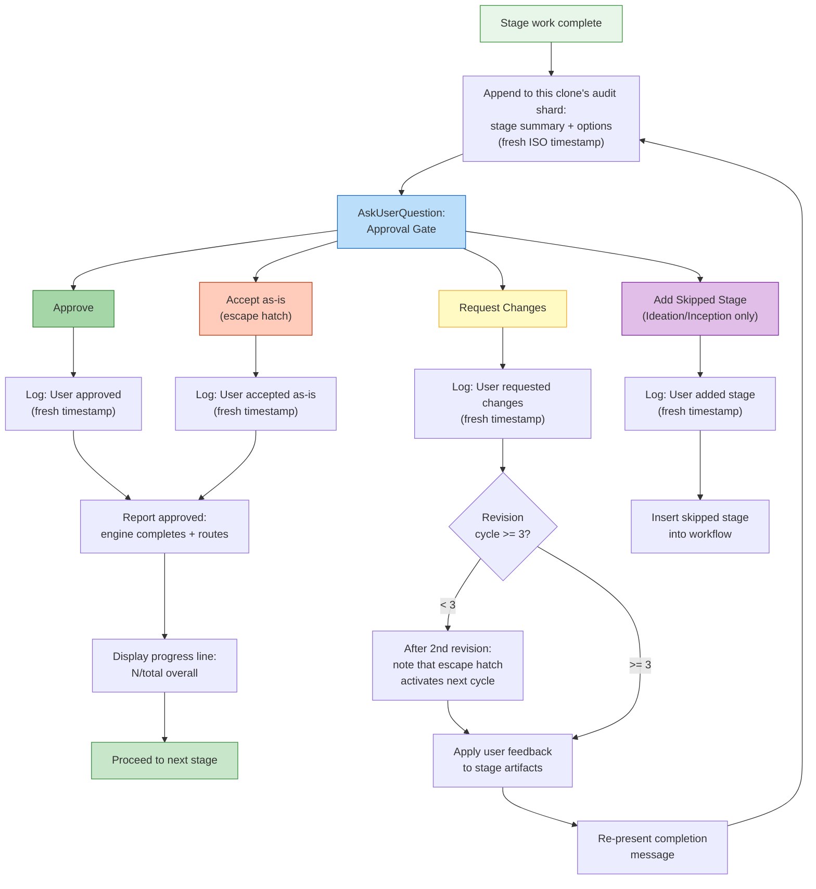

# Interaction Modes

AI-DLC provides three ways to interact with agents during stages, plus approval gates that keep you in control at every decision point.

> **Harness note.** Gates and questions render differently per harness: Claude Code
> uses the `AskUserQuestion` widget; the other harnesses render numbered-prose options
> (answer with a number or free text), with the questions file the source of truth.
> The *semantics* — when a gate fires, what it asks, that you stay in control — are
> identical, since they live in the engine. See [Running on other harnesses](harnesses/README.md).

---

## Tri-Mode Question Flow

When a stage gathers your input, the agent presents three interaction modes. You choose which mode works best for the current stage.

```
▸ Choose interaction mode:
  (1) Guide Me — agent asks structured questions
  (2) Edit File — write directly to the artifact
  (3) Chat — freeform discussion
```

### Guide Me

The agent walks you through each question interactively using structured prompts. Best when you want the agent to lead the conversation and ensure nothing is missed.

- Agent presents questions one at a time (or in batches)
- You answer each question directly
- Answers are recorded in the stage's questions file for traceability

### Edit File

The agent creates (or opens) the questions file and you edit it directly. Best when you already know what you want and prefer to write it down rather than answer questions.

- The questions file appears in the intent's record dir with blank answer fields
- You fill in answers at your own pace
- The agent reads the completed file and proceeds

### Chat

Freeform conversation with the agent. Best for exploring ideas or when your requirements are not yet well-defined.

- You discuss freely with the agent
- The agent extracts decisions from the conversation
- Extracted decisions are written back to the questions file as the source of truth

### Switching Modes Mid-Stage

You can switch between modes at any point during a stage. All three modes converge on the questions file as the canonical record of decisions. Switching does not lose progress — answers already captured remain in the file.

---

## Approval Gates

Every stage (except the 3 Initialization stages) ends with an approval gate. This is your checkpoint to review the agent's work before the workflow advances.

### Standard Gate

The default approval gate presents two options:

```
▸ How would you like to proceed?
  (1) Approve — Continue to [next stage]
  (2) Request Changes — Provide revision feedback
```

`[next stage]` shows the actual next stage the workflow will run (for example "Continue to NFR Requirements"), or "Complete workflow" on the final stage; the engine computes it, so it is always correct rather than a guess.

- **Approve** reports the outcome; the engine marks the stage completed, updates
  `aidlc-state.md`, shows a progress line, and advances to the next stage
- **Request Changes** lets you provide specific feedback; the agent revises its work and re-presents the approval gate

The gate requires a real human acknowledgement: typing a prompt or answering an `AskUserQuestion` widget records a human turn (a `HUMAN_TURN` event) in the audit ledger, and the approve (and any clarifying-question answer) refuses unless one was recorded since the last gate resolution, so a model running on autopilot cannot fabricate an approval with no human having acted since. On a harness whose gate widget does not record a human turn, type a short message once (for example "approve") so one is on record. (On a harness whose ledger has no human turn yet, the gate fails open and does not require this.)

### Approval Gate Flow



<!-- Text fallback: Stage work completes, the audit log records the options, and AskUserQuestion presents the approval gate. Approve: log the response, report approval so the engine completes and routes, show progress, proceed. Request Changes: log the response, check revision count (if <3, note escape hatch coming, revise and re-present; if >=3, Accept-as-is becomes available). Accept as-is: log and report approval. Add Skipped Stage (Ideation/Inception only): log and recompose the plan. -->

---

## The 3-Strike Revision Escape Hatch

If you have requested changes 3 or more times on the same stage, a third option appears:

```
▸ This is revision cycle 4. How would you like to proceed?
  (1) Approve — Continue to [next stage]
  (2) Request Changes — Provide revision feedback
  (3) Accept as-is — Archive current version and move on
```

**Accept as-is** archives the current version of the stage artifacts and advances the workflow. This prevents infinite revision loops when perfect is the enemy of good.

### How It Activates

| Revision Cycle | What Happens |
|----------------|-------------|
| 1st | Standard 2-option gate |
| 2nd | Standard 2-option gate, plus a note: "After one more revision, an 'Accept as-is' option will become available." |
| 3rd and beyond | 3-option gate with Accept as-is |

The revision count resets when you move to the next stage.

---

## Add Skipped Stage Option

During **Ideation** and **Inception** phases, the approval gate may include a conditional option to add a previously skipped stage back into the workflow:

```
▸ How would you like to proceed?
  (1) Approve — Continue to Scope Definition
  (2) Request Changes — Provide revision feedback
  (3) Add Market Research — Include Market Research which was skipped
```

This option appears only when:
- The current stage is in Ideation or Inception
- A stage ahead was skipped during scope routing
- The skipped stage is relevant to the current context

Selecting this option inserts the skipped stage into the workflow plan. The workflow continues normally through the added stage.

---

## Skipping and Navigating Stages

Beyond the approval gate, you have additional navigation options:

| Command | Effect |
|---------|--------|
| `/aidlc --stage <name>` | Jump to a specific stage (intervening stages marked `[S]`) |
| `/aidlc --phase <name>` | Jump to the start of a phase |

See [Session Management](11-session-management.md) and [CLI Commands](12-cli-commands.md) for details.

---

## Progress Tracking

After every approval, a progress line appears:

```
Progress: 13/32 overall | 3/7 IDEATION stages complete. Next: Approval & Handoff
```

This shows:
- Total progress across all stages
- Progress within the current phase
- The name of the next stage

---

## Next Steps

- [Your First Workflow](02-your-first-workflow.md) — see interaction modes in context
- [State and Audit](10-state-and-audit.md) — how decisions are tracked
- [Session Management](11-session-management.md) — resume, redo, jump
- [Glossary](glossary.md) — terminology reference
