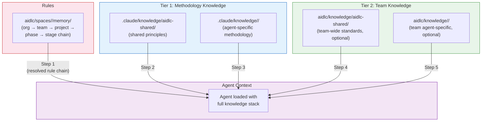
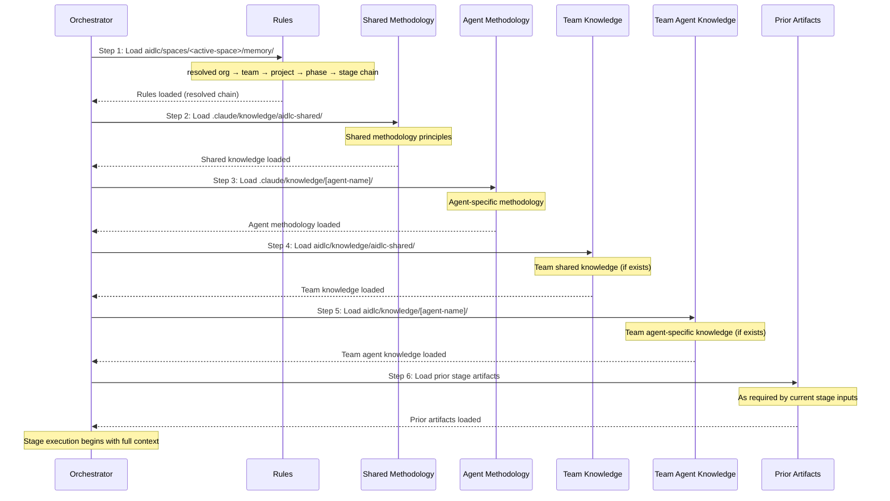

# Knowledge

AI-DLC uses a two-tier knowledge system that lets agents draw on both methodology expertise (shipped with the framework) and your team's specific standards (managed by you).

---

## Two-Tier Knowledge Architecture



<!-- Text fallback: The resolved rule chain loads first, then Tier 1 methodology knowledge (shared, then agent-specific), then Tier 2 team knowledge (shared, then agent-specific). All feed into the agent context for stage execution. -->

### Tier 1: Methodology Knowledge

**Location:** `.claude/knowledge/`

Ships with the framework. Contains shared principles and per-agent methodology references that define how AI-DLC stages execute. Updated when you upgrade the framework.

```
.claude/knowledge/
├── aidlc-shared/                       # Loaded by every agent
│   ├── ai-dlc-principles.md        # Core methodology principles
│   ├── audit-format.md             # 74-event audit taxonomy
│   ├── brownfield.md               # Brownfield safeguards and reverse-engineering guidance
│   ├── knowledge-readme-template.md # Optional README template a team can copy into Tier 2
│   ├── state-template.md           # State file contract
│   └── verification.md             # Phase boundary verification rules
├── aidlc-architect-agent/                 # Loaded when aidlc-architect-agent is active
├── aidlc-developer-agent/                 # Loaded when aidlc-developer-agent is active
├── aidlc-product-agent/                   # Loaded when aidlc-product-agent is active
└── ...                              # One directory per agent
```

> **Do NOT edit Tier 1 files to inject your team's knowledge.** `.claude/knowledge/` and `.claude/agents/*.md` are framework files — they are overwritten on every upgrade, and your changes will disappear. If you want to add company standards, architectural preferences, or domain context, add them to **Tier 2** (below). If you want to constrain agent behavior, add a **rule** (see [Rules and the Learning Loop](09-rules-and-the-learning-loop.md)).

### Tier 2: Team Knowledge

**Location:** the active space — `aidlc/knowledge/` (shorthand for `aidlc/spaces/<space>/knowledge/`)

User-managed. Contains your company-specific standards, policies, and conventions. It is a sibling of the space's `memory/`, `codekb/`, and `intents/` — so team knowledge accumulates across every intent in the space, not inside any one intent's record. It is **free-form and empty at bootstrap**: the engine just creates the empty `aidlc/knowledge/` directory on your first `/aidlc`. There is no fixed file set and no mandated structure. The convention below — an `aidlc-shared/` directory plus one per agent — is what the agent personas look for, so create the subdirectories you want as you go:

```
aidlc/knowledge/                  # empty at bootstrap; create the subdirs you need
├── aidlc-shared/                 # if present, loaded by every agent
│   ├── company-coding-standards.md
│   └── company-architecture-principles.md
├── aidlc-architect-agent/           # if present, loaded when aidlc-architect-agent is active
│   └── company-architecture-patterns.md
├── aidlc-developer-agent/           # if present, loaded when aidlc-developer-agent is active
│   └── company-coding-conventions.md
├── aidlc-devsecops-agent/           # if present, loaded when aidlc-devsecops-agent is active
│   └── company-security-policy.md
├── aidlc-quality-agent/             # if present, loaded when aidlc-quality-agent is active
│   └── company-testing-standards.md
└── ...                        # add a directory per agent only if you have content for it
```

---

## Adding Company Standards

Place your company-specific files in the appropriate `aidlc/knowledge/` directory. They are loaded automatically when the agent is activated — no configuration changes needed.

### Team-wide standards (loaded by all agents)

Add to `aidlc/knowledge/aidlc-shared/`:

```
aidlc/knowledge/aidlc-shared/company-coding-standards.md
aidlc/knowledge/aidlc-shared/company-architecture-principles.md
aidlc/knowledge/aidlc-shared/naming-conventions.md
```

### Agent-specific standards (loaded only when that agent is active)

Add to `aidlc/knowledge/<agent-name>/`:

| Directory | Example Files |
|-----------|--------------|
| `knowledge/aidlc-architect-agent/` | Architecture patterns, ADR templates, design principles |
| `knowledge/aidlc-developer-agent/` | Coding conventions, framework guides, API patterns |
| `knowledge/aidlc-devsecops-agent/` | Security policies, threat model templates, scanning rules |
| `knowledge/aidlc-quality-agent/` | Testing standards, coverage thresholds, performance criteria |
| `knowledge/aidlc-aws-platform-agent/` | AWS account structure, CDK conventions, tagging policies |
| `knowledge/aidlc-compliance-agent/` | Regulatory requirements, data classification, audit standards |
| `knowledge/aidlc-operations-agent/` | SLO definitions, incident procedures, monitoring standards |
| `knowledge/aidlc-product-agent/` | Product strategy, persona definitions, prioritization frameworks |
| `knowledge/aidlc-design-agent/` | Design system, accessibility standards, UX guidelines |
| `knowledge/aidlc-delivery-agent/` | Sprint templates, capacity models, estimation guidelines |
| `knowledge/aidlc-pipeline-deploy-agent/` | CI/CD patterns, deployment checklists, rollback procedures |

### Where the directories come from

The team creates them. On your first `/aidlc` the engine creates the empty space-level `aidlc/knowledge/` directory — and nothing inside it. There is no scaffold command, no seeded per-agent subdirectories, and no guidance READMEs. The `aidlc-shared/` and per-agent subdirectories are a convention the agent personas look for; create the ones you have content for. Match the agent slug exactly (`aidlc-architect-agent/`, not `architect/`) — a typo'd directory name is silently ignored.

---

## Worked Example: Adding Your First Knowledge File

Say your team uses Amazon API Gateway with a specific pattern — authorizer Lambdas in front of every route, a request-validation JSON schema, and a standard response envelope. You want the aidlc-architect-agent to default to that pattern whenever it designs a new API.

**Step 1 — Create the knowledge directory you need.** On your first `/aidlc` the engine creates an empty `aidlc/knowledge/` directory. There is no per-agent scaffold and no seeded READMEs, so create the agent subdirectory yourself — here, `aidlc/knowledge/aidlc-architect-agent/`. Match the agent slug exactly.

**Step 2 — Create a focused knowledge file in the right agent directory:**

```
aidlc/knowledge/aidlc-architect-agent/api-gateway-standards.md
```

Filename rules:
- Lowercase, hyphen-separated, descriptive
- One topic per file — `api-gateway-standards.md`, not `architecture.md`
- Any `.md` file in the directory is loaded — no naming convention is required, but descriptive names help during weekly reviews

**Step 3 — Write the content as concise reference material.** Agents load the file literally, so keep it tight:

```markdown
# API Gateway Standards

All new HTTP APIs use Amazon API Gateway REST APIs (not HTTP APIs) with:

## Authorization
- Lambda authorizer in front of every route
- Token source: `Authorization` header, Bearer scheme
- Authorizer result cached for 300 seconds

## Request validation
- Every request body validated against a JSON schema attached to the method
- Reject at the gateway layer — do not validate in handlers

## Response envelope
All successful responses follow:
  { "data": <payload>, "requestId": "<uuid>", "timestamp": "<iso-8601>" }

Error responses follow:
  { "error": { "code": "<short-code>", "message": "<human-readable>" }, "requestId": "<uuid>" }
```

**Step 4 — Run a workflow.** On the next `/aidlc` invocation, the aidlc-architect-agent loads this file automatically at stage start (step 5 in the loading order below). No configuration, no CLI flags, no registration — the file's presence is the registration.

**Common mistakes to avoid:**

| Wrong | Right |
|-------|-------|
| Editing `.claude/agents/aidlc-architect-agent.md` | Add a file under `aidlc/knowledge/aidlc-architect-agent/` |
| Editing `.claude/knowledge/aidlc-architect-agent/architecture-guide.md` | Add a file under `aidlc/knowledge/aidlc-architect-agent/` |
| Putting everything in `knowledge/aidlc-shared/` | Use agent-specific directories unless the standard truly applies to all 14 agents |
| One large `company-standards.md` covering API, auth, data, and logging | Split into `api-gateway-standards.md`, `auth-standards.md`, etc. |

---

## Verifying Knowledge Is Loaded

Before a team rolls knowledge out, confirm the agent is actually seeing the file.

**Option 1 — Ask the agent at an approval gate.** At any gate during a workflow, reply with:

```
What team knowledge are you using for this stage?
```

The agent lists the Tier 2 files it loaded. If your file is missing, check the filename extension is `.md` and the directory matches the agent name exactly (e.g. `aidlc-architect-agent/`, not `architect/`).

**Option 2 — Check the audit trail for the agent.** Every stage start emits a `STAGE_STARTED` audit event recording the stage and its lead agent. After running a stage, inspect:

```
<record>/audit/        # per-clone shards; glob and merge by timestamp
```

Find the most recent `STAGE_STARTED` entry for your stage and confirm the **Agent** field is the one whose knowledge directory holds your file — that tells you the right persona activated and its `aidlc/knowledge/<agent>-agent/` directory was in scope. The audit trail records which agent ran, not the individual files it read; use Option 1 to confirm a specific file was loaded.

**Option 3 — Run a fast workflow to smoke-test.** For a lightweight end-to-end check, use a small scope that exercises the target agent:

```
/aidlc poc Prototype a new inventory API
```

The aidlc-architect-agent runs during Application Design; any Tier 2 file it loaded will influence its output visibly (in our example, the generated architecture should reference API Gateway with a Lambda authorizer).

---

## Managing Knowledge Over Time

Knowledge files are not fire-and-forget. As standards evolve, the vault of team knowledge needs pruning and refactoring just like code.

### Updating an existing file

Edit the file in place. Knowledge reloads at every stage start, so the next `/aidlc` invocation picks up the change. No restart, no cache, no registration.

### Removing outdated knowledge

Delete the file. There is no registry to update and no configuration to clean up. If the agent was relying on a now-removed standard, subsequent runs will simply stop applying it.

### Splitting a file that has grown too large

If a single file now covers multiple topics (a common drift), split it:

```
api-standards.md          →   api-gateway-standards.md
                              api-versioning-standards.md
                              api-error-handling-standards.md
```

Smaller focused files are easier to update, easier to review, and less likely to contain contradictions.

### Promoting agent-specific to shared

If a standard originally written for one agent turns out to apply across the team, move it up:

```
aidlc/knowledge/aidlc-architect-agent/naming-conventions.md
  →  aidlc/knowledge/aidlc-shared/naming-conventions.md
```

The `aidlc-shared/` directory is loaded by every agent (step 4 in the loading order).

### Review cadence

Schedule a quarterly prune — every active project accumulates stale knowledge. Outdated or contradictory files actively confuse agents because they are loaded literally with equal weight. A short weekly or sprint review during retro is often enough: open each file, confirm it still reflects reality, delete or update what does not.

---

## Knowledge vs Rules: Which to Use

Both knowledge files and rules customize agent behavior, but they are not interchangeable. Use this table to decide:

| Use knowledge when... | Use a rule when... |
|-----------------------|--------------------|
| You are providing **reference material** the agent should consult | You are stating a **behavioral rule** the agent must follow |
| "These are the patterns we use" | "Never do X" / "Always do Y" |
| Content is informative and contextual | Content is prescriptive and non-negotiable |
| Applies to a specific domain or agent | Applies across stages and agents |
| Can be long-form prose, diagrams, or tables | Should be short, imperative, one line each |
| Example: API Gateway standards, coding conventions, domain glossary | Example: "Never log PII", "All data access must go through the repository layer", "Reject any design that uses DynamoDB with scan operations" |

A useful rule of thumb: **if a human reviewer would reject a stage's output when the rule is violated, it belongs in the space memory layer (`aidlc/spaces/<active-space>/memory/`).** If they would use the rule as background context when reviewing, it is knowledge.

Rules and knowledge sit on different planes, and that is why their loading behaves differently. Knowledge files are reference material that agents weigh during a stage. Rules resolve through a strict-additive chain — org, then team, then project, then phase, then stage — that the framework compiles ahead of the workflow; every applicable rule reaches the agent, and nothing is silently dropped. Conflicts between layers are caught at admission time, when a team or project rule is first written, rather than reconciled mid-stage.

For the full rule model — file locations, the five-layer chain, the learning loop, and admission-time conflict checks — see [Rules and the Learning Loop](09-rules-and-the-learning-loop.md).

---

## Knowledge Loading Order

When a stage begins, the conductor loads knowledge in a strict 6-step order:



<!-- Text fallback: Six steps: 1. Rules (the resolved org → team → project → phase → stage chain), 2. Shared methodology knowledge, 3. Agent-specific methodology knowledge, 4. Team shared knowledge (if exists), 5. Team agent-specific knowledge (if exists), 6. Prior stage artifacts. -->

| Step | Source | What Loads | Priority |
|------|--------|-----------|----------|
| 1 | `aidlc/spaces/<active-space>/memory/` | The resolved org → team → project → phase → stage rule chain | Behavioral rules — every applicable rule loads (strict-additive) |
| 2 | `.claude/knowledge/aidlc-shared/` | Shared methodology principles | Framework-level defaults |
| 3 | `.claude/knowledge/<agent>/` | Agent-specific methodology | Agent expertise |
| 4 | `aidlc/knowledge/aidlc-shared/` | Team-wide standards | Your company defaults |
| 5 | `aidlc/knowledge/<agent>/` | Team agent-specific standards | Your company + agent expertise |
| 6 | Prior stage artifacts | Outputs from earlier stages | Runtime context |

**Key points:**
- Steps 1-5 load from files on disk
- Step 6 is context added by the orchestrator at runtime based on the current stage's declared inputs
- Steps 4-5 only load if the directories exist and contain files
- [Rules](09-rules-and-the-learning-loop.md) are behavioral constraints, not reference material — the resolved chain loads first and every applicable rule reaches the agent

---

## Best Practices

### Keep knowledge files focused

Each file should cover one topic. Prefer many small files over one large file — this makes it easier to update and remove outdated standards.

### Use the shared directory for cross-cutting concerns

Standards that apply to all agents (naming conventions, coding style, commit message format) go in `knowledge/aidlc-shared/`. Standards specific to a domain (architecture patterns, security policies) go in the agent directory.

### Review knowledge before workflows

Knowledge files are loaded at every stage start. Outdated or contradictory knowledge will confuse agents. Periodically review and prune your knowledge directories.

### Don't duplicate Tier 1 content

If you want to **constrain** how the agent applies a methodology principle, add a rule instead of duplicating the Tier 1 file. See [Rules and the Learning Loop](09-rules-and-the-learning-loop.md).

### Don't edit agent files to inject team context

`.claude/agents/*.md` defines the agent's persona, tool access, and knowledge-loading sequence. Editing them to add team knowledge is a common mistake — the changes are overwritten on framework upgrade. Always use `aidlc/knowledge/<agent>/` instead.

### Name the directories to match the agent slug

The space-level `aidlc/knowledge/` directory is empty at bootstrap — you create the `aidlc-shared/` and per-agent subdirectories yourself as you accumulate standards. The directory name must match the agent slug exactly (e.g. `aidlc-architect-agent/`, not `architect/`); a typo'd name is silently ignored because the loader walks the agent's own directory by name and finds nothing.

---

## Next Steps

- [Rules and the Learning Loop](09-rules-and-the-learning-loop.md) — the strict-additive rule chain and how the framework learns new rules across workflows
- [Getting Started](01-getting-started.md) — the workspace shell and where knowledge directories appear
- [Customization](13-customization.md) — full customization guide
- [Glossary](glossary.md) — terminology reference
