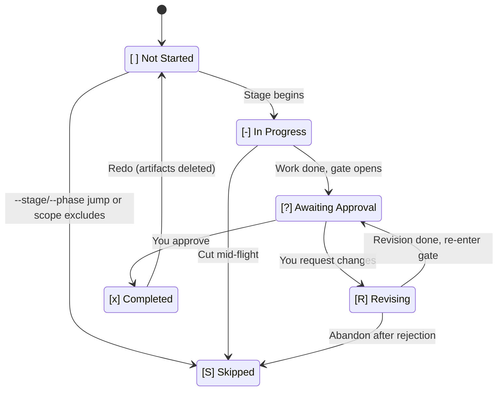
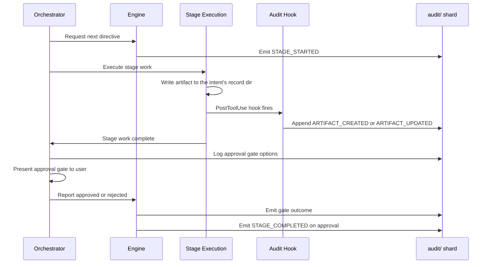

# State Tracking and Audit Trail

AI-DLC maintains two persistent files that together provide full traceability from intent to production: the **state file** tracks where you are in the workflow, and the **audit trail** records every decision, action, and event along the way.

---

## State File (`aidlc-state.md`)

Each intent has its own state file at `aidlc/spaces/<space>/intents/<YYMMDD>-<label>/aidlc-state.md` (under the intent's record dir) — the single source of truth for that intent's workflow progress. The engine reads the active intent's state file on every session start to determine what has been completed, what is in progress, and what comes next.

### What it contains

| Section | Purpose |
|---------|---------|
| **Project Information** | Project description, type (greenfield/brownfield), scope, start date, current phase, active agent |
| **Scope Configuration** | Stages to execute, stages to skip (with reasons), depth level |
| **Workspace State** | Project root, detected languages, frameworks, build system |
| **Execution Plan Summary** | Total stages, completed count, in-progress stage |
| **Runtime State** | Revision count for the current stage |
| **Stage Progress** | Per-stage checkboxes tracking completion status |
| **Current Status** | Lifecycle phase, current/next stage, status, last updated timestamp |
| **Session Resume Point** | Last completed stage, next action, pending artifacts |

### Six-state checkboxes

Stage progress uses a six-state checkbox notation:

| Checkbox | Meaning |
|----------|---------|
| `[ ]` | Not started |
| `[-]` | In progress |
| `[?]` | Awaiting your approval (gate open) |
| `[R]` | Revising (you rejected the gate, stage is being revised) |
| `[x]` | Completed |
| `[S]` | Skipped (scope-excluded, cut via `skip`, or bypassed via `--stage`/`--phase` jump) |

Stages transition through `[ ]` → `[-]` → `[?]` → `[x]` on the happy path. When you reject at the gate, the stage moves to `[R]` while it's revised, back to `[?]` when ready, and finally to `[x]` on approval. `/aidlc --status` reads the checkbox and tells you who's blocking — "Awaiting your approval on \<stage\>" for `[?]`, "Revising \<stage\> (revision N of 3)" for `[R]`.

For the canonical state-machine reference (transition tables, audit-event emitters), see [Developer Reference: State Machine](../reference/12-state-machine.md).

### State transitions

<!-- Text fallback: [ ] Not Started transitions to [-] In Progress when a stage begins. [-] In Progress transitions to [?] Awaiting Approval when stage work is done and the gate opens. [?] Awaiting Approval transitions to [x] Completed when you approve, or to [R] Revising when you request changes. [R] Revising transitions back to [?] Awaiting Approval when revision is complete. [ ] Not Started, [-] In Progress, and [R] Revising can each transition to [S] Skipped via jumps, scope exclusion, or abandonment. [x] Completed transitions back to [ ] Not Started on redo (artifacts deleted). -->

### Normal, revision, skip, redo, and jump flows

- **Normal flow**: `[ ]` -> `[-]` -> `[?]` -> `[x]` (stage begins, work completes, gate opens, you approve)
- **Revision flow**: `[?]` -> `[R]` -> `[?]` -> `[x]` (you reject, stage is revised, gate re-opens, you approve)
- **Scope skip flow**: `[ ]` -> `[S]` (stage not in scope for this workflow, marked at init)
- **Redo flow**: `[x]` or `[-]` -> `[ ]` -> `[-]` (you request redo, artifacts are deleted, stage re-executes)
- **Jump flow**: `[-]` at stage A, you request jump to stage B, intervening stages are marked `[S]`

---

## Audit Trail (`audit/`)

The audit trail lives in the intent's record dir at `aidlc/spaces/<space>/intents/<YYMMDD>-<label>/audit/`. It is an append-only event log written as **per-clone shards** (`<host>-<clone>.md`): each clone appends only to its own shard, so concurrent appends from sibling worktrees never git-conflict. Readers glob `audit/*.md` and merge-sort by ISO timestamp to reconstruct the full chronological history of decisions and events.

### 72-event taxonomy

Events are organized into 19 categories:

| Category | Count | Events |
|----------|------:|--------|
| **Workflow Lifecycle** | 4 | `WORKFLOW_STARTED`, `WORKFLOW_COMPLETED`, `WORKFLOW_PARKED`, `WORKFLOW_UNPARKED` |
| **Phase Lifecycle** | 4 | `PHASE_STARTED`, `PHASE_COMPLETED`, `PHASE_VERIFIED`, `PHASE_SKIPPED` |
| **Stage Lifecycle** | 6 | `STAGE_STARTED`, `STAGE_AWAITING_APPROVAL`, `STAGE_REVISING`, `STAGE_COMPLETED`, `STAGE_SKIPPED`, `STAGE_JUMPED` |
| **Session** | 5 | `SESSION_STARTED`, `SESSION_RESUMED`, `SESSION_COMPACTED`, `SESSION_ENDED`, `HUMAN_TURN` (hook-emitted) |
| **Initialization** | 3 | `WORKSPACE_SCAFFOLDED`, `WORKSPACE_SCANNED`, `WORKSPACE_INITIALISED` |
| **Navigation** | 6 | `SCOPE_CHANGED`, `SCOPE_DETECTED`, `DEPTH_CHANGED`, `TEST_STRATEGY_CHANGED`, `RECOMPOSED`, `PLUGIN_SELECTION_CHANGED` |
| **Interaction** | 4 | `DECISION_RECORDED`, `GATE_APPROVED`, `GATE_REJECTED`, `QUESTION_ANSWERED` |
| **Artifact** | 3 | `ARTIFACT_CREATED`, `ARTIFACT_UPDATED` (audit-logger hook), `ARTIFACT_REUSED` |
| **Subagent** | 1 | `SUBAGENT_COMPLETED` (log-subagent hook) |
| **Reviewer Scope** | 1 | `REVIEWER_SCOPE_BLOCKED` (reviewer-scope hook) |
| **Utility** | 1 | `HEALTH_CHECKED` |
| **Error/Recovery** | 2 | `ERROR_LOGGED`, `RECOVERY_COMPLETED` |
| **Construction Bolt** | 4 | `BOLT_STARTED`, `BOLT_COMPLETED`, `BOLT_FAILED`, `AUTONOMY_MODE_SET` |
| **Worktree** | 7 | `WORKTREE_CREATED`, `WORKTREE_MERGED`, `WORKTREE_DISCARDED`, `STATE_FORKED`, `STATE_MERGED`, `AUDIT_FORKED`, `AUDIT_MERGED` |
| **Practices** | 4 | `PRACTICES_DISCOVERED`, `PRACTICES_AFFIRMED`, `PRACTICES_OVERRIDE`, `PRACTICES_SECTION_EMPTY` |
| **Merge Dispatch** | 3 | `MERGE_DISPATCH_INVOKED`, `MERGE_DISPATCH_RETURNED`, `MERGE_DISPATCH_FALLBACK` |
| **Sensors** | 5 | `SENSOR_FIRED`, `SENSOR_PASSED`, `SENSOR_FAILED`, `SENSOR_BUDGET_OVERRIDE`, `GUARDRAIL_LOADED` |
| **Learning Loop** | 3 | `MEMORY_EMPTY`, `RULE_LEARNED`, `SENSOR_PROPOSED` |
| **Swarm** | 6 | `SWARM_STARTED`, `SWARM_UNIT_CONVERGED`, `SWARM_UNIT_FAILED`, `SWARM_BATON_RETURNED`, `SWARM_COMPLETED`, `SWARM_DEGRADED` |

### What gets logged and when

- **Every stage start and completion** is logged with `STAGE_STARTED` and `STAGE_COMPLETED` events
- **Every file write** to the intent's record dir (except the `audit/` shards themselves) is automatically logged by the audit-logger hook
- **Every approval gate decision** (approve, request changes, accept-as-is) is logged
- **Every question answer** you provide is recorded
- **Every subagent completion** is logged by the log-subagent hook
- **Every error and recovery** is logged

### How to read the audit log

Each entry follows a structured format with these fields:

- **Timestamp** — ISO 8601 timestamp
- **Event** - One of the 72 event types
- **Details** — Event-specific data (stage name, decision, artifact path, etc.)

Entries are appended chronologically. To review the history of a specific stage, search for its `STAGE_STARTED` and `STAGE_COMPLETED` entries and everything in between.

### Audit event flow

When a stage executes and produces artifacts, the audit trail captures the full sequence:

<!-- Text fallback: The orchestrator requests the next directive and the engine emits STAGE_STARTED. Stage execution writes artifacts; the PostToolUse hook appends ARTIFACT_CREATED or ARTIFACT_UPDATED. After the stage work and approval gate, the orchestrator reports the outcome. The engine emits the gate result and, on approval, STAGE_COMPLETED while updating state and routing. -->

---

## How State and Audit Work Together

The state file and audit trail serve complementary purposes:

| Concern | State File | Audit Trail |
|---------|-----------|-------------|
| **Purpose** | Track current position and progress | Record full history of events |
| **Read by** | Orchestrator (for routing and resume) | Users and auditors (for traceability) |
| **Update pattern** | Overwritten at each state change | Append-only (never modified) |
| **Session resume** | Primary source for determining where to continue | Provides the original project description and decision context |
| **Git policy** | Commit to version control | Commit (per-clone shards under `audit/`; no merge conflicts) |

The orchestrator uses `aidlc-state.md` for all routing decisions. It does not read the `audit/` shards for routing. The audit trail is a traceability record that lets you trace every decision from intent through to production.

If the state file is corrupted, you can reconstruct it from the audit trail by reviewing `STAGE_STARTED` and `STAGE_COMPLETED` events. See [Troubleshooting](15-troubleshooting.md) for repair instructions.

---

## Next Steps

- [Session Management](11-session-management.md) — How state is used for session resume
- [Artifacts Reference](14-artifacts-reference.md) — What gets stored in the intent's record dir
- [Troubleshooting](15-troubleshooting.md) — State corruption repair
- [Glossary](glossary.md) — Definitions for state file, audit trail, checkpoint, compaction
