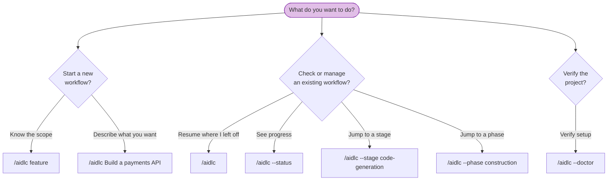

# CLI Commands

All AI-DLC commands start with the orchestrator invocation. This chapter is a complete reference for every invocation pattern and flag.

> **Invocation prefix differs by harness.** On Claude Code, Kiro IDE, Kiro CLI,
> and opencode you type `/aidlc`; on Codex CLI it is `$aidlc` (or `/skills` →
> aidlc). The flags and behaviour below are identical either way — only the
> prefix changes. The examples use `/aidlc`; substitute `$aidlc` on Codex. See
> the [Kiro CLI](harnesses/kiro-cli.md), [Kiro IDE](harnesses/kiro-ide.md),
> [Codex CLI](harnesses/codex-cli.md), and
> [opencode](harnesses/opencode.md) harness guides.

---

## Quick Reference

| Command | Description |
|---------|-------------|
| `/aidlc [scope]` | Start a new workflow with an explicit scope |
| `/aidlc [description]` | Start a new workflow; scope is auto-detected from your description (rich/unmatched prose gets a compose offer) |
| `/aidlc compose "<task>"` | Force the adaptive composer: propose a tailored EXECUTE/SKIP plan for the task |
| `/aidlc compose --report <path>` | Compose from a scan report (triage findings into a compact fix-and-ship run) |
| `/aidlc --new-scope "<task>"` | Force the composer to synthesize a custom scope even when a stock scope matches |
| `/aidlc` | Resume an existing workflow (if an intent exists) or birth the first intent and start new |
| `/aidlc intent [name]` | List intents in the active space, or switch to an existing intent |
| `/aidlc space [name]` | List spaces, or switch to an existing space |
| `/aidlc space-create <name>` | Create a new space from the framework baseline |
| `/aidlc --status` | Display a read-only status summary |
| `/aidlc --doctor [--check-updates]` | Run a health check; the explicit flag refreshes update metadata |
| `/aidlc --doctor --export` | Run a fresh health check, then write a small, redacted diagnostic report for sharing |
| `/aidlc --stage <slug\|#>` | Jump to a specific stage |
| `/aidlc --stage <slug> --single` | Run one stage in isolation, without advancing your workflow |
| `/aidlc --phase <name\|#>` | Jump to the start of a phase |
| `/aidlc --scope <name>` | Change the active scope |
| `/aidlc --depth <level>` | Override depth level (minimal, standard, comprehensive) |
| `/aidlc --test-strategy <level>` | Override test strategy (minimal, standard, comprehensive) |
| `/aidlc config get <key>` | Print active workflow config (`depth`, `test-strategy`) |
| `/aidlc config set <key> <value>` | Change active workflow config (`depth`, `test-strategy`) |
| `/aidlc config list` | List active workflow config (`--json` for structured output) |
| `aidlc config global <get\|set\|clear\|list>` | Manage machine update and release settings |
| `/aidlc plugin list [--verbose\|--json]` | Compare host-installed plugins with this project's composition stamps |
| `/aidlc plugin sync [--prune-missing]` | Transactionally compose installed plugins; explicitly prune missing owned content |
| `aidlc init [options]` | Initialize or refresh a project from an installed or local harness projection |
| `aidlc upgrade [options]` | Install and activate a complete release |
| `aidlc rollback [--version <v>]` | Activate a retained complete release without network access |
| `aidlc use <version\|current>` | Set or clear the project's `.aidlc-version` pin |
| `aidlc versions list\|install\|prune` | Inspect, install, or remove unprotected retained versions |
| `aidlc harness add\|remove\|list\|default` | Manage harness runtimes in the active release |
| `aidlc uninstall [--purge]` | Remove the command and versions; optionally remove machine state |
| `aidlc completions <shell>` | Emit bash, zsh, fish, or PowerShell completions |
| `aidlc package create\|verify` | Create or verify a flat offline release set |
| `/aidlc --version` | Print the framework version |
| `/aidlc --help` | Display usage information |
| `aidlc plugin select [names]` | Show or set the enabled plugin list |

---

## Native Install And Lifecycle

The machine-level `aidlc` command is the supported install and lifecycle
surface. It is distinct from the harness chat invocation shown above.

```bash
install.sh --harness claude
cd your-project
aidlc init --mcp none
aidlc doctor
```

`init` is local-only. It reads the installed runtime or `--from <dir|tgz>`,
previews the exact change set with `--dry-run`, preserves project-owned method
and workflow data, and refuses locally modified framework files unless
`--force` is explicit.

See [Install and Lifecycle](18-install-and-lifecycle.md) for the complete
installer, trust, root-merge, pin, offline, plugin, and transaction contract.

For scripted approval, read `data.planToken` from
`aidlc init --dry-run --json`, then rerun the same command without
`--dry-run` and with `--plan-token <token>`. Apply refuses if source bytes,
options, or current project state changed after the preview.

Machine lifecycle commands never follow a project pin. Engine commands do:
a valid `.aidlc-version` re-executes that retained binary before project data
loads, while a missing retained version fails with
`aidlc versions install <version>` remediation.

Commit `.aidlc-version`: it is a team-shared toolchain pin and the managed
AI-DLC `.gitignore` block deliberately does not ignore it. A fresh clone or CI
runner must install that exact version with
`install.sh --version "$(cat .aidlc-version)" --harness <name>`, use
`aidlc versions install "$(cat .aidlc-version)" --harness <name>` when an
active binary already exists, or consume a reviewed offline package in a
restricted pipeline.

```bash
aidlc versions list
aidlc versions install 2.5.0 --harness claude
aidlc use 2.5.0
aidlc upgrade --version 2.5.1
aidlc upgrade --check
aidlc rollback
aidlc harness add kiro
aidlc harness default kiro
aidlc versions prune --yes
aidlc package create --version 2.5.0 --harness claude --target linux-x64 --output ./aidlc-offline
aidlc package verify ./aidlc-offline
```

`harness add` always acquires the running version, never latest. Harness
removal, version pruning, and uninstall prompt on a TTY and require `--yes`
when stdin is not interactive. Active, rollback, and registered pinned
versions are never pruned; stale pin paths are reported for explicit cleanup.
Removing the final harness leaves the native command available for lifecycle
management; doctor reports the missing runtime, upgrades carry the empty set
forward, and `aidlc harness add <name>` restores project operations.
`aidlc uninstall` leaves project trees untouched and preserves machine config,
cache, pins, and the harness default unless `--purge` is supplied.

Update settings use `aidlc config global set <key> <value>` (the equivalent
`aidlc config set <key> <value> --global` form is also accepted). Initial keys
are `update-check`, `offline`, `release-base-url`, and `ca-bundle`. Flag values
override environment variables, which override machine config. Bare help and
management listings never use the network: they read only a valid 24-hour
cache. Interactive human `aidlc doctor` may refresh stale data within 750 ms;
non-TTY, JSON, and quiet doctor runs remain network-free unless
`--check-updates` is explicit. `doctor --check-updates` and
`upgrade --check` use a 15-second budget. Doctor refreshes accept
`--release-base-url <url>` and `--ca-bundle <absolute-path>`; release URLs
cannot contain credentials, a query, or a fragment.

All lifecycle commands support human output and `--json`; mutating commands
also support `--dry-run` where listed by `aidlc help --all`.
The installer also accepts `--quiet`, `--json`, `--no-color`, and `--yes`.
Human mode reports each completed download with a fixed-width TTY display;
quiet and JSON modes suppress download progress.
It never edits a startup file unless `--profile <absolute-startup-file>` is
explicit; that opt-in writes one marked PATH block through a separate
transaction.

Generate shell definitions from the same route registry used by help:

```bash
aidlc completions bash
aidlc completions zsh
aidlc completions fish
aidlc completions powershell
```

The definitions complete route options plus locally installed harness names and
retained versions. Their helper calls are local, network-free, and output
bounded.

---

## Command Decision Tree



<!-- Text fallback: Starting a new workflow: use /aidlc feature (known scope) or /aidlc Build a payments API (auto-detect; the first intent auto-births). Managing an existing workflow: /aidlc (resume), /aidlc --status (view progress), /aidlc --stage (jump to stage), /aidlc --phase (jump to phase). Verify setup: /aidlc --doctor (health check). -->

---

## Detailed Reference

### `/aidlc [scope]` — Start with explicit scope

Start a new workflow with one of the enabled scopes. Core ships 9 named scopes; plugins can add more, and `select-plugins` can hide disabled plugin/core scopes from runtime.

**Syntax:**

```
/aidlc enterprise
/aidlc feature
/aidlc mvp
/aidlc poc
/aidlc bugfix
/aidlc refactor
/aidlc infra
/aidlc security-patch
```

**Behavior:** The framework recognizes the scope keyword, asks what you want to build, then runs the Initialization phase and begins the first domain stage. If a state file already exists, it offers resume options instead.

**Example:**

```
/aidlc bugfix
> What would you like to fix?
> The login API returns 500 when email contains a plus sign
```

---

### `/aidlc [description]` — Start with auto-detection

Describe what you want to build and the engine auto-detects the appropriate scope.

**Syntax:**

```
/aidlc Build a REST API for inventory management
/aidlc Fix the login timeout bug
```

**Behavior:** The engine analyzes keywords in your description (e.g., "fix" suggests bugfix). A clear match asks a one-line confirm naming the MATCHED scope and its ceremony (stage count, approval-gate count, and any per-unit fan-out, all from the compiled grid); rich or unmatched prose gets the compose offer (see `/aidlc compose` below) instead of a silent default. You confirm or override before the workflow begins.

**Example:**

```
/aidlc Fix the null pointer in ProfileSerializer
> Starting a "bugfix" workflow for: "Fix the null pointer in ProfileSerializer" - 7 of 32 stages, 4 approval gates, 1 stage repeats per unit of work in Construction. Confirm to proceed, name a different scope, or say "compose" for a tailored plan.
```

---

### `/aidlc compose` - The adaptive composer

Force the composer even when a stock scope would match. Works in three moments:

```
/aidlc compose "harden the deployment pipeline and add observability"
/aidlc compose --report sonar.json
/aidlc compose            (mid-workflow: re-shape the pending stages)
```

**Behavior:** the conductor dispatches the composer agent, which reads your task (or the scan report, or the running workflow's state), runs the read-only `detect` scan, estimates the five implementation-entropy components (intent ambiguity, structural uncertainty, verification entropy, risk, unresolved assumptions - grounded in CodeKB MCP analysis when configured, the workspace scan otherwise), and proposes the minimum viable EXECUTE/SKIP grid with the score breakdown and a reason for every EXECUTE and SKIP. You approve, edit, or reject at a gate. On approve: a stock match births directly; a custom grid is authored as a real scope (two files in the installed tree) and the workflow births on it in the same turn; an in-flight proposal lands as pending-stage suffix flips via the `recompose` verb (under the audit lock, strict-validated, `RECOMPOSED` audited). `--new-scope` forces synthesis; `--report <path>` seeds the triaged findings into the intent. The `/aidlc-compose` skill is a typeable shortcut over the same path. Mid-workflow you can also just say it in chat ("can we skip market research?") - the conductor recognizes a reshape request and routes it through the same gate and verb, no literal `compose` needed (on the non-Claude harnesses the literal verb remains the documented reliable path).

See [Scopes and Depth - The Adaptive Composer](05-scopes-and-depth.md#the-adaptive-composer) for the full flow.

---

### `/aidlc` — Resume existing workflow

Run with no arguments when a state file exists to resume.

**Syntax:**

```
/aidlc
```

**Behavior:** Reads `aidlc-state.md`, checks `.aidlc-recovery.md` for corruption, then presents four resume options: resume from checkpoint, redo current stage, jump to stage, or start fresh. See [Session Management](11-session-management.md) for details.

If no state file exists, the framework treats this as a new workflow and asks for scope/description.

---

### Workflow Initialization — automatic

`aidlc init` lays down the project shell and refresh baseline. A complete
advanced manual projection already contains that same shell. In either case,
the engine **auto-births** the first intent on your first `/aidlc` (or when you
describe what to build). Birth runs the three Initialization stages
(Workspace Scaffold, Workspace Detection, State Init) as a single deterministic
tool call: it creates the intent's record dir at
`aidlc/spaces/<space>/intents/<YYMMDD>-<label>/` (the `audit/` shard dir, the
per-phase artifact dirs, `verification/`) and the empty space-level
`aidlc/knowledge/` directory, runs a rule-based workspace scan, and writes that
intent's `aidlc-state.md` with the scope plan.
It logs the init-sequence events (`WORKFLOW_STARTED`, `WORKSPACE_SCAFFOLDED`,
`WORKSPACE_SCANNED`, `WORKSPACE_INITIALISED`, plus per-stage
`STAGE_STARTED`/`STAGE_COMPLETED`). Naming a scope (`/aidlc --scope feature`)
seeds the initial scope; absent one it defaults to `poc`. To add team knowledge
or guardrails before the first run, edit the shipped `aidlc/spaces/default/memory/`
files; the space-level `aidlc/knowledge/` directory is created (empty) once the
first intent exists, and you add free-form files to it from there.

Run `aidlc init` once before opening the harness; workflow intent birth remains
automatic on the first chat invocation.

The welcome message is rendered at session start via the `companyAnnouncements`
entry in `settings.json`.

**Multi-repo workspaces.** When your workspace root holds more than one sibling
code repo (each an immediate child directory with a `.git`), the birth step
records the set of repos the intent touches in its `intents.json` row. By default
it **auto-discovers** every sibling repo; to scope an intent to a specific subset,
the birth tool accepts `--repos a,b` (a comma-separated list of repo directory
names). These are flags of the deterministic `aidlc-utility intent-birth` step the
engine runs for you — not `/aidlc` flags you type. During Construction, each git
operation (worktree, swarm, Bolt) targets one repo; the conductor passes
`--repo <name>` to anchor it, required only when an intent spans more than one
repo. An intent with no recorded repos is the single-repo default (git runs in the
workspace/project dir). See [Artifacts Reference](14-artifacts-reference.md).

---

### `/aidlc intent [name]` — List or switch intents

Bare `/aidlc intent` lists the intents in the active space; add `--json` for
structured output. `/aidlc intent <name>` switches the per-user active-intent
cursor to an existing intent by unambiguous slug or full record-dir name. It
never creates an intent or advances a workflow.

### `/aidlc space [name]` — List or switch spaces

Bare `/aidlc space` lists spaces; add `--json` for structured output.
`/aidlc space <name>` switches the per-user active-space cursor and re-points
the harness-native method include to that space. It never creates a space or
advances an intent.

### `/aidlc space-create <name>` — Create a space

Creates a new team space with the full `memory/`, `knowledge/`, `codekb/`, and
`intents/` shape, seeded from the framework baseline rather than another
team's learned practices. It does not switch spaces automatically. See
[Spaces and Intents](03-spaces-and-intents.md) for the workspace model,
switching examples, and what is committed.

---

### `/aidlc --status` — Read-only status

Display current workflow progress without modifying anything.

**Syntax:**

```
/aidlc --status
```

**Behavior:** Reads the active intent's `aidlc-state.md` and displays: current phase, current stage, completed/total stage count, scope, depth, and the stage progress list. If no workflow is active, reports that no workflow is in progress.

---

### `/aidlc --doctor` — Health check

Validate that all of this implementation's prerequisites, configuration, and stage-graph integrity are in place. Exits 0 on full pass, 1 on any failure; the full report writes to stdout in both cases so the orchestrator surfaces it either way. `--doctor` is **read-only** — on a fresh shell with no intent yet (no `audit/` shards) it creates no files, so it is safe to run before the first intent is born; once an intent exists it records a `HEALTH_CHECKED` audit row.

When a workflow has issues, `--doctor` also prints a **Workflow diagnosis** section listing the structured findings (e.g. `gate-unresolved`, `runtime-graph-stale`) for unresolved gates, a stale or missing runtime graph, cold hooks, and similar "it will not advance" causes. The live report and `--export` share one analysis, so the findings are identical either way.

**Syntax:**

```
/aidlc --doctor
```

**What it checks:**

| Check | What it validates |
|-------|-------------------|
| Prerequisites | Active self-contained `aidlc` command |
| Installed runtime | Active machine version and installed harness distributions |
| Project stamp | Project distribution/version compared with the selected engine |
| Hook presence | Every hook `settings.json` wires (its `hooks` blocks + the `statusLine` command — all 13 framework hooks) exists in `.claude/hooks/`; a wired-but-missing hook fails loudly. Sourcing the expected roster from `settings.json` means adding a hook there auto-checks it |
| Project structure | `.claude/settings.json` exists (file presence only, no content validation) |
| Workspace shell | `.claude/` + `aidlc/spaces/default/memory/` are present (the shipped shell) |
| Submodules | If a `.gitmodules` is present, reports how many submodule paths are declared and how many are uninitialized, naming `git submodule update --init --recursive` when any are (advisory - never fails) |
| Env scope | `AWS_AIDLC_DEFAULT_SCOPE` (if set) names a valid scope |
| Hook heartbeats | `.aidlc-hooks-health/` contains recent timestamps from hook executions |
| Hook drops | Surfaces any `.aidlc-hooks-health/<hook>.drops` telemetry - each records a failure a hook swallowed to avoid breaking your tool call - with the drop count and last timestamp per hook, and the remediation (inspect, then delete the file). Advisory - never fails |
| State drift | the active intent's `aidlc-state.md` matches the last `WORKFLOW_COMPLETED` in the audit |
| Cycle detection | `stage-graph.json` has no cycles |
| Orphan stage files | Every slug in the graph has a matching `<phase>/<slug>.md` on disk |
| Uncompiled stage files | Surfaces any stage `.md` on disk whose slug is not in the compiled graph; it will not execute until you run `aidlc graph compile` (advisory, never fails) |
| Plugin selection | Enabled plugin list, per-plugin enabled-stage counts, full-graph `enabled:false` flag agreement, and torn-selection recovery hints |
| Plugin composition | Offline installed-versus-composed version/hash state, including sync or repair remediation |
| Scope validation | All enabled scopes (from `.claude/scopes/*.md` after plugin selection) walk cleanly (advisories for scope-truncation gaps are expected) |
| Schema validation | Every stage's YAML frontmatter passes `validateStageFrontmatter` |
| Graph references | Every `consumes[].artifact` and `requires_stage[]` target resolves |
| Keyword overlap | No keyword is claimed by >1 scope |
| Rule drift | Surfaces any team or project rule heading that overlaps a populated org-policy heading, so you can review it for contradiction (advisory — never fails) |
| Paired sensor coverage | Confirms every rule that names a paired Sensor resolves to a Sensor some stage actually fires (advisory — never fails) |

**Example output:**

```
AI-DLC Health Check
─────────────────────────────────────
✓ Self-contained binary runtime (bun is not required)
✓ Installed runtime: 2.5.3 [claude, codex, kiro, kiro-ide]
✓ Command pointer: ~/.local/bin/aidlc -> 2.5.3
✓ Rollback target: none recorded
✓ Transaction staging: no abandoned directories
✓ Project pin registry: no stale registrations
✓ Native command trust: host hooks and permission entries select the installed `aidlc` command
✓ Project runtime stamp: 2.5.3 (claude)
✓ aidlc-audit-logger.ts present
✓ aidlc-log-subagent.ts present
✓ aidlc-mint-presence.ts present
✓ aidlc-reviewer-scope.ts present
✓ aidlc-runtime-compile.ts present
✓ aidlc-sensor-fire.ts present
✓ aidlc-session-end.ts present
✓ aidlc-session-start.ts present
✓ aidlc-statusline.ts present
✓ aidlc-stop.ts present
✓ aidlc-sync-statusline.ts present
✓ aidlc-validate-state.ts present
✓ settings.json present
✓ AWS_AIDLC_DEFAULT_SCOPE (unset — no project default)
✓ Enabled plugins: all enabled (no selection); enabled stage counts: aidlc=29, bootstrap=3
✓ Plugin selection flags: harness.json agrees with stage-graph.json
✓ Enabled stage compile coverage: every enabled stage file is in the full graph
✓ workspace shell ready (.claude/ + aidlc/spaces/default/memory/)
✓ Agent filename/name consistency: all agent files match declared names
✓ Scope filename/name consistency: all scope files match declared names
✓ Submodules: no .gitmodules at workspace root
✓ Hooks last fired: validate-state 2026-07-19T07:47:47Z
✓ Hook drops: none recorded
✓ Audit locks: none leaked
✓ Orphan worktrees: 0 observed
✓ Stale branches: 0 observed (not a git repo)
✓ Orphan state files: 0 observed
✓ Orphan audit: 0 observed
✓ Practices staleness: state file absent (informational)
✓ MERGE_DISPATCH: 0 orphan INVOKED (0 bracketed)
✓ Cycle detection: 0 cycles
✓ Orphan stage files: 32 graph entries all have files
✓ Uncompiled stage files: 0 stage files missing from the compiled graph
✓ Scope validation: 9 scopes valid (27 advisories)
✓ Schema validation: 32/32 stages validated
✓ Graph references: 122 artifacts + edges resolved
✓ Keyword overlap: no conflicts
✓ Rule drift: no team/project rule overlaps org policy
✓ Paired sensor coverage: no sensor-bound rules (0 feedforward-only)
✓ Intent registry: all rows ⇄ record dirs reconciled
! Update: update cache is absent
✓ Plugins: no AIDLC plugins installed
─────────────────────────────────────
49 passed, 1 warnings, 0 failed
```

---

### `/aidlc --doctor --export` — Write a diagnostic report

Add `--export` to `--doctor` to write a small, redacted diagnostic report so a
misbehaving workflow can be debugged without sharing your whole project
directory. It runs a **fresh** doctor pass first (the report never reflects a
cached diagnosis), then writes the report. The report write never changes
doctor's exit code.

**Syntax:**

```
/aidlc --doctor --export
/aidlc --doctor --export --output <dir>
```

`--output <dir>` overrides the output location; the default is
`aidlc/diagnostics/` under the project.

**What it produces:** a timestamped `.tar.gz` when a system `tar` is available,
otherwise the report directory is retained with instructions to compress it
yourself before sharing (no new package dependency, no bespoke archive writer).
The report contains:

| File | Contents |
|------|----------|
| `report.md` | Human-readable workflow timeline plus findings |
| `report.json` | Machine-readable timeline, findings, and summary |
| `manifest.json` | Report schema version, AI-DLC version, harness, hashed intent id, per-file SHA-256 checksums, applied redactions, truncation notices, and the excluded list |
| `evidence/normalized.json` | Allowlisted, normalized fields only — never raw files |

**What it diagnoses:** the report reconstructs the workflow **timeline** from the
audit trail (stage durations, gates, revisions, gaps, and abnormal/incomplete
flags), then runs **deterministic** condition→remedy rules (no LLM) for the
common "it will not advance" causes: unresolved approval gates, state/audit
drift, and a stale or missing runtime graph / cold or frozen hook heartbeats.
Findings come from the same shared `DoctorFinding` model the
live `--doctor` uses, so the command and the report can never diverge. A remedy
that names a recovery bypass (for example an `AIDLC_DISABLE_*` env var or an
"archive your workspace" instruction) is always flagged as not safe to automate.

**Safety.** The report never includes workspace source, raw state/audit/
runtime-graph files, artifact/contribution/question/memory bodies, environment
variables, or command output. Every emitted string is redacted: your home dir
becomes `~`, the project root becomes `<project>`, intent ids are hashed, and
secret-like values are scrubbed. Inputs whose real path escapes the project root
are refused (a symlinked leaf or parent is not followed out of the tree),
per-file and total size are capped (truncations are recorded in the manifest),
and files are created owner-only where the platform supports it.

**Example output:**

```
Diagnostic report created:
  aidlc/diagnostics/aidlc-diagnostic-report-20260714-153000-3f9a1c22.tar.gz

Findings:
  ERROR gate-unresolved
  WARNING runtime-graph-stale

No source files or artifact bodies were included.
```

---

### `/aidlc --stage <slug|#>` — Jump to stage

Jump directly to a specific stage by slug or number.

**Syntax:**

```
/aidlc --stage code-generation
/aidlc --stage 3.5
/aidlc --stage requirements-analysis
/aidlc --stage 2.3
```

**Behavior:** If a workflow is active, jumps to the target stage (skipping intervening stages with warnings). If no workflow exists, you can combine with `--scope`:

```
/aidlc --stage code-generation --scope bugfix
```

---

### `/aidlc --stage <slug> --single` — Run one stage in isolation

Add `--single` to run a single stage on its own without touching your main
workflow. The stage runs, writes its artifact, and stops; your workflow's
`Current Stage` is never advanced — the isolation is enforced by the engine, not
by convention. Use it to apply one piece of methodology (a requirements
analysis, a reverse-engineering scan) without committing to a full lifecycle.
The isolated run still uses the stage's configured agents and reviewer, but it
does not run workflow learnings or ask for a workflow approval. Its synthetic
completion is recorded in the audit log, then the command stops.

```
/aidlc --stage requirements-analysis --single
/aidlc --stage reverse-engineering --single
```

Every runnable stage also ships a typeable one-word runner — `/aidlc-<slug>`,
which packages `/aidlc --stage <slug> --single`. The full runner family (scope
runners, stage runners, `/aidlc-init`, and the session views) is documented in
[Skills and Runner Commands](17-skills.md).

---

### `/aidlc --phase <name|#>` — Jump to phase

Jump to the first stage of a specific phase.

**Syntax:**

```
/aidlc --phase construction
/aidlc --phase 3
/aidlc --phase ideation
/aidlc --phase 1
```

**Behavior:** Same as `--stage` but targets the first stage of the named phase. Can be combined with `--scope`.

---

### `/aidlc --scope <name>` — Change scope

Change the active scope of a running workflow.

**Syntax:**

```
/aidlc --scope bugfix
/aidlc --scope enterprise
```

**Behavior:** Updates the scope configuration in `aidlc-state.md`, recalculates which stages should execute and which should be skipped, and logs a `SCOPE_CHANGED` audit event. Can be combined with `--depth` to override the new scope's default depth.

Refused under autonomous Construction (`Construction Autonomy Mode: autonomous`), the same rule as `recompose`: re-shaping the plan needs a human at the gate, and an unattended run has none. Switch to gated Construction first (`aidlc-bolt set-autonomy --mode gated`) or let the swarm finish.

On a fresh project with no workflow yet, `--scope <name>` starts one instead: it behaves exactly like `/aidlc <name>` — the workspace is initialized with the named scope and the workflow begins at its first stage.

---

### `/aidlc --depth <level>` — Override depth

Override the depth level of the current or new workflow.

**Syntax:**

```
/aidlc --depth minimal
/aidlc --depth standard
/aidlc --depth comprehensive
```

**Behavior:** When a workflow is active, updates the Depth field in `aidlc-state.md` and logs a `DEPTH_CHANGED` audit event. When combined with `--scope`, overrides the new scope's default depth. When combined with `--stage` or `--phase`, sets the depth for the jump target's execution context. Without an active workflow, produces an error.

**Valid values:** `minimal`, `standard`, `comprehensive` (case-insensitive).

**Examples:**

```
/aidlc --depth minimal                            Change depth of active workflow
/aidlc --scope bugfix --depth comprehensive        Bugfix with comprehensive analysis
/aidlc --stage code-generation --depth minimal     Jump with minimal depth
```

---

### `/aidlc --test-strategy <level>` — Override test strategy

Override the test volume strategy independently of depth.

**Syntax:**

```
/aidlc --test-strategy minimal
/aidlc --test-strategy standard
/aidlc --test-strategy comprehensive
```

**Behavior:** Defaults to the current depth level when not specified, unless the scope declares its own default (e.g., workshop defaults to Minimal). When set independently, allows combinations like Standard depth (full artifacts) with Minimal testing (Nyquist model). Updates the `Test Strategy` field in `aidlc-state.md` and logs a `TEST_STRATEGY_CHANGED` audit event.

**Valid values:** `minimal`, `standard`, `comprehensive` (case-insensitive).

**Test strategy models:**
- **Minimal (Nyquist):** 1 test per requirement, happy-path floor, unit tests only (~5-15 total)
- **Standard:** 5-8 tests per component, unit + integration
- **Comprehensive:** 10-15 tests per component, all test types

See [Scopes, Depth, and Test Strategy](05-scopes-and-depth.md#the-3-test-strategy-levels) for full details on each level, defaulting behavior, and common combinations.

**Examples:**

```
/aidlc --test-strategy minimal                         Minimal testing for active workflow
/aidlc --depth standard --test-strategy minimal        Full artifacts, minimal tests
/aidlc --scope bugfix --test-strategy comprehensive    Bugfix with thorough testing
```

---

### `/aidlc --version` — Framework version

Print the framework version (`aidlc <X.Y.Z>`) and exit. Read-only — works without a workflow and never prompts to resume one.

**Syntax:**

```
/aidlc --version
```

---

### `/aidlc --help` — Usage information

Display a summary of available commands and flags.

**Syntax:**

```
/aidlc --help
```

---

## Deterministic CLI Tools

Beyond the `/aidlc` flags above, the native dispatcher exposes deterministic
debug routes. The TypeScript files under each harness directory are authored
sources, not the runtime invocation surface.

### `aidlc-utility codekb-path` - resolve the code knowledge directory

Use the hidden workspace route:

```bash
aidlc workspace codekb --repo <repo>
```

It prints the active space's deterministic
`aidlc/spaces/<space>/codekb/<repo>/` path. Add `--json` for
`{space, repo, dir}`. The query writes nothing, creates no directory, and emits
no audit event; reverse-engineering stage prose invokes it directly so paths
are never derived by hand.

### `aidlc-utility detect` - read-only workspace scan

`aidlc workspace detect --json` prints the workspace scan (project type, languages, frameworks, build system, and a `submodules` array of any declared git submodules with their initialized state) plus the resolved scopes dir and scope-grid path. Pure read; the composer runs it to learn where scope data lives on the current harness.

### `aidlc plugin select` - install plugin selection

`/aidlc plugin list` reads the host's installed plugin inventory and compares
each plugin's manifest version and deterministic source hash with the project's
composition stamp. Its default status column is `current`,
`run: aidlc plugin sync`, or `needs attention: <remediation>`.
`--verbose` and `--json` retain the exact internal state. Claude and Codex use
their host registries. Claude falls back to current-root-only when its enablement
settings are malformed instead of assuming every installed plugin is enabled;
both hosts fall back when their proved registry source disappears. Kiro reports
`host inventory unavailable` outside a hook that supplies the current plugin
root. The check is always offline.
`aidlc plugin select` prints the current selection
(`all enabled (no selection)` when the `plugins` key is absent) and the known
plugin names. Pass a comma-separated list to set it:

```bash
aidlc plugin select test-pro
aidlc plugin select aidlc,test-pro
```

The command validates names, writes `.claude/tools/data/harness.json`, strips a newly disabled plugin's merged contributions from core stage source (structural adds via the compose-written sidecar, spliced prose via its sentinel markers; re-enabling restores them on the next session start), recompiles the full graph with disabled nodes marked `enabled:false`, prunes/regenerates stage and scope runners, and refreshes the generated SKILL.md scope/stage tables in one transaction. `aidlc` is core; omitting it disables core surfaces except the always-on Initialization stages. A change that would strand an active workflow (its scope, or a pending EXECUTE stage in its plan, owned by a plugin the new selection disables) is refused with each dependency named - complete or park the workflow first, or keep the plugin enabled.

`/aidlc plugin sync` stages all enabled installed plugins, composes and
regenerates their graph/runner surfaces, then commits one rollback-safe project
transaction with version/hash stamps. SessionStart calls the same implementation
for its injected current root. Missing installed sources are reported but never
deleted by plain sync. Use `aidlc plugin sync --prune-missing` only after
reviewing the missing rows; it requires full inventory, confirmation (or
`--yes`), and refuses any path whose ownership and unchanged hash cannot be
proved.

### `aidlc-utility recompose` - in-flight plan flips

`aidlc recompose --skip <slugs> --add <slugs>` (comma-separated) flips PENDING, ahead-of-cursor stages' plan suffixes on the live state file. Runs under the audit lock, rejects flips that would starve a remaining stage of a required input (and flips of completed/in-progress stages, behind-cursor stages, any flip that would move the first EXECUTE stage of Construction - the walking-skeleton anchor - in either direction, any recompose against a workflow whose Status is not Running, and any recompose under autonomous Construction - re-shaping the plan needs a human at the gate, so switch to gated first or let the swarm finish), rebuilds the derived state fields, and emits `RECOMPOSED`. Normally reached through `/aidlc compose` mid-workflow, not typed directly.

### `aidlc-graph validate-grid` - arbitrary-grid dependency check

`aidlc graph validate-grid --proposal <path> [--strict] [--project-type <t>] [--keywords <csv>]` validates an arbitrary `{"<stage>": "EXECUTE"|"SKIP"}` JSON grid. Lenient mode mirrors `validate-scope` (an off-path required producer is advisory); `--strict` hard-rejects it (the recompose posture). `--keywords` checks each granted keyword against the keywords existing scopes already claim: a collision is a hard error naming the incumbent scope (the composer runs this before writing gate-granted keywords). Exit 1 iff invalid; the JSON result lands on stdout.

### `aidlc-sensor` — inspect and fire Sensors

Sensors are deterministic checks that run after every `Write` or `Edit` to a stage output (see [Rules and the Learning Loop](09-rules-and-the-learning-loop.md) and reference [Sensor System](../reference/07-sensor-system.md)). The PostToolUse hook fires them for you; this tool lets you list, describe, and manually fire one.

| Subcommand | What it does |
|------------|--------------|
| `list` | Print every framework Sensor (`id`, `kind`, `description`), alphabetically |
| `describe <id>` | Print one Sensor's full manifest (command, default severity, `matches` glob, timeout) |
| `fire <id> --stage <slug> --output-path <path>` | Run a Sensor against a file and emit a `SENSOR_FIRED` row plus its paired result row |

A manual fire emits a `SENSOR_FIRED` audit row, then exactly one terminal row: `SENSOR_PASSED`, `SENSOR_FAILED`, or `SENSOR_BUDGET_OVERRIDE`. A failure writes a detail file under `<record>/.aidlc-sensors/<stage>/` (in the intent's record dir). Sensors are advisory — a Sensor failure is never a tool failure, so the command still exits 0. The four Sensors that ship with the framework are `required-sections`, `upstream-coverage`, `linter`, and `type-check`.

```
aidlc sensor list
aidlc sensor describe required-sections
aidlc sensor fire required-sections \
  --stage requirements-analysis \
  --output-path aidlc/spaces/default/intents/<YYMMDD>-<label>/inception/requirements-analysis/requirements.md
```

### `aidlc-learnings` — the learning-gate tool

This is the deterministic half of the §13 learning gate. After a stage is approved, the orchestrator uses it to turn your stage's `memory.md` diary into reviewable learning candidates, then to persist the ones you confirm. You normally never call it directly — the orchestrator drives both steps around an `AskUserQuestion` gate — but it is here so the audit rows it emits make sense.

| Subcommand | What it does |
|------------|--------------|
| `surface --slug <stage-slug>` | Read the just-approved stage's `memory.md` and print structured candidates (Interpretations, Deviations, Tradeoffs) plus any parked open questions. Read-only |
| `persist --slug <stage-slug> --selections-json <path>` | Write the confirmed learnings (a confirmed learning is a practice) to `aidlc/spaces/<active-space>/memory/project.md` / `team.md` (and, for a Sensor-binding learning, scaffold and bind a project-tier Sensor), emitting `RULE_LEARNED` / `SENSOR_PROPOSED` |

Confirmed learnings apply on the next workflow, not the current one.

### `aidlc-runtime` — read the runtime graph

The runtime graph (`runtime-graph.json` in the intent's record dir) is the data-plane record of what actually happened this workflow: which stages ran, how full each `memory.md` diary got, which Sensors fired, what each returned. It is the runtime mirror of the structural `stage-graph.json`. The framework recompiles it after every stage transition; this tool lets you trigger a compile or read one stage's row.

| Subcommand | What it does |
|------------|--------------|
| `compile` | Walk the `audit/` shards and the per-stage `memory.md` files and rewrite `runtime-graph.json`. Fired automatically by a hook on every transition |
| `read <stage-slug>` | Print one stage's row from `runtime-graph.json` (timestamps, agent, memory breakdown, Sensor firings, outcome) |
| `summary [--json]` | Print deterministic aggregates over the whole graph — stage/phase outcome tallies, memory-entry counts, Sensor 4-state tallies, learnings captured, workflow duration. The data source the read-only session skills read from |

```
aidlc runtime read requirements-analysis
```

`runtime-graph.json` is gitignored. See [Artifacts Reference](14-artifacts-reference.md) for the artifact's shape and the [Runtime Graph](../reference/13-runtime-graph.md) reference chapter for the full schema.

### Session skills — report on a workflow

Three read-only skills surface what `aidlc-runtime summary` reports, wrapped in readable output. Type them like commands:

| Skill | What it does |
|-------|--------------|
| `/aidlc-session-cost` | Deterministic cost view (duration, stage outcomes, memory, Sensors, learnings). Terminal only |
| `/aidlc-replay` | Readable session narrative for async review. Terminal only |
| `/aidlc-outcomes-pack` | Handover document for the team. Writes `OUTCOMES.md` |

All three are read-only — no stage advance, no audit emit — and source every number from `aidlc-runtime summary --json`. See [Session Management § Session Skills](11-session-management.md#session-skills) for the full walkthrough.

---

## Environment Variables

### `AWS_AIDLC_DEFAULT_SCOPE`

Pre-set the default scope for a project. Read from `.claude/settings.json` `env` block at workflow initialization.

**Syntax (in `.claude/settings.json`):**

```json
{
  "env": {
    "AWS_AIDLC_DEFAULT_SCOPE": "workshop"
  }
}
```

**Valid values:** `enterprise`, `feature`, `mvp`, `poc`, `bugfix`, `refactor`, `infra`, `security-patch`, `workshop`.

**Precedence:** explicit CLI flag > keyword detection > `AWS_AIDLC_DEFAULT_SCOPE` > hard-coded fallback.

**Scope of effect:** applies at workflow initialization only. Once the intent's `aidlc-state.md` exists, the state file is authoritative. See [Customization § Per-Project Default Scope](13-customization.md#per-project-default-scope) for the full walkthrough.

---

## Next Steps

- [Skills and Runner Commands](17-skills.md) — The typeable `/aidlc-<scope>` and `/aidlc-<stage>` runners, and what `--single` does
- [Session Management](11-session-management.md) — Resume options and stage jumps in detail
- [Scopes, Depth, and Test Strategy](05-scopes-and-depth.md) — Scope definitions, stage mappings, and test strategy levels
- [Troubleshooting](15-troubleshooting.md) — When commands don't behave as expected
- [Glossary](glossary.md) — Definitions for command, utility command, scope
