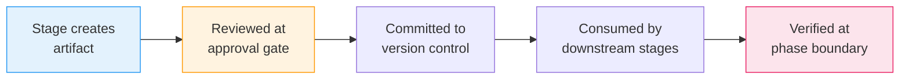

# Artifacts Reference

Every AI-DLC workflow produces artifacts under its **intent record dir** —
`aidlc/spaces/<space>/intents/<YYMMDD>-<label>/` (where `<space>` is `default`
unless a non-default space is in play, and `<YYMMDD>-<label>` is the intent dir;
written `<record>/` below). This chapter is a complete reference for the
directory structure, per-artifact descriptions, lifecycle, and git policy.

---

## Directory Tree

```
aidlc/spaces/<space>/intents/<YYMMDD>-<label>/   # one record dir per intent
  aidlc-state.md                    # Workflow state (commit)
  audit/                            # Audit trail — per-clone shards (commit)
    <host>-<clone>.md               # this clone's shard; readers glob + merge by timestamp
  .aidlc-recovery.md                # Recovery breadcrumb (gitignore)
  runtime-graph.json                # Execution telemetry view (gitignore)

  verification/                     # Phase boundary checks (commit)
    phase-check-initialization.md
    phase-check-ideation.md
    phase-check-inception.md
    phase-check-construction.md
    phase-check-operation.md

  initialization/                   # Phase 0 artifacts
    workspace-scaffold/scaffold-report.md
    workspace-detection/workspace-findings.md
    state-init/state-init-summary.md

  ideation/                         # Phase 1 artifacts
    intent-capture/
    market-research/                (conditional)
    feasibility/                    (conditional)
    scope-definition/
    team-formation/                 (conditional)
    rough-mockups/                  (conditional)
    approval-handoff/

  inception/                        # Phase 2 artifacts
    reverse-engineering/            (conditional: brownfield)
    practices-discovery/            (conditional)
    requirements-analysis/
    user-stories/                   (conditional)
    refined-mockups/                (conditional)
    application-design/             (conditional)
    units-generation/
    delivery-planning/

  construction/                     # Phase 3 artifacts
    {unit-name}/                    (per unit of work, repeated)
      functional-design/            (conditional)
      nfr-requirements/             (conditional)
      nfr-design/                   (conditional)
      infrastructure-design/        (conditional)
      code-generation/
    build-and-test/
    ci-pipeline/                    (conditional)

  operation/                        # Phase 4 artifacts
    deployment-pipeline/            (conditional)
    environment-provisioning/       (conditional)
    deployment-execution/           (conditional)
    observability-setup/            (conditional)
    incident-response/              (conditional)
    performance-validation/         (conditional)
    feedback-optimization/          (conditional)

  archive/                          (created on-demand)
    {ISO-date}-{stage-name}/
```

**Team knowledge is not in the record dir.** It lives one level up, at the space
level — `aidlc/spaces/<space>/knowledge/` (a sibling of `intents/`) — so it
accumulates across every intent in the space rather than being trapped in one
intent's record. The engine creates it empty; the team adds free-form files
under an optional `aidlc-shared/` and per-agent subdirectories. See
[Knowledge](08-knowledge.md).

**Per-stage memory diary.** Each executed stage also keeps a committed
`memory.md` alongside its artifacts (e.g.
`<record>/inception/requirements-analysis/memory.md`). It is the
stage's observation diary — auto-created from a template at stage start,
maintained by the orchestrator during the stage, and read by the §13
Learnings Ritual at the approval gate. It is never hand-edited. See
[Rules and the Learning Loop](09-rules-and-the-learning-loop.md) for how
the diary feeds the learning loop.

**Code lives in sibling repos, not the record dir.** The `aidlc/` tree holds only
method, state, audit, and artifacts — never application code. Generated code lands
in the workspace's **code repos**: in the common single-repo case, the project dir
itself; in a multi-repo workspace, the sibling repo directories that are immediate
children of the workspace root (each with its own `.git`). An intent records the
repos it touches at birth — auto-discovered, or scoped with `--repos a,b` — in its
`intents.json` row (`repos: [...]`); Construction anchors each git operation to one
of them. An intent with no recorded `repos` is the single-repo default. See
[CLI Commands](12-cli-commands.md).

---

## Artifact Lifecycle

Artifacts flow through a predictable lifecycle from creation to consumption by downstream stages:



<!-- Text fallback: Stage creates artifact, reviewed at approval gate, committed to version control, consumed by downstream stages, verified at phase boundary. -->

1. **Created** — The lead agent produces the artifact during stage execution and writes it to the appropriate subdirectory of the intent's record dir
2. **Reviewed** — You review the artifact at the approval gate and either approve or request changes
3. **Committed** — After approval, the artifact is ready for version control (see git policy below)
4. **Consumed** — Downstream stages read the artifact as input (see the inputs table below)
5. **Verified** — Phase boundary verification checks confirm traceability across all artifacts in the phase

---

## Artifacts by Phase

### Initialization (stages 0.1-0.3)

| Stage | Artifacts | Notes |
|-------|-----------|-------|
| 0.1 Workspace Scaffold | `scaffold-report.md` | Deterministic (runs inside `aidlc-utility intent-birth`) |
| 0.2 Workspace Detection | `workspace-findings.md`, updates `aidlc-state.md` | Deterministic rule-based scanner |
| 0.3 State Init | `state-init-summary.md` | Deterministic |

The welcome message is rendered at session start via `companyAnnouncements` in `settings.json` — it is not a stage and produces no artifact.

### Ideation (stages 1.1-1.7)

| Stage | Key Artifacts | Condition |
|-------|--------------|-----------|
| 1.1 Intent Capture | `intent-statement.md`, `stakeholder-map.md` | Always |
| 1.2 Market Research | `competitive-analysis.md`, `build-vs-buy.md` | Conditional |
| 1.3 Feasibility | `feasibility-assessment.md`, `constraint-register.md`, `raid-log.md` | Conditional |
| 1.4 Scope Definition | `scope-document.md`, `intent-backlog.md` | Always |
| 1.5 Team Formation | `team-assessment.md`, `mob-composition.md` | Conditional |
| 1.6 Rough Mockups | `wireframes.md`, `user-flow.md` | Conditional |
| 1.7 Approval & Handoff | `initiative-brief.md`, `decision-log.md` | Always |

### Inception (stages 2.1-2.8)

| Stage | Key Artifacts | Condition |
|-------|--------------|-----------|
| 2.1 Reverse Engineering | 9 files including `architecture.md`, `code-structure.md`, `technology-stack.md` | Brownfield only |
| 2.2 Practices Discovery | `team-practices.md`, `discovered-rules.md`, `evidence.md`, `practices-discovery-timestamp.md` (promoted to the space memory layer — `aidlc/spaces/<space>/memory/team.md` and `memory/project.md` — on affirmation) | Conditional |
| 2.3 Requirements Analysis | `requirements.md` | Always |
| 2.4 User Stories | `stories.md`, `personas.md` | User-facing features |
| 2.5 Refined Mockups | `mockups.md`, `interaction-spec.md`, `accessibility-checklist.md` | UI projects |
| 2.6 Application Design | `components.md`, `services.md`, `decisions.md` | When new components needed |
| 2.7 Units Generation | `unit-of-work.md`, `unit-of-work-dependency.md`, `unit-of-work-story-map.md` | Always |
| 2.8 Delivery Planning | `bolt-plan.md`, `team-allocation.md`, `risk-and-sequencing-rationale.md`, `external-dependency-map.md` | Always |

### Construction (stages 3.1-3.7)

Stages 3.1-3.5 repeat per unit of work. Artifacts go in `construction/{unit-name}/{stage-name}/`. Stages 3.6-3.7 run once after all units.

The four design stages (3.1-3.4) prune their artifacts to each unit's **kind** (tagged in 2.7's edge block: `service`, `spec`, `ui`, `packaging`, or `library`). A `spec` unit owes no scalability doc, a `packaging` unit no business-logic model; a unit left untagged receives the full matrix below. Which artifact applies to which kind is stage frontmatter data (`produces_kinds`, see [Stage definition](../reference/15-stage-definition.md)). A unit for which none of a stage's artifacts apply is complete for that stage with zero files.

| Stage | Key Artifacts | Condition |
|-------|--------------|-----------|
| 3.1 Functional Design | `business-logic-model.md`, `business-rules.md` | Per plan, per unit (by kind) |
| 3.2 NFR Requirements | `security-requirements.md`, `performance-requirements.md` | Per plan, per unit (by kind) |
| 3.3 NFR Design | `security-design.md`, `performance-design.md` | Per plan, per unit (by kind) |
| 3.4 Infrastructure Design | `deployment-architecture.md`, `infrastructure-services.md` | Per plan, per unit (by kind) |
| 3.5 Code Generation | `code-generation-plan.md`, `code-summary.md` (code goes to workspace root) | Always, per unit |
| 3.6 Build and Test | `build-instructions.md`, `test-results.md` | Always, after all units |
| 3.7 CI Pipeline | `ci-config.md`, `quality-gates.md` | Conditional, after all units |

### Operation (stages 4.1-4.7)

| Stage | Key Artifacts | Condition |
|-------|--------------|-----------|
| 4.1 Deployment Pipeline | `cd-config.md`, `deployment-strategy.md`, `rollback-runbook.md` | Conditional |
| 4.2 Environment Provisioning | `environment-inventory.md`, `validation-report.md` | Conditional |
| 4.3 Deployment Execution | `deployment-log.md`, `smoke-test-results.md` | Conditional |
| 4.4 Observability Setup | `dashboards.md`, `alarms.md`, `slo-config.md` | Conditional |
| 4.5 Incident Response | `runbooks.md`, `incident-plan.md`, `escalation-matrix.md` | Conditional |
| 4.6 Performance Validation | `load-test-plan.md`, `nfr-validation-matrix.md` | Conditional |
| 4.7 Feedback & Optimization | `slo-report.md`, `cost-analysis.md`, `feedback-loop.md` | Conditional |

---

## Question Files

Every stage that collects user input produces a co-located question file named `{stage-name}-questions.md`. Questions use lettered options (A-E) plus a mandatory `X. Other (please specify)` option, with `[Answer]:` tags for recording responses.

You choose how to answer at each stage:

| Mode | How it works |
|------|-------------|
| **Guide Me** | Interactive walkthrough, batches of up to 4 questions |
| **I'll Edit the File** | Edit the question file directly, signal "done" when finished |
| **Chat** | Freeform conversation; decisions are extracted and written to the file |

You can switch modes mid-stage. The question file is always the source of truth.

---

## What to Commit vs. Gitignore

The shipped `.gitignore` encodes this split (vision §5.1): the shared work —
method, registry, state, audit, artifacts — is committed; per-user session
cursors and machine-local derived state are ignored.

| Commit | Gitignore |
|--------|-----------|
| `aidlc-state.md` | `aidlc/active-space`, `intents/active-intent` (per-user cursors) |
| `audit/*.md` (per-clone shards) | `.aidlc-recovery.md` and other `intents/*/.aidlc-*` (transient breadcrumbs) |
| All stage artifacts | `runtime-graph.json` (re-derivable from the audit shards) |
| `verification/` phase check results | `aidlc/.aidlc-clone-id` (names this clone's shard; must stay machine-local) |
| Space-level `aidlc/knowledge/` team knowledge files | `aidlc/.aidlc-sessions/` (per-conversation session→intent map) |
| Per-stage `memory.md` diaries; space `memory/` layer | `.aidlc-hooks-health/`, `.aidlc-sensors/` (heartbeats, advisory findings) |

---

## Inputs and Dependencies

Each stage reads artifacts from prior stages as input. Key dependency chains:

- **Intent Capture** artifacts flow into Market Research, Feasibility, Scope Definition, and Rough Mockups
- **Requirements Analysis** artifacts flow into User Stories, Application Design, and all Construction stages
- **Application Design** and **Units Generation** artifacts flow into all per-unit Construction stages
- **All Construction artifacts** flow into Build and Test and CI Pipeline
- **Infrastructure Design** artifacts flow into Operation stages

For the complete per-stage input table, see the [Orchestration Reference](../reference/00-overview.md).

---

## Phase Boundary Verification

At each phase transition, a verification check runs to confirm traceability:

| Check File | Transition | What it validates |
|-----------|-----------|-------------------|
| `phase-check-initialization.md` | Initialization to Ideation | Workspace scaffold, scope plan, agents available |
| `phase-check-ideation.md` | Ideation to Inception | Intent to scope to intent backlog consistency |
| `phase-check-inception.md` | Inception to Construction | Requirements to stories to architecture alignment |
| `phase-check-construction.md` | Construction to Operation | All units built and tested, CI configured |
| `phase-check-operation.md` | Operation to workflow complete | Deployment, observability, and feedback loops verified |

---

## Next Steps

- [State Tracking and Audit Trail](10-state-and-audit.md) — State file and audit trail details
- [How a Stage Runs](04-phases-and-stages.md) — Stage execution and artifact production
- [Glossary](glossary.md) — Definitions for artifact, phase boundary verification, question file
