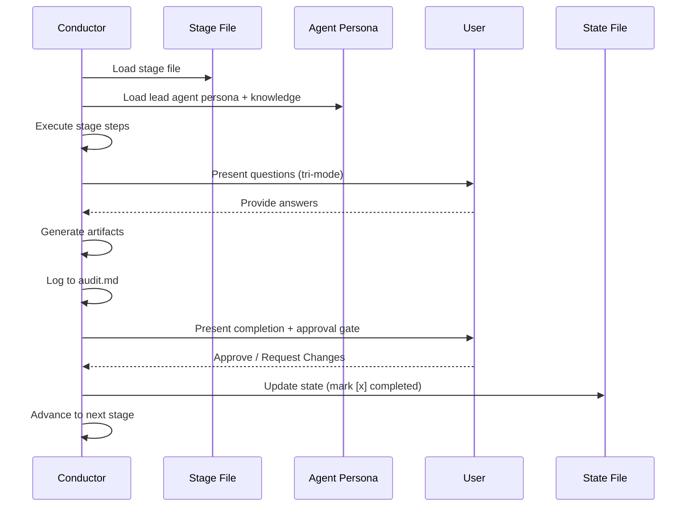
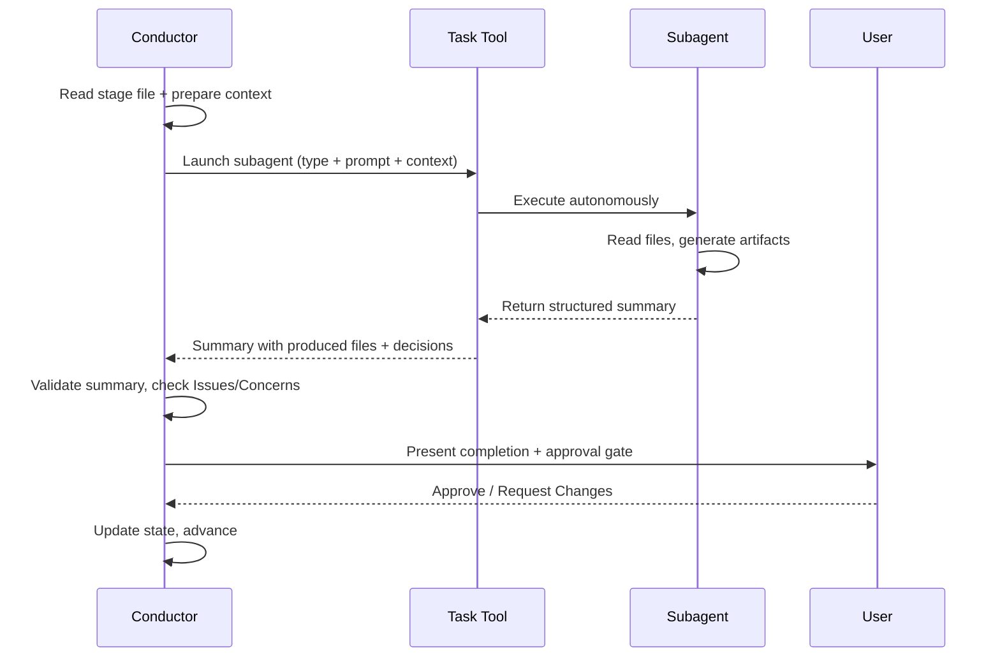

# Architecture

> **Source**: Derived from the engine and conductor (`.claude/tools/aidlc-orchestrate.ts` and `.claude/skills/aidlc/SKILL.md`) and surrounding files.

## Overview

AI-DLC uses a hybrid execution model: some stages run inline (the conductor loads the agent persona and executes directly in conversation), while others delegate to subagents via the Claude Code Task tool. Inline stages support user interaction (questions, clarifications, approval). Subagent stages run autonomously and return structured summaries.

```mermaid
graph LR
    subgraph INITIALIZATION["INITIALIZATION (0.1-0.3)"]
        Z1["Workspace Scaffold"]
        Z4["State Init"]
        Z1 -.->|"3 stages"| Z4
    end

    subgraph IDEATION["IDEATION (1.1-1.7)"]
        I1["Intent Capture"]
        I7["Approval & Handoff"]
        I1 -.->|"7 stages"| I7
    end

    subgraph INCEPTION["INCEPTION (2.1-2.8)"]
        N1["Reverse Engineering"]
        N7["Delivery Planning"]
        N1 -.->|"8 stages"| N7
    end

    subgraph CONSTRUCTION["CONSTRUCTION (3.1-3.7)"]
        C1["Functional Design"]
        C7["CI Pipeline"]
        C1 -.->|"7 stages per unit"| C7
    end

    subgraph OPERATION["OPERATION (4.1-4.7)"]
        O1["Deployment Pipeline"]
        O7["Feedback & Optimization"]
        O1 -.->|"7 stages"| O7
    end

    Z4 -->|"auto-proceed"| I1
    I7 -->|"Verification Gate 1"| N1
    N7 -->|"Verification Gate 2"| C1
    C7 -->|"Verification Gate 3"| O1
    O7 -.->|"Feedback Loop"| I1

    style INITIALIZATION fill:#f3e5f5,stroke:#9c27b0
    style IDEATION fill:#e8f5e9,stroke:#4caf50
    style INCEPTION fill:#e3f2fd,stroke:#2196f3
    style CONSTRUCTION fill:#fff3e0,stroke:#ff9800
    style OPERATION fill:#fce4ec,stroke:#e91e63
```



## Five Layers

**Rules** (`rules/`) -- Organization and project guardrails. Self-learning: human corrections become persistent behavioral rules. Only ~35 lines total -- kept minimal to avoid context bloat in non-AI-DLC conversations.

**Agents** (`agents/*.md`) -- Fourteen flat agent files: 11 domain-expert personas, 2 review-only agents, and the adaptive-workflows composer. Each defines its role, responsibilities, collaboration pattern, tools, and knowledge loading order. All have `disallowedTools: Task` -- only the conductor delegates.

**Knowledge** (`knowledge/`) -- Two-tier methodology reference:
- `aidlc-shared/` -- Principles, verification, brownfield safeguards, **audit event taxonomy** (canonical event registry), state template
- `aidlc-<agent>-agent/` -- Per-agent methodology files (architecture patterns, testing strategies, etc.)

**Skills** (`skills/aidlc/`) -- The orchestrator entry point (`SKILL.md`), stage protocol files (`stage-protocol.md`, `stage-protocol-recovery.md`, `stage-protocol-governance.md`), and 32 stage files across 5 phase directories (`stages/initialization/`, `stages/ideation/`, `stages/inception/`, `stages/construction/`, `stages/operation/`).

**Hooks** (`hooks/`) -- Framework hooks for audit emission (PostToolUse on Write/Edit), session lifecycle (SessionStart, SessionEnd), state sync (PostToolUse on TaskUpdate), state validation (PreCompact), subagent tracking (SubagentStop), and statusline rendering. All framework files prefixed `aidlc-*.ts`.

## Configuration Layers

> **Audience**: contributors deciding where a new concern (a rule, a piece of methodology, a sensor binding, a domain-knowledge fact) belongs.
> **Source-of-truth status**: this is the routing principle. When code and this section disagree, this section wins; the code is being miscategorised.

Configuration in this repo partitions along **two orthogonal axes**, not one.

### Axis 1 — who authors it?

- **Framework-authored** — ships with the AI-DLC distribution. Same content for every project. Updated when the framework releases. Never edited by users in their own workspaces.
- **Team-authored** — written by humans (or by a stage running in this workspace, then affirmed by humans). Specific to this project. Persists across workflows in this workspace. Editable.

### Axis 2 — when is it consumed?

- **Loaded continuously (harness configuration)** — read at session start; available to every stage in every workflow run in this workspace. Lives under `.claude/`.
- **Per-workflow artefact** — produced by a specific stage as output, read by later stages as input. Lives under the intent's record dir (`aidlc/spaces/<space>/intents/<YYMMDD>-<label>/`, written `<record>/` below). Re-produced on each workflow run.

### The four quadrants

Crossing the two axes gives four quadrants. Three are populated; one is intentionally empty.

|  | Framework-authored | Team-authored |
|---|---|---|
| **Loaded continuously** (harness config) | `.claude/skills/`, `.claude/agents/`, `.claude/knowledge/`, `aidlc/spaces/<space>/memory/org.md`, `aidlc/spaces/<space>/memory/phases/*.md`, `.claude/scopes/`, `.claude/tools/data/scope-grid.json`, `.claude/tools/data/stage-graph.json` | `aidlc/spaces/<space>/memory/team.md`, `aidlc/spaces/<space>/memory/project.md` |
| **Per-workflow artefact** | *(empty by design)* | `<record>/aidlc-state.md`, `<record>/audit/*.md` (per-clone shards), `<record>/<phase>/<stage>/*.md`, `.aidlc/worktrees/bolt-*/` |

The framework doesn't produce per-workflow artefacts because such outputs would have to ship with the distribution — which makes them framework-authored harness config, not per-workflow output. The empty cell is the routing rule's signature, not a gap.

> **Framework-authored = ships from upstream; treat as immutable in your project.** Nothing in git or the file system enforces this — `.claude/` is editable territory and you can edit `org.md` or the `phases/*.md` files if you want. But the convention is: override at `team.md` / `project.md` (the right-hand cell) instead of mutating the framework defaults. That keeps your overrides visible at review time, lets the framework upgrade cleanly, and prevents drift between projects sharing the same framework version.

### Boundary tests for placing a new concern

When a new concern arrives, two questions resolve where it goes:

1. **Same content for every project, or project-specific?** Framework-authored vs team-authored.
2. **Loaded into agent context every session, or read only by specific stages?** Harness config vs per-workflow artefact.

Worked examples:

- *"We always squash-merge to main"* — project-specific (other teams use rebase) and loaded continuously (the conductor reads it on every Bolt merge). Goes to `aidlc/spaces/<space>/memory/team.md`.
- *"ALWAYS use Result<T,E> in service layer; NEVER throw"* — project-specific and loaded continuously (agents read it on every code-gen). Goes to `aidlc/spaces/<space>/memory/project.md`.
- *"Trunk-based development is the recommended branching strategy"* — same for every project (framework opinion) and loaded continuously (read at delivery-planning). Goes to `aidlc/spaces/<space>/memory/org.md`.
- *"The 5 common branching strategies and their trade-offs"* — same for every project (framework reference) and loaded continuously (aidlc-pipeline-deploy-agent reads when discovering branching strategy). Goes to `.claude/knowledge/aidlc-pipeline-deploy-agent/branching-strategies.md`.
- *"This run's requirements analysis"* — project-specific and per-workflow (each run produces fresh analysis). Goes to `<record>/inception/requirements-analysis/`.
- *"Bolt-1's worktree state mid-Construction"* — project-specific and per-workflow (regenerated each Bolt). Goes to the Bolt worktree's copy of the record dir, `.aidlc/worktrees/bolt-1/<record>/aidlc-state.md`.

### Sub-categories of harness config (top row)

The top row partitions further by **form of content**:

- **Framework harness mechanics** → frontmatter / JSON. Workflow ordering, stage definitions, artifact production, gate semantics. Read by tools deterministically. Lives in `.claude/skills/`, `.claude/tools/data/`.
- **Framework domain reference** → agent KB prose under `.claude/knowledge/aidlc-<agent>-agent/`. The menu of options for a domain (the 5 branching strategies, the deployment patterns, the testing methodologies). Read by the owning agent when it needs the menu.
- **Framework methodology defaults** → prose at `aidlc/spaces/<space>/memory/org.md`. What the framework recommends until a team affirms otherwise. Written in the team's voice (because if the team doesn't override, the org defaults *are* the team's voice).
- **Team practices** → prose at `aidlc/spaces/<space>/memory/team.md`. The team's selection — "this is how we work", populated by practices-discovery's affirmation gate. Read by agents at decision points (delivery-planning reads branching strategy; the conductor reads walking-skeleton stance in `SKILL.md`).
- **Project overrides** → prose at `aidlc/spaces/<space>/memory/project.md`. Project-specific corrections that override team and org defaults; also populated by practices-discovery's affirmation gate.
- **Guardrails** (`## Forbidden`, `## Mandated`, `## Corrections` sections) — present in `org.md`, `team.md`, and `project.md`. Corrective rules for agents — `ALWAYS X`, `NEVER Y`. Loaded into agent context continuously.

### What not to put in `.claude/` directly

Two cases that look like configuration but aren't:

- **Per-workflow analysis outputs.** Reverse-engineering's 9 brownfield artifacts (`code-structure.md`, `architecture.md`, etc.) describe *this* run's codebase scan. They live in `<record>/inception/reverse-engineering/`, not in `.claude/`. They re-run on each workflow.
- **Run-state.** The `aidlc-state.md` file is per-workflow truth-of-now. It belongs in the intent's record dir, not in `.claude/`. Same for the `audit/` shards.

### Cross-row promotion — the practices-discovery exception

Most stages write to one row. A few stages write to both, with the cross-row write gated by team affirmation. **Practices-discovery (Inception 2.2) is the only stage that does this.** Its outputs are:

- `<record>/inception/practices-discovery/team-practices.md` — per-workflow audit trail (bottom row).
- On affirmation, content is copied to the space memory layer — `aidlc/spaces/<space>/memory/team.md` AND `memory/project.md` — team-authored harness config (top-right cell).

The audit-trail copy proves what was affirmed in this run; the `.claude/` copy becomes the team's standing configuration that every future workflow loads.

The pattern (scan → draft → affirm → publish) matches reverse-engineering's structure. The difference is the *consequence*: reverse-engineering's affirmation just means "this scan is accurate"; practices-discovery's affirmation means "the framework can write these words into our standing config and load them on every future workflow."

Without the affirmation gate, the framework would put words in the team's mouth — and worse, those words would persist across workflows. With the gate, the team always wrote it.

This pattern is rare and should be deliberate. Use it only when all three are true:
1. The stage's output is constitutive truth about the team, project, or workspace.
2. That truth should affect every future workflow run, not just this one's downstream stages.
3. The team is willing to author the truth — review and approve at a gate, not just let the framework write it.

If any of the three is false, default to per-workflow-only.

### Cross-references

- [Agent System](05-agent-system.md) — agent file structure (top-left cell mechanics).
- [Knowledge System](10-knowledge-system.md) — `knowledge/` two-tier shape.
- [Stage Definition](15-stage-definition.md) — stage frontmatter spec (the harness mechanics format).
- [Stage Protocol](04-stage-protocol.md) — execution rules per stage.

## Execution Models

**Inline stages** -- The conductor reads the lead agent's flat file (e.g., `agents/aidlc-architect-agent.md`) and knowledge from `knowledge/[agent]/` for persona framing, then executes the stage directly in conversation. This allows real-time user interaction: asking questions, resolving ambiguity, and iterating on artifacts before approval.

Most stages use inline execution, including all three Initialization stages (Workspace Scaffold, Workspace Detection, State Init; all run deterministically inside `aidlc-utility intent-birth`), all Ideation stages (Intent Capture, Market Research, Feasibility, Scope Definition, Team Formation, Rough Mockups, Approval & Handoff), most Inception stages (Practices Discovery, Requirements Analysis, User Stories, Refined Mockups, Application Design, Units Generation, Delivery Planning), most Construction stages (Functional Design, NFR Requirements, NFR Design, Infrastructure Design, Build and Test, CI Pipeline), and all Operation stages. Note: Build and Test (3.6) runs once after all units are complete, not per-unit.

**Subagent stages** -- The conductor prepares context (prior artifacts, project description, workspace findings) and delegates to a Claude Code Task tool subagent. The subagent executes autonomously and returns a structured summary. This is used for stages that benefit from focused, independent work without user interaction during execution. If a subagent call fails, the conductor retries once with a reduced-context prompt, then offers the user inline execution or skip-and-revisit as fallback options.

Stages using subagent execution: Reverse Engineering (2.1, two-step delegation by aidlc-developer-agent for the code scan then aidlc-architect-agent for the synthesis) and Code Generation (3.5, aidlc-developer-agent subagent). Workspace Detection (0.2) runs deterministically inline inside `aidlc-utility intent-birth`, not as a subagent.

```mermaid
flowchart LR
    subgraph INLINE["Mode 1: Inline"]
        direction TB
        IN1["Conductor reads\nstage file"]
        IN2["Load agent persona\n+ knowledge"]
        IN3["Execute stage steps\ndirectly in conversation"]
        IN4["User interaction\navailable"]
        IN5["Approval gate\n(AskUserQuestion)"]
        IN1 --> IN2 --> IN3 --> IN4 --> IN5
    end

    subgraph SUBAGENT["Mode 2: Subagent (simple)"]
        direction TB
        SA1["Conductor reads\nstage file"]
        SA2["Prepare context:\nartifacts + persona"]
        SA3["Task tool call\n(subagent_type specified)"]
        SA4["Subagent executes\n(no user interaction)"]
        SA5["Return structured\nsummary to conductor"]
        SA6["Conductor presents\ncompletion + approval"]
        SA1 --> SA2 --> SA3 --> SA4 --> SA5 --> SA6
    end

    subgraph TWOSTEP["Mode 3: Subagent (two-step RE)"]
        direction TB
        TS1["Conductor reads\nRE stage file"]
        TS2["Task: aidlc-developer-agent\ncode scan"]
        TS3["Developer returns\nscan results"]
        TS4["Task: aidlc-architect-agent\nsynthesis"]
        TS5["Architect produces\n9 artifacts"]
        TS6["Conductor presents\ncompletion + approval"]
        TS1 --> TS2 --> TS3 --> TS4 --> TS5 --> TS6
    end

    style INLINE fill:#e8f5e9,stroke:#4caf50
    style SUBAGENT fill:#e3f2fd,stroke:#2196f3
    style TWOSTEP fill:#fff3e0,stroke:#ff9800
```



### Conductor Inline Stage Execution



### Conductor Subagent Delegation



## Source vs distribution (one core, many harnesses)

The framework is **authored once and generated per harness** — today Claude
Code, Kiro CLI, Kiro IDE, Codex CLI, and opencode, and any capable CLI you port
it to. The
hand-authored source is a harness-neutral `core/` plus a thin `harness/<name>/`
surface per CLI; `bun scripts/package.ts` regenerates the committed,
drift-guarded `dist/<harness>/` trees:

```
core/                  # hand-authored, harness-neutral (tools, aidlc-common,
                       #   agents, rules, scopes, sensors, knowledge, hooks,
                       #   3 session skills); prose uses the {{HARNESS_DIR}} token
harness/<name>/        # per-CLI surface: manifest.ts + orchestrator skill +
                       #   harness files (+ emit.ts for codex)
scripts/package.ts     # the build: copy core (token→.claude/.kiro/.codex) +
                       #   harness, compile the graph, generate runners, emit;
                       #   `--check` is the byte-parity drift guard
scripts/build-binaries.ts # release-only binary compiler + smoke gate, writing
                       #   per-target executable + runtime/<harness>/ bundles
                       #   under ignored build/binaries/
dist/<harness>/        # GENERATED + committed: claude/.claude, kiro/.kiro,
                       #   kiro-ide/.kiro, codex/{.codex,.agents} — never hand-edited
```

`core/` `.ts` is byte-copied untransformed; the runtime `harnessDir()` seam
(`core/tools/aidlc-lib.ts`) derives the harness dir from the shipped layout at
execution time — open-set, from the tool's own path rather than a hardcoded
list, so a new harness needs no edit here — and its rules-dir rename ships
per-tree in a generated `tools/data/harness.json` the `rulesSubdir()` seam
reads. One set of tool sources runs in every harness. See
[Porting to a New Harness](../harness-engineering/09-porting-to-a-new-harness.md).

## Directory Structure

The shipped Claude distribution (`dist/claude/.claude/`, regenerated
byte-for-byte from `core/` + `harness/claude/`):

```
dist/claude/.claude/
+-- CLAUDE.md
+-- settings.json
+-- hooks/
|   +-- aidlc-audit-logger.ts
|   +-- aidlc-sync-statusline.ts
|   +-- aidlc-validate-state.ts
|   +-- aidlc-log-subagent.ts
|   +-- aidlc-session-start.ts
|   +-- aidlc-session-end.ts
|   +-- aidlc-statusline.ts
+-- rules/
|   +-- aidlc.md                  # @-import stub -> ../../aidlc/spaces/<space>/memory/ (NOT a copy; re-pointed in place on `space` switch)
+-- agents/
|   +-- aidlc-product-agent.md
|   +-- aidlc-design-agent.md
|   +-- aidlc-delivery-agent.md
|   +-- aidlc-architect-agent.md
|   +-- aidlc-aws-platform-agent.md
|   +-- aidlc-compliance-agent.md
|   +-- aidlc-devsecops-agent.md
|   +-- aidlc-developer-agent.md
|   +-- aidlc-quality-agent.md
|   +-- aidlc-pipeline-deploy-agent.md
|   +-- aidlc-operations-agent.md
+-- knowledge/
|   +-- aidlc-shared/
|   |   +-- ai-dlc-principles.md
|   |   +-- verification.md
|   |   +-- brownfield.md
|   |   +-- audit-format.md
|   |   +-- state-template.md
|   |   +-- knowledge-readme-template.md
|   +-- aidlc-product-agent/
|   |   +-- requirements-guide.md
|   |   +-- product-guide.md
|   |   +-- functional-design-guide.md
|   |   +-- requirements-elicitation.md
|   |   +-- prioritization-frameworks.md
|   |   +-- user-story-patterns.md
|   |   +-- market-research-methods.md
|   +-- aidlc-architect-agent/
|   |   +-- architecture-guide.md
|   |   +-- nfr-design-guide.md
|   |   +-- ddd-patterns.md
|   |   +-- architecture-patterns.md
|   |   +-- nfr-design-patterns.md
|   |   +-- adr-template.md
|   +-- aidlc-developer-agent/
|   |   +-- code-analysis-guide.md
|   |   +-- code-generation-guide.md
|   |   +-- code-generation-patterns.md
|   |   +-- api-design-guide.md
|   |   +-- data-modelling-patterns.md
|   |   +-- re-artifacts.md
|   +-- [... 8 more agent knowledge dirs]
+-- skills/
    +-- aidlc/
        +-- SKILL.md
        +-- stage-protocol.md
        +-- stage-protocol-recovery.md
        +-- stage-protocol-governance.md
        +-- stages/
            +-- initialization/
            |   +-- workspace-scaffold.md
            |   +-- workspace-detection.md
            |   +-- state-init.md
            +-- ideation/
            |   +-- intent-capture.md
            |   +-- market-research.md
            |   +-- feasibility.md
            |   +-- scope-definition.md
            |   +-- team-formation.md
            |   +-- rough-mockups.md
            |   +-- approval-handoff.md
            +-- inception/
            |   +-- reverse-engineering.md
            |   +-- practices-discovery.md
            |   +-- requirements-analysis.md
            |   +-- user-stories.md
            |   +-- refined-mockups.md
            |   +-- application-design.md
            |   +-- units-generation.md
            |   +-- delivery-planning.md
            +-- construction/
            |   +-- functional-design.md
            |   +-- nfr-requirements.md
            |   +-- nfr-design.md
            |   +-- infrastructure-design.md
            |   +-- code-generation.md
            |   +-- build-and-test.md
            |   +-- ci-pipeline.md
            +-- operation/
                +-- deployment-pipeline.md
                +-- environment-provisioning.md
                +-- deployment-execution.md
                +-- observability-setup.md
                +-- incident-response.md
                +-- performance-validation.md
                +-- feedback-optimization.md
```

### The workspace: spaces and intents

The tree above is the **engine** — harness-specific, never browsed by the user.
Everything the engine *reads and writes at runtime* lives in a separate, neutral
`aidlc/` directory at the project root, organized as a two-level container:
**space → intent**. (For the end-user orientation, see the User Guide's
[Spaces and Intents](../guide/03-spaces-and-intents.md); this section is the
data model the engine resolves against.)

```
aidlc/                                    # neutral, harness-independent, committed to git
+-- active-space                          # cursor: active space name (gitignored, per-user)
+-- spaces/
    +-- default/                          # one space per team; "default" is auto-resolved
        +-- memory/                        # the method — org.md/team.md/project.md, phases/, templates/
        +-- knowledge/                     # space-level domain knowledge (free-form)
        +-- codekb/<repo>/                 # per-repo code knowledge base
        +-- intents/
            +-- active-intent              # cursor: active intent record dir (gitignored, per-user)
            +-- intents.json               # the registry: [{ uuid, slug, dirName, scope, repos, status }]
            +-- <YYMMDD>-<label>/          # one record dir per intent (date-prefixed, short kebab label; UUIDv7 carries identity in intents.json)
                +-- aidlc-state.md          # per-intent workflow state
                +-- audit/<host>-<clone>.md # per-clone audit shards (glob-and-merge by timestamp)
                +-- <phase>/<stage>/*.md    # artifacts + the per-stage memory.md diary
```

**Resolution.** Two per-user cursors select context; neither ever errors (a
missing cursor falls back to a default):

- **Space** — `aidlc/active-space`, precedence `explicit arg > cursor > "default"`
  (`DEFAULT_SPACE`, `core/tools/aidlc-lib.ts:285`; resolver `activeSpace()`,
  `aidlc-lib.ts:354-366`). `listSpaces()` always reports `default` even with
  nothing on disk (`aidlc-lib.ts:713-728`).
- **Intent** — `aidlc/spaces/<space>/intents/active-intent`, precedence
  `explicit arg > cursor (if it names a real record holding aidlc-state.md) >
  lone-intent > null` (`activeIntent`, `aidlc-lib.ts:411-435`). A `null` intent
  means "no record yet" — the signal the orchestrator uses to auto-birth the
  first intent.

The path helpers — `intentsDir`, `knowledgeDir`, `codekbDir` (`aidlc-lib.ts`),
and `memoryDirFor` (`aidlc-graph.ts:234`) — all default their space argument to
`activeSpace(projectDir)`, so AI-DLC's own resolvers follow the cursor; switching
spaces with `/aidlc space <name>` also
re-points each harness-native rule include (the Claude `@`-import stub described
above, Kiro's resources glob, Codex's rules dir) at the switched space's
`memory/`. At `default` the re-point is a byte-identical no-op, so a single-team
committed tree never churns.

**Committed vs gitignored.** `aidlc/` is checked in so a team shares its work.
The split (`harness/claude/dot-gitignore:34-54`): the two cursors
(`active-space`, `active-intent`), per-clone runtime (`.aidlc-clone-id`,
`.aidlc-sessions/`), and derived state (`runtime-graph.json`, `.aidlc-*` under a
record) are **gitignored**; the method (`memory/**`), knowledge (`knowledge/**`,
`codekb/**`), the `intents.json` registry, each record's `aidlc-state.md`, the
`audit/` shards, and artifacts are **committed**. Audit is committed as per-clone
shards (`audit/<host>-<clone>.md`) precisely so git never has to merge concurrent
appends — there is intentionally no `merge=union` attribute.

## Key Design Decisions

1. **Hybrid execution model (inline + subagent)** -- Stages requiring user interaction (questions, clarifications, approval iteration) run inline where the conductor has direct conversation access. Stages performing focused, autonomous work (code scanning, code generation) delegate to subagents. A pure-subagent model would prevent mid-stage user interaction; a pure-inline model would not benefit from focused agent specialization.

2. **Agent personas for inline stages** -- For inline stages, the conductor loads the agent's flat file as context to frame its perspective, rather than delegating to a subagent. This gives the benefits of domain-expert framing (the conductor thinks like an architect during Application Design) without the costs of subagent context transfer and loss of user interaction.

3. **Two-step Reverse Engineering** -- Reverse Engineering uses a developer subagent for code scanning, then an architect subagent for synthesis. This is necessary because subagents cannot spawn subagents in Claude Code. The conductor acts as the bridge, passing the developer's code scan results to the architect for synthesis into a coherent architectural model.

4. **State tracking via aidlc-state.md** -- A single markdown state file tracks stage completion, current status, workspace context, scope configuration, execution plan, and runtime state (revision counts). The stage protocol defines the update pattern once; each stage updates it as its final step. A PostToolUse hook validates the state file structure after each write. Stage-level task IDs are resolved at runtime via `TaskList` (matching by subject like "Inception - Requirements Analysis") rather than stored in the state file -- this is more robust after context compaction since it reflects actual task system state.

5. **Stage protocol as shared contract** -- All 32 stages follow `stage-protocol.md` for approval gates, question format (tri-mode: Guide Me / Edit File / Chat), completion messages, state tracking, error recovery, change handling, the §13 Learnings Ritual, and phase boundary verification. This ensures consistent behavior across all stages without repeating instructions in each stage file.

6. **Two-tier knowledge architecture** -- Methodology knowledge ships with the framework in `knowledge/` (shared principles + per-agent methodology). User-managed team knowledge lives at the space level in `aidlc/knowledge/` (a sibling of the space's `intents/`), created empty by the engine and populated by the team. This separates framework upgrades from team customization.

7. **Flat agent files** -- Each agent is a single `.md` file in `agents/` (not a subdirectory with `agent.md` + `knowledge/`). This simplifies the structure and makes agents discoverable. Methodology knowledge lives separately in `knowledge/[agent]/`.

8. **Scope-driven adaptive depth** -- Nine named scopes (enterprise, feature, mvp, poc, bugfix, refactor, infra, security-patch, workshop) plus auto-detect determine which stages execute and at what depth. Each scope is a `.claude/scopes/aidlc-<name>.md` file (identity); membership is a per-stage `scopes:` frontmatter tag, transposed at compile into the EXECUTE/SKIP grid (`.claude/tools/data/scope-grid.json`, authoritative) and compiled into a summary table in SKILL.md (informational). NL keyword→scope inference reads each scope's `keywords` from its `.md` frontmatter. The user can override at any approval gate.

9. **Minimal rules** -- Only guardrails (~35 lines total) live in the space memory layer (`aidlc/spaces/<space>/memory/`, pulled in via the `.claude/rules/aidlc.md` @-import stub). Everything else (verification, brownfield safeguards, audit format, adaptive patterns) lives in `knowledge/aidlc-shared/` or is embedded in SKILL.md/stage-protocol.md. This prevents context bloat in non-AI-DLC conversations since rules are always loaded.

10. **Self-learning loop** -- When a human corrects agent behavior, the correction can become a persistent Rule. The §13 Learnings Ritual (tool-as-actor: `aidlc-learnings.ts` surfaces and persists; the user confirms) writes each confirmed learning as a practice into the space memory layer — `aidlc/spaces/<space>/memory/project.md` (default), one-click promote to `memory/team.md` — or scaffolds a Sensor, applying on the next workflow's compile. See [Rule System](08-rule-system.md).

11. **Phase boundary verification** -- Traceability checks run automatically at phase transitions (Initialization->Ideation auto-proceed, Ideation->Inception, Inception->Construction, Construction->Operation). This catches missing requirements-to-design links, orphaned artifacts, and inconsistencies before downstream stages build on incomplete foundations.

12. **Hook-based audit logging** -- A PostToolUse hook on Write/Edit operations automatically logs artifact creation and modification to the intent's `audit/` shards. A PreCompact hook validates state file structure before context compaction. A SubagentStop hook logs subagent completions. The 72-event taxonomy (defined in `knowledge/aidlc-shared/audit-format.md`; see [State Machine](12-state-machine.md) for the emitter registry) enables post-hoc analysis -- key events include `STAGE_STARTED`, `STAGE_COMPLETED`, `DECISION_RECORDED`, `SCOPE_CHANGED`, and `RULE_LEARNED`.

13. **No nested delegation** -- The conductor (SKILL.md) performs every agent Task call. Agents never invoke each other or spawn subagents. This keeps the delegation graph flat and debuggable.

14. **Four-option session resume** -- Resume from checkpoint, redo current stage, jump to a specific stage, or start fresh (with archive confirmation). Gives users fine-grained control over workflow navigation without manual state file editing.

15. **Stage/Phase jump commands** -- `--stage <slug|#>` and `--phase <name|#>` jump directly to a specific stage or phase. `--scope <scope>` sets or overrides the workflow scope. Forward jumps mark intermediate stages as `[S]` (skipped); backward jumps reset downstream stages to `[ ]` and replay forward from the target. Composable with each other.

## Directory Structure: Tests

```
tests/
+-- run-tests.ts              # Native Bun test runner (all levels, flag-selectable)
+-- run-tests.sh              # POSIX compatibility wrapper for run-tests.ts
+-- gen-coverage-registry.ts  # Generates .coverage-registry.json from covers: headers
+-- .coverage-registry.json   # Machine-checked coverage index (units x test files)
+-- .coverage-ratchet.json    # Coverage floor the registry --check enforces
+-- README.md                 # Discoverable suite index + quick reference
+-- lib/
|   +-- bun-junit-to-meta.ts  # Bun JUnit -> runner metadata glue
+-- harness/                  # Shared TS helpers: fixtures, sdk-drive, tui-drive, windows/
+-- fixtures/                 # State files, stub projects, RE artifacts
+-- hooks/
|   +-- pre-commit            # Git hook: runs the default levels (smoke + unit + integration)
+-- smoke/                    # Level: structural validation (no LLM, seconds)
+-- unit/                     # Level: single-component isolation (no LLM)
+-- integration/              # Level: cross-component contracts + live stage/CLI utilities
+-- e2e/                      # Level: full lifecycle, worktree, rendered terminal journeys
```

Every test is a `t*.test.ts` file run under `bun` — there are no shell test
files. The four directories are the suite's four levels.

## Testing

The project's test suite is **entirely TypeScript** (zero `.sh` test files) and
organized into four levels — `smoke`, `unit`, `integration`, `e2e` — that map
onto the classic three-layer pyramid (smoke + unit = L1 Protocol, integration =
L2 Stage, e2e = L3 Acceptance). Being all-TS makes the suite cross-platform by
construction: the same files run identically on macOS, Linux, and native
Windows. Tests validate everything from file existence to rendered-terminal
journeys, ensuring that changes to hooks, agents, stages, or settings do not
introduce regressions.

### Test Levels

| Level | Directory | What It Covers |
|-------|-----------|----------------|
| **Smoke** (L1) | `tests/smoke/` | File existence, agent/stage/protocol structure, SKILL.md graph consistency, settings.json schema. Fast structural checks that catch missing or misnamed files. No LLM. |
| **Unit** (L1) | `tests/unit/` | The 12 hooks, CLI tools, stage/agent frontmatter, knowledge inventory, the orchestration-engine handlers, and other single-component contracts. Each test isolates one component. No LLM. |
| **Integration** (L2) | `tests/integration/` | Cross-component contracts (scope-to-stage mapping, stage-agent cross-checks, protocol compliance, audit/runtime-graph end-to-end) and the live stage/CLI utilities driven through the `claude` CLI or SDK. The live files skip cleanly when `claude` is absent. |
| **E2E** (L3) | `tests/e2e/` | Full lifecycle and worktree primitives, plus the rendered-terminal (`tui-drive.ts`) journeys that prove answering real AskUserQuestion gates advances disk state. The live journeys require `claude` + Bedrock creds and are gated behind `AIDLC_TUI_LIVE=1`. |

For the full test strategy, the coverage registry, and how to add tests, see [Testing](09-testing.md).

## Cross-References

- [Orchestrator](03-orchestrator.md) -- SKILL.md deep-dive
- [Stage Protocol](04-stage-protocol.md) -- behavioral contract
- [Agent System](05-agent-system.md) -- agent structure and configuration
- [Hooks and Tools](06-hooks-and-tools.md) -- hook implementations
- [Knowledge System](10-knowledge-system.md) -- two-tier architecture
- [Diagrams](diagrams.md) -- all Mermaid diagrams in one place
