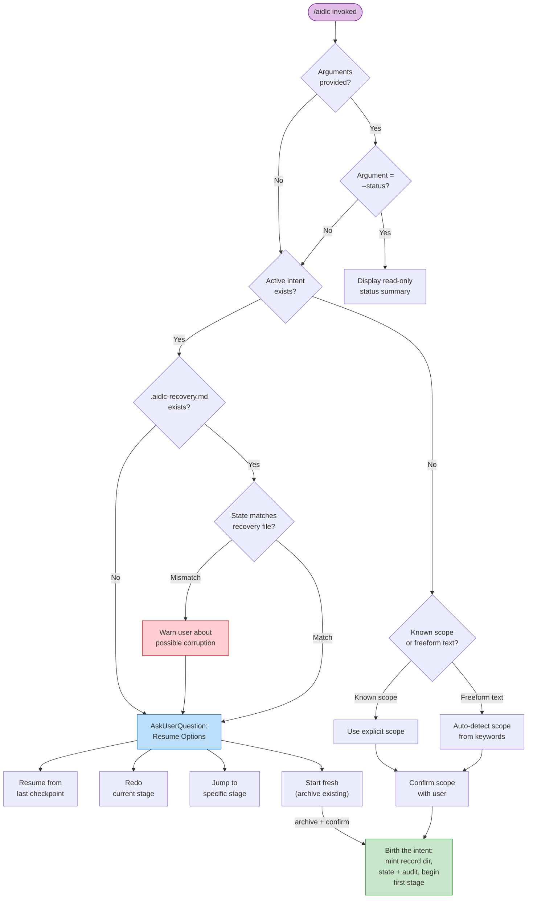
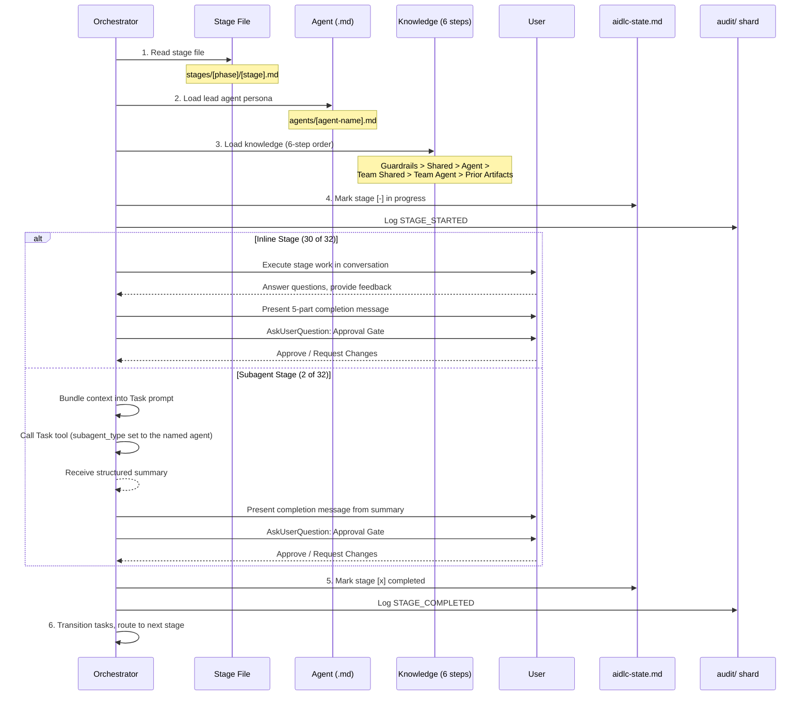
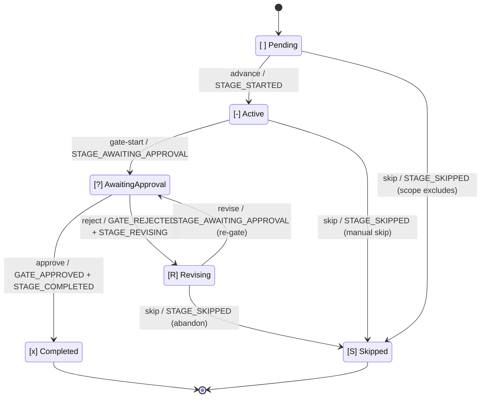

# Orchestrator

Orchestration is split across two pieces. A deterministic **engine** (`aidlc-orchestrate.ts`, with exactly three subcommands: `next`, `report`, and `park`) owns every between-stage decision - scope determination, stage routing, jump resolution, resume and init guards, gate status, and workflow completion - and emits a typed **directive** on each `next`. The **conductor** (`.claude/skills/aidlc/SKILL.md`, invoked via `/aidlc`) is a thin forwarding loop that acts on each directive - running the named stage, asking the human a question, fanning out a swarm - and reports the outcome with `report`. SKILL.md is not the control plane: the routing decisions live in the engine and the compiled data it reads (`tools/data/stage-graph.json`, `tools/data/scope-grid.json`), while SKILL.md owns execution quality inside the move the engine names.

This chapter documents the workflow behaviour from the conductor's side — entry points, session management, scope-to-stage mapping, the stage execution and advancement protocol, and the deliberate deviations. For the engine internals — the `next`/`report` contract, the typed directive union, the conductor persona, plural skills, scope shape, and the swarm referee — see [Engine and Skill System](17-skill-system.md). For user-facing command usage, see the [User Guide -- CLI Commands](../guide/12-cli-commands.md).

> **Ownership note.** Throughout this chapter, the behaviours described — argument resolution, scope detection, jump validation, resume branching — are computed by the **engine** on each `next` and delivered to the conductor as a directive. Where older prose said "the orchestrator does X," read it as "the engine decides X and emits a directive; the conductor carries it out." The decision logic is deterministic tool code, never SKILL.md prose.

> **Path convention.** Each intent's state, audit trail, and artifacts live under its **record dir** — `aidlc/spaces/<space>/intents/<YYMMDD>-<label>/`, written `<record>/` below. The audit trail is a directory of per-clone shards under `<record>/audit/`, not a single file.

---

## Table of Contents

- [Entry Points](#entry-points)
- [Session Management](#session-management)
- [Scope-to-Stage Mapping](#scope-to-stage-mapping)
- [Stage Execution Engine](#stage-execution-engine)
- [Stage Advancement Protocol](#stage-advancement-protocol)
- [Task Tracking](#task-tracking)
- [Deliberate Deviations](#deliberate-deviations)
- [Error Handling](#error-handling)
- [Appendix A: Stage Graph Reference](#appendix-a-stage-graph-reference)
- [Appendix B: Hook Reference](#appendix-b-hook-reference)
- [Appendix C: Approval Gate Patterns](#appendix-c-approval-gate-patterns)

---

## Entry Points

The conductor passes `$ARGUMENTS` to the engine's first `next` verbatim — it never pre-parses them. The engine parses the flags and freeform text and resolves which of the invocation patterns below applies, emitting the matching directive. The patterns are engine-resolved inputs, not conductor-side branches.

### `/aidlc [scope]` -- Explicit Scope

When the argument matches one of the 9 known scopes (`enterprise`, `feature`, `mvp`, `poc`, `bugfix`, `refactor`, `infra`, `security-patch`, `workshop`):

An explicitly named scope on a fresh workspace (no intent yet — no `aidlc-state.md` under `aidlc/spaces/*/intents/*/`) **births the first intent**: the engine's `next` emits a run-then-continue `print` directive naming `aidlc-utility.ts intent-birth --scope <scope>` (threading any `--depth` / `--test-strategy` flags onto the named command); the conductor runs it and re-runs `next` to land on the first stage. Both naming shapes — the bare positional (`/aidlc bugfix`) and the explicit flag (`/aidlc --scope bugfix`) — emit the identical birth print. Describing what to build (`/aidlc "build the auth service"`) also births. A bare `/aidlc` with no explicitly named scope and no description does NOT birth (an env- or default-resolved scope is not a birth signal); it emits the no-state error directing the user to describe what to build or name a scope.

1. Reads guardrails from `aidlc/spaces/<space>/memory/`.
2. Asks the user "What would you like to build?"
3. Determines stages to execute per the Scope-to-Stage Mapping.
4. Executes the Initialization phase (workspace-scaffold, workspace-detection, state-init) as a single deterministic `aidlc-utility intent-birth` call. The welcome message is rendered at session start via `companyAnnouncements` in `settings.json`.
5. Creates stage-level tasks for all in-scope stages. The first stage is set to `in_progress`; the rest are `pending`. Stages not in scope get no task at all.
6. Begins the first post-initialization stage.

### `/aidlc [freeform]` -- AI Scope Detection

When the argument is freeform text (not a known scope keyword):

1. Reads guardrails from `aidlc/spaces/<space>/memory/`.
2. Analyzes the intent against keyword patterns:
   - "fix" / "bug" / "broken" maps to `bugfix`
   - "refactor" / "clean up" / "simplify" maps to `refactor`
   - "infrastructure" / "deploy" / "infra" maps to `infra`
   - "security" / "CVE" / "vulnerability" / "patch" maps to `security-patch`
   - "proof of concept" / "prototype" / "poc" / "spike" maps to `poc`
   - "mvp" / "minimum viable" maps to `mvp`
   - Anything else defaults to `feature`
3. Disambiguation rule: if the text contains BOTH a scope keyword AND a longer project description (more than 5 words), the match is treated as incidental and the COMPOSE OFFER fires instead of a silent default.
4. On a clear keyword match, confirms with the user, naming the ceremony from the compiled grid: `Starting a "[scope]" workflow for: "[text]" - [N] of [T] stages, [G] approval gates. Confirm to proceed, name a different scope, or say "compose" for a tailored plan.` (A per-unit clause is appended when the scope's Construction stages fan out per Unit of Work.)
5. On no match / rich prose, offers the adaptive composer: the composer agent proposes an EXECUTE/SKIP grid for the task, human-gated (see the compose surfaces below). The offer's example scope list carries counts too (`bugfix = 7 of 32 stages, poc = 8, feature = all 32`) so the magnitude difference is visible before choosing.
6. On confirmation, proceeds as with an explicit scope. The original freeform text is stored as `Initial Intent` in `aidlc-state.md`.
7. If the user overrides the detected scope, uses the user's chosen scope instead.

### `/aidlc compose` -- The Adaptive Composer

The compose surfaces (a leading `compose` verb, `--new-scope`, or `--report <path>`) make the engine emit a composer-dispatch `print` instead of a scope confirm. The verb is deliberately NOT a workspace verb (workspace verbs are terminal utility commands the Kiro seam runs off-band; compose is workflow work the conductor dispatches). Two modes split on the state file:

1. **Front / report (no workflow yet):** the conductor dispatches `aidlc-composer-agent`, which runs the read-only `detect --json` scan, reads the stock scopes, and returns a structured proposal (`mode matched|custom`, the grid, per-SKIP rationale, and a `summary` copied verbatim from the validator) validated by `aidlc-graph.ts validate-grid` (whose JSON now carries a `summary` field with the grid's stage/gate/per-unit counts). The conductor renders the approve/edit/reject gate, leading with the validator's summary line (`N stages EXECUTE / M SKIP, G approval gates`); on approve a stock match births directly, a custom grid is authored as scope data (`scopes/aidlc-<name>.md` + a `scope-grid.json` entry, `keywords: []` by default) and the birth continues in the same turn.
2. **In-flight (workflow running):** the composer proposes SKIP/un-SKIP flips for PENDING, ahead-of-cursor stages. The conductor writes the pending-proposal marker (`aidlc/.aidlc-compose-pending`) before the gate (the Stop hook honours it as a turn-stop signal) and deletes it on resolve; on approve it runs `aidlc-utility.ts recompose --skip <slugs> --add <slugs>`, which flips the plan suffixes under the audit lock, strict-validates against new starvation, rebuilds the derived fields, and emits `RECOMPOSED`. The marker is bounded: the Stop hook honours it only while it is fresh (younger than 24h by its mtime), and an older orphan (a session that crashed between the write and the resolve) is ignored and best-effort deleted, so a stranded marker cannot silently disable forwarding-loop enforcement; `--doctor` also reports a present marker with its age (fresh = advisory pass, stale = fail). `recompose` refuses under autonomous Construction (it needs a human at the gate) - switch to gated first, or let the swarm finish. Detection is chat-first: the conductor's pre-forward judgment step (the same one that spots new-work) classifies a plain-chat reshape request ("can we skip market research?") and routes it as `next compose "<their words>"` rather than forwarding it verbatim (a verbatim forward would fall through to Branch 10 and run the current stage). When the request names specific stages imperatively, the conductor may skip the composer dispatch and present the gate itself, running `recompose` directly on approve - sound because the verb rejects starved/frozen/behind-cursor/skeleton-gate flips (and any autonomous-Construction call) no matter who calls it; the human gate and the marker discipline are identical on both paths.

### `/aidlc --status` -- Progress Check

Read-only command that inspects the current workflow without advancing it:

1. Reads the active intent's `aidlc-state.md` (under `aidlc/spaces/<space>/intents/<YYMMDD>-<label>/`).
2. Displays: current phase, current stage, completion percentage, pending decisions, and active agent.
3. If verification is needed, runs the phase boundary check per stage-protocol-governance.md section 13.
4. Does NOT advance the workflow -- strictly read-only.

### `/aidlc --stage <id>` / `/aidlc --phase <name>` -- Jump to Stage/Phase

Jumps directly to a specific stage or phase. Supports both forward and backward jumps. The engine resolves the target, validates scope membership, and computes the jump direction; it emits a run-then-continue `print` directive naming the `aidlc-jump.ts execute` tool. The conductor runs that tool and re-runs `next` — it does not resolve or validate the jump itself. The numbered steps below describe what the jump computation (engine + tool) performs.

**Forward jump** (target is ahead of current position):
1. Resolves target: `--stage` accepts a slug (`code-generation`) or display number (`3.5`). `--phase` accepts a name (`construction`) or number (`3`), resolves to the first in-scope stage of that phase.
2. Checks for existing state file. If none, auto-initializes (runs 3 Initialization stages).
3. Validates the target is in scope for the current/specified scope.
4. Marks intermediate in-scope stages as `[S]` (skipped via jump). Already-completed `[x]` stages are left unchanged.
5. Warns about missing upstream artifacts and asks for confirmation.
6. Creates stage-level tasks and begins execution from the target stage.

**Backward jump** (target is behind current position):
1. Same resolution and validation as forward jump.
2. Resets all downstream stages (after the target) to `[ ]` (not started). Artifacts on disk are preserved, not deleted.
3. When the target stage and subsequent stages re-execute, they detect existing artifacts and offer: Keep / Modify / Redo from scratch.
4. Creates stage-level tasks and begins execution from the target stage.

Composable with `--scope` (to set/override scope), `--depth` (to override depth level), and `--test-strategy` (to override test volume).

### `/aidlc --scope <scope>` -- Set/Override Scope

Sets the workflow scope. When used alone (`/aidlc --scope bugfix`), behaves like `/aidlc bugfix`. When combined with `--stage` or `--phase`, provides the scope for jump operations. Can be combined with `--depth` and `--test-strategy` to override defaults.

### `/aidlc --depth <level>` -- Override Depth

Overrides the depth level (minimal, standard, comprehensive). When used alone, updates the active workflow's depth. When combined with `--scope`, overrides the new scope's default. Logs a `DEPTH_CHANGED` audit event for standalone changes.

### `/aidlc --test-strategy <level>` -- Override Test Strategy

Overrides the test volume strategy (minimal, standard, comprehensive) independently of depth. Defaults to the current depth when not specified. Allows combinations like `--depth standard --test-strategy minimal` for full artifacts with minimal testing. Logs a `TEST_STRATEGY_CHANGED` audit event for standalone changes.

### Intent birth -- the Initialization phase

There is no separate scaffold command (the earlier `init` flag was retired; the workspace shell ships pre-built in `dist/<harness>/`). The three Initialization stages (workspace-scaffold, workspace-detection, state-init) run deterministically inside `aidlc-utility intent-birth` — auto-invoked on the first `/aidlc` (or `/aidlc <description>`), or explicitly via the `/aidlc-init` packaging. Birth mints the intent's record dir at `aidlc/spaces/<space>/intents/<YYMMDD>-<label>/` with state initialised, scope routing applied, and the workflow positioned at the first post-Initialization stage:

1. Creates the record dir tree (idempotent -- skips existing directories/files): the `audit/` shard dir, stage artifact directories (empty), and the verification directory.
2. Creates the empty space-level `aidlc/knowledge/` directory (a sibling of the space's `intents/`). It is free-form with no fixed file set — birth seeds no per-agent subdirectories and no READMEs; the team adds files itself.
3. Scans the workspace and writes the intent's `aidlc-state.md` with the actual phase (e.g., `IDEATION` for `--scope feature`), the resolved scope, and the stage plan derived from the compiled scope grid (`scope-grid.json`, the transpose of each stage's `scopes:` frontmatter).
4. Emits the full event sequence: `WORKFLOW_STARTED`, `WORKSPACE_SCAFFOLDED`, `WORKSPACE_SCANNED`, `WORKSPACE_INITIALISED`, `PHASE_STARTED` for the first executing phase, `STAGE_STARTED` + `STAGE_COMPLETED` for each Initialization stage, plus `PHASE_SKIPPED` events for any phases the scope skips.
5. Auto-births only on a workspace with zero intents; with intents already present and no active cursor, the engine prompts the user to pick one (`/aidlc intent <slug>`) rather than birthing a duplicate. There is no re-init flag.
6. When birth was reached via the auto-birth print, the conductor re-runs `next` and continues into the first post-Initialization stage; the explicit `/aidlc-init` packaging stops after Initialization so the user invokes `/aidlc` again to begin interactively.

### Resume (State File Exists)

When the active intent's `aidlc-state.md` exists and the user invokes `/aidlc`, the engine's `next` detects the existing state, runs the resume/recovery guard, and emits an `ask` directive carrying the resume-options question. The conductor renders it via `AskUserQuestion` and feeds the choice back on `report --user-input`. The conductor does not branch on state-file existence itself; the guard logic below runs in the engine:

1. The engine reads the state file and prepares a status summary.
2. It checks for `.aidlc-recovery.md` (in the intent's record dir). If it exists, it compares its "Current stage" field with `aidlc-state.md` to detect possible compaction-related state corruption.
3. It emits the `ask` directive with the resume options; the conductor renders them via `AskUserQuestion`.
4. On the answer, the conductor recreates stage-level tasks matching the current workflow state.

---

## Session Management

### Session Resume Flow

The branching below is the **engine's** `next` decision logic — the argument, init, and state-file checks all run inside `aidlc-orchestrate next`, which emits one directive (status `print`, scaffold `print`, an `ask` for the resume menu, or a `run-stage` to begin work). The conductor's own flow is just the forwarding loop: call `next`, act on the directive, `report`, repeat.



### State File Schema

The state file at `aidlc/spaces/<space>/intents/<YYMMDD>-<label>/aidlc-state.md` (the intent's record dir) is generated by the engine according to the contract at `.claude/knowledge/aidlc-shared/state-template.md`. Stage rows come from the compiled `tools/data/stage-graph.json` plus `scope-grid.json`, not from the template. It uses State Version 7 and contains:

| Section | Contents |
|---------|----------|
| Project Information | Project description, type (greenfield/brownfield), scope, start date, lifecycle phase, active agent, worktree path, Bolt refs, practices affirmed timestamp |
| Scope Configuration | Stages to execute, stages to skip (with reasons), depth level, test strategy |
| Workspace State | Project root, detected languages, frameworks, build system |
| Execution Plan Summary | Total stages, completed count, in-progress stage |
| Runtime State | Revision count for the current stage |
| Phase Progress | Per-phase status |
| Stage Progress | Per-stage checkboxes generated from the compiled graph, organized by phase (see below) |
| Current Status | Lifecycle phase, current/next stage, status, last updated timestamp |
| Session Resume Point | Last completed stage, next action, pending artifacts |

**Stage Progress** uses six-state checkboxes:
- `[ ]` not started
- `[-]` in progress
- `[?]` awaiting your approval (gate open)
- `[R]` revising (you rejected the gate, stage is being revised)
- `[x]` completed (approved by user)
- `[S]` skipped (scope-excluded at init, cut via `skip`, or bypassed via `--stage`/`--phase` jump)

The Construction phase section is special: it runs Bolt by Bolt (see [Construction Execution](#construction-execution) below), so the checkboxes appear once for each Unit within each Bolt defined in `bolt-plan.md`. Additionally, `Construction Autonomy Mode: [unset|autonomous|gated]` is recorded under **Current Status** — written after the ladder prompt fires and honoured on session resume.

### Recovery Breadcrumb

The recovery breadcrumb (`.aidlc-recovery.md` in the intent's record dir) is written by the `validate-state.ts` PreCompact hook. It records a snapshot of the workflow's last known-good state before context compaction occurs.

On session resume, the orchestrator compares the breadcrumb's "Current stage" with the state file's "Current Stage". If they differ, it warns the user that compaction may have caused state corruption. This is important because PreCompact hooks are informational-only and cannot block compaction.

### Resume Options

When a state file is detected, the orchestrator presents four options:

**1. Resume from last checkpoint** -- Continues from the in-progress stage. Reads `aidlc-state.md` to determine completed/in-progress/not-started stages. Recreates stage tasks matching current state.

**2. Redo current stage** -- Discards partial artifacts for the current stage and re-runs it. Deletes the artifact directory entirely, resets the state checkbox to `[ ]`, and re-executes from scratch.

**3. Jump to stage** -- Presents the full stage list for the user to select. Warns about invalidation of downstream artifacts.

**4. Start fresh** -- Archives the active intent's record dir under `aidlc/spaces/<space>/intents/` after explicit confirmation, then births a new intent.

### Session Resume Context Loading

| Phase / Stage Type | Context Loaded |
|---|---|
| INITIALIZATION (0.1-0.3) | Guardrails only (workspace not yet detected) |
| IDEATION (1.1-1.7) | `<record>/ideation/` artifacts completed so far + guardrails |
| INCEPTION -- RE stages | `<record>/inception/reverse-engineering/` + ideation artifacts |
| INCEPTION -- Requirements stages | RE artifacts (if performed) + requirements artifacts |
| INCEPTION -- Design stages | Requirements + user stories + application design artifacts |
| INCEPTION -- Delivery Planning | All inception artifacts |
| CONSTRUCTION -- Code Generation | Design artifacts for the current unit + story design + acceptance criteria + prior code |
| CONSTRUCTION -- Build/Test | Code outputs for the current unit + test plans + build configuration |
| CONSTRUCTION -- CI/Infra | Infrastructure design + code generation outputs |
| OPERATION (4.1-4.7) | Construction outputs + operation artifacts; later stages (4.4+) also load deployment outputs from 4.1-4.3 |

---

## Scope-to-Stage Mapping

The scope determines which of the 32 stages execute and at what depth. Stages not in scope are skipped entirely -- no task is created, no approval gate is presented. All scopes begin with the Initialization phase (0.1-0.3).

### Complete Mapping

Authoritative data lives in the `.claude/scopes/aidlc-<name>.md` files plus each stage's `scopes:` frontmatter, compiled into `.claude/tools/data/scope-grid.json`. Run `bun .claude/tools/aidlc-utility.ts scope-table` for the live compiled counts.

| Scope | Stages Included | EXECUTE / Total | Depth | Test Strategy |
|---|---|---|---|---|
| `enterprise` | All: 0.1-0.3, 1.1-1.7, 2.1-2.8, 3.1-3.7, 4.1-4.7 | 32 / 32 | Comprehensive | Comprehensive |
| `feature` | All: 0.1-0.3, 1.1-1.7, 2.1-2.8, 3.1-3.7, 4.1-4.7 | 32 / 32 | Standard | Standard |
| `mvp` | 0.1-0.3, 1.1, 1.3 (light), 1.4, 2.1 (if brownfield), 2.2, 2.3, 2.4, 2.5 (if UI), 2.6, 2.7, 2.8, 3.1-3.7 | 22 / 32 | Standard | Standard |
| `poc` | 0.1-0.3, 1.1 (minimal), 2.1 (if brownfield), 2.3 (minimal), 3.5, 3.6 | 8 / 32 | Minimal | Minimal |
| `bugfix` | 0.1-0.3, 2.1 (always), 2.3 (minimal), 3.5, 3.6 | 7 / 32 | Minimal | Minimal |
| `refactor` | 0.1-0.3, 2.1 (always), 2.3 (minimal), 3.1 (refactoring plan), 3.5, 3.6 | 8 / 32 | Minimal | Minimal |
| `infra` | 0.1-0.3, 2.2, 2.3 (infra requirements), 3.2, 3.3, 3.4, 3.7, 4.1, 4.2, 4.3, 4.4 | 13 / 32 | Standard | Standard |
| `security-patch` | 0.1-0.3, 2.1 (find vulnerability context), 2.3 (minimal), 3.2, 3.5, 3.6, 4.1, 4.3 | 10 / 32 | Minimal | Minimal |
| `workshop` | 0.1-0.3, 2.1-2.8, 3.1-3.7, 4.1-4.7 (skips all ideation 1.1-1.7) | 25 / 32 | Standard | **Minimal** |

### Detailed Scope Breakdown

- **enterprise** -- All 32 stages with comprehensive depth. Every stage executes with full artifact detail, deep analysis, and all optional stages included. Suitable for regulated enterprise features requiring complete traceability.
- **feature** -- All 32 stages with standard depth. Same stage set as enterprise but with moderate artifact detail. The default scope for new features.
- **mvp** -- Skips most of Ideation (keeps only Intent Capture, light Feasibility, and Scope Definition). Runs all of Inception and Construction. Operation stages optional.
- **poc** -- Minimal Ideation (only Intent Capture). Core Inception. Only Code Generation and Build and Test from Construction. No Operation.
- **bugfix** -- No Ideation. Reverse Engineering always included (to find the bug) plus minimal Requirements Analysis. Code Generation and Build and Test only.
- **refactor** -- No Ideation. Same Inception start as bugfix. Adds Functional Design (as refactoring plan).
- **infra** -- No Ideation. Infra-focused Requirements Analysis. NFR stages + Infrastructure Design + CI Pipeline from Construction. Deployment and Observability from Operation.
- **security-patch** -- No Ideation. Reverse Engineering to find vulnerability context plus minimal Requirements Analysis (the auditable statement of the vulnerability and its remediation criteria). NFR Requirements, Code Generation, Build and Test. Deployment Pipeline and Deployment Execution from Operation.
- **workshop** -- No Ideation (project is pre-decided by the facilitator). All Inception, Construction, and Operation stages execute. Default depth: Standard (full artifact detail for learning). Default test strategy: Minimal (Nyquist testing to keep workshop pace fast). Designed for multi-day AI-DLC workshops where participants work through the full lifecycle as a mob.

### Depth Levels

| Depth | Scopes | Characteristics |
|---|---|---|
| Minimal | poc, bugfix, refactor, security-patch | Minimal artifacts, brief analysis, optional stages skipped |
| Standard | feature, mvp, infra, workshop | Full artifacts at moderate detail |
| Comprehensive | enterprise | Comprehensive artifacts with deep analysis, all stages execute |

**Note:** Workshop is unique in having independent depth and test strategy defaults. It uses Standard depth (full artifacts for learning) but Minimal test strategy (Nyquist testing for pace). All other scopes default their test strategy to match their depth level. Override with `--test-strategy`.

---

## Stage Execution Engine

Every stage follows one of two execution patterns: inline or subagent. The compiled stage graph (`tools/data/stage-graph.json`) carries each stage's mode; the engine reads it and delivers it on the `run-stage` directive as `directive.mode`. The Stage Graph table in SKILL.md is a human-readable mirror, not the dispatch source.

### Full Stage Lifecycle



### Inline Execution

Inline stages run directly in the orchestrator conversation. The user can interact with the stage in real time. Most stages (30 of 32) are inline.

The 6-step process:

1. **Read the stage file.** The orchestrator reads the stage file from `stages/[phase]/[stage-name].md`.
2. **Load the lead agent's persona.** The orchestrator reads the lead agent's flat file for role framing.
3. **Load knowledge per the 6-step loading order** (guardrails, shared methodology, agent methodology, team shared, team agent, prior stage artifacts).
4. **Execute steps directly in conversation.** The orchestrator performs the stage work inline: asking questions, analyzing answers, producing artifacts, and interacting with the user.
5. **Follow stage-protocol.md for approval gates.** Every inline stage (except the 3 Initialization stages) ends with the 5-part completion message and an `AskUserQuestion` approval gate.
6. **Return control to the stage advancement protocol.** After approval, the orchestrator updates state, logs the completion, transitions tasks, and routes to the next stage.

### Subagent Execution

Subagent stages delegate work to a separate Claude Code task via the Claude Code Task tool. Two stages use this pattern:

| Stage | Claude Code Subagent Type | Agent | Reason |
|-------|---------------------------|-------|--------|
| 2.1 Reverse Engineering | `aidlc-developer-agent` then `aidlc-architect-agent` (two-step) | aidlc-developer-agent + aidlc-architect-agent | Deep code analysis produces large intermediate output |
| 3.5 Code Generation | `aidlc-developer-agent` | aidlc-developer-agent | Code writing benefits from clean context focused on unit specification |

Workspace detection (0.2) used to be a subagent. It is now a deterministic rule-based scanner inside `aidlc-utility intent-birth`; rules are documented in `aidlc-common/stages/initialization/workspace-detection.md`.

The 6-step process:

1. **Read the stage file.**
2. **Prepare context.** Bundle all required context into the Task prompt (prior artifacts, project description, workspace findings, agent persona) because subagents cannot access conversation history.
3. **Call the Claude Code Task tool** with the appropriate `subagent_type`.
4. **Apply context budget rules:** pass only current unit's design artifacts, summarize inception artifacts as 1-2 line summaries with file paths, cap knowledge files at 3 most relevant.
5. **Receive structured summary** with four sections: Produced, Key Decisions, Issues/Concerns, and Next Steps.
6. **Use the summary for the completion message** and present the approval gate.

### Multi-Agent Coordination

Some stages involve multiple agents: a lead agent and one or more support agents. The coordination pattern is strictly sequential and orchestrator-mediated:

1. Execute the lead agent's work first, producing primary artifacts.
2. Bring in each support agent with the lead's output as context. On an inline stage (every multi-agent stage in the shipped graph) the orchestrator loads the support agent as a persona in its own context rather than dispatching a `Task`; `Task` is reserved for `mode: subagent` stages.
3. Synthesize all agent outputs into the final stage artifacts.
4. Agents do NOT invoke each other -- only the orchestrator delegates. Enforced by `disallowedTools: Task` on all agent files.

### Two-Step Reverse Engineering Pattern

Stage 2.1 uses a unique two-step delegation:

1. **Developer subagent (code scan):** Scans the codebase, analyzes code structure, identifies components, maps dependencies, produces raw analysis.
2. **Architect subagent (synthesis):** Receives the developer's raw analysis and synthesizes it into architectural documentation.

Reverse Engineering has an **always-rerun policy**: it is always re-executed for brownfield projects even when prior artifacts exist, ensuring the analysis reflects the current codebase state.

### Construction Execution <a id="construction-execution"></a>

Construction (stages 3.1–3.7) deviates from the standard stage-by-stage inline execution model. Instead, the orchestrator runs it **Bolt by Bolt**, driven by `<record>/inception/delivery-planning/bolt-plan.md` (Bolt sequence + walking-skeleton marker) and `<record>/inception/units-generation/unit-of-work-dependency.md` (DAG).

Per-Bolt structure:

1. Collect questions for stages 3.1–3.4 across the Bolt's Units in QUESTION-ONLY mode. Single answers gate.
2. Generate design artifacts for stages 3.1–3.4 in ARTIFACT-ONLY mode.
3. Dispatch stage 3.5 Code Generation per Unit via the Task tool (`subagent_type="aidlc-developer-agent"`). The per-Unit approval gate inside `code-generation.md` is **suppressed** by the orchestrator.
4. Present a single Bolt-level (or batch-level) approval gate.

The first Bolt in `bolt-plan.md` is the **walking skeleton** — its gate is always presented regardless of autonomy mode. Immediately after the walking-skeleton gate approves, the orchestrator fires the **ladder prompt** exactly once per workflow, records `Construction Autonomy Mode: autonomous|gated` in `aidlc-state.md`, and emits `AUTONOMY_MODE_SET`. Remaining Bolts honour that mode.

Bolts eligible to run in parallel (dependency prerequisites satisfied, no mutual dependency) form a **batch**. The orchestrator executes questions/design per-Bolt sequentially within the batch, then dispatches stage 3.5 Code Generation in parallel by issuing **N `Task` calls in a single assistant message**. The framework spawns N subagent sessions concurrently; results arrive in the orchestrator's next turn. A single batch-level gate covers all Bolts in the batch. Audit log ties parallel Bolts together via the `Batch` field on `BOLT_STARTED`/`BOLT_COMPLETED`.

Failure handling is **halt-and-ask** and runs regardless of autonomy mode:

- Solo Bolt failure: halt, emit `BOLT_FAILED`, present retry / skip / abort.
- Parallel batch partial failure: wait for all parallel Tasks to return, preserve successful Bolts' artifacts on disk, emit `BOLT_FAILED` with `Succeeded=[names]`, present the same choices scoped to the failed Bolt. Retry re-runs only the failed Bolt; the batch siblings stay `[x]`.

```mermaid
sequenceDiagram
    participant U as User
    participant O as Orchestrator
    participant T as Task Framework
    participant BA as Subagent (Bolt A)
    participant BB as Subagent (Bolt B)
    participant BC as Subagent (Bolt C)

    O->>O: Read bolt-plan.md + unit-of-work-dependency.md
    O->>U: Run Bolt A (walking skeleton) — questions, design, code-gen
    U->>O: Approve walking-skeleton gate
    O->>U: Ladder prompt (fires once)
    U->>O: "Continue autonomously"
    O->>O: Write Construction Autonomy Mode: autonomous; emit AUTONOMY_MODE_SET

    Note over O,T: Bolts B + C eligible in parallel batch
    O->>T: Task(B code-gen) + Task(C code-gen) in ONE message
    par Parallel execution
        T->>BB: spawn subagent for Bolt B
        T->>BC: spawn subagent for Bolt C
    end
    BB-->>O: Bolt B artifacts + summary
    BC-->>O: Bolt C artifacts + summary
    O->>O: Emit BOLT_COMPLETED for B and C (shared Batch=N)
    Note over O,U: No gate — autonomous mode. A failure would force halt-and-ask regardless.

    O->>O: All Bolts done → run 3.6 Build and Test, then 3.7 CI Pipeline
```

<!-- Text fallback: The orchestrator reads bolt-plan.md and the dependency DAG. It runs Bolt A as the walking skeleton, the user approves the gate, and the ladder prompt fires once. User picks "Continue autonomously", orchestrator writes Construction Autonomy Mode and emits AUTONOMY_MODE_SET. For Bolts B and C (eligible in parallel), the orchestrator issues both Task calls in a single message; the framework runs them concurrently; the orchestrator receives both results in the next turn and emits BOLT_COMPLETED for each with a shared Batch field. No gate because autonomy mode is autonomous — a failure would still halt. Once all Bolts are done, 3.6 and 3.7 run once at the end. -->

State and audit safety under parallel dispatch: `aidlc-audit.ts` uses mkdir-based locking so concurrent appends are safe. `aidlc-state.ts advance` is not locked, but the orchestrator serialises state writes naturally — it only writes after Task results return, not during. No state-race risk.

---

## Stage Advancement Protocol

State transitions are tool-owned. The orchestrator decides when to advance; `aidlc-state.ts` commands handle the state-file update + audit emission atomically. See [State Machine](12-state-machine.md) for the canonical workflow / phase / stage state diagrams and full audit-event taxonomy.

### Stage Lifecycle



The state tool owns every transition above. The orchestrator never writes checkbox states directly and never emits stage/gate/phase audit events via prose.

### When a stage completes (user approves via the gate)

1. **Run completion verification** - check artifacts exist on disk, guardrails respected. This is a correctness check, not a state transition. This is also enforced deterministically: `approve` refuses a gated stage whose declared `produces` artifacts are missing (unless `AIDLC_SKIP_ARTIFACT_GUARD=1`), so a stage cannot be marked complete without its outputs (#366). Per-unit Construction stages are verified by the swarm referee instead.

2. **Enter the gate** (optional): `bun .claude/tools/aidlc-state.ts gate-start <slug>`. Marks `[-]` → `[?]`, emits `STAGE_AWAITING_APPROVAL`, makes `/aidlc --status` show "Awaiting your approval on \<stage\>". If skipped, the engine's `report` / `reject` paths backfill the missing `STAGE_AWAITING_APPROVAL` row (tagged `Recovered=true`) before recording the outcome.

3. **Present the approval gate** (AskUserQuestion).

4. **Record the user's response**:
   - **Approve** -> `bun .claude/tools/aidlc-orchestrate.ts report --stage <slug> --result approved --user-input "<exact choice>"`. Emits any missing gate row, then `GATE_APPROVED` + `STAGE_COMPLETED`, and advances. Refuses with a missing-produced-artifact error if the stage's `produces` outputs are absent.
   - **Request Changes** → `bun .claude/tools/aidlc-state.ts reject <slug> --feedback "<text>"`. Emits `GATE_REJECTED` + `STAGE_REVISING`, marks `[?]` → `[R]`, increments Revision Count.
   - After re-running work for a `[R]` stage, call `bun .claude/tools/aidlc-state.ts revise <slug>` to re-enter the gate (emits a fresh `STAGE_AWAITING_APPROVAL`, marks `[R]` → `[?]`).

5. **Advance to the next stage**: `bun .claude/tools/aidlc-state.ts advance <slug>`. The tool derives the next in-scope stage from the state file's EXECUTE/SKIP suffix (set by `init`) plus the compiled scope grid (`scope-grid.json`). Marks `[x]` on completed, `[-]` on next, updates Current Stage / Lifecycle Phase / Active Agent / Next Stage / Last Completed Stage / Last Updated / Completed count, and emits `STAGE_STARTED` for the next stage. At a phase boundary it additionally emits `PHASE_COMPLETED` + `PHASE_VERIFIED` + `PHASE_STARTED` atomically.

   The tool is idempotent — replaying `advance <slug>` a second time returns `{replay: true}` without re-emitting events.

6. **If this was the last in-scope stage**: `bun .claude/tools/aidlc-state.ts complete-workflow <slug>`. Marks `[x]`, sets Status=Completed, emits `PHASE_COMPLETED` + `PHASE_VERIFIED` + `WORKFLOW_COMPLETED`. Present a completion summary.

7. **Transition tasks**: mark the old task `completed`, set the new task `in_progress` with `activeForm: "Running <Next Stage> [slug]"`. The `[slug]` suffix triggers the PostToolUse hook that syncs statusline fields.

### Phase Boundary Verification

At phase transitions (init→ideation / inception / …, ideation→inception, inception→construction, construction→operation), `advance` emits PHASE_COMPLETED + PHASE_VERIFIED + PHASE_STARTED. The orchestrator is responsible for running the traceability check from `.claude/knowledge/aidlc-shared/verification.md` BEFORE calling `advance` — if verification fails, surface the issues to the user and do not advance.

---

## Task Tracking

The orchestrator uses Claude Code's TaskCreate/TaskUpdate/TaskList tools to maintain a visible progress sidebar throughout the workflow.

### Stage-Level Tasks

Tasks are created at the stage level -- one task per stage in scope. Tasks exist only in the Claude Code task sidebar (NOT stored in the state file). If task IDs are lost after context compaction, they are recovered via `TaskList` using subject-based lookup.

### Task Creation Timing

Tasks are created in phase batches:

- **INITIALIZATION**: All Initialization stage tasks (workspace-scaffold, workspace-detection, state-init) created before `aidlc-utility intent-birth` runs. The tool completes all three stages in one call; tasks flip to completed after the tool returns.
- **IDEATION**: All Ideation stage tasks created before stage 1.1 begins.
- **INCEPTION**: All Inception stage tasks created before stage 2.1 begins.
- **CONSTRUCTION**: Tasks created based on the execution plan from Delivery Planning. Per-unit stage tasks are created for each unit, plus cross-cutting tasks.
- **OPERATION**: All Operation stage tasks created before stage 4.1 begins.

### Per-Unit Task Naming Conventions

| Phase | Pattern | Example |
|---|---|---|
| Initialization | `"Initialization - [Stage Name]"` | `"Initialization - Workspace Scaffold"` |
| Ideation | `"Ideation - [Stage Name]"` | `"Ideation - Intent Capture"` |
| Inception | `"Inception - [Stage Name]"` | `"Inception - Requirements Analysis"` |
| Construction (per Bolt) | `"Construction — Bolt: [bolt-name]"` (add `" (walking skeleton)"` for the first Bolt) | `"Construction — Bolt: notification-core (walking skeleton)"` |
| Construction (per-Unit code gen) | `"Construction — Code Generation (Unit: [unit-name])"` | `"Construction — Code Generation (Unit: notification-email)"` |
| Construction (cross-Bolt) | `"Construction — [Stage Name]"` | `"Construction — Build and Test"` |
| Operation | `"Operation - [Stage Name]"` | `"Operation - Observability Setup"` |

### Skipped Stage Handling

For stages marked SKIP in the execution plan, the orchestrator creates a task but immediately marks it completed with a skip description. This ensures the sidebar shows the full stage set with clear skip annotations.

### MANDATORY Status Line Updates

Before executing ANY stage, the orchestrator MUST:

1. Mark the previous stage task (if any) as `completed`.
2. Activate the current stage task as `in_progress` with `activeForm` set to `"Running [Stage Name]"`.

The task MUST be `in_progress` for the `activeForm` spinner to display. This update must happen BEFORE reading the stage file.

---

## Deliberate Deviations

The following intentional differences from the upstream `aidlc-workflows/` reference and the v2 framework spec are documented in SKILL.md and stage-protocol.md to prevent future "fix" attempts.

| # | Deviation | Reference | Implementation | Rationale |
|---|-----------|-----------|----------------|-----------|
| 1 | NFR artifact granularity | 2 files each | 5 NFR Requirements + 5 NFR Design files | Finer granularity improves traceability |
| 2 | Plan/question file co-location | Flat centralized pattern | Co-located with stage artifacts | Improves discoverability |
| 3 | Infrastructure Design expansion | 2-3 files | 5 files (+monitoring-design.md, +cicd-pipeline.md) | Operational visibility |
| 4 | Inline questions | All questions in files | `AskUserQuestion` for 1-3 simple options | Claude Code's structured UI |
| 5 | Architecture Decision Records | Not present | `decisions.md` in Application Design | Architectural traceability |
| 6 | Welcome message | Longer Unicode-based | Shorter, ASCII-safe; rendered via `companyAnnouncements` in `settings.json` (not a stage) | Fixes reference's own ascii-diagram-standards violation |
| 7 | RE always-rerun policy | Uses cached artifacts | Always re-executes for brownfield | Ensures current codebase analysis |
| 8 | Session resume | File-based `[Answer]:` tag | Uses `AskUserQuestion` | More natural in Claude Code |
| 9 | Clarification questions | Separate files | Handled inline | Typically 1-2 targeted queries |
| 10 | Audit log formats | Single format | Three additional: Error, Recovery, Change Request | Post-hoc analysis |
| 11 | Tri-mode question flow | File-based only | "Guide me" / "I'll edit the file" / "Chat" | Accommodates different preferences |
| 12 | Delivery Planning | Workflow Planning (stage selector) | Renamed; adds work breakdown analysis | More actionable Construction planning |
| 13 | State file naming | `state.md` | `aidlc-state.md` | Hooks hardcode path; changing breaks scripts |
| 14 | Minimal rules | Multiple rule files | Only guardrails (~35 lines) | Avoids context bloat in non-AI-DLC conversations |
| 15 | Scope-to-stage mapping location | In rules | File-authored: `.claude/scopes/aidlc-<name>.md` (identity) + per-stage `scopes:` frontmatter (membership), transposed at compile into `scope-grid.json` (the runtime source the engine reads) | Scope is a file-authored primitive; no `scope-mapping.json`, no SKILL.md-resident routing |
| 16 | Agent tool access | Scoped restrictions | Binary: full Bash or none | Claude Code doesn't support scoped tool restrictions |
| 17 | No nested delegation | Agents can delegate | All agents have `disallowedTools: Task` | Prevents cascading subagent chains |
| 18 | Flat agent location | `.claude/agents/aidlc/*.md` | `.claude/agents/*.md` | Matches Claude Code standard discovery |
| 19 | Agent memory | `memory: project` defined | Omitted | Not a supported Claude Code frontmatter field |
| 20 | Design-agent support additions | 1.6, 2.5 only | Added as support to 2.4, 2.6 | UX-informed development |

---

## Error Handling

### Subagent Failure Retry

When a Claude Code Task tool call fails:

1. **Retry once** with a reduced context prompt (summarize inception artifacts, pass only current unit's design artifacts).
2. **If retry also fails**, offer two options: "Run inline" (execute in orchestrator conversation) or "Skip and revisit" (mark incomplete and continue).
3. **Log the failure** using the Error format in the `audit/` shards.

### State Corruption Recovery

If `aidlc-state.md` exists but cannot be parsed:

1. Create a backup (`aidlc-state.md.bak`).
2. Scan the intent's record dir for artifact evidence to determine which stages actually completed.
3. Rebuild the state file from artifact evidence.
4. Inform the user: "State file was corrupted. Rebuilt from artifacts. Please verify."

If `.aidlc-recovery.md` disagrees with `aidlc-state.md` on resume, warn the user of possible compaction-related corruption.

### Missing Artifact Recovery

If a stage references prior artifacts that do not exist:

1. Check which expected artifacts are missing.
2. Cross-reference with state (is the producing stage marked complete?).
3. If marked complete but artifacts missing, offer: re-run the stage or provide artifacts manually.
4. If not marked complete, run the stage normally.

### Contradictory Inputs Recovery

If user inputs from different stages contradict each other:

1. Flag the specific contradiction with quotes from both sources.
2. Do NOT resolve by choosing one interpretation.
3. Ask the user which input takes priority.
4. Update the overridden artifact and log the resolution.

### Error Severity Levels

| Severity | Action | Examples |
|---|---|---|
| **Critical** | Stop and ask user immediately | Corrupted state, missing critical artifacts, unrecoverable parse errors |
| **High** | Stop and ask user immediately | Contradictory inputs, incomplete answers, missing dependencies |
| **Medium** | Attempt resolution; ask user if unresolved | Vague responses, partial context, ambiguous requirements |
| **Low** | Handle silently and log | Formatting inconsistencies, minor naming mismatches |

---

## Appendix A: Stage Graph Reference

Complete reference of all 32 stages with execution metadata. The welcome message is rendered at session start via `companyAnnouncements` in `settings.json` — not a stage.

| # | Stage | Phase | Execution | Lead Agent | Support Agents | Mode |
|---|---|---|---|---|---|---|
| 0.1 | Workspace Scaffold | Initialization | ALWAYS | (orchestrator) | -- | inline |
| 0.2 | Workspace Detection | Initialization | ALWAYS | (orchestrator) | -- | inline |
| 0.3 | State Initialization | Initialization | ALWAYS | (orchestrator) | -- | inline |
| 1.1 | Intent Capture & Framing | Ideation | ALWAYS | aidlc-product-agent | aidlc-architect-agent | inline |
| 1.2 | Market Research | Ideation | CONDITIONAL | aidlc-product-agent | -- | inline |
| 1.3 | Feasibility & Constraints | Ideation | CONDITIONAL | aidlc-architect-agent | aidlc-aws-platform-agent, aidlc-compliance-agent | inline |
| 1.4 | Scope Definition | Ideation | ALWAYS | aidlc-product-agent | aidlc-delivery-agent | inline |
| 1.5 | Team Formation | Ideation | CONDITIONAL | aidlc-delivery-agent | -- | inline |
| 1.6 | Rough Mockups | Ideation | CONDITIONAL | aidlc-design-agent | aidlc-product-agent | inline |
| 1.7 | Approval & Handoff | Ideation | ALWAYS | aidlc-delivery-agent | aidlc-product-agent | inline |
| 2.1 | Reverse Engineering | Inception | CONDITIONAL | aidlc-developer-agent | aidlc-architect-agent | subagent (aidlc-developer-agent → aidlc-architect-agent) |
| 2.2 | Practices Discovery | Inception | CONDITIONAL | aidlc-pipeline-deploy-agent | aidlc-quality-agent, aidlc-developer-agent, aidlc-devsecops-agent | inline |
| 2.3 | Requirements Analysis | Inception | ALWAYS | aidlc-product-agent | -- | inline |
| 2.4 | User Stories | Inception | CONDITIONAL | aidlc-product-agent | aidlc-design-agent | inline |
| 2.5 | Refined Mockups | Inception | CONDITIONAL | aidlc-design-agent | aidlc-product-agent | inline |
| 2.6 | Application Design | Inception | CONDITIONAL | aidlc-architect-agent | aidlc-aws-platform-agent, aidlc-design-agent | inline |
| 2.7 | Units Generation | Inception | ALWAYS | aidlc-architect-agent | aidlc-delivery-agent | inline |
| 2.8 | Delivery Planning | Inception | ALWAYS | aidlc-delivery-agent | aidlc-architect-agent | inline |
| 3.1 | Functional Design | Construction | CONDITIONAL | aidlc-architect-agent | aidlc-developer-agent | inline |
| 3.2 | NFR Requirements | Construction | CONDITIONAL | aidlc-architect-agent | aidlc-devsecops-agent, aidlc-compliance-agent, aidlc-quality-agent | inline |
| 3.3 | NFR Design | Construction | CONDITIONAL | aidlc-architect-agent | aidlc-aws-platform-agent | inline |
| 3.4 | Infrastructure Design | Construction | CONDITIONAL | aidlc-aws-platform-agent | aidlc-devsecops-agent, aidlc-compliance-agent | inline |
| 3.5 | Code Generation | Construction | ALWAYS | aidlc-developer-agent | -- | subagent (aidlc-developer-agent) |
| 3.6 | Build and Test | Construction | ALWAYS | aidlc-quality-agent | aidlc-devsecops-agent | inline |
| 3.7 | CI Pipeline | Construction | CONDITIONAL | aidlc-pipeline-deploy-agent | -- | inline |
| 4.1 | Deployment Pipeline | Operation | CONDITIONAL | aidlc-pipeline-deploy-agent | -- | inline |
| 4.2 | Environment Provisioning | Operation | CONDITIONAL | aidlc-aws-platform-agent | aidlc-devsecops-agent, aidlc-compliance-agent | inline |
| 4.3 | Deployment Execution | Operation | CONDITIONAL | aidlc-pipeline-deploy-agent | aidlc-developer-agent | inline |
| 4.4 | Observability Setup | Operation | CONDITIONAL | aidlc-operations-agent | -- | inline |
| 4.5 | Incident Response | Operation | CONDITIONAL | aidlc-operations-agent | -- | inline |
| 4.6 | Performance Validation | Operation | CONDITIONAL | aidlc-quality-agent | -- | inline |
| 4.7 | Feedback & Optimization | Operation | CONDITIONAL | aidlc-operations-agent | aidlc-aws-platform-agent | inline |

**Execution key:**
- ALWAYS: Executes for all scopes that include this stage.
- CONDITIONAL: May be skipped based on scope, project type, or execution plan.

**Mode key:**
- `inline`: Runs in the orchestrator conversation. User can interact.
- `subagent (<agent-name>)`: Delegated via Claude Code Task tool with `subagent_type` set to the named agent (e.g., `aidlc-developer-agent`). The subagent inherits the full session toolset unless narrowed by an optional `tools:` allowlist in the agent's frontmatter; `disallowedTools: Task` is the only shipped restriction.

---

## Appendix B: Hook Reference

The framework hooks are registered project-wide in `settings.json` (the v0.6.0 hooks-move; they self-gate when no workflow is active). Three of them are detailed below. The rest, including `aidlc-sensor-fire.ts`, `aidlc-sync-statusline.ts`, and `aidlc-runtime-compile.ts`, are covered in [Hooks and Tools](06-hooks-and-tools.md), which carries the authoritative hook list and full source-level documentation for all of them.

### PostToolUse: audit-logger.ts

- **Matcher**: `Write|Edit`
- **Trigger**: Every Write or Edit Claude Code tool call during the skill session.
- **Behavior**: Filters to the intent's record-dir paths only. Skips the `audit/` shards themselves (avoids recursion). Emits a canonical `ARTIFACT_CREATED` (Write to net-new path) or `ARTIFACT_UPDATED` (Edit, or Write overwriting existing) event via `appendAuditEntry`. Uses `mkdir`-based locking via `lib.ts`.
- **Exits silently** if the active intent's `audit/` shard does not exist.

### PreCompact: validate-state.ts

- **Matcher**: (empty -- matches all compaction events)
- **Trigger**: Before Claude Code performs context compaction.
- **Behavior**: Exits silently if no state file exists. Validates `aidlc-state.md` contains "Stage Progress" and "Current Status" sections. Writes `.aidlc-recovery.md` breadcrumb.

### SubagentStop: log-subagent.ts

- **Matcher**: (empty -- matches all subagent completions)
- **Trigger**: When any subagent finishes execution.
- **Behavior**: Emits a canonical `SUBAGENT_COMPLETED` audit event via `appendAuditEntry` (replacing the earlier free-form `## Subagent Completed` markdown write). Fields: agent type, agent ID, and truncated message (first 200 characters). Uses `mkdir`-based locking via `lib.ts`.

These hooks are TypeScript and run via `bun`. They do not require `jq`.

---

## Appendix C: Approval Gate Patterns

### Standard 2-Option Gate (Construction and Operation)

```
AskUserQuestion({
  questions: [{
    question: "[Stage Name] complete. How would you like to proceed?",
    header: "Approval",
    multiSelect: false,
    options: [
      { label: "Approve", description: "Continue to [next stage]" },
      { label: "Request Changes", description: "Provide revision feedback" }
    ]
  }]
})
```

`[next stage]` is rendered verbatim from the run-stage directive's `next_stage`
field (the display name of the next in-scope stage, computed by the engine at
emit time), or `Complete workflow` when `next_stage` is null. The conductor
never infers the next stage.

### Conditional 3-Option Gate (Ideation and Inception only)

```
AskUserQuestion({
  questions: [{
    question: "[Stage Name] complete. How to proceed?",
    header: "Approval",
    multiSelect: false,
    options: [
      { label: "Approve", description: "Continue to [next stage]" },
      { label: "Request Changes", description: "Provide revision feedback" },
      { label: "Add [Skipped Stage]", description: "Include [stage] which was skipped" }
    ]
  }]
})
```

### Revision Loop Escape Hatch

After 3 "Request Changes" cycles on the same stage, a third option appears:

```
AskUserQuestion({
  questions: [{
    question: "[Stage Name] -- this is revision cycle [N]. How would you like to proceed?",
    options: [
      { label: "Approve" },
      { label: "Request Changes" },
      { label: "Accept as-is", description: "Archive current version and move on" }
    ]
  }]
})
```

The "Accept as-is" option logs the decision, marks the stage complete, and overrides the NO EMERGENT BEHAVIOR RULE for that specific stage.

After the 2nd revision cycle (before the escape hatch activates), the approval question includes a note: "After one more revision, an 'Accept as-is' option will become available."

### Final Stage Gate (4.7 Feedback & Optimization)

```
Options:
  - Approve (workflow complete)
  - Request Changes
  - Start New Ideation Cycle
```

### NO EMERGENT BEHAVIOR RULE

Construction and Operation stages MUST use standardized 2-option completion messages. The orchestrator must NOT create 3-option menus or other emergent navigation patterns for these phases. Only Ideation and Inception stages may conditionally include a 3rd option (to add a previously skipped stage). The sole exception is the revision loop escape hatch (3+ revision cycles).

---

## Cross-References

- [Architecture](01-architecture.md) -- 5-layer model, execution model
- [Stage Protocol](04-stage-protocol.md) -- behavioral contract for all stages
- [Agent System](05-agent-system.md) -- agent frontmatter, tool restrictions
- [Hooks and Tools](06-hooks-and-tools.md) -- hook system, audit event taxonomy
- [Knowledge System](10-knowledge-system.md) -- 6-step knowledge loading order
- [Diagrams](diagrams.md) -- all Mermaid diagrams consolidated
