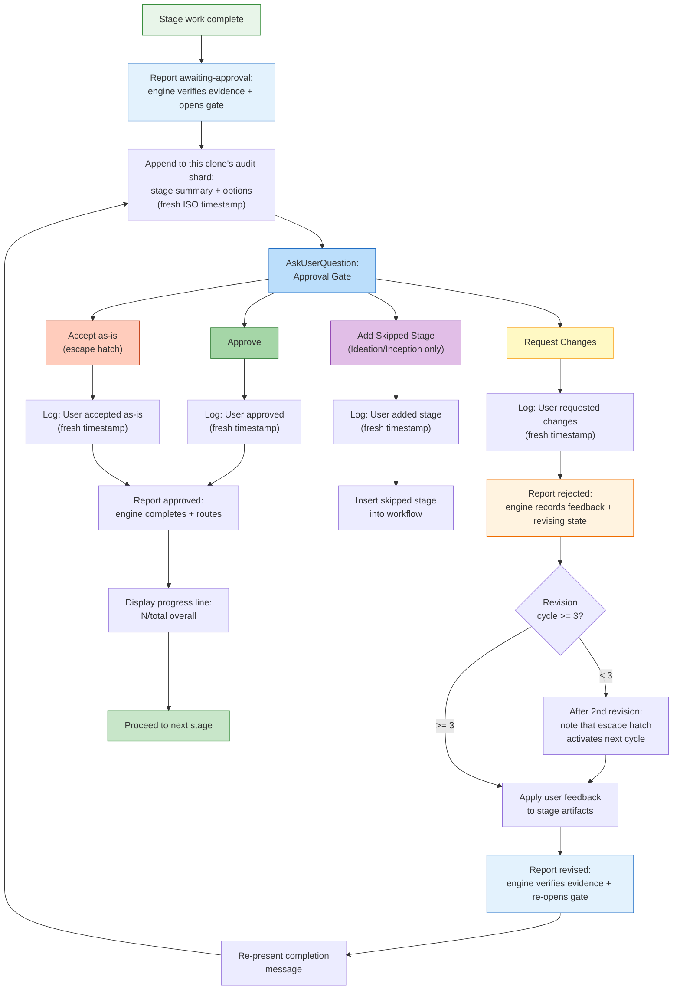

# Stage Protocol Reference

Human-readable restructuring of the machine-oriented
`dist/claude/.claude/aidlc-common/protocols/stage-protocol.md`. Preserves all
rules, conditions, and behaviors while reorganizing for developer consumption.
Section references (e.g., "Protocol Section 1") map to the source file.

> For stage file *format* (YAML frontmatter, body conventions), see
> [Stage Definition](15-stage-definition.md). This chapter covers runtime
> execution behaviour.

> **Path convention.** Intent-scoped artifacts, state, and the audit trail live
> under the active intent's **record dir** —
> `aidlc/spaces/<space>/intents/<YYMMDD>-<label>/`, written `<record>/` below.
> Reverse Engineering outputs instead live in the space-level, per-repository
> store `aidlc/spaces/<active-space>/codekb/<repo>/`. The audit trail is a
> directory of per-clone shards at `<record>/audit/<host>-<clone>.md` (readers
> glob and merge by timestamp), not a single file.

---

## Protocol File Structure

The stage protocol is split across three files, loaded conditionally by the
conductor based on workflow context:

| File | Contents | When Loaded |
|------|----------|-------------|
| `stage-protocol.md` | Core protocol: approval gates, completion messages, question flow, state tracking, agent persona loading, depth guidance, terminology, content validation, subagent return formats, and the §13 Learnings Ritual | Every stage (mandatory) |
| `stage-protocol-recovery.md` | Error Recovery + Change Handling | On session resume, or when a change event is detected mid-stage |
| `stage-protocol-governance.md` | Phase Boundary Verification (§13) | At phase boundaries (1.7->2.1, 2.8->3.1, 3.7->4.1) |

### Conditional Loading Logic (from SKILL.md Routing)

The conductor's Routing section defines the loading rules:

- **`stage-protocol.md`**: load every stage -- core gates, question format,
  state tracking, completion messages.
- **`stage-protocol-recovery.md`**: load on session resume or when a change
  event is detected mid-stage. This keeps error recovery and change handling
  out of context for normal forward-progress stages.
- **`stage-protocol-governance.md`**: load at phase boundaries
  (1.7->2.1, 2.8->3.1, 3.7->4.1) to run the Phase Boundary Verification
  traceability check. This limits governance overhead to the points where it
  is needed.

The split reduces context size during normal stage execution while ensuring
recovery and governance rules are available when relevant. Capturing in-stage
corrections as durable Rules is handled by the §13 Learnings Ritual in
`stage-protocol.md` (loaded every stage), not by a separate governance flow.

---

## Overview

The stage protocol is the mandatory behavioral contract governing how every
stage in the AI-DLC workflow executes. All 32 stages across five phases
(Initialization, Ideation, Inception, Construction, Operation) follow this protocol without
exception. The conductor (`SKILL.md`) hands stage execution to agent
personas; the protocol stays independent of phase and agent, defining
the structural rules that wrap around any stage's domain-specific work.

The protocol covers: approval gates, completion messages, question flow, state
tracking, agent persona loading, error recovery, change handling, depth
guidance, content validation, subagent return formats, the §13 Learnings
Ritual, and phase boundary verification.

### Critical Compliance Checklist

Before and during every stage, verify these commonly missed steps:

State transitions and audit emissions are tool-owned rather than
hand-written audit blocks. The conductor reports forward progress through
`aidlc-orchestrate.ts report --stage <slug>`; the engine delegates to the
state tool, which atomically updates state and emits the paired audit event
with a fresh timestamp.

| # | Check |
|---|-------|
| 1 | At the approval gate, call `bun .claude/tools/aidlc-orchestrate.ts report --stage <slug> --result awaiting-approval`. The engine flips state from `[-]` to `[?]` AwaitingApproval and emits `STAGE_AWAITING_APPROVAL` atomically, so status shows the held gate while the prompt is open. (`STAGE_STARTED` / the `[-]` transition was emitted when the stage became active.) |
| 2 | For non-gate questions, log options BEFORE calling `AskUserQuestion` via `bun .claude/tools/aidlc-log.ts decision` (not by hand-writing to the `audit/` shards), then log the exact response via `aidlc-log.ts answer`. |
| 3 | After an approval-gate response, call `aidlc-orchestrate.ts report --stage <slug> --result approved --user-input "<exact choice>"` for approval or `aidlc-orchestrate.ts report --stage <slug> --result rejected --user-input "<feedback>"` for request-changes. Never call `aidlc-log.ts decision` or `aidlc-log.ts answer` for the gate. After revision work, report `--result revised` before re-presenting it. |
| 4 | Never summarize user input -- pass exact option labels to the owning log or report tool; for automated stages use `N/A -- [reason]` |
| 5 | One audit entry per interaction -- the log/state tools enforce single-event emission; never merge multiple events into one call |
| 6 | At stage end, call `aidlc-orchestrate.ts report --stage <slug> --result approved --user-input "<exact choice>"` (gated stages) or `report --stage <slug> --result completed` (Initialization). The engine flips `[?]`/`[-]` to `[x]`, emits `GATE_APPROVED` when gated, and emits `STAGE_COMPLETED` atomically through the state tool |
| 7 | Mark previous stage task `completed` and current stage task `in_progress` with `activeForm` BEFORE work begins (the `sync-statusline` hook handles state syncing) |
| 8 | Use ONLY event types from `knowledge/aidlc-shared/audit-format.md` -- the state and log tools enforce this; never write directly to the `audit/` shards |
| 9 | Do NOT hand-write lifecycle events or invoke lifecycle verbs on `aidlc-state.ts`. Report outcomes through `aidlc-orchestrate.ts`; the engine's internal state call emits the atomic audit rows |

---

## Approval Gates

Every stage except the 3 Initialization stages requires explicit user approval
before advancing. Approval uses `AskUserQuestion` with structured UI options.

The gate corresponds to the `[?]` AwaitingApproval checkbox state in `aidlc-state.md`; rejection transitions the stage to `[R]` Revising. See [State Machine](12-state-machine.md) for the full stage state diagram and the canonical `GATE_APPROVED` / `GATE_REJECTED` / `STAGE_AWAITING_APPROVAL` emitters.

*(Protocol Section 1)*

### Standard 2-Option Gate

The default gate presents exactly two choices -- **Approve** (mark complete,
advance) or **Request Changes** (user provides feedback, stage re-executes,
gate re-presents):

```
AskUserQuestion({
  questions: [{
    question: "[Stage Name] complete. How would you like to proceed?",
    header: "Approval",
    multiSelect: false,
    options: [
      { label: "Approve", description: "Continue to [next stage]" },
      { label: "Request Changes", description: "Provide revision feedback" }
    ]
  }]
})
```

`[next stage]` is rendered verbatim from the run-stage directive's `next_stage`
field (the display name of the next in-scope stage, computed by the engine at
emit time), or `Complete workflow` when `next_stage` is null. The conductor
never guesses the next stage.

**No Emergent Behavior Rule:** Construction and Operation stages (phases 3-4)
must always use this 2-option format. They must never introduce additional
navigation options.

### Conditional 3rd Option

Ideation and Inception stages (phases 1-2) may conditionally include a third
option when a previously skipped stage could be added back:

```
{ label: "Add [Skipped Stage]", description: "Include [stage] which was skipped" }
```

This is the only circumstance for a 3rd option in phases 1-2. The label must
reference the specific skipped stage.

### Revision Escape Hatch

After 3 "Request Changes" cycles on the same stage, the 4th and subsequent
approval gates add a third option:

```
{ label: "Accept as-is", description: "Archive current version and move on" }
```

The question text changes to include the cycle count:
`"[Stage Name] -- this is revision cycle [N]. How would you like to proceed?"`

**When "Accept as-is" is selected:** log in the `audit/` shards ("User accepted stage
output as-is after [N] revision cycles"), mark complete, proceed. This
overrides the No Emergent Behavior Rule for Construction stages only when
the threshold is reached.

**Pre-activation notice:** After the 2nd cycle, include: "After one more
revision, an 'Accept as-is' option will become available."

### Approval Gate Flow



---

## Completion Messages

Every stage ends with this 5-part structure, in order. All parts mandatory.

*(Protocol Section 2)*

### Part 0: Audit Logging

Before showing the completion message:
1. Append to `<record>/audit/` (per-clone shards): stage name, work summary, artifacts
2. After receiving approval response, append user's choice with fresh timestamp

### Part 1: Announcement

```markdown
# [emoji] [Stage Name] Complete
```

Emoji defined by each stage file. Always a level-1 heading.

### Part 2: Summary

Structured bullet-point summary of what was produced:
- Factual and content-focused -- no workflow instructions ("please review")
- Include an inline summary table (5-10 lines) of key artifacts:
  ```
  | Artifact | Contents |
  |----------|----------|
  | requirements.md | 6 FR groups (18 sub-requirements), 4 NFRs |
  | requirements-analysis-questions.md | 5 questions, all answered |
  ```
- **First completion of a session** must include:
  `**Project depth**: [Minimal/Standard/Comprehensive] -- depth adapts artifact detail. You can request different depth at any approval gate.`

### Part 3: Review + Approval

```markdown
**Review:** `<record>/[path to artifacts]`
```

Followed by the `AskUserQuestion` approval gate (see Approval Gates section).

### Part 4: Progress Update

After user approves, display before proceeding:

```
Progress: [N]/[total] overall | [phase-N]/[phase-total] [Phase] stages complete. Next: [Next Stage Name]
```

Count only current-phase stages. Include completed and skipped in numerator.
Example: `Progress: 13/32 overall | 3/7 IDEATION stages complete. Next: Approval & Handoff`

---

## Question Flow

When a stage gathers user input through questions, the protocol defines a
tri-mode interaction flow with batching rules, mandatory answer analysis,
and ambiguity detection.

*(Protocol Section 3)*

### Tri-Mode System

**Step 1: Create the questions file** in the appropriate `<record>/`
directory using `[Answer]:` tag format with options A-E. Every question must
end with `X. Other (please specify)` -- no exceptions. All `[Answer]:` tags
start blank. Multi-select questions add "(select all that apply)" to the
question text; answer format: `[Answer]: A, B, E`.

**Step 2: Present mode choice:**

```
AskUserQuestion({
  questions: [{
    question: "I've created [N] questions at `[file path]`. How would you like to answer them?",
    header: "Questions",
    multiSelect: false,
    options: [
      { label: "Guide me", description: "Walk through each question interactively here" },
      { label: "I'll edit the file", description: "I'll fill in the answers in the file directly" },
      { label: "Chat", description: "Discuss freely -- I'll extract decisions from our conversation" }
    ]
  }]
})
```

Log the mode choice to the `audit/` shards. Users can switch modes mid-stage.

#### Guide Me (Interactive Mode)

- Present via `AskUserQuestion` in batches (max 4 questions per call, max 4
  options per question)
- Questions with 5+ options: split across multiple calls (4 options each).
  User must see every option. File retains full option set.
- Built-in "Other" triggers discussion. Tell user before first batch:
  "Select 'Other' on any question to discuss it before answering."
- After each batch, IMMEDIATELY write answers to the questions file
- Log each batch with fresh ISO timestamp
- Present a consolidated answer summary, then a structured confirmation with
  **Looks correct** and **Request changes** options. Do not ask for confirmation
  as bare prose. Before presenting it, append or reset a dedicated
  **Consolidated Summary Confirmation** entry in the stage questions file with
  both options and a blank `[Answer]:`; fill it only from the human's response.
  A request for changes resets that confirmation to blank before re-prompting.

#### Edit File (Self-Guided Mode)

- Tell user: "Edit the file at `[file path]`. When done, send **done** or
  **ready** and I'll continue."
- WAIT for completion signal. Do not read file or proceed until signaled.

#### Chat (Freeform Mode)

- Open-ended conversation; extract decisions as they emerge
- End signal: "When ready to proceed, say **done** and I'll summarize."
- Write extracted answers to file with value, timestamp, and `**Mode:** chat`
- Present the decision summary, then persist and use the same **Looks correct / Request changes** structured confirmation before proceeding
- Best for: exploratory stages, brainstorming, questions needing discussion

**Step 4: Verify completeness.** Read file, confirm all `[Answer]:` tags
filled. If any blank, present unanswered via `AskUserQuestion`. Do not
proceed with partial answers. The file is the authoritative record.

### Batch Rules

| Constraint | Limit |
|-----------|-------|
| Questions per `AskUserQuestion` call | Max 4 |
| Options per question per call | Max 4 |
| Questions with 5+ options | Split across multiple calls |

### Answer Analysis

After collecting answers, analyze ALL responses (mandatory):
- **Vague answers**: "mix of", "not sure", "depends", "probably"
- **Contradictions** between answers
- **Missing details** needed for next step

If ANY ambiguity found, create follow-up questions and resolve before
proceeding. **When in doubt, ask.**

### Ambiguity Detection

**Invalid/missing answer handling:**

| Condition | Action |
|-----------|--------|
| Blank or underscore-only `[Answer]:` | List unanswered, ask user to complete |
| Answer not matching options (A-E, X) and not clear free-text | Ask user to clarify |
| Ambiguous ("maybe B", "either A or C") | Ask user to commit to single choice |

**Contradiction detection** -- cross-check full answer set for:

| Type | Example |
|------|---------|
| Scope mismatch | "Keep it simple" + enterprise-grade feature requests |
| Risk mismatch | "Security not a concern" + sensitive data handling |
| Technology conflicts | Offline-first + real-time collaboration |
| Timeline vs. scope | MVP timeline + full-feature scope |

When detected: present contradictory answers side by side, explain conflict,
ask targeted follow-up. Do NOT proceed until resolved.

**Overconfidence prevention:**
- Default to asking, not assuming. Never proceed with ambiguity.
- Red flags requiring follow-up: single-word answers to open-ended questions;
  "whatever you think" / "up to you"; contradictory signals; question-dodging
- When user defers to AI: "I want to make sure the design reflects YOUR
  priorities. Could you tell me [specific aspect]?"

### Plan and Question File Location

Files are co-located with stage artifacts, not centralized. Example:
`<record>/inception/user-stories/user-stories-questions.md`. All inputs,
questions, and outputs for a stage live in the same directory.

---

## State Tracking

State is maintained at multiple levels: stage checkboxes in the state file,
task status in the sidebar, ISO timestamps for audit entries, and structured
audit log entries.

*(Protocol Section 4)*

### Checkbox States

| Checkbox | Meaning |
|----------|---------|
| `[ ]` | Not started |
| `[-]` | In progress (executing, not yet approved) |
| `[?]` | Awaiting human approval |
| `[R]` | Revising after rejection |
| `[x]` | Completed (approved by user) |
| `[S]` | Skipped by a justified current-stage report or navigation |

**Enforcement:** The engine marks these states; stage prose and conductors do
not. Report gate and terminal outcomes through `aidlc-orchestrate.ts`.

**`[S]` behavior:**
- Set by `report --stage <current> --result skipped --reason "<reason>"`, scope composition, or Stage/Phase Jump
- Excluded from statusline progress counts (not counted in total or done)
- Preserved while the engine routes onward; never paired with `STAGE_COMPLETED`
- On resume, treated as completed for task tracking (task created and immediately marked completed)
- A reported skip requires an explicit current stage and nonblank reason; single-stage runs reject it

### Task Status Transitions

Before beginning any stage, transition sidebar tasks:

1. Previous stage task `in_progress` -> mark `completed`
2. Current stage task -> mark `in_progress` with `activeForm: "Running [Stage Name]"`

Rules: task must be `in_progress` for spinner to display. Update BEFORE
reading stage file. Applies to all 32 stages. If task IDs lost (compaction),
use `TaskList` to find by subject. For skipped stages:
`TaskUpdate({ taskId: [ID], status: "completed", description: "[original] -- Skipped: [reason]" })`

### Plan-Level Checkbox Enforcement

Two-level tracking must stay in sync:
- **Plan-level**: individual work items (each user story, each component)
- **State-level**: stage completion in `aidlc-state.md`

If a step is done, its checkbox is checked. If checked, step must be done.
Update immediately after completing each step.

### Timestamps

Format: ISO 8601 UTC via `date -u +"%Y-%m-%dT%H:%M:%SZ"`. Execute via Bash.
Never date-only. One Bash call per audit entry -- never reuse timestamps.

### Audit Log Formats

`<record>/audit/` (per-clone shards) rules: always append (never overwrite); "User Input"
field must be COMPLETE and UNMODIFIED; log prompts BEFORE showing; log
responses AFTER receiving; create with `# AI-DLC Audit Log` header if missing;
backup if corrupted; retry once if Edit fails (hooks may modify between
Read and Edit).

#### Standard Conversation Event

```markdown
## [Stage Name]
**Timestamp**: [YYYY-MM-DDTHH:MM:SSZ]
**User Input**: "[Complete raw input -- never summarize]"
**AI Response**: "[Action taken]"
**Context**: [Stage, decision made]
---
```

#### Error Log

```markdown
## Error: [Brief Description]
**Timestamp**: [ISO timestamp]
**Severity**: [Critical/High/Medium/Low]
**Type**: [Parse error/Missing artifact/State corruption/Validation failure]
**Description**: [What went wrong]
**Cause**: [Root cause or best assessment]
**Resolution**: [Action taken]
**Impact**: [Artifacts affected, stages delayed, data lost]
---
```

#### Recovery Log

```markdown
## Recovery: [Brief Description]
**Timestamp**: [ISO timestamp]
**Issue**: [What triggered recovery]
**Recovery Steps**: [Numbered list of actions]
**Outcome**: [Successful/Partial/Failed -- current state after recovery]
**Artifacts Affected**: [Files created, restored, or rebuilt]
---
```

#### Change Request Log

```markdown
## Change Request: [Brief Description]
**Timestamp**: [ISO timestamp]
**Request**: [User's exact change request -- complete raw input]
**Current State**: [Which stage, what exists, what would change]
**Impact Assessment**: [Stages affected, artifacts to regenerate, scope change]
**User Confirmation**: [User's approval response]
**Action Taken**: [What was done]
**Artifacts Affected**: [Files changed]
---
```

#### Question Interaction Log

```markdown
## Questions: [Stage Name] -- [Mode choice / Batch N of M]
**Timestamp**: [ISO timestamp]
**User Input**: "[Exact user selection -- option labels as displayed]"
**AI Response**: "[Wrote answer to file / Presented next batch / Proceeded to analysis]"
**Context**: [Stage name, file path, question numbers covered]
---
```

### Conversation Event Logging Checklist

`PostToolUse` hook auto-logs file writes. Conversation events must be logged
manually (most commonly missed step).

**At each approval gate:** (1) BEFORE `AskUserQuestion` -- report
`awaiting-approval`. (2) AFTER response -- report `approved` or `rejected` with
the exact user input. The report-owned lifecycle events are the gate's complete
audit record; do not call `aidlc-log.ts decision` or `aidlc-log.ts answer`.

**At each non-gate question interaction:** AFTER receiving answers -- append
the Q&A summary through `aidlc-log.ts answer`.

---

## Agent Persona Loading

Each stage specifies lead and optional support agents. Personas load through
a 6-step knowledge order building from broad context to stage-specific
artifacts.

*(Protocol Section 5)*

### 6-Step Knowledge Loading Order

See [Knowledge System](10-knowledge-system.md) for the full loading order.

Steps 1-3 ship with the framework. Steps 4-5 are user-managed. Step 6 is
dynamic per workflow position.

### Inline Stages and Inline Mob Leads

1. Read **every** file in `directive.inline_context_paths` before doing stage
   work. The engine expands exact persona and existing knowledge-file paths:
   lead + supports for `inline`, and the lead only for `mob` because mob
   supports are dispatched. Agent names alone are not loaded context.
2. Preserve the directive's path order, which follows the 6-step knowledge
   order. Do not omit support-agent entries on `inline` or the lead entries on
   `mob`.
3. Apply every loaded perspective during execution.

### Subagent Stages

1. Dispatch the named harness agent; its config loads the persona and knowledge.
2. Pass exact rule paths, relevant prior-artifact paths, and task instructions
   rather than copied persona or knowledge prose.
3. Select the agent named by the stage metadata.

### Multi-Agent Stages (Ensemble Topologies)

*How* the conductor brings support agents in follows `directive.mode` — the stage's
communication topology: on an `inline` stage the support agents are personas the
conductor loads into its own context (voices, not dispatches); on `subagent`
(hub-and-spoke), `pipeline` (chain), and `mob` (mesh as bounded rounds) each support
agent is a real, independently dispatched collaborator. Everyone writes their own
work: on subagent/mob each collaborator writes a contribution file (Contribution +
Positions, §11) that the lead integrates — the lead alone edits the `produces[]`
artifacts, and the contribution files are the engine-checked completion evidence;
on pipeline the chain links advance the artifacts directly and the final link leaves
them complete. Who sees what differs per topology — spokes are mutually blind, chain
links see all upstream work, mob objectors get one confirm-or-maintain round while
judgment-call objections surface to the human mid-stage — but on every topology the
conductor performs every delegation; agents never spawn subagents. See
stage-protocol.md §5 "Multi-agent stages" for the full contract.

Example: Feasibility uses `aidlc-architect-agent` (lead) + `aidlc-aws-platform-agent` +
`aidlc-compliance-agent`, all inline. The mob showcase is `user-stories`: the
`aidlc-product-agent` drafts personas and stories; design, developer, and quality
collaborators contribute against that draft while mutually blind; then the lead
integrates their work before the gate, with `aidlc-product-lead-agent` reviewing.
The hub-and-spoke showcase is `practices-discovery`: pipeline-deploy lead draft,
mutually blind quality, developer, and devsecops contributions, human interview,
then lead integration. Its gate offers **Approve** / **Request Changes**; after
Approve, `practices-promote` must commit both the affirmed timestamp and a
`PRACTICES_AFFIRMED` audit receipt from the current stage attempt before the
conductor reports the stage approved.

### The 11 Domain Agents

The full 14-agent roster comprises 11 domain agents, 2 review-only agents, and
the adaptive-workflows composer. The domain agents that lead and support stage
work are:

aidlc-product-agent, aidlc-design-agent, aidlc-delivery-agent, aidlc-architect-agent,
aidlc-aws-platform-agent, aidlc-compliance-agent, aidlc-devsecops-agent, aidlc-developer-agent,
aidlc-quality-agent, aidlc-pipeline-deploy-agent, aidlc-operations-agent.

The two review-only agents run independent checks when stage frontmatter names
a reviewer; see [Reviewer Invocation](#reviewer-invocation). The composer
proposes and reshapes adaptive stage plans instead of leading domain stage
work. See the full [Agent Reference](agents/README.md).

---

## Error Recovery

*(Protocol Section 6)*

### Resume Context

When `aidlc-state.md` exists at session start, the conductor reads it to
determine completed stages (`[x]`), current/next stage, and artifact
existence, then offers to resume from the last incomplete stage.

### Resume Context Loading by Phase

| Phase/Stage Group | Context to Load |
|-------------------|----------------|
| **Initialization (0.1-0.3)** | Workspace filesystem; `aidlc-state.md` |
| **Ideation (1.1-1.7)** | `<record>/ideation/` artifacts; guardrails |
| **Inception -- RE** | Per-repo RE artifacts at `aidlc/spaces/<active-space>/codekb/<repo>/`; ideation scope/feasibility |
| **Inception -- Practices Discovery** | Preserve the lead draft and existing contribution files; dispatch only missing quality/developer/devsecops spokes, then continue with the human interview and lead integration |
| **Inception -- Requirements** | Per-repo `codekb/` artifacts (if performed); requirements-analysis docs |
| **Inception -- Design** | Requirements; user stories; application-design docs |
| **Inception -- Delivery Planning** | All inception artifacts; delivery-planning if partial |
| **Construction -- Code Gen** | Current unit's design artifacts, story design, acceptance criteria, prior code |
| **Construction -- Build/Test** | Current unit's code, test plans, acceptance criteria, build config |
| **Construction -- CI/Infra** | Infrastructure design; code generation outputs |
| **Operation (4.1-4.7)** | Construction outputs; operation artifacts so far; for 4.4+, deployment outputs from 4.1-4.3 |

### Re-run Behavior

If a stage needs re-run (changes requested after approval):
1. Re-read stage file
2. Load prior artifacts as context
3. Execute again, overwriting previous artifacts
4. Present new completion message

### Compaction Recovery

`PreCompact` hook validates `aidlc-state.md` structure before compaction
(informational-only, cannot block). Writes `.aidlc-recovery.md` breadcrumb
with last validated state (stage, timestamp). On resume, the conductor compares
breadcrumb with state file to detect compaction-related corruption.

### Corrupted State File Recovery

If `aidlc-state.md` exists but cannot be parsed:
1. Backup to `aidlc-state.md.bak`
2. Scan `<record>/` for artifacts to determine actual completion:
   - RE analysis files -> RE stages complete
   - Requirement docs -> requirements complete
   - Design docs -> design complete
   - Code matching story designs -> code gen complete
3. Rebuild state from artifact evidence
4. Set "Current Status" to first stage lacking evidence
5. Inform user: "State file was corrupted. Rebuilt from artifacts. Please verify."

### Missing Artifact Recovery

If a stage references artifacts that do not exist on disk:
1. List missing artifacts
2. Check if producing stage is marked complete
3. If complete but missing: inform user, offer re-run or manual provision
4. If not complete: run stage normally

### Contradictory Inputs Recovery

If user inputs from different stages contradict:
1. Flag specific contradiction with quotes from both sources
2. Do NOT resolve by choosing one interpretation
3. Ask which takes priority
4. Update overridden artifact
5. Log resolution in the `audit/` shards

### Severity Levels

| Severity | Description | Examples | Action |
|----------|-------------|----------|--------|
| **Critical** | Cannot continue | Corrupted state, missing critical artifacts, unrecoverable parse errors | Stop, ask user immediately |
| **High** | Output may be wrong | Contradictory inputs, incomplete answers, missing dependencies | Stop, ask user immediately |
| **Medium** | Quality reduced | Vague responses, partial context, ambiguous requirements | Attempt resolution; if unresolved, ask user |
| **Low** | Cosmetic | Formatting, naming, style issues | Handle silently, log in the `audit/` shards |

---

## Change Handling

Five categories of mid-workflow changes, each with different handling.

*(Protocol Section 7)*

### Minor Changes

Affect only current stage. Apply changes to artifacts, re-present completion
message. No rollback needed.

### Major Changes

Affect prior stages:
1. Identify affected prior stages
2. Present impact analysis via `AskUserQuestion`
3. If approved, re-run affected stages in order
4. Re-enter and complete them through orchestrator directives and reports; do
   not edit lifecycle checkboxes directly

### Scope Changes

New requirements or scope-level modifications:
1. Document in the `audit/` shards
2. Return to Requirements Analysis (2.3) or Delivery Planning (2.8)
3. Re-plan from that point
4. If change affects stage selection (e.g., `poc` -> `feature`), use the
   scope/recompose command so the engine updates the plan atomically

### Unit Changes

| Change | Procedure |
|--------|-----------|
| **Add** | Add to plan, create story design, slot into build order. Do NOT re-run completed units. |
| **Remove** | Mark skipped, archive artifacts. Check dependencies -- flag impact on dependents. |
| **Split** | Archive original, create two entries, distribute stories, run story design for each. |

### Architectural Changes

Affect application architecture (switching DBs, deployment model, major
integration):
1. Identify scope: affected design artifacts, story designs, generated code
2. Present full impact analysis
3. If approved, return to App Design stage and re-run from there
4. Regenerate all downstream artifacts for affected units
5. Preserve unaffected units

### Archive Before Change

Before any major change overwriting artifacts:
1. Create `<record>/archive/` if needed
2. Copy affected artifacts to `<record>/archive/[ISO-date]-[stage-name]/`
3. Proceed. No prior work permanently lost.

---

## Depth Guidance

Create exactly the detail needed -- no more, no less. Depth adapts to scope
and problem complexity.

*(Protocol Section 8)*

### Scope-to-Depth and Test Strategy Defaults

| Scope | Default Depth | Test Strategy | Typical Stages | Notes |
|-------|--------------|---------------|---------------:|-------|
| enterprise | Comprehensive | Comprehensive | 32 | All stages |
| feature | Standard | Standard | 32 | All stages |
| mvp | Standard | Standard | 22 | Skip all Operation |
| poc | Minimal | Minimal | ~8 | Initialization + Ideation + core Inception |
| bugfix | Minimal | Minimal | ~8 | Targeted |
| refactor | Minimal | Minimal | 8 | Targeted |
| infra | Standard | Standard | ~13 | Infra-focused |
| security-patch | Minimal | Minimal | ~10 | Security-focused |
| workshop | Standard | **Minimal** | 25 | Standard depth for learning; Nyquist testing for pace |

User can override depth or test strategy at any approval gate.

### Three Depth Levels

**Minimal** (poc, bugfix, refactor, security-patch) -- minimal artifacts,
brief analysis, skip optional stages:
- Requirements: 5-10 items, brief descriptions, minimal NFRs
- App Design: single component diagram, basic data model, no ADRs
- Functional Design: brief business rules, simple entities, skip
  `frontend-components.md`

**Standard** (feature, mvp, infra) -- full artifacts at moderate detail:
- Requirements: 15-30 with acceptance criteria, moderate NFRs
- App Design: component diagrams with interactions, relationships, 2-3 ADRs
- Functional Design: detailed business logic, comprehensive rules, entity
  lifecycle

**Comprehensive** (enterprise) -- deep analysis, all stages execute:
- Requirements: 30+, detailed criteria, comprehensive NFRs across all
  categories
- App Design: multi-layer diagrams, detailed data flow, integration sequences,
  5+ ADRs with alternatives
- Functional Design: decision trees, state machines, concurrency, error
  recovery, cross-unit patterns

---

## Terminology Glossary

*(Protocol Section 9)*

| Term | Definition |
|------|-----------|
| **AI-DLC** | AI-Driven Development Life Cycle -- the methodology this system implements |
| **Phase** | Top-level grouping: Initialization, Ideation, Inception, Construction, Operation |
| **Stage** | A discrete step within a phase (e.g., Intent Capture, Code Generation) |
| **Scope** | Controls which stages execute and at what depth (enterprise, feature, mvp, poc, bugfix, refactor, infra, security-patch, workshop) |
| **Depth** | Artifact detail scale: Minimal, Standard, or Comprehensive |
| **Unit of Work** | An independently implementable package of features; the Construction iteration unit. One pass through stages 3.1-3.7. |
| **Service** | A deployable process or container (API server, worker, frontend app) |
| **Module** | Code-level organizational boundary within a service (package, namespace) |
| **Component** | Logical building block within a module (class, function group, UI component) |
| **Planning** | Stages producing markdown artifacts (analysis, questions, design) |
| **Generation** | Stages producing executable code (Code Generation, Build and Test) |
| **Artifact** | A versioned markdown file in `<record>/` recording a decision, design, or analysis |
| **Guardrail** | A learned behavioral rule stored in the active space memory layer (`aidlc/spaces/<active-space>/memory/`) |
| **Approval Gate** | Structured prompt where user approves or requests changes |
| **Inline Stage** | Stage executing directly in the orchestrator conversation |
| **Subagent Stage** | Stage delegating execution to a Claude Code Task tool call |
| **Lead Agent** | Primary agent persona responsible for a stage's work |

---

## Content Validation

*(Protocol Section 10)*

### Mermaid Rules

Before writing any Mermaid diagram:
1. Verify syntax (balanced braces, valid nodes/edges, no unescaped specials)
2. Ensure all referenced nodes are declared
3. Include text fallback: `<!-- Text fallback: [description] -->`

### Pre-Creation Checklist

Before creating any artifact:
- All referenced entities exist in prior artifacts
- No naming conflicts with existing artifacts
- File path matches stage convention

### ASCII Diagram Standards

Use only basic ASCII: `+` `-` `|` `^` `v` `<` `>` `/` `\` plus
alphanumerics and spaces. Prohibited: Unicode box-drawing (U+2500-U+257F).
Character-width rule: every line in a box must have equal character count.

Reference patterns:
```
+------------------+       +---------------------------+
| Component Name   |       | Outer                     |
+------------------+       |  +-----+  +-----+        |
                           |  | A   |  | B   |        |
[Source] -----> [Target]   |  +-----+  +-----+        |
[Source] <----> [Target]   +---------------------------+
```

### Character Escaping

| Character | Rule |
|-----------|------|
| Pipe (`\|`) | Escape inside table cells |
| Angle brackets | Escape when not HTML tags |
| Code fences | Triple backtick with language identifier |
| Mermaid labels | Wrap special characters in quotes |

---

## Subagent Return Summary

When a subagent completes, it must return a structured summary to the
conductor to ensure no context is lost.

*(Protocol Section 11)*

### Required Format

```markdown
## Subagent Summary: [Stage Name]
### Produced
- [file path]: [brief description]
### Key Decisions
- [Decision]: [rationale]
### Issues / Concerns
- [Problems, edge cases, risks] or "None"
### Next Steps
- [What orchestrator should do next]
```

**Conductor rules:** Must read summary before proceeding. Non-empty
Issues/Concerns must be presented to user. Fewer files than expected requires
investigation before marking complete.

### Context Budget

| Rule | Detail |
|------|--------|
| Current-unit only | Pass only current unit's design artifacts |
| Summarize inception | 1-2 line summary per inception artifact with path; subagent Reads if needed |
| Always include | Specific task instructions and relevant state/artifact paths; the harness agent config loads persona and knowledge |
| Large knowledge sets | Name especially relevant file paths; do not paste persona or knowledge prose into the prompt |

### Failure Recovery

1. **Retry once** with reduced context (summarize inception, current unit only)
2. If retry fails, offer user: "Run inline" (execute in orchestrator) or
   "Skip and revisit" (mark incomplete, continue)
3. Log failure in the `audit/` shards using Error log format

---

## Reviewer Invocation

When a `run-stage` directive carries a non-null `reviewer` field, the conductor
invokes that reviewer as a **separate sub-agent** after the stage body produces its
artifacts and before the §13 Learnings Ritual and the approval gate. The stage
ritual sequence in full: questions → artifact → reviewer (if declared) →
learnings → gate.

*(Protocol Section 12a)*

1. **Invoke.** Delegate to the agent named in `directive.reviewer`, passing the
   stage definition path, the Q&A file, the produced artifact paths, and any
   validation tools from frontmatter — never the builder's `memory.md` or plan, so
   the reviewer forms independent judgment.
2. **Review.** The review runs under the adversarial review contract: the
   reviewer tries to refute the artifact rather than confirm it, grounding
   findings in machine-checkable evidence where it exists (READY is the verdict
   it fails to reach, not the default). The reviewer reads the definition, Q&A,
   and artifacts, runs any listed validation tools, and appends a `## Review`
   section to the primary artifact with a **READY** or **NOT-READY** verdict.
3. **Verdict.** READY → proceed to the learnings ritual then the gate. NOT-READY
   with iterations remaining below `reviewer_max_iterations` (default 2) → the lead
   agent re-runs to address the findings and the reviewer re-checks. NOT-READY with
   iterations exhausted → proceed to the gate with the unresolved findings noted.

The reviewer never blocks — the human always has final say at the gate — and does
not fire for stages without a `reviewer` field. See the `reviewer` /
`reviewer_max_iterations` frontmatter fields in [Stage Definition](15-stage-definition.md).

---

## Learnings Ritual

When a human corrects agent behavior, the correction can become a persistent
rule (guardrail) for the next workflow. v0.5.0 handles this through the
tool-as-actor Learnings Ritual, not a separate guardrail-emission flow.

*(Protocol Section 13)*

The ritual runs at every gated stage, between the completion message and the
approval gate:

1. **Diary**: the agent maintains a per-stage `memory.md` (Interpretations /
   Deviations / Tradeoffs / Open questions) as it works.
2. **Surface**: `aidlc-learnings.ts surface --slug <slug>` reads the diary and
   emits structured candidates — the LLM does not re-parse or classify.
3. **Confirm**: the conductor renders the candidates; the user picks which to
   keep and, for free-text additions, picks the heading that derives the
   destination. The always-present "Anything to add?" channel renders at least
   `Nothing to add` and `Add a note`; one-option structured questions are
   invalid on Claude Code and Codex.
4. **Admission check**: each kept learning is checked against `org.md`'s
   matching section; a contradiction is surfaced to revise / skip / escalate.
5. **Persist**: `aidlc-learnings.ts persist` writes each confirmed learning as a practice to
   `aidlc/spaces/<active-space>/memory/{project,team}.md` (and, for a sensor-binding
   learning, installs the manifest + stage `sensors:` import in one locked
   transaction), emitting `RULE_LEARNED` / `SENSOR_PROPOSED`.

Learnings apply on the **next** workflow's compile, not the in-flight run. See
`stage-protocol.md` §13 for the full tool-as-actor protocol, and
[Rule System](08-rule-system.md) for the strict-additive resolution the written
rules feed into.

---

## Phase Boundary Verification

At each phase transition, traceability verification ensures completed-phase
outputs are sufficient and consistent for the next phase.

*(`stage-protocol-governance.md` Section 13 — distinct from the Learnings
Ritual, which is `stage-protocol.md` Section 13)*

### Triggers

- After last stage of each phase is approved
- Before first stage of next phase begins
- On demand via `/aidlc --status`

### Process

1. Read methodology from `.claude/knowledge/aidlc-shared/verification.md`
2. Run phase-specific traceability checks
3. Write results to `<record>/verification/[phase-boundary]-verification.md`
4. If failed: present issues (missing links, orphaned artifacts,
   inconsistencies) before proceeding
5. Log `PHASE_VERIFIED` to the `audit/` shards

### Per-Phase Checks

| Boundary | Verified |
|----------|---------|
| **Ideation -> Inception** | Intent captured, scope defined, feasibility confirmed, initiative approved |
| **Inception -> Construction** | All requirements traced to designs, units defined, delivery plan approved |
| **Construction -> Operation** | All units built/tested, CI pipeline configured, infrastructure designed |

### Traceability Matrix

The verification ensures a traceable chain:
```
Intent -> Scope -> Requirements -> Designs -> Units -> Code -> Tests -> Deployment
```

At each boundary, every artifact on the left must have a corresponding
artifact on the right. Missing links, orphans, and inconsistencies are flagged
for user review.

---

## Cross-References

- [Architecture](01-architecture.md) -- 5-layer model, design decisions
- [Orchestrator](03-orchestrator.md) -- SKILL.md deep-dive
- [Stages](04-stages/) -- per-phase stage documentation
- [Agent System](05-agent-system.md) -- agent structure, frontmatter
- [Hooks and Tools](06-hooks-and-tools.md) -- hook system, audit events
- [Knowledge System](10-knowledge-system.md) -- loading order, templates
- [Diagrams](diagrams.md) -- all diagrams in one place
