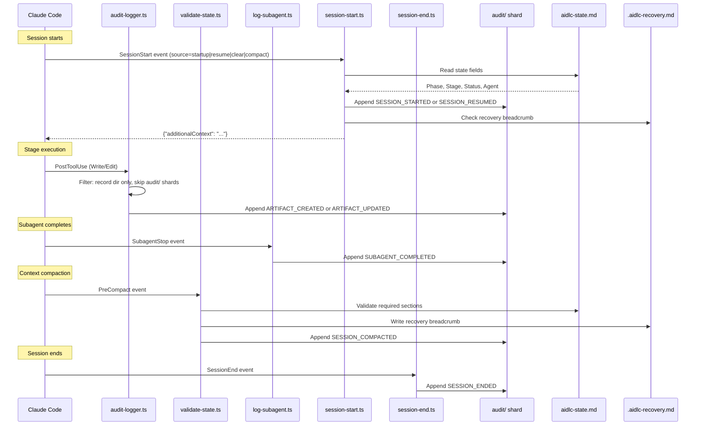

# Hooks and Tools

This chapter documents the hook system architecture, all twelve hook scripts, the audit event taxonomy, CLI tool configuration, and the deterministic utility tool.

> **Path convention.** State, audit, and artifacts live under the active intent's **record dir** — `aidlc/spaces/<space>/intents/<YYMMDD>-<label>/`, written `<record>/` below (a compact UTC date prefix plus a short kebab-case label so record dirs sort chronologically; the canonical id is the UUIDv7 in the `intents.json` registry row). The audit trail is a directory of per-clone shards under `<record>/audit/`, not a single file.

---

## Hook System Architecture

This implementation uses twelve hook scripts in `.claude/hooks/`. All twelve are TypeScript (run via `bun`). All twelve are **project-wide** — registered in `settings.json` (the statusline via the top-level `statusLine` key, the other eleven via the `hooks` block), they fire regardless of which skill is active. They were previously split (six declared in `aidlc/SKILL.md` frontmatter as skill-scoped, the rest project-wide); v0.6.0 moved the skill-scoped six into `settings.json` so every entry point — the orchestrator, each packaged scope/stage runner, and any hand-written customer runner — inherits the deterministic spine with no per-runner `hooks:` block. This is safe because every hook **self-gates**: it early-exits when there is no active workflow (`aidlc-state.md` / the active intent's `audit/` shard absent), so always-on is a no-op outside AI-DLC.

Ten of the twelve are **non-blocking** — they observe and exit 0, never altering control flow. Two are **flow-altering**, each with a sanctioned, deliberate contract distinct from the advisory `never-block` contract every other hook honours: the `Stop` hook (`aidlc-stop.ts`) may return `{"decision":"block"}` to keep the interactive forwarding loop running (see "The flow-altering `Stop` hook" below), and the `PreToolUse` reviewer-scope hook (`aidlc-reviewer-scope.ts`) may refuse a dispatched per-unit reviewer's sibling-unit tool call via exit 2 + a redirecting stderr reason (see "The flow-altering `PreToolUse` reviewer-scope hook" below).

```
.claude/hooks/
+-- mint-presence.ts     # UserPromptSubmit + PostToolUse AskUserQuestion (project-wide, settings.json, TypeScript)
+-- reviewer-scope.ts    # PreToolUse file/search/shell tools (project-wide, settings.json, TypeScript, flow-altering)
+-- audit-logger.ts      # PostToolUse Write|Edit (project-wide, settings.json, TypeScript)
+-- sensor-fire.ts       # PostToolUse Write|Edit (project-wide, settings.json, TypeScript)
+-- sync-statusline.ts   # PostToolUse TaskUpdate (project-wide, settings.json, TypeScript)
+-- runtime-compile.ts   # PostToolUse Bash (project-wide, settings.json, TypeScript)
+-- validate-state.ts    # PreCompact (project-wide, settings.json, TypeScript)
+-- log-subagent.ts      # SubagentStop (project-wide, settings.json, TypeScript)
+-- aidlc-stop.ts        # Stop (project-wide, settings.json, TypeScript, flow-altering)
+-- session-start.ts     # SessionStart (project-wide, settings.json, TypeScript)
+-- session-end.ts       # SessionEnd (project-wide, settings.json, TypeScript)
+-- aidlc-statusline.ts  # statusLine (project-wide, settings.json, TypeScript)
```

### Hook Summary

| Hook | Event | Scoping | Matcher | Purpose |
|------|-------|---------|---------|---------|
| `mint-presence.ts` | UserPromptSubmit + PostToolUse | Project-wide (settings.json) | (empty) / `AskUserQuestion` | Record a `HUMAN_TURN` event on every real human prompt and on every answered `AskUserQuestion` widget (gate approvals and interview answers are widget clicks, not typed prompts); the approval/interview gate checks the ledger and requires one since the last gate resolution so a model under autopilot cannot fabricate an approval with no human having acted |
| `reviewer-scope.ts` | PreToolUse | Project-wide (settings.json) | `Read\|Edit\|Write\|Glob\|Grep\|Bash` | **Flow-altering.** Enforce the per-unit reviewer read-scope bound (stage-protocol §12a) deterministically: while the conductor's reviewer dispatch record (`<record>/.aidlc-reviewer-dispatch.json`) is fresh, the dispatched reviewer's tool calls that reach into sibling units' `construction/` paths — file reads/writes and grep/glob/shell patterns spanning siblings — are refused (exit 2 + a redirecting stderr reason) unless the target is on the record's exempt list. Each refusal emits `REVIEWER_SCOPE_BLOCKED`. Fail-open on every ambiguity; `AIDLC_DISABLE_REVIEWER_SCOPE_HOOK=1` disables enforcement |
| `audit-logger.ts` | PostToolUse | Project-wide (settings.json) | `Write\|Edit` | Auto-log artifact writes to the `audit/` shards |
| `sensor-fire.ts` | PostToolUse | Project-wide (settings.json) | `Write\|Edit` | Fire the active stage's resolved Sensors on matching writes (advisory; never blocks) |
| `sync-statusline.ts` | PostToolUse | Project-wide (settings.json) | `TaskUpdate` | Auto-sync state file on stage task activation |
| `runtime-compile.ts` | PostToolUse | Project-wide (settings.json) | `Bash` | Recompile `runtime-graph.json` on transition-class audit emits |
| `validate-state.ts` | PreCompact | Project-wide (settings.json) | (empty) | Validate state file, write recovery breadcrumb |
| `log-subagent.ts` | SubagentStop | Project-wide (settings.json) | (empty) | Log subagent completion events |
| `aidlc-stop.ts` | Stop | Project-wide (settings.json) | (empty) | **Flow-altering.** Enforce the forwarding loop on turn-end: run `aidlc-orchestrate next`; on `done` or `parked` allow the stop, on a pending directive block the stop and inject the next move back via `reason`. Allows the stop (human-wait carve-out) when the current stage is awaiting approval (`[?]`), being revised (`[R]`), `[-]` in-progress with an unanswered question in its `<slug>-questions.md`, or the ending turn was conversational (the human's last prompt was answered with no workflow-engine call, read from the harness transcript) - the last two suppressed under autonomous Construction. Recursion-bounded (no-progress counter + `stop_hook_active` under `CLAUDE_CODE_STOP_HOOK_BLOCK_CAP`; default 2 in an interactive run and 8 under autonomous Construction). No-op outside an AIDLC workflow |
| `session-start.ts` | SessionStart | Project-wide (settings.json) | (empty) | Inject workflow context on session resume |
| `session-end.ts` | SessionEnd | Project-wide (settings.json) | (empty) | Emit `SESSION_ENDED` audit event on graceful exit |
| `aidlc-statusline.ts` | statusLine | Project-wide (settings.json) | -- | Show real-time progress in terminal |

### Shared Characteristics

All twelve TypeScript hooks:

- Written in TypeScript, run via `bun`
- Do not need executable permissions — work identically on macOS, Linux, and native Windows PowerShell
- Receive JSON on stdin from Claude Code
- Use native JSON parsing (no `jq` dependency)
- Exit with code 0 on success or when skipped (the `Stop` hook also exits 0 when it blocks — the block is signalled by a `{"decision":"block"}` JSON object on stdout, not by the exit code; the reviewer-scope hook is the one exception, signalling its block with exit 2 + the reason on stderr, the harness PreToolUse reject contract)
- Resolve `$CLAUDE_PROJECT_DIR` with multiple fallback methods
- Share locking and utility functions from `lib.ts`

### Audit Event Flow



---

## Workflow-Spine Hooks

These six hooks (the audit/sensor/statusline/runtime-compile/state-validation/subagent spine) are registered project-wide in `settings.json`. They are always on, but each **self-gates**: it early-exits when there is no active workflow (`aidlc-state.md` / the active intent's `audit/` shard absent), so audit logging and state sync never clutter non-AI-DLC sessions. Before v0.6.0 they were declared in `aidlc/SKILL.md` frontmatter (skill-scoped); the move to `settings.json` lets every entry point — the orchestrator and every packaged or hand-written runner — inherit the spine without copying a `hooks:` block.

### PostToolUse: audit-logger.ts

**Source:** `.claude/hooks/aidlc-audit-logger.ts`
**Trigger:** After every `Write` or `Edit` Claude Code tool call (matcher: `"Write|Edit"`)
**Purpose:** Auto-log artifact writes to the intent's `audit/` shards

**Processing steps:**

1. **Project directory resolution:** Resolves `$CLAUDE_PROJECT_DIR` with fallback to script path derivation and CWD detection.
2. **Health heartbeat:** Writes UTC timestamp to `.aidlc-hooks-health/audit-logger.last`.
3. **JSON parsing:** Reads stdin, extracts `tool_name` and `tool_input.file_path`.
4. **Path filtering:** Skips files not under the intent's record dir. Skips the `audit/` shards themselves (avoids recursion).
5. **Audit file guard:** Exits silently if the active intent's `audit/` shard does not exist (the framework creates it).
6. **Context extraction:** Strips the path prefix up to the record dir, replaces `/` with ` > ` for a breadcrumb (e.g., `inception > requirements-analysis > requirements.md`).
7. **Atomic locking:** Uses `mkdir`-based lock in the system temp directory (`os.tmpdir()`) with 3-retry loop (100ms delay). The hash isolates locks per project.
8. **Log entry:** Appends a canonical `ARTIFACT_CREATED` (for Write to a net-new path) or `ARTIFACT_UPDATED` (for Edit, or Write overwriting existing) event via `appendAuditEntry`. Fields: Timestamp, Event, Tool, File, Context.

### PostToolUse: sync-statusline.ts

**Source:** `.claude/hooks/aidlc-sync-statusline.ts`
**Trigger:** After every `TaskUpdate` call (matcher: `"TaskUpdate"`)
**Purpose:** Auto-sync `aidlc-state.md` when a stage task becomes `in_progress`

**Processing steps:**

1. **Project directory resolution:** Same multi-fallback pattern as audit-logger.ts.
2. **Status filter:** Only fires when `status` is `in_progress`. Exits silently for `completed`, `pending`, etc.
3. **activeForm filter:** Exits silently if no `activeForm` field or no `[slug]` suffix pattern.
4. **State file guard:** Exits silently if `aidlc-state.md` does not exist (pre-init).
5. **Health heartbeat:** Writes to `.aidlc-hooks-health/sync-statusline.last`.
6. **State sync:** Calls `bun aidlc-utility.ts set-status --stage <slug>` (updates Phase, Stage, Agent, checkbox).

**Design notes:**
- Stage Jump tasks (no `[slug]`) and dependency-wiring TaskUpdates (no activeForm) are naturally filtered out.
- The hook calls the existing `set-status` subcommand — no new code path needed.

### PostToolUse: sensor-fire.ts

**Source:** `.claude/hooks/aidlc-sensor-fire.ts`
**Trigger:** After every `Write` or `Edit` Claude Code tool call (matcher: `"Write|Edit"`)
**Purpose:** Fire the active stage's compile-resolved Sensors on matching writes (advisory; never blocks)

**Processing steps:**

1. **Project directory resolution:** Same multi-fallback pattern as audit-logger.ts.
2. **Audit + state guards:** Exits silently if the `audit/` shard or `aidlc-state.md` does not exist (pre-init).
3. **Active-stage read:** Reads the active stage's `sensors_applicable` array off `stage-graph.json` — the compile-resolved sensor list for that stage node (empty for stages like workspace-scaffold).
4. **Dispatch:** For each applicable Sensor, spawns `aidlc-sensor.ts fire <id> --stage <slug> --output-path <path>`. The dispatcher applies each Sensor's `matches` glob hook-side; a non-matching write is skipped. Outcomes are advisory — the hook never blocks the write.
5. **Health heartbeat:** Writes `.aidlc-hooks-health/sensor-fire.last` on a fire, so the doctor can distinguish a healthy idle hook from a silent failure.

See [Sensor System](07-sensor-system.md) for the manifest schema and the fire lifecycle.

### PostToolUse: runtime-compile.ts

**Source:** `.claude/hooks/aidlc-runtime-compile.ts`
**Trigger:** After every `Bash` Claude Code tool call (matcher: `"Bash"`)
**Purpose:** Recompile `runtime-graph.json` when a transition-class audit event has just landed

**Processing steps:**

1. **Command filter:** Only `bun .claude/tools/aidlc-(state|jump|bolt|utility).ts` invocations pass the early exit. `aidlc-runtime.ts` is rejected explicitly (recursion guard).
2. **Audit-existence guard:** Exits cleanly before init (no `audit/` shard yet).
3. **Health heartbeat:** Writes `.aidlc-hooks-health/runtime-compile.last`.
4. **Tail-read:** Splits the merged `audit/` shards on `\n---\n` and takes the last 3 blocks (the upper bound a single `approve` call appends).
5. **Event-class filter:** Recompiles only when one of the last 3 blocks carries `GATE_APPROVED`, `STAGE_STARTED`, `STAGE_AWAITING_APPROVAL`, `AUDIT_MERGED`, or `WORKFLOW_COMPLETED`. Exits on no match.
6. **Dispatch:** Spawns `bun aidlc-runtime.ts compile`. On non-zero exit, records a hook drop for `--doctor`; never blocks the parent Bash call.

See [Runtime Graph](13-runtime-graph.md) for the compile lifecycle and the locked schema.

### PreCompact: validate-state.ts

**Source:** `.claude/hooks/aidlc-validate-state.ts`
**Trigger:** Before Claude Code compacts the conversation context (matcher: empty = always)
**Purpose:** Section presence check (informational only, does not block compaction) and write a recovery breadcrumb

**Processing steps:**

1. **State file guard:** Exits cleanly if `aidlc-state.md` does not exist.
2. **Section validation:** Checks for two mandatory sections using `grep -q`:
   - `## Stage Progress` -- the checklist of all stages with completion status
   - `## Current Status` -- current phase, stage, and scope
   Outputs a WARNING if either section is missing (informational only -- cannot block compaction).
3. **Recovery breadcrumb:** Writes `.aidlc-recovery.md` containing the current stage and a validation timestamp. On session resume, the framework compares this with `aidlc-state.md` to detect compaction-related state corruption.

**Why this matters:** Context compaction discards conversation history. If compaction happens mid-stage, the model loses awareness of what it was doing. The recovery breadcrumb provides an external checkpoint that survives compaction.

### SubagentStop: log-subagent.ts

**Source:** `.claude/hooks/aidlc-log-subagent.ts`
**Trigger:** When any subagent (Claude Code Task tool invocation) completes (matcher: empty = always)
**Purpose:** Log subagent completion events to the audit trail

**Processing steps:**

1. **Project directory resolution:** Same multi-fallback pattern as audit-logger.ts.
2. **Health heartbeat:** Writes to `.aidlc-hooks-health/log-subagent.last`.
3. **JSON parsing:** Extracts `agent_type` (defaults to `"unknown"`), `agent_id`, and `last_assistant_message` (truncated to 200 characters).
4. **Audit file guard:** Exits silently if the `audit/` shard does not exist.
5. **Entry assembly:** Emits canonical `SUBAGENT_COMPLETED` event via `appendAuditEntry`. Fields: Timestamp, Event, Agent Type, and optionally Agent ID and truncated Message.
6. **Atomic locking:** Same `mkdir`-based pattern as audit-logger.ts (unified in `lib.ts`) but with a separate lock name to avoid contention.

**Fires for the two subagent stages:**
- Stage 2.1 (Reverse Engineering) -- two-step delegation (fires twice: `aidlc-developer-agent` code scan, then `aidlc-architect-agent` synthesis)
- Stage 3.5 (Code Generation) -- `aidlc-developer-agent` subagent (fires once per unit of work)

Workspace detection (0.2) used to be a subagent; it now runs deterministically inside `aidlc-utility init`, so this hook no longer fires during initialization.

---

### Stop: aidlc-stop.ts

**Source:** `.claude/hooks/aidlc-stop.ts`
**Trigger:** When the conductor tries to end its turn (matcher: empty = always, while `/aidlc` is active)
**Purpose:** Enforce the interactive forwarding loop — keep it running until the engine reports the workflow is `done`

This is the framework's **first flow-altering hook** (the PreToolUse reviewer-scope hook below is the second). Every other hook observes and exits 0; this one may return `{"decision":"block"}` to stop the turn from ending. On the gated, conversational path the conductor (the LLM) holds the loop because only it can ask the human a question — so if it forgets to consult the engine, the workflow drifts. This hook removes that dependency on the LLM's diligence: the loop is enforced by the harness.

**Processing steps:**

1. **stdin idiom:** Mirrors `log-subagent.ts` — a TTY means no Claude Code JSON is coming (test/debug), so it allows the stop. Otherwise it reads the Stop-hook JSON, from which it needs only `stop_hook_active`.
2. **No-op outside AIDLC:** If there is no active intent's `aidlc-state.md` under the project dir, there is nothing to enforce — it allows the stop. The frontmatter `Stop` matcher already scopes the hook to `/aidlc`; this is defence in depth so a non-AIDLC session is never blocked.
3. **Compose the engine:** Runs `bun .claude/tools/aidlc-orchestrate.ts next --project-dir <dir>` and parses the directive `kind`. It does not re-derive state — it composes the engine.
4. **`done` → allow:** If the directive is `done`, the workflow is complete; the hook emits nothing and exits 0 (the precedent non-blocking pattern), then clears the recursion counter.
5. **`parked` -> allow:** If the directive is `parked`, the workflow was intentionally parked mid-flow for a later session (`aidlc-orchestrate park`); the hook allows the stop and clears the counter, exactly like `done`. This is the supported multi-session exit: without it, the only clean stop is `done`, which an agent on a long workflow can only reach by rubber-stamping the remaining stages (#367). **Autonomy guard (#365):** the `parked` allow is suppressed under autonomous Construction (`Construction Autonomy Mode: autonomous`), so a `parked` directive there falls through to the cap-bounded block and the loop keeps moving.
6. **Human-wait -> allow:** If the directive is pending but the conductor is correctly parked on the human (or simply chatting), the hook allows the stop and records a drop rather than spamming the nudge. Four cases qualify: the current stage's checkbox is positively `[?]` awaiting-approval, `[R]` revising, `[-]` in-progress **with** an unanswered `[Answer]:` tag in its `<slug>-questions.md` (a pending mid-stage clarifying question), or the ending turn was conversational (the human's most recent prompt was answered with no workflow-engine call, read from the harness transcript) - the last two suppressed under autonomous Construction. Positive-confirmation only: any other state, no checkbox row, no open question, no transcript / no human prompt / any engine call in the responding turn, or a parse error falls through to the block below. See "Human-wait carve-out" below.
7. **Pending -> block and inject:** For any other (pending) directive - `run-stage`, `dispatch-subagent`, `invoke-swarm`, `present-gate`, `ask`, `print`, `error` - it prints `{"decision":"block","reason":<on-task continuation>}`, so the same session resumes with the next move injected. The injected `reason` also names `aidlc-orchestrate park` as the clean-pause alternative, so a conductor that wants to stop a long workflow parks rather than advancing.
8. **Fail open:** Any unexpected failure (unreadable state, an engine that exits non-zero or returns no parseable directive, malformed stdin) allows the stop and records a drop. Failing open is the only safe failure mode for a hook that can otherwise trap a turn.

**Security property — the `reason` is an on-task continuation, never an override.** The injected `reason` names the work the conductor still owes ("run the forwarding loop, act on the directive, then report"), never an instruction to do something new or out-of-band. Override-shaped directives are refused by the conductor's own safety training; that refusal is the security property. A buggy or compromised engine therefore can only ever *continue* sanctioned work — it cannot hijack the session to act against the user.

**Recursion guard — a stuck block can never trap the session.** A block that re-fires forever is the one way a hook could trap a turn, so recursion is bounded two ways, both native:

- **`stop_hook_active`** — Claude Code sets this true when the current stop is itself the product of a prior Stop-hook block. The hook reads it as a signal that it is already inside a blocked sequence.
- **A no-progress counter** - the hook persists a small record under `<record>/.aidlc-stop-hook/block-count.json` (in the intent's record dir), keyed on the workflow's *progress signature* (Current Stage slug + audit-tail length). A `report` that advances the workflow changes that signature, so the counter resets - a healthy loop is never throttled. When the signature is unchanged across consecutive blocks (no report ran), the counter increments. Once the no-progress streak reaches the ceiling - `CLAUDE_CODE_STOP_HOOK_BLOCK_CAP`, whose default is **run-mode aware: 2 in an interactive run and 8 under autonomous Construction** (interactive 2 so a chatting or pausing human is released after one nudge; autonomous 8 so an unattended loop, with no human to release it, runs to completion before letting go) - the hook **releases** the turn (allows the stop), so a stuck loop always lets go. An explicit `CLAUDE_CODE_STOP_HOOK_BLOCK_CAP` overrides both defaults.

**Human-wait carve-out - an interactive gate is not punished.** Four cases where the conductor ends its turn *because* it is waiting on the human (or is simply conversational) are handled so the hook never spams the nudge:

- **Esc is free.** Stop hooks do not fire on user interrupt (Esc), so a manual interrupt can never be trapped — no code is needed for that case.
- **The approval gate is not free.** The Stop hook *does* fire when the conductor ends its turn to await an `AskUserQuestion` answer. At an approval gate (the current stage is `[?]` awaiting-approval) or in the Request-Changes loop (`[R]` revising) the engine still re-emits a pending `run-stage` for the in-flight stage, so without a carve-out the hook would block and re-inject the forwarding-loop nudge until the cap bled out — confusing at an interactive gate. So when the current stage's checkbox is positively `[?]`/`[R]`, the hook allows the stop. This is **positive-confirmation only and fail-open**: it only ever releases more readily, never blocks more; a missing checkbox row and any parse error fall through to the cap-bounded block, so a genuine mid-stage quit is still nudged.
- **A mid-stage clarifying question is not free either.** Such a question parks the stage at `[-]` in-progress — the same checkbox state as a lazy quit, so `[-]` alone cannot be carved out. But the conductor must create a `<slug>-questions.md` with blank `[Answer]:` tags before asking (stage protocol §3), so an unanswered tag is a positive signal that a question is pending. When the current `[-]` stage's questions file has an unanswered tag, the hook allows the stop. This is **strictly gated**: it never fires under autonomous Construction (`Construction Autonomy Mode: autonomous`), where the loop must keep running unattended, and it falls through to the cap-bounded block on any miss — no file, all answered, autonomous, or a read error — so a genuine mid-stage quit is still nudged. (Immediate mitigation for any residual case: `CLAUDE_CODE_STOP_HOOK_BLOCK_CAP=1`.)
- **A conversational turn is not free either.** During an active workflow a human who just wants to chat (ask a question, discuss a decision) should not be nudged back into the loop. The hook reads the harness transcript and allows the stop when the most recent genuine human prompt was answered with **no** workflow-engine engagement - the conductor ran neither `aidlc-orchestrate` nor `aidlc-state` since that prompt. A read-only query (`--status`, `--doctor`, `--help`, `--version`) does **not** count as engagement, so "what stage am I on?" answered with `--status` still qualifies as chat. Claude and Codex deliver `transcript_path` on the Stop payload; **Kiro delivers none**, so on Kiro this carve-out is inert and the run-mode-aware interactive cap (2) is the release path that lets a chatting human go after one nudge instead of eight. This is **strictly gated and fail-closed**: it never fires under autonomous Construction, and a missing or unreadable transcript, no human prompt found, or any engine call in the responding turn falls through to the cap-bounded block, so a conductor that engaged the workflow and then quit mid-loop is still nudged. It only ever ALLOWS - it can never block more.

> **Contrast with the sensor-fire hook's advisory contract.** `aidlc-sensor-fire.ts` carries an explicit *never-block* contract (it never returns `{decision: block}`, asserted by `t95` Case 7). That is *that hook's* advisory contract, not a framework-wide ban on blocking. The `Stop` hook's use of `block` for loop enforcement is a different, sanctioned contract.

---

### PreToolUse: aidlc-reviewer-scope.ts

**Source:** `.claude/hooks/aidlc-reviewer-scope.ts`
**Trigger:** Before file/search/shell tool calls (`Read`, `NotebookRead`, `Edit`, `MultiEdit`, `Write`, `NotebookEdit`, `LS`, `Glob`, `Grep`, or `Bash`; matcher: `"Read|NotebookRead|Edit|MultiEdit|Write|NotebookEdit|LS|Glob|Grep|Bash"`)
**Purpose:** Enforce the per-unit reviewer read-scope bound (stage-protocol §12a) deterministically

This is the framework's **second flow-altering hook** and its first `PreToolUse` registration. The §12a prose bound says a reviewer dispatched for one unit must not read sibling units' `construction/<other-unit>/` content through any tool — field transcripts showed a diligent reviewer bypassing the prose with recursive greps carrying cross-unit globs (`construction/*/*/*.md`), growing per-unit review cost superlinearly with unit count. Per the framework's layering (determinism belongs in tools and hooks), this hook makes the bound self-enforcing.

**How it learns the dispatch.** The conductor writes `<record>/.aidlc-reviewer-dispatch.json` at §12a step 1 (per-unit stages only) — `{reviewer, stage, unit, exempt[]}`, where `exempt` carries the resolved `consumes` contract paths, the stage file, the Q&A file, and (when the current unit's design explicitly names an integration point) that one owning sibling file — and deletes it at step 3 when the verdict is read. The record is the enforcement window; a record older than 6 hours is an orphan from a crashed review, ignored and janitored (the compose-marker staleness discipline).

**Identity.** Claude Code and Codex deliver the active subagent's name as `agent_type` on the hook payload (absent on main-session calls), so the hook enforces only when `agent_type` equals the record's `reviewer`. The Kiro CLI registers the hook inside the two reviewer agents' own JSON configs, so the registration itself is the identity (the adapter asserts `scoped_registration`). Kiro IDE ships no registration: its hook context (`USER_PROMPT`) carries no tool inputs (`toolArgs` is always empty - see `kiro-ide-hook-payload.md`), so a pre-tool matcher has nothing to inspect there and the §12a prose bound governs on that harness.

**Decision.** The matcher (`evaluateReviewerScope`, an exported pure function pinned by `t220`) scans path fields and command/pattern text for `construction/<seg>` tokens: the dispatched unit passes, a wildcard or bare sweep root blocks, and a concrete sibling blocks unless the full token exactly matches an exempt entry's `construction/` suffix. A grep of the current unit, the shared inception contracts, and validation-tool runs are never touched. Blocks emit a `REVIEWER_SCOPE_BLOCKED` audit row (Tool, Target, Stage, Unit) and signal via **exit 2 + a redirecting stderr reason** — the harness PreToolUse reject contract — that names the scope and points the reviewer back to the passed contracts.

**Fail-open everywhere.** No record, a stale or malformed record, a non-reviewer agent, an unknown tool, malformed stdin, or any internal error allows the call; a reviewer-agent sighting with no dispatch record records an advisory drop for `--doctor` (the conductor forgot the step-1 write). The deterministic off-switch `AIDLC_DISABLE_REVIEWER_SCOPE_HOOK=1` disables enforcement entirely.

---

## Project-Wide Hooks

These three hooks fire regardless of whether the `/aidlc` skill is active.

### SessionStart: session-start.ts

**Source:** `.claude/hooks/aidlc-session-start.ts`
**Registration:** `settings.json` under `hooks.SessionStart`
**Purpose:** Inject workflow context as `additionalContext` JSON on session resume

When Claude Code starts a session (or resumes after compaction), this hook checks for an active workflow and injects key state fields into the conversation.

**Processing steps:**

1. **Project directory resolution:** Multi-fallback methods (`$CLAUDE_PROJECT_DIR`, script path, CWD).
2. **State file guard:** Exits if no `aidlc-state.md` exists.
3. **Health heartbeat:** Writes to `.aidlc-hooks-health/session-start.last`.
4. **State extraction:** Reads state file and extracts 7 fields: Phase, Stage, Status, Last Completed, Next Action, Agent, Scope.
5. **Recovery check:** If `.aidlc-recovery.md` exists, includes a compaction warning note.
6. **JSON output:** Outputs `{"additionalContext": "..."}` with native JSON serialization.

**Output format:**

```
AIDLC WORKFLOW ACTIVE
Scope: feature
Lifecycle Phase: Inception
Current Stage: 2.4 User Stories
Status: in_progress
Active Agent: aidlc-product-agent
Last Completed: 2.3 Requirements Analysis
Next Action: resume current stage
```

### SessionEnd: session-end.ts

**Source:** `.claude/hooks/aidlc-session-end.ts`
**Registration:** `settings.json` under `hooks.SessionEnd`
**Purpose:** Emit a `SESSION_ENDED` audit event on every graceful Claude Code exit when an active AI-DLC workflow is present.

**Lifecycle:**
1. **Workflow guard:** Exits silently when no active intent's `aidlc-state.md` exists (the canonical "active workflow" marker — same guard as `session-start.ts`). A workspace shell with no born intent emits nothing.
2. **Audit emission:** Appends `SESSION_ENDED` to the `audit/` shard via `aidlc-audit.ts`. Pairs with `session-start.ts`'s `SESSION_STARTED` for session lifecycle observability.

### Status Line: aidlc-statusline.ts

**Source:** `.claude/hooks/aidlc-statusline.ts`
**Registration:** `settings.json` under `statusLine`, invoked via `bun`
**Purpose:** Real-time workflow progress in the terminal status bar

**Output format:** `[AIDLC] PHASE [▓▓▓▓▓░░░░░] n/m > Display Name -- Agent`

Special states: `[AIDLC] ready` (no workflow), `[AIDLC] COMPLETE [▓▓▓▓▓▓▓▓▓▓]` (finished).

**Processing steps:**

1. **Project directory resolution:** 4 fallback methods (stdin JSON `workspace.project_dir`, `$CLAUDE_PROJECT_DIR`, script path via `fileURLToPath`, CWD).
2. **Ready fallback:** Outputs `[AIDLC] ready` if no state file exists or phase is empty.
3. **State extraction:** Reads Phase, Stage, Agent from state file via single-file regex. Maps stage slugs to display names. Strips `-agent` suffix.
4. **Phase-scoped progress:** Counts `[x]` checkboxes under the current phase heading (`### <Lifecycle Phase> PHASE`), excluding SKIP and `[S]` (jump-skipped) stages. Produces `{done, total}` which feeds both the 10-char unicode bar (`▓`/`░` via `floor(done·10/total)`) and the `done/total` ratio (e.g. `4/7`). Bar and ratio share one scope so they advance together.
5. **Model + context:** Extracts model ID and context percentage from stdin JSON. Abbreviates Bedrock prefix to `BR:`, colors context green/yellow/red.
6. **Complete detection:** If Status is `Completed`, outputs `[AIDLC] COMPLETE [bar]`.
7. **Graceful degradation:** Each segment is appended only if it has a value.

---

## Audit Event Taxonomy

The audit trail (the intent's `audit/` shards) uses a **72-event taxonomy** defined in `.claude/knowledge/aidlc-shared/audit-format.md`. Every event is tool-owned or hook-owned - the conductor no longer emits events from prose. See [State Machine](12-state-machine.md) for the canonical emitter registry and the audit-first atomicity rules; the summary below is a cross-reference, not the source of truth.

### Event Categories

| Category | Count | Events | Logged By |
|----------|-------|--------|-----------|
| **Session Lifecycle** | 4 | `SESSION_STARTED`, `SESSION_RESUMED`, `SESSION_COMPACTED`, `SESSION_ENDED` | Hooks (session-start, validate-state PreCompact, session-end) |
| **Workflow Lifecycle** | 4 | `WORKFLOW_STARTED`, `WORKFLOW_COMPLETED`, `WORKFLOW_PARKED`, `WORKFLOW_UNPARKED` | `aidlc-utility.ts init`, `aidlc-state.ts complete-workflow`/`park`/`unpark` |
| **Phase** | 4 | `PHASE_STARTED`, `PHASE_COMPLETED`, `PHASE_VERIFIED`, `PHASE_SKIPPED` | `aidlc-utility.ts init`, `aidlc-state.ts advance` |
| **Stage** | 6 | `STAGE_STARTED`, `STAGE_AWAITING_APPROVAL`, `STAGE_REVISING`, `STAGE_COMPLETED`, `STAGE_SKIPPED`, `STAGE_JUMPED` | `aidlc-state.ts` (gate-start/approve/reject/skip/advance), `aidlc-jump.ts` |
| **Initialization** | 3 | `WORKSPACE_SCAFFOLDED`, `WORKSPACE_SCANNED`, `WORKSPACE_INITIALISED` | `aidlc-utility.ts init` |
| **Navigation** | 4 | `SCOPE_CHANGED`, `SCOPE_DETECTED`, `DEPTH_CHANGED`, `TEST_STRATEGY_CHANGED` | `aidlc-utility.ts` |
| **Interaction** | 4 | `DECISION_RECORDED`, `GATE_APPROVED`, `GATE_REJECTED`, `QUESTION_ANSWERED` | `aidlc-log.ts`, `aidlc-state.ts` |
| **Artifact** | 3 | `ARTIFACT_CREATED`, `ARTIFACT_UPDATED`, `ARTIFACT_REUSED` | audit-logger hook, `aidlc-state.ts reuse-artifact` |
| **Subagent** | 1 | `SUBAGENT_COMPLETED` | log-subagent hook |
| **Reviewer scope** | 1 | `REVIEWER_SCOPE_BLOCKED` | reviewer-scope hook |
| **Utility** | 1 | `HEALTH_CHECKED` | `aidlc-utility.ts doctor` |
| **Error/Recovery** | 2 | `ERROR_LOGGED`, `RECOVERY_COMPLETED` | `lib.ts emitError`, `aidlc-state.ts acknowledge-compaction` |
| **Construction Bolt** | 4 | `BOLT_STARTED`, `BOLT_COMPLETED`, `BOLT_FAILED`, `AUTONOMY_MODE_SET` | `aidlc-bolt.ts` |
| **Worktree / fork-merge** | 7 | `WORKTREE_CREATED`, `WORKTREE_MERGED`, `WORKTREE_DISCARDED`, `STATE_FORKED`, `STATE_MERGED`, `AUDIT_FORKED`, `AUDIT_MERGED` | `aidlc-worktree.ts`, `aidlc-state.ts` (fork/merge), `aidlc-audit.ts` (audit-fork/merge) |
| **Practices** | 4 | `PRACTICES_DISCOVERED`, `PRACTICES_AFFIRMED`, `PRACTICES_OVERRIDE`, `PRACTICES_SECTION_EMPTY` | `aidlc-state.ts` (practices-promote / practices-event) |
| **Merge dispatch** | 3 | `MERGE_DISPATCH_INVOKED`, `MERGE_DISPATCH_RETURNED`, `MERGE_DISPATCH_FALLBACK` | `aidlc-bolt.ts dispatch-event` |
| **Sensors** | 5 | `SENSOR_FIRED`, `SENSOR_PASSED`, `SENSOR_FAILED`, `SENSOR_BUDGET_OVERRIDE`, `GUARDRAIL_LOADED` | `aidlc-sensor.ts fire`, `aidlc-utility.ts doctor` (`GUARDRAIL_LOADED`) |
| **Learning loop** | 3 | `MEMORY_EMPTY`, `RULE_LEARNED`, `SENSOR_PROPOSED` | `aidlc-runtime.ts compile`, `aidlc-learnings.ts persist` |
| **Swarm** | 6 | `SWARM_STARTED`, `SWARM_UNIT_CONVERGED`, `SWARM_UNIT_FAILED`, `SWARM_BATON_RETURNED`, `SWARM_COMPLETED`, `SWARM_DEGRADED` | `aidlc-swarm.ts` referee — `SWARM_STARTED` + `SWARM_DEGRADED` from `prepare`; the per-unit pair, baton row, and batch tally from `finalize` |

### Entry Format

All audit events follow the format defined in `audit-format.md`:

```markdown
## EVENT_NAME
**Timestamp**: 2026-01-15T10:30:00Z
**Event**: EVENT_NAME
**Details**: [event-specific content]

---
```

All events — hook-generated and tool-generated — use the same canonical `appendAuditEntry` emitter, producing identical structured markdown with `**Event**:` fields. The heading is derived from the event name via `EVENT_HEADINGS` in `aidlc-audit.ts`.

### Mandatory Events

Every stage execution must produce exactly two events:
- `STAGE_STARTED` -- logged when the conductor begins a stage
- `STAGE_COMPLETED` -- logged when the stage finishes (approval or auto-proceed)

### Hook-Generated vs Tool-Logged

| Source | Events | When |
|--------|--------|------|
| `audit-logger.ts` | `ARTIFACT_CREATED` / `ARTIFACT_UPDATED` | Every Write/Edit to the intent's record dir (except the `audit/` shards) |
| `log-subagent.ts` | `SUBAGENT_COMPLETED` | Any subagent stop |
| `reviewer-scope.ts` | `REVIEWER_SCOPE_BLOCKED` | A per-unit reviewer's tool call refused for sibling-unit access (PreToolUse) |
| `session-start.ts` | `SESSION_STARTED` / `SESSION_RESUMED` | Per Claude Code SessionStart hook input `source` field |
| `session-end.ts` | `SESSION_ENDED` | Claude Code SessionEnd hook |
| `validate-state.ts` | `SESSION_COMPACTED` | Claude Code PreCompact hook |
| CLI tools | All other events (stage/phase/workflow lifecycle, gates, decisions, bolts, sensors, learnings, recovery, …) | Emitted by the tool subcommands the conductor calls — `aidlc-state.ts`, `aidlc-log.ts`, `aidlc-bolt.ts`, `aidlc-learnings.ts`, `aidlc-utility.ts`. Never hand-appended from prose (see `SKILL.md`: "Never emit audit events from prose"). |

---

## Claude Code Tool Configuration

### Permissions (settings.json)

The `permissions.allow` array in `.claude/settings.json` pre-approves Claude Code tools to avoid per-invocation permission prompts:

| Claude Code Tool | AI-DLC Usage |
|------------------|-------------|
| `Read` | Reading stage files, knowledge files, state files, project source code |
| `Edit` | Modifying existing artifacts, updating state files |
| `Write` | Creating new artifacts, audit log entries, scaffolding directories |
| `Bash` | Running build tools, test commands, timestamps, package managers |
| `Glob` | Finding files by pattern during workspace detection and reverse engineering |
| `Grep` | Searching codebases for patterns, dependencies, and API endpoints |
| `Task` | Delegating to subagents for Reverse Engineering and Code Generation |
| `WebSearch` | Market research, design reference lookups, compliance framework research |

`AskUserQuestion` is always permitted by default and does not require explicit approval.

### Agent Tool Restrictions

Every agent inherits the full session toolset by default; the only shipped restriction is `disallowedTools: Task`. A persona can be narrowed by adding an optional `tools:` allowlist to its frontmatter (which drops inherited MCP tools unless the `mcp__<server>__<tool>` ids are also listed), but none of the 14 shipped agents do so. The table below records which agents the methodology *expects* to exercise Bash and WebSearch in their stage work.

| Claude Code Tool | Agents That Have It |
|------------------|---------------------|
| Bash | aidlc-aws-platform-agent, aidlc-devsecops-agent, aidlc-developer-agent, aidlc-quality-agent, aidlc-pipeline-deploy-agent, aidlc-operations-agent |
| WebSearch | aidlc-product-agent, aidlc-design-agent, aidlc-compliance-agent |
| Read/Edit/Write/Glob/Grep/AskUserQuestion | All 14 agents |

**Pattern:** Bash access is given to agents that need CLI interaction (build tools, test commands, infrastructure). WebSearch is given to research-oriented agents (market research, design references, regulatory frameworks).

---

## Deterministic Utility Tool

The file `.claude/tools/aidlc-utility.ts` is a Bun/TypeScript CLI tool that handles utility commands deterministically (no LLM reasoning needed). The conductor dispatches to it with a single Bash call:

```bash
bun .claude/tools/aidlc-utility.ts <subcommand>
```

### Implemented Subcommands

| Subcommand | Purpose | Emits |
|------------|---------|-------|
| `help` | Print usage information and available commands | — |
| `version` | Print the framework version | — |
| `status` | Read-only status check from `aidlc-state.md`. Surfaces `[?]` / `[R]` gate awareness in the Status line. | — |
| `doctor` | Health check: verify hooks, prerequisites, file structure | `HEALTH_CHECKED` |
| `intent-birth` | Birth a new intent and run the three deterministic Initialization stages. | `WORKFLOW_STARTED`, `PHASE_STARTED`, `PHASE_SKIPPED`, `STAGE_STARTED`, `STAGE_COMPLETED`, `WORKSPACE_*`, and the init-to-first-post-init phase hand-off events |
| `intent [name]` | List intents (`--json`) or switch the active-intent cursor. Normally routed from `/aidlc intent [name]`. | — |
| `space [name]` | List spaces (`--json`) or switch the active-space cursor and harness include. Normally routed from `/aidlc space [name]`. | — |
| `space-create <name>` | Create a new space from the framework memory baseline. Normally routed from `/aidlc space-create <name>`. | — |
| `codekb-path [--repo <name>] [--json]` | Direct-only, read-only query that prints the deterministic per-repo codekb directory. There is no `/aidlc codekb-path` route. | — |
| `scope-change` | Atomic scope updates mid-workflow (recalculate stage inclusion). Re-plans which stages are EXECUTE/SKIP. | `SCOPE_CHANGED` |
| `config-change` | `--depth` / `--test-strategy` updates on an active workflow | `DEPTH_CHANGED`, `TEST_STRATEGY_CHANGED` |
| `set-status` | Low-level state-field sync (called by `sync-statusline.ts` hook on TaskUpdate) | — |
| `detect-scope` | Record a scope-detection event during freeform handling. Two modes: `--scope <s> --input <text> [--source freeform\|keyword\|env\|cli]` (explicit), or `--from-text --input <text>` (inference via `inferScopeFromText` — reads each scope's `keywords` from its `.claude/scopes/*.md` frontmatter with word-boundary matching, alphabetical tie-break, `>5`-word fallback to `feature`). Modes are mutually exclusive. Audit event includes optional `Matched keywords` field when a keyword fires. | `SCOPE_DETECTED` |
| `detect` | Read-only composer scan (the dispatched composer's first call): prints the stock scope registry, the compiled stage graph summary, and the paths a composed scope's two files must land at, as JSON (`--json`). Mutates nothing. | — |
| `recompose` | In-flight plan re-shape: `--skip <slug,...>` / `--add <slug,...>` flips PENDING ahead-of-cursor stages' plan suffixes on the live state file, under the audit lock. Validates strictly (a starved required input, a frozen/behind-cursor stage, a walking-skeleton anchor move, a non-Running workflow, or autonomous Construction all reject) and rebuilds the derived state fields. | `RECOMPOSED` |
| `resolve-env-scope` | Validate `AWS_AIDLC_DEFAULT_SCOPE` env var and emit its value to stdout | — |
| `scope-table` | Render or drift-check the compiled scope table in the orchestrator skill. | — |

The user-facing `intent`, `space`, and `space-create` forms are covered in
[CLI Commands](../guide/12-cli-commands.md) and
[Spaces and Intents](../guide/03-spaces-and-intents.md). `codekb-path` is
intentionally invoked directly as
`bun <harness-dir>/tools/aidlc-utility.ts codekb-path`; it is stage machinery,
not an orchestrator command.

### Design Rationale

Deterministic handlers avoid LLM overhead for operations that are pure computation: printing text, reading/formatting files, checking prerequisites, creating directories. They run in under a second, require no task tracking, and handle their own audit logging via shared helpers from `lib.ts`.

---

## Sensor, Learning, and Runtime Tools

Three further `aidlc-*.ts` tools back the v0.5.0 data plane. Each is a thin, deterministic dispatcher: the hooks invoke them automatically, and they are also human-callable for debugging. They follow the same three-concerns split as `aidlc-utility.ts` — determinism lives in the tool, the conflict/contradiction VERDICT is the orchestrator-LLM's, and keep/skip judgement is the user's at a gate.

### `aidlc-sensor.ts` — Sensor dispatcher

Routes a Sensor invocation: it validates inputs, resolves the manifest and stage off the graph, emits `SENSOR_FIRED` under the audit lock, spawns the per-Sensor script (no lock held), then emits the paired terminal row. See [Sensor System](07-sensor-system.md) for the manifest schema, the fire lifecycle, and the outcome truth table.

| Subcommand | Purpose | Emits |
|------------|---------|-------|
| `list` | Enumerate framework Sensors (`id`, `kind`, `description`), alphabetically | — |
| `describe <id>` | Print one Sensor's manifest fields (command, default severity, `matches` glob, optional timeout, manifest path) | — |
| `fire <id> --stage <slug> --output-path <path>` | Fire a Sensor against an output file | `SENSOR_FIRED` then one of `SENSOR_PASSED` / `SENSOR_FAILED` / `SENSOR_BUDGET_OVERRIDE` |

The dispatcher exits non-zero only on its own invocation errors (unknown id, missing flag, `matches` mismatch). A Sensor *outcome* — pass, fail, timeout, or any script error — is advisory: the CLI still exits 0 and always closes the `SENSOR_FIRED` row with a paired terminal row. Failures write a detail file to `<record>/.aidlc-sensors/<stage>/<id>-<fire-id>.md` (in the intent's record dir) race-free (`wx`-flag write + rename). The same dispatcher is driven by the `aidlc-sensor-fire.ts` PostToolUse hook on every matching `Write` / `Edit`.

### `aidlc-learnings.ts` — Learning-gate tool

The tool-as-actor half of the stage-protocol §13 learning ritual. `surface` reads the just-approved stage's `memory.md`; `persist` writes the confirmed selections. Detection, surfacing, routing, and writing are deterministic (this tool); the admission conflict-check is the orchestrator-LLM's; keep/skip/escalate is the user's at the `AskUserQuestion` gate. No LLM call lives in the tool. See [Rule System](08-rule-system.md) for the learning loop and the strict-additive rule model.

| Subcommand | Purpose | Emits |
|------------|---------|-------|
| `surface --slug <stage-slug>` | Read-only. Partition `memory.md` entries into keep-candidates (Interpretations / Deviations / Tradeoffs) and parked open questions; print a structured JSON candidate set | — |
| `persist --slug <stage-slug> --selections-json <path>` | Write each confirmed learning as a practice (default scope project) to `aidlc/spaces/<space>/memory/project.md` / `memory/team.md` as dated entries; for a Sensor-binding learning, scaffold a project-tier manifest and append its id to the originating stage's `sensors:` frontmatter — both writes inside one `withAuditLock` | `RULE_LEARNED`, `SENSOR_PROPOSED` |

Both subcommands accept `--project-dir <path>`. `persist` never judges — it receives only conflict-clear or user-escalated selections — and dedups per `(Stage, Candidate-ID)` against a fresh in-lock read of the audit, so a same-day re-run is a no-op rather than a double-append.

### `aidlc-runtime.ts` — Runtime-graph compiler + reader

Materialises the intent's `runtime-graph.json`, the data-plane mirror of `stage-graph.json`. `compile` walks the `audit/` shards plus the per-stage `memory.md` files; `read` prints one stage row. The compiler is a pure observer — it never mutates `aidlc-state.md` and never prompts. See [Runtime Graph](13-runtime-graph.md) for the locked schema.

| Subcommand | Purpose | Emits |
|------------|---------|-------|
| `compile` | Walk audit + memory, rewrite `runtime-graph.json`; emit a `MEMORY_EMPTY` row per approved stage whose diary is empty | `MEMORY_EMPTY` |
| `read <stage-slug>` | Print one stage's row from `runtime-graph.json` | — |
| `fragment-fork --slug <slug>` | Byte-copy main's `runtime-graph.json` into a Bolt worktree (one-shot). Called by `aidlc-bolt.ts start --worktree` | — |
| `fragment-merge --slug <slug>` | Remove the worktree fragment (idempotent). Called by `aidlc-bolt.ts complete --merge` | — |

Re-running `compile` against the same audit produces a byte-equivalent graph. It is invoked automatically by the `aidlc-runtime-compile.ts` PostToolUse Bash hook on every transition-class audit emit (`GATE_APPROVED`, `STAGE_STARTED`, `STAGE_AWAITING_APPROVAL`, `AUDIT_MERGED`, `WORKFLOW_COMPLETED`); manual invocation is a debug surface. The `fragment-fork` / `fragment-merge` primitives ride on the existing fork/merge audit boundaries (`STATE_FORKED` + `AUDIT_FORKED`, `STATE_MERGED` + `AUDIT_MERGED`) and emit no events of their own. All subcommands accept `--project-dir <path>`.

---

## Prerequisites

1. **bun** -- Required for all 12 hooks and every CLI tool (`aidlc-utility.ts`, `aidlc-state.ts`, `aidlc-jump.ts`, `aidlc-orchestrate.ts`, `aidlc-audit.ts`, `aidlc-validate.ts`, `aidlc-graph.ts`, `aidlc-sensor.ts`, `aidlc-learnings.ts`, `aidlc-runtime.ts`). Install via `curl -fsSL https://bun.sh/install | bash`. On Windows: `npm install -g bun` or `powershell -c "irm bun.sh/install.ps1 | iex"`. Must be on PATH for non-interactive shells.
2. **$CLAUDE_PROJECT_DIR** -- Set by Claude Code to the project root. All hooks use it to locate the `aidlc/` workspace (and the active intent's record dir within it).

No other prerequisites: every hook and tool is TypeScript run via bun, so no `jq`, `sed`, `awk`, Git Bash, or WSL is required on any platform.

---

## Cross-References

- [Architecture](01-architecture.md) -- hook layer in the 5-layer model
- [Stage Protocol](04-stage-protocol.md) -- audit logging rules per stage
- [Knowledge System](10-knowledge-system.md) -- audit-format.md taxonomy (shipped in shared knowledge)
- [Contributing](11-contributing.md) -- adding a utility handler
- [Harness Primitives Mapping](14-claude-features.md) -- settings.json configuration (Claude-specific section)
- [State Machine](12-state-machine.md) -- canonical event emitter registry and audit-first atomicity rules
