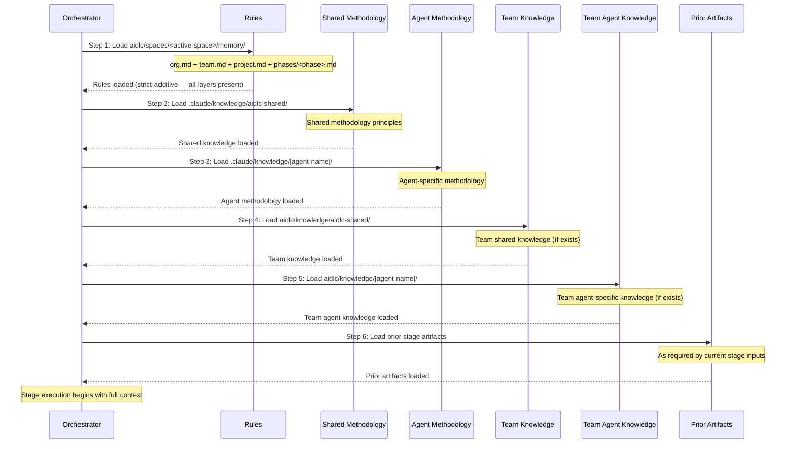

# Knowledge System

This chapter documents the two-tier knowledge architecture: how methodology knowledge ships with the framework, how team knowledge is managed per-project, the 6-step loading order, the template system, and how to extend knowledge.

---

## Two-Tier Architecture

AI-DLC uses a two-tier knowledge system that separates framework methodology from team customization:

**Tier 1: Methodology knowledge** (`.claude/knowledge/`) -- Ships with the framework. Contains shared principles and per-agent methodology references. Updated when upgrading the framework. Read-only during workflow execution.

**Tier 2: Team knowledge** (the active space — `aidlc/knowledge/`, shorthand for `aidlc/spaces/<space>/knowledge/`) -- User-managed. Contains company-specific standards, policies, and conventions. A sibling of the space's `memory/`, `codekb/`, and `intents/`, so it accumulates across every intent in the space. Free-form and empty at bootstrap: the engine creates the empty `aidlc/knowledge/` directory on the first `/aidlc` and seeds nothing inside it. There is no fixed file set.

### Tier 1 Structure

```
.claude/knowledge/
+-- aidlc-shared/
|   +-- ai-dlc-principles.md       # Core methodology principles
|   +-- verification.md            # Phase boundary verification rules
|   +-- brownfield.md              # Brownfield safeguards
|   +-- audit-format.md            # 72-event audit taxonomy
|   +-- knowledge-readme-template.md  # Optional README template a team can copy into Tier 2
|   +-- state-template.md          # State file contract
+-- aidlc-product-agent/
|   +-- requirements-guide.md
|   +-- product-guide.md
|   +-- functional-design-guide.md
|   +-- requirements-elicitation.md
|   +-- prioritization-frameworks.md
|   +-- user-story-patterns.md
|   +-- market-research-methods.md
+-- aidlc-architect-agent/
|   +-- architecture-guide.md
|   +-- nfr-design-guide.md
|   +-- ddd-patterns.md
|   +-- architecture-patterns.md
|   +-- nfr-design-patterns.md
|   +-- adr-template.md
+-- aidlc-developer-agent/
|   +-- code-analysis-guide.md
|   +-- code-generation-guide.md
|   +-- code-generation-patterns.md
|   +-- api-design-guide.md
|   +-- data-modelling-patterns.md
|   +-- re-artifacts.md
+-- [... 8 more agent knowledge dirs]
```

### Tier 2 Structure

Empty at bootstrap. The engine creates the bare `aidlc/knowledge/` directory and nothing inside it — no README, no per-agent subdirectories. The `aidlc-shared/` and per-agent directories below are the convention the agent personas look for; the team creates the ones it has content for.

```
aidlc/knowledge/                    # empty at bootstrap; team-created subdirs
+-- aidlc-shared/                   # optional — loaded by every agent if present
|   +-- (user-added files)
+-- aidlc-product-agent/            # optional — loaded when that agent is active
|   +-- (user-added files)
+-- [... a directory per agent the team chooses to populate]
```

---

## 6-Step Knowledge Loading Order

Each stage loads knowledge in a strict 6-step sequence: the resolved rule set first, then shared methodology, then agent-specific methodology, then team customizations, and finally prior stage artifacts.



| Step | Source | Tier | Managed By | Loaded |
|------|--------|------|-----------|--------|
| 1 | `aidlc/spaces/<active-space>/memory/` | -- | Framework + self-learning | First |
| 2 | `.claude/knowledge/aidlc-shared/` | 1 | Framework | Early |
| 3 | `.claude/knowledge/[agent]/` | 1 | Framework | Early |
| 4 | `aidlc/knowledge/aidlc-shared/` | 2 | Team | Mid |
| 5 | `aidlc/knowledge/[agent]/` | 2 | Team | Mid |
| 6 | Prior stage artifacts | -- | Dynamic | Last |

> **Note:** Steps 1-5 are agent knowledge loading (defined in each agent file). Step 6 (prior stage artifacts) is context added by the orchestrator at runtime, not a file-loading step.

### What Each Layer Contributes

- Rules (step 1) load first and are resolved through the strict-additive five-layer chain (org → team → project → phase → stage) — every applicable rule is present in context; broader layers are never overridden, only added to. See [Rule System](08-rule-system.md).
- Framework methodology (steps 2-3) provides the baseline behavior.
- Team knowledge (steps 4-5) adds organization-specific context.
- Prior artifacts (step 6) provide workflow-specific context.

---

## Template System

### Knowledge README Template

`.claude/knowledge/aidlc-shared/knowledge-readme-template.md` ships an optional README template a team can copy into its Tier 2 directories to document them. The engine does not scaffold or seed it — the space-level `aidlc/knowledge/` directory is created empty, and the team adds whatever it wants. The template explains:

- What types of files to add for that agent
- Examples of common customization files
- How files are loaded (automatically when the agent activates)
- That no special naming convention is required -- any `.md` file is loaded

### State Template

The engine generates `aidlc-state.md` according to the contract in `.claude/knowledge/aidlc-shared/state-template.md`. The template defines the required sections and fields; concrete Stage Progress rows are emitted from the compiled stage graph and scope grid, not hand-enumerated in the template.

---

## Adding Team Knowledge

Add company-specific files to the team knowledge directories:

```bash
# Team-wide standards (loaded by all agents)
aidlc/knowledge/aidlc-shared/company-coding-standards.md
aidlc/knowledge/aidlc-shared/company-architecture-principles.md

# Agent-specific standards (loaded only when that agent is active)
aidlc/knowledge/aidlc-architect-agent/company-architecture-patterns.md
aidlc/knowledge/aidlc-devsecops-agent/company-security-policy.md
aidlc/knowledge/aidlc-developer-agent/company-coding-conventions.md
aidlc/knowledge/aidlc-quality-agent/company-testing-standards.md
```

Files are loaded automatically when the agent is activated (steps 4-5 of the loading order). No configuration changes needed. Any `.md` file placed in a directory is loaded.

### Knowledge by Agent

> This table is a snapshot. The authoritative `display_name` + `examples` for each agent lives in the agent's frontmatter at `core/agents/<slug>-agent.md` and is surfaced programmatically via `loadAgents()` in `core/tools/aidlc-lib.ts`. Add a new agent there first; update this table in the same PR.

| Directory | Purpose | Example Files |
|-----------|---------|---------------|
| `aidlc-shared/` | Team-wide standards | `coding-standards.md`, `api-conventions.md` |
| `aidlc-product-agent/` | Product context | `roadmap.md`, `personas.md` |
| `aidlc-design-agent/` | UX/UI guidelines | `design-system.md`, `accessibility.md` |
| `aidlc-delivery-agent/` | PM conventions | `sprint-cadence.md`, `definition-of-done.md` |
| `aidlc-architect-agent/` | Architecture decisions | `tech-stack.md`, `infrastructure-preferences.md` |
| `aidlc-developer-agent/` | Coding patterns | `db-conventions.md`, `error-handling.md` |
| `aidlc-quality-agent/` | Testing standards | `test-strategy.md`, `coverage-requirements.md` |
| `aidlc-devsecops-agent/` | Security policies | `security-baseline.md`, `compliance-rules.md` |
| `aidlc-aws-platform-agent/` | Cloud context | `account-structure.md`, `service-limits.md` |
| `aidlc-compliance-agent/` | Compliance rules | `data-governance.md`, `audit-requirements.md` |
| `aidlc-pipeline-deploy-agent/` | CI/CD standards | `pipeline-standards.md`, `deployment-gates.md` |
| `aidlc-operations-agent/` | Ops runbooks | `monitoring.md`, `incident-response.md` |

---

## Cross-References

- [Architecture](01-architecture.md) -- knowledge layer in the 5-layer model
- [Agent System](05-agent-system.md) -- agent frontmatter and configuration
- [Stage Protocol](04-stage-protocol.md) -- agent persona loading section
- [Hooks and Tools](06-hooks-and-tools.md) -- audit-format.md taxonomy (shipped in shared knowledge)
