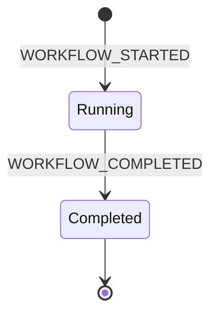
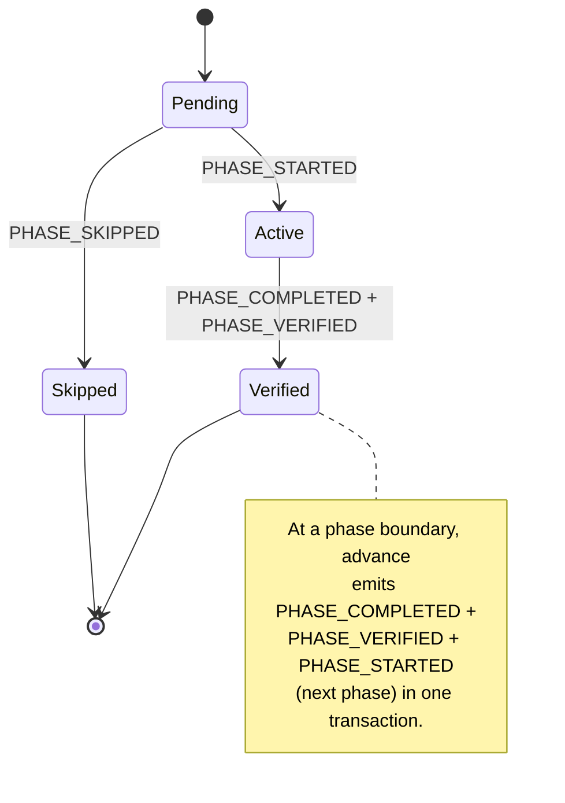
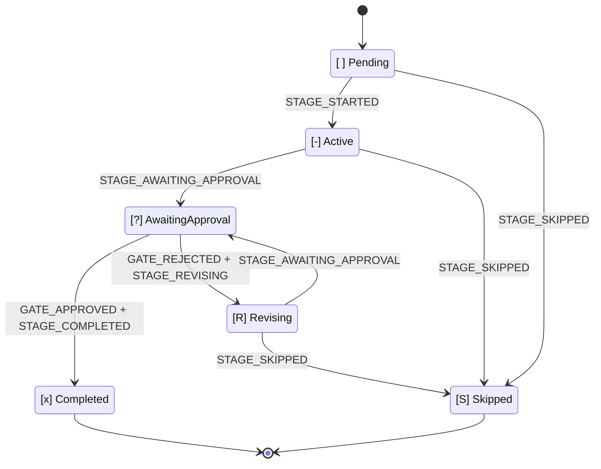

# State Machine

This chapter is the canonical reference for AI-DLC's state machines, the audit-event taxonomy, and the rule that connects them — **every state transition has exactly one tool-owned emitter**. Keeping this chapter's tables in sync with the code is enforced by the drift test at `tests/integration/t48-audit-event-emitters.test.ts`. If the doc and the code disagree, t48 fails.

Three nested state machines drive AI-DLC: **workflow**, **phase**, and **stage**. A fourth, independent stream records **session** events emitted by Claude Code hooks. These four streams share the intent's audit trail (the `audit/` shard dir under its record dir, `<record>/` = `aidlc/spaces/<active-space>/intents/<YYMMDD>-<label>/`) but are owned by different code paths, so it's easiest to read them as separate concerns and remember that their timelines interleave.

> **North-star invariant:** TypeScript owns deterministic bookkeeping; the LLM owns judgment. Every audit emission originates in a tool or hook, keeping LLM prose out of the emit path. If you're reading an MD file and see `aidlc-audit.ts append <EVENT>` as a prose instruction, that is a bug.
>
> **Audit-first atomicity:** tools emit their audit entries *before* mutating state. If audit emission fails, the tool throws before touching state — so `audit.md` and the state file never disagree. The ["Audit-first atomicity" section](#audit-first-atomicity) near the end of this chapter spells out the failure modes.

---

## Why three state machines

A workflow completes by passing through phases; a phase completes by passing through its in-scope stages; a stage completes when its approval gate closes. Each layer owns a distinct decision:

- **Workflow** — is the overall job running, or done?
- **Phase** — is this lifecycle phase in progress, verified, or skipped because the scope excluded it?
- **Stage** — is the stage being worked on, waiting on the user, being revised after rejection, or complete?

Flattening them into one state field conflates those decisions. Separating them means `/aidlc --status` can answer "what's blocking this workflow?" in one read: workflow `Running`, phase `Active`, stage `[?]` → "awaiting your approval on \<stage\>".

---

## Workflow machine



<!-- Text fallback: initial state transitions to Running on WORKFLOW_STARTED; Running transitions to Completed on WORKFLOW_COMPLETED; Completed is terminal. -->

**Status values:** `Running`, `Completed`.

A workflow starts when the first intent is born (`aidlc-utility intent-birth`, auto-invoked on the first `/aidlc` or via `/aidlc-init`) and ends when the last in-scope stage's approval gate closes. There is no `Paused` status and no `Waiting for Approval` status — approval is a stage-level concern, pause has no UX.

A workflow's `Running` state persists across Claude Code sessions. You start a workflow on Monday, stop the session, resume on Tuesday — the workflow is still `Running`; the *session* ended and a new one started.

| Transition | Trigger | Emitter |
|---|---|---|
| `[*] -> Running` | `aidlc-utility intent-birth` | `tools/aidlc-utility.ts` |
| `Running -> Completed` | Final stage outcome reported through `aidlc-orchestrate.ts report` | `tools/aidlc-state.ts` (internal emitter) |

---

## Phase machine



<!-- Text fallback: initial state transitions to Pending; Pending transitions to Active on PHASE_STARTED; Pending transitions to Skipped on PHASE_SKIPPED; Active transitions to Verified on PHASE_COMPLETED + PHASE_VERIFIED. At a phase boundary, advance emits PHASE_COMPLETED + PHASE_VERIFIED + PHASE_STARTED (next phase) atomically, chaining Verified back to the next phase's Pending-to-Active transition. -->

**Status values:** `Pending`, `Active`, `Verified`, `Skipped`.

Phase state is tracked in the `## Phase Progress` section of `aidlc-state.md`. Intent birth seeds the section: `Initialization` lands `Verified` (birth completes every init stage before handing off), the first post-init stage's phase lands `Active`, and each later phase lands `Skipped` when the scope leaves it without EXECUTE stages (one `PHASE_SKIPPED` audit row each) or `Pending` otherwise. Phase completion fires both `PHASE_COMPLETED` and `PHASE_VERIFIED` at the phase boundary, then `PHASE_STARTED` for the next one, and the rows flip in the same state write. The section is display-only: routing reads `Lifecycle Phase` and the Stage Progress checkboxes, and `/aidlc --status` recomputes its phase block live.

| Transition | Trigger | Emitter |
|---|---|---|
| seed (`Verified`/`Active`/`Pending`/`Skipped`) | `aidlc-utility intent-birth` | `tools/aidlc-utility.ts` |
| `Active -> Verified` | Stage completion/skip reported through `aidlc-orchestrate.ts` at a phase boundary; forward `aidlc-jump execute` | `tools/aidlc-state.ts` (internal emitter), `tools/aidlc-jump.ts` |
| `Pending -> Active` (boundary) | Engine routes after a reported outcome, or `aidlc-jump execute` | `tools/aidlc-state.ts` (internal emitter), `tools/aidlc-jump.ts` |
| `Pending -> Skipped` (jumped over) | forward `aidlc-jump execute` past a whole phase | `tools/aidlc-jump.ts` |
| `Verified/Active -> Pending` reset | backward `aidlc-jump execute` (reset phases with EXECUTE stages) | `tools/aidlc-jump.ts` |
| `Pending <-> Skipped` re-derivation | `aidlc-utility scope-change` / `recompose` (not-yet-reached rows only) | `tools/aidlc-utility.ts` |

At the init→post-init hand-off, `aidlc-utility intent-birth` itself emits `PHASE_COMPLETED + PHASE_VERIFIED + PHASE_STARTED + STAGE_STARTED` after the final init stage so the audit trail captures the transition instead of going silent between birth and the first `advance`.

---

## Stage machine



<!-- Text fallback: [ ] Pending transitions to [-] Active on STAGE_STARTED. [-] Active transitions to [?] AwaitingApproval on STAGE_AWAITING_APPROVAL. [?] AwaitingApproval transitions to [x] Completed on GATE_APPROVED + STAGE_COMPLETED, or to [R] Revising on GATE_REJECTED + STAGE_REVISING. [R] Revising transitions back to [?] AwaitingApproval on STAGE_AWAITING_APPROVAL (re-entry). Any of Pending / Active / Revising can transition to [S] Skipped via STAGE_SKIPPED. -->

**Checkbox legend (in `aidlc-state.md`):**

| Checkbox | State | Meaning |
|---|---|---|
| `[ ]` | `Pending` | Not started |
| `[-]` | `Active` | In progress |
| `[?]` | `AwaitingApproval` | Stage work done, gate open — user is the blocker |
| `[R]` | `Revising` | User rejected the gate — stage is being revised before re-entry |
| `[x]` | `Completed` | Approved and done |
| `[S]` | `Skipped` | Excluded by scope, skipped via jump, or cut mid-flight |

`[?]` and `[R]` disambiguate two situations that would otherwise both look like `[-]`. On resume, `[R]` tells the conductor to present the prior artifact and feedback before re-entering the gate, instead of re-executing the stage from scratch.

| Transition | Trigger | Emitter |
|---|---|---|
| `Pending → Active` | Engine routes after the previous reported outcome | `tools/aidlc-state.ts` (internal emitter) |
| `Active → AwaitingApproval` | `aidlc-orchestrate.ts report --stage <slug> --result awaiting-approval` | `tools/aidlc-state.ts` (internal emitter) |
| `AwaitingApproval → Completed` | `aidlc-orchestrate.ts report --stage <slug> --result approved --user-input "<exact choice>"` | `tools/aidlc-state.ts` (internal emitter) |
| `AwaitingApproval → Revising` | `aidlc-orchestrate.ts report --stage <slug> --result rejected --user-input <text>` | `tools/aidlc-state.ts` (internal emitter) |
| `Active → Revising` | The same rejected report when gate-open recovery is needed | `tools/aidlc-state.ts` (internal emitter) |
| `Revising → AwaitingApproval` | `aidlc-orchestrate.ts report --stage <slug> --result revised` | `tools/aidlc-state.ts` (internal emitter) |
| `{Active,Revising} → Skipped` | `aidlc-orchestrate.ts report --stage <slug> --result skipped --reason <text>` | `tools/aidlc-state.ts` (internal routed-skip emitter) |
| `Pending → Skipped` | Scope composition or `aidlc-jump execute` | `tools/aidlc-utility.ts`, `tools/aidlc-jump.ts` |

The `approved` report owns the full post-gate transition: it emits
`GATE_APPROVED + STAGE_COMPLETED`, then routes to the next in-scope stage,
emitting `STAGE_STARTED` plus any `PHASE_*` events at boundaries. On the final
in-scope stage it emits `PHASE_COMPLETED + PHASE_VERIFIED +
WORKFLOW_COMPLETED` and sets Status=Completed. The conductor does not call
state lifecycle verbs before or after reporting.

**Routed skip.** `report --result skipped` is accepted only on the main
workflow with an explicit nonblank `--stage` and `--reason`, when the named
stage is declared `execution: CONDITIONAL`, equals `Current Stage`, and is
Active or Revising. It runs before
artifact, per-unit, and ensemble-evidence guards because a justified skip owes
no completion evidence. The engine invokes the internal skip transition with
its routing marker: the transaction preserves `[S]`, emits exactly one
`STAGE_SKIPPED`, never emits `STAGE_COMPLETED`, and either starts the next
stage (including boundary events) or completes the workflow. If onward routing
fails, recovery leaves the skipped marker and cursor at the same stage so the
route can be retried without duplicating the skip event. `report --single
--result skipped` is rejected.

**Artifact guard (issue #366).** Every report outcome that marks a stage `[x]`
runs a deterministic artifact check before completing it, so a stage cannot be
marked complete without evidence of work on disk. A stage that declares
`produces[]` must have at least one of those artifacts present (under the
active intent's record dir, its per-unit Construction directories, or the
active space's `codekb/<repo>/` for codekb stages); `workspace_requires: true`
also requires source-work evidence outside `aidlc/` and the harness dir. A
failure writes nothing. Optional outputs do not participate. For
`produces_kinds`, units whose kind prunes the required set to zero owe no
artifact; any applicable unit remains strict. Bypass with
`AIDLC_SKIP_ARTIFACT_GUARD=1`.

**Ensemble evidence gate.** On a `mob` or `subagent`-with-supports stage, the
report path refuses `awaiting-approval`, `revised`, and `approved` while a
declared support agent's contribution file
(`<stage>/contributions/<agent-slug>.md`) is missing or lacks its
`**Collaborator:**` identity-marker first line — the deterministic proof the
ensemble actually convened. A settled autonomous swarm is exempt (its per-unit
convergence ledger is the evidence); `report --single` checks stage-level
evidence only. Bypass with `AIDLC_DISABLE_ENSEMBLE_EVIDENCE=1`, intended only
for recovering a legitimately-run stage whose contribution files were lost.

**Gate-revision backstop.** If the conductor revises an artifact at an open
gate without first reporting rejection, the `approved` report reconciles the
missing `GATE_REJECTED` + `STAGE_REVISING` pair before completion when audit
evidence proves a post-gate human turn followed by an artifact write. The
backfilled rows carry `Recovered: true`; reviewer writes before the human turn
do not count. Bypass with `AIDLC_SKIP_REVISION_BACKSTOP=1`.

**Park (issue #365/#367).** `aidlc-orchestrate park` writes a `Parked` / `Parked At Stage` runtime marker (via `aidlc-state.ts park`, which emits `WORKFLOW_PARKED`) without advancing any stage; a subsequent plain `next` re-emits a terminal `parked` directive and the Stop hook lets the turn end, so a long workflow can pause across sessions instead of rubber-stamping the remaining stages to reach `done`. `/aidlc --resume` clears the marker (`unpark` emits `WORKFLOW_UNPARKED`) before continuing. An unattended autonomous Construction run (`Construction Autonomy Mode: autonomous`) refuses to park: both the tool and the Stop hook's `parked` allow decline under autonomous mode, so the loop keeps moving with no human to resume it.

### Revision loop

```
report awaiting-approval  →  [?] AwaitingApproval
          ↘ report rejected  →  [R] Revising  (Revision Count += 1)
                   ↓ report revised
                   [?] AwaitingApproval
                   ↘ report approved  →  [x] Completed
```

`Revision Count` lives in the state file and increments on each rejected
report. The conductor uses this to detect the revision-loop escape hatch
(default is 3 cycles before offering to skip).

When a revision changes a `produces[]` artifact on a stage whose directive
carries a reviewer, the conductor re-runs the §12a reviewer step before
reporting `revised` (stage-protocol Part 0) — the engine's own checks on the
`revised` report remain structural (completion evidence + artifact existence);
the reviewer re-run is conductor prose, not an engine gate.

---

## Session stream (hook-owned, independent)

Session events are emitted by Claude Code hooks, not by AI-DLC tools. A session is a single Claude Code conversation; a workflow is a long-lived directory state. The relationship is many-to-many — one workflow can span multiple sessions, one session can touch multiple workflows — so the streams are independent by design.

| Event | Emitter | Trigger |
|---|---|---|
| `SESSION_STARTED` | `hooks/aidlc-session-start.ts` | `SessionStart` with `source=startup` or `clear` |
| `SESSION_RESUMED` | `hooks/aidlc-session-start.ts` | `SessionStart` with `source=resume` |
| `SESSION_COMPACTED` | `hooks/aidlc-validate-state.ts` | `PreCompact` — fires at compaction time so it's captured reliably |
| `SESSION_ENDED` | `hooks/aidlc-session-end.ts` | `SessionEnd` |

Session hooks check for the active intent's `aidlc-state.md` (under `aidlc/spaces/<space>/intents/<YYMMDD>-<label>/`) before emitting. If no such file exists (no active AI-DLC workflow in the cwd), the hook exits silently without writing to any audit log. Session events exist to annotate an active workflow's timeline — a session in a directory with no workflow has nothing to annotate.

### Compaction awareness

`aidlc-state.ts resume` scans the audit tail for the latest `SESSION_COMPACTED`. If no stage activity (`STAGE_STARTED`, `STAGE_COMPLETED`, `GATE_APPROVED`, `SESSION_RESUMED`, `RECOVERY_COMPLETED`) follows it, resume returns `compaction_pending: true` and the conductor surfaces a three-option prompt (continue / review / restart) before proceeding. `RECOVERY_COMPLETED` is emitted by `acknowledge-compaction` once the user picks an option, satisfying the activity gate so subsequent compactions detect a fresh boundary.

---

## Audit event taxonomy

**74 events**, grouped below into 17 categories (the canonical `audit-format.md` registry splits the same 74 into 19 - the grouping is presentational, the event set is the invariant). Every event has exactly one tool or hook emitter, except for events pre-registered for an upcoming release whose Emitter cell reads `Reserved (v0.4.0 PR N)`, `Reserved (v0.5.0 PR N)`, or `Reserved (v0.6.0 PR N)` - these are skipped by the drift test's forward check until the consumer PR ships the emitter. The drift test `tests/integration/t48-audit-event-emitters.test.ts` enforces forward/reverse/tertiary/pairing/MD-MD consistency between this chapter's tables and the code.

### Workflow lifecycle

| Event | Emitter | Notes |
|---|---|---|
| `WORKFLOW_STARTED` | `tools/aidlc-utility.ts` | Mandatory first event on every intent birth |
| `WORKFLOW_COMPLETED` | `tools/aidlc-state.ts` |  |
| `WORKFLOW_PARKED` | `tools/aidlc-state.ts` | `park` - workflow parked mid-flow for a later session; no stage advanced |
| `WORKFLOW_UNPARKED` | `tools/aidlc-state.ts` | `unpark` - park marker cleared on explicit `--resume` re-entry |

### Phase lifecycle

| Event | Emitter | Notes |
|---|---|---|
| `PHASE_STARTED` | `tools/aidlc-utility.ts`, `tools/aidlc-state.ts`, `tools/aidlc-jump.ts` | First fire in init; subsequent fires at stage-tool phase boundaries |
| `PHASE_COMPLETED` | `tools/aidlc-utility.ts`, `tools/aidlc-state.ts`, `tools/aidlc-jump.ts` | Paired with `PHASE_VERIFIED` at every boundary |
| `PHASE_VERIFIED` | `tools/aidlc-utility.ts`, `tools/aidlc-state.ts`, `tools/aidlc-jump.ts` | Always paired with `PHASE_COMPLETED` |
| `PHASE_SKIPPED` | `tools/aidlc-utility.ts` | One per scope-excluded phase, emitted at intent birth |

### Stage lifecycle

| Event | Emitter | Notes |
|---|---|---|
| `STAGE_STARTED` | `tools/aidlc-state.ts`, `tools/aidlc-utility.ts`, `tools/aidlc-jump.ts` | Internal route marks `[ ]` → `[-]` |
| `STAGE_AWAITING_APPROVAL` | `tools/aidlc-state.ts` | Internal emitter for `report --result awaiting-approval` / `revised`; recovered rows carry `Recovered=true` |
| `STAGE_COMPLETED` | `tools/aidlc-state.ts`, `tools/aidlc-utility.ts` | Internal emitter for a completed/approved report; never paired with a skipped report |
| `STAGE_REVISING` | `tools/aidlc-state.ts` | Internal emitter paired with `GATE_REJECTED` after a rejected report |
| `STAGE_SKIPPED` | `tools/aidlc-state.ts`, `tools/aidlc-jump.ts` | Exactly one per `[S]` transition; the main-workflow report path routes onward atomically |
| `STAGE_JUMPED` | `tools/aidlc-jump.ts` | Records the destination slug on `--stage`/`--phase` jump |

### Gate decisions

| Event | Emitter | Notes |
|---|---|---|
| `GATE_APPROVED` | `tools/aidlc-state.ts` | `--user-input` captures the exact choice |
| `GATE_REJECTED` | `tools/aidlc-state.ts` | `--feedback` captures the rejection reason |

### User interaction

| Event | Emitter | Notes |
|---|---|---|
| `DECISION_RECORDED` | `tools/aidlc-log.ts` | Fires before `AskUserQuestion` so options are captured |
| `QUESTION_ANSWERED` | `tools/aidlc-log.ts` | Fires after user response |
| `REVIEW_REQUESTED` | `tools/aidlc-log.ts` | Fires when the conductor dispatches the §12a reviewer sub-agent |
| `REVIEW_COMPLETED` | `tools/aidlc-log.ts` | Fires when a `READY` or `NOT-READY` reviewer verdict is read. All completing state transitions (`approve`, `advance`, `finalize`, and `complete-workflow`) require a matching receipt from the current workflow attempt and after the latest relevant declared-artifact write; per-unit stages require one per applicable unit and scope artifact invalidation to that unit. Autonomous swarm finalization additionally requires each configured unit's receipt after its Bolt started. |

### Scope and configuration

| Event | Emitter | Notes |
|---|---|---|
| `SCOPE_DETECTED` | `tools/aidlc-utility.ts` | `detect-scope` subcommand; `Source` field records provenance (freeform / keyword / env / cli) |
| `SCOPE_CHANGED` | `tools/aidlc-utility.ts` | `scope-change` subcommand on active workflow |
| `PLUGIN_SELECTION_CHANGED` | `tools/aidlc-utility.ts` | `select-plugins` set-mode; fields: `Previous Selection`, `New Selection` |
| `DEPTH_CHANGED` | `tools/aidlc-utility.ts` | `config set depth <value>` / `config-change --depth` |
| `TEST_STRATEGY_CHANGED` | `tools/aidlc-utility.ts` | `config set test-strategy <value>` / `config-change --test-strategy` |
| `RECOMPOSED` | `tools/aidlc-utility.ts` | `recompose` subcommand - the adaptive composer's in-flight plan re-shape (pending-stage suffix flips under the audit lock) |

### Artifacts

| Event | Emitter | Notes |
|---|---|---|
| `ARTIFACT_CREATED` | `hooks/aidlc-audit-logger.ts` | Write to net-new path — distinguished from UPDATED via `mtimeMs == birthtimeMs` stat check |
| `ARTIFACT_UPDATED` | `hooks/aidlc-audit-logger.ts` | Edit tool or Write overwriting existing file |
| `ARTIFACT_REUSED` | `tools/aidlc-state.ts` | `reuse-artifact` subcommand — keep/modify/redo decisions |

### Construction Bolts

| Event | Emitter | Notes |
|---|---|---|
| `BOLT_STARTED` | `tools/aidlc-bolt.ts` | Accepts CSV bolt names for parallel batches |
| `BOLT_COMPLETED` | `tools/aidlc-bolt.ts` | Paired with a prior `BOLT_STARTED` |
| `BOLT_FAILED` | `tools/aidlc-bolt.ts` (`fail` + `abort`) | `--succeeded-siblings` captures parallel-batch survivors; `abort` adds `Reason: aborted` field for sub-classification |
| `AUTONOMY_MODE_SET` | `tools/aidlc-bolt.ts` | Atomically updates `Construction Autonomy Mode` field; validates field exists first (audit-first) |

### Session

| Event | Emitter | Notes |
|---|---|---|
| `SESSION_STARTED` | `hooks/aidlc-session-start.ts` | `source=startup` or `clear` |
| `SESSION_RESUMED` | `hooks/aidlc-session-start.ts` | `source=resume` |
| `SESSION_COMPACTED` | `hooks/aidlc-validate-state.ts` | Emitted at PreCompact (not at next SessionStart) to avoid duplication |
| `SESSION_ENDED` | `hooks/aidlc-session-end.ts` | Includes `Reason` field from Claude Code |
| `HUMAN_TURN` | `hooks/aidlc-mint-presence.ts` (+ per-harness prompt-submit adapters) | One per real human prompt or answered question widget; the approval/interview gate requires one since the last gate resolution |
| `SUBAGENT_COMPLETED` | `hooks/aidlc-log-subagent.ts` | Records subagent completion via SubagentStop hook |
| `REVIEWER_SCOPE_BLOCKED` | `hooks/aidlc-reviewer-scope.ts` | A per-unit reviewer's tool call refused for reaching into sibling units' `construction/` paths (the §12a read-scope bound); one row per refusal |

### Diagnostics and workspace

| Event | Emitter | Notes |
|---|---|---|
| `HEALTH_CHECKED` | `tools/aidlc-utility.ts` | `--doctor` run |
| `WORKSPACE_SCAFFOLDED` | `tools/aidlc-utility.ts` | Net-new directory tree created by init |
| `WORKSPACE_SCANNED` | `tools/aidlc-utility.ts` | Brownfield workspace detection complete |
| `WORKSPACE_INITIALISED` | `tools/aidlc-utility.ts` | State file materialized |

### Error and recovery

| Event | Emitter | Trigger |
|---|---|---|
| `ERROR_LOGGED` | `tools/aidlc-lib.ts` (via `emitError` from every tool's `error()`) | Any tool CLI that calls `error(msg)` to exit non-zero; best-effort — no-op if no workflow in cwd, guarded against recursion |
| `RECOVERY_COMPLETED` | `tools/aidlc-state.ts` | `acknowledge-compaction --choice <continue|review|restart>` called by the conductor after the user answers the compaction-awareness AskUserQuestion |

### Worktree

Pre-registered for v0.4.0; the three `WORKTREE_*` rows ship with `aidlc-worktree.ts` (milestone 7); `STATE_*` lands in milestone 9 (state fork/merge); `AUDIT_*` lands in milestone 10 (audit fork/merge). t48 forward check skips rows whose Emitter cell still reads `Reserved`.

| Event | Emitter | Trigger |
|---|---|---|
| `WORKTREE_CREATED` | `tools/aidlc-worktree.ts` | Per-Bolt git worktree created from main on Bolt start (subcommand: `create`) |
| `WORKTREE_MERGED` | `tools/aidlc-worktree.ts` | Bolt's worktree merged back to main on gate approval (subcommand: `merge`) |
| `WORKTREE_DISCARDED` | `tools/aidlc-worktree.ts` | Aborted Bolt's worktree explicitly removed (subcommand: `discard`) |
| `STATE_FORKED` | `tools/aidlc-state.ts` | State file forked to worktree on Bolt start (subcommand: `fork`) |
| `STATE_MERGED` | `tools/aidlc-state.ts` | Worktree's state merged back to main on gate approval; alphabetical-slug tiebreak as defence-in-depth (subcommand: `merge`) |
| `AUDIT_FORKED` | `tools/aidlc-audit.ts` (`audit-fork`) | Audit log forked to worktree on Bolt start; audit-of-intent — emit precedes the byte-copy |
| `AUDIT_MERGED` | `tools/aidlc-audit.ts` (`audit-merge`) | Worktree's audit entries appended to main audit on gate approval; per-Bolt entry order preserved, cross-Bolt order reflects merge-completion order |

### Practices

Pre-registered for v0.4.0; emitters land in milestone 8 (stage 2.2 practices-discovery) and milestone 13 (Construction orchestrator runtime).

| Event | Emitter | Trigger |
|---|---|---|
| `PRACTICES_DISCOVERED` | `tools/aidlc-state.ts` `practices-event --type discovered` | Greenfield or brownfield lead draft + three spokes + human interview + lead integration completed; drafts await affirmation |
| `PRACTICES_AFFIRMED` | `tools/aidlc-state.ts` `practices-promote` | Team approved practices; content promoted from the intent's `inception/practices-discovery/` to `aidlc/spaces/<active-space>/memory/team.md` and `project.md` |
| `PRACTICES_OVERRIDE` | `tools/aidlc-state.ts` `practices-promote` (write-failure path) and `tools/aidlc-state.ts` `practices-event --type override` (bolt-plan-marker-conflict path) | Either promotion failed and the stage remains awaiting approval, or the active-space walking-skeleton stance overrode the current Bolt's marker |
| `PRACTICES_SECTION_EMPTY` | `tools/aidlc-state.ts` `practices-event --type empty` | Conductor read a practices section that returned empty; advisory-only, falls back to org defaults |

### Merge dispatch

Pre-registered for v0.4.0 in milestone 1; emitters land in milestone 13 via the new `aidlc-bolt dispatch-event` subcommand. The conductor brackets each aidlc-pipeline-deploy-agent dispatch — pre-call INVOKED, post-call RETURNED on successful YAML parse, FALLBACK on timeout / malformed-YAML / low-confidence.

| Event | Emitter | Trigger |
|---|---|---|
| `MERGE_DISPATCH_INVOKED` | `tools/aidlc-bolt.ts` `dispatch-event --event MERGE_DISPATCH_INVOKED` | Conductor dispatched aidlc-pipeline-deploy-agent via Task to determine merge strategy from team practices prose |
| `MERGE_DISPATCH_RETURNED` | `tools/aidlc-bolt.ts` `dispatch-event --event MERGE_DISPATCH_RETURNED` | Agent returned parsed YAML with strategy, target branch, confidence, and notes |
| `MERGE_DISPATCH_FALLBACK` | `tools/aidlc-bolt.ts` `dispatch-event --event MERGE_DISPATCH_FALLBACK` | Agent timed out or returned malformed YAML; conductor fell back to org defaults — critical observability hook |

### Sensors

Pre-registered for v0.5.0 in milestone 1; emitters land in milestone 9 (sensor dispatcher) for the four `SENSOR_*` events and milestone 14 (paired-coverage doctor row) for `GUARDRAIL_LOADED`. Coverage is environmental — every Inception/Construction/Operation stage that writes markdown emits at least one `SENSOR_FIRED` row from the registry-default sensors. Advisory-only in v0.5.0; v0.8.0 ralph driver introduces blocking semantics for Construction-phase sensors.

| Event | Emitter | Trigger |
|---|---|---|
| `SENSOR_FIRED` | `tools/aidlc-sensor.ts` `fire` | Dispatcher invoked a sensor against a stage output (per PostToolUse Write/Edit match on the sensor's `matches` filter) |
| `SENSOR_PASSED` | `tools/aidlc-sensor.ts` `fire` | Sensor completed and reported no findings (also covers tool-unavailable and script-error fall-through; `Note` field discriminates) |
| `SENSOR_FAILED` | `tools/aidlc-sensor.ts` `fire` | Sensor completed and reported findings; detail file written at `<record>/.aidlc-sensors/<stage-slug>/<sensor-id>-<fire-id>.md` (in the intent's record dir) |
| `SENSOR_BUDGET_OVERRIDE` | `tools/aidlc-sensor.ts` `fire` | Sensor exceeded its configured cap (registry / binding / depth-derived per the three-layer cap model) and was terminated or skipped |
| `GUARDRAIL_LOADED` | `tools/aidlc-utility.ts` | Guardrail loader resolved the scope-hierarchical guardrail set for the active workflow (org → project → phase → stage); doctor's paired-coverage check reads from this event |

### Learning loop

Pre-registered for v0.5.0 in milestone 4; `MEMORY_EMPTY` emitter lands in milestone 8 (`aidlc-runtime.ts compile`). The §13 Learnings Ritual writes a per-stage memory.md during execution; on stage approval, the runtime-graph compile reads memory.md and emits `MEMORY_EMPTY` for any stage with zero non-blank entries under the four standard headings. milestone 12's learning-gate tool (`aidlc-learnings.ts persist`) emits `RULE_LEARNED` when a kept learning lands as a dated practice entry in `aidlc/spaces/<active-space>/memory/{project,team}.md`, and `SENSOR_PROPOSED` when a learning installs a sensor binding (manifest + originating stage `sensors:` frontmatter). Doctor reads these rows for diary-discipline observability.

| Event | Emitter | Trigger |
|---|---|---|
| `MEMORY_EMPTY` | `tools/aidlc-runtime.ts` | Stage approval's runtime-graph compile found memory.md missing or with zero non-blank entries under §13's four headings |
| `RULE_LEARNED` | `tools/aidlc-learnings.ts` | The learning gate persisted a kept learning as a dated practice entry to `aidlc/spaces/<active-space>/memory/{project,team}.md` |
| `SENSOR_PROPOSED` | `tools/aidlc-learnings.ts` | The learning gate scaffolded a project-tier sensor manifest and bound it to the originating stage's `sensors:` frontmatter |

### Swarm

Pre-registered for v0.6.0 in milestone 2. All six swarm events now emit from the swarm referee `aidlc-swarm.ts` — the deterministic verdict surface the conductor consults. The referee is stateless: `prepare` forks the per-unit worktrees and emits `SWARM_STARTED` (plus `SWARM_DEGRADED`, born live in Wave 4 milestone 16, when the conductor reports a loud downgrade); `finalize` re-verifies the conductor's claimed-converged set, including each configured unit's post-Bolt terminal reviewer receipt, and emits the per-Unit pair, the per-failed-Unit baton row, and the batch tally. The `check` subcommand is advisory and emits nothing. The engine is read-only and the conductor never emits audit events, so the deterministic tool owns the whole swarm taxonomy. These rows track the lifecycle of a batch of dependency-linked Units: fan-out at batch start, per-Unit convergence or re-verify failure, return-the-baton handback to the conductor, and batch completion. The conductor handles `invoke-swarm` as an orthogonal directive kind beside the stage `mode` enum — it does NOT activate the reserved `agent-team` mode, which stays reserved. t48 forward check skips rows whose Emitter cell still reads `Reserved`.

| Event | Emitter | Trigger |
|---|---|---|
| `SWARM_STARTED` | `tools/aidlc-swarm.ts` | Swarm referee `prepare` forked a batch of dependency-linked Units |
| `SWARM_UNIT_CONVERGED` | `tools/aidlc-swarm.ts` | A swarm Unit re-verified green and untampered, with its configured post-Bolt reviewer receipt present, then merged back (a converged unit whose merge-back failed gets no row until a finalize retry merges it) |
| `SWARM_UNIT_FAILED` | `tools/aidlc-swarm.ts` | A swarm Unit failed the `finalize` re-verify (not claimed, claimed-but-red, tampered, or missing its configured reviewer receipt) |
| `SWARM_BATON_RETURNED` | `tools/aidlc-swarm.ts` | A swarm Unit returned the baton to the conductor for orchestrator-mediated coordination |
| `SWARM_COMPLETED` | `tools/aidlc-swarm.ts` | All Units in the batch finished (converged or failed); batch closed |
| `SWARM_DEGRADED` | `tools/aidlc-swarm.ts` | `AIDLC_USE_SWARM=1` was requested but the Workflow tool was unavailable; the conductor ran the subagent floor |

Every event in the taxonomy is either backed by a real emitter or marked `Reserved (v0.4.0 PR N)` / `Reserved (v0.5.0 PR N)` / `Reserved (v0.6.0 PR N)` for a pre-registered upcoming consumer. The drift test enforces both halves — the `Reserved` early-skip applies only while the cell literally contains "Reserved"; consumer PRs replace it with the real emitter file path in the same commit they ship the emit call.

---

## Audit-first atomicity

State-mutating commands emit their audit entries **before** mutating the state file. Two consequences:

1. If audit emission fails (lock timeout, disk error, invalid event type), the tool throws before touching state. The state stays at its previous value; audit.md stays clean.
2. If state writing fails *after* audit emission, the audit has an "intent" entry but the state didn't move. The drift is visible and diagnosable; `--doctor` surfaces it.

The case `test("65: approve is audit-first ...")` in `tests/unit/t17.test.ts` proves this for `approve`: chmod'ing audit.md to read-only forces an audit failure and asserts the state file stays at `[?]` (not `[x]`). The same invariant holds for `gate-start`, `reject`, `revise`, `skip`, `advance`, `complete-workflow`, `reuse-artifact`, `aidlc-bolt.ts set-autonomy`, and `aidlc-state.ts fork` / `aidlc-state.ts merge` (the v0.4.0 milestone 9 state fork/merge subcommands — see `tests/unit/t76.test.ts` for the equivalent chmod-the-lock-dir Part A and chmod-the-target-after-emit Part B proofs).

State fork/merge are deliberately NOT in the audit-of-intent exception below: re-reading and re-writing a state file is idempotent (unlike `git worktree add`, which leaves the worktree present after a kill-9 between emit and git), so the strict invariant applies cleanly. A failed state write after a successful audit emit becomes a phantom `STATE_FORKED` row that doctor (v0.4.0 milestone 15) reconciles against the worktree's record-dir `aidlc-state.md` existence.

### Audit-of-intent semantics (`WORKTREE_*`, `AUDIT_*`, and merge-dispatch `MERGE_DISPATCH_INVOKED`)

Audit-of-intent semantics apply to side-effects whose outcome cannot be checked before emission — including disk operations (worktree creation / removal, audit byte-copy) and LLM Task dispatch (aidlc-pipeline-deploy-agent). The emitting tool writes the audit entry first, then performs the side-effect. If the side-effect fails after the emit, the tool calls `emitError` with the slug embedded in the message (`[slug=<slug>]`); the audit-fork / audit-merge handlers additionally tag failures with `[fork-emitted:<timestamp>]` so `--doctor` (v0.4.0 milestone 15) can distinguish "intent recorded, side-effect never landed" from earlier failure modes. For `MERGE_DISPATCH_INVOKED`, doctor reconciliation matches orphan INVOKED rows to a missing `MERGE_DISPATCH_RETURNED` or `MERGE_DISPATCH_FALLBACK` partner via slug + timestamp window (no correlation tag needed because the LLM Task call has no disk artifact to sequence against). `appendAuditEntry` records an `ERROR_LOGGED` entry on disk-side-effect failure; doctor reconciles audit drift at observation time.

| Event group | Emitter | Side-effect that follows the emit |
|---|---|---|
| `WORKTREE_CREATED`, `WORKTREE_MERGED`, `WORKTREE_DISCARDED` | `tools/aidlc-worktree.ts` | `git worktree add`, `git merge` + cleanup, `git worktree remove` + branch delete |
| `AUDIT_FORKED`, `AUDIT_MERGED` | `tools/aidlc-audit.ts` | `mkdir -p` + `copyFileSync` of main audit; `appendFileSync` of worktree-audit delta to main audit |
| `MERGE_DISPATCH_INVOKED` | `tools/aidlc-bolt.ts` `dispatch-event` | `Task(aidlc-pipeline-deploy-agent, ...)` LLM dispatch — the side-effect is the LLM call itself; success is observed via the matching `MERGE_DISPATCH_RETURNED` or `MERGE_DISPATCH_FALLBACK` post-call emit |

This is a deliberate departure from the strict audit-first invariant for stage transitions, motivated by the kill-9 / OS-crash window where neither the rollback emit nor `ERROR_LOGGED` can be guaranteed. The pattern is bounded to the events listed above. `STATE_FORKED` / `STATE_MERGED` (milestone 9) deliberately do NOT take this exception — see the previous section for the strict-first rationale (state writes are idempotent, so a failed write surfaces as recoverable drift instead of unrecoverable orphan state). `MERGE_DISPATCH_RETURNED` / `MERGE_DISPATCH_FALLBACK` are post-call emits (audit-of-result, not intent — strict-first) and don't take the exception. All other state-mutating commands stay strict-first per the section above.

### Forbidden patterns

Don't emit audit events from LLM prose. The following anti-patterns are the reason this refactor exists:

- `bun .claude/tools/aidlc-audit.ts append WORKFLOW_STARTED ...` as a step in SKILL.md — replaced by the tool emitting it internally
- `**Event**: STAGE_COMPLETED` markdown block written by a stage file — events only come from `appendAuditEntry` in a tool or hook
- Freeform `## Artifact Update` sections written by hooks — replaced by canonical `ARTIFACT_CREATED` / `ARTIFACT_UPDATED`

The drift test at `tests/integration/t48-audit-event-emitters.test.ts` catches drift between this chapter's tables and the code: every event in the tables must have a matching `appendAuditEntry(..., "EVENT", ...)` call in the declared emitter file, and every emission call site in the codebase must appear in the tables. The test also guards against deleted events being resurrected and against pairing invariants (e.g., `handleApprove` must emit both `GATE_APPROVED` and `STAGE_COMPLETED`).

---

## Same-commit rule

When you change state-machine behavior, update both the code and this chapter in the **same commit**. The rule catches itself via the drift test, but the cost of fixing drift after the fact (chasing down who owns which event across three files) is much higher than updating one table.

Specifically:
- Adding an event → add to `VALID_EVENT_TYPES` in `aidlc-audit.ts`, add the emitter, add to the appropriate table above.
- Deleting an event → remove from `VALID_EVENT_TYPES`, remove emitter, remove the row here, grep the codebase for any stale prose or tests.
- Renaming an emitter file → update the Emitter column in every table row that points at it.

---

## Known limitations

- **Multi-project sessions.** Claude Code doesn't fire a hook on `cd` within a session, so if a user runs `/aidlc` in project A and then `cd`s to project B, the session hooks won't re-fire against B's audit.md. Session events may not perfectly reflect every workspace switch. This is a Claude Code limitation, not an AI-DLC design flaw.

---

## Related reference

- [Orchestrator](03-orchestrator.md) — how `/aidlc --status`, session check, and the resume path consume state-machine signals.
- [Stage Protocol](04-stage-protocol.md) — the stage-level behavioral contract, including the approval-gate UX that drives `[?]` / `[R]` transitions.
- [Hooks and Tools](06-hooks-and-tools.md) — hook lifecycle, CLI tool reference, and the audit-event catalog.
- [Testing](09-testing.md) — how the drift test works and when to run it.
