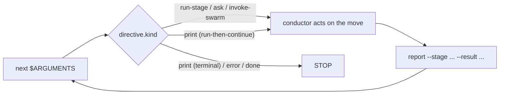

# The Orchestration Engine and Skill System

> Audience: Tier 2/3 (team adopter, framework contributor).

> **Path convention.** `<record>/` below = the active intent's record dir, `aidlc/spaces/<space>/intents/<YYMMDD>-<label>/`, where per-intent state and runtime files live.

This chapter is the canonical reference for the orchestration architecture that drives every `/aidlc` run: a deterministic **engine** (`aidlc-orchestrate.ts`) that answers "what's next?", a thin **conductor** (`skills/aidlc/SKILL.md`) that acts on the engine's answer, the **typed directive contract** that joins them, the **plural skill** set the runner generator emits, the **scope shape** that decides which stages run, and the **swarm** referee that converges parallel Construction work. It replaces the older prose-orchestrator model, where the `SKILL.md` body itself held all the routing logic. Cross-link to [Orchestrator](03-orchestrator.md) (the conductor's own chapter), [Runtime Graph](13-runtime-graph.md) (the execution-truth mirror the engine and swarm read), [State Machine](12-state-machine.md) (the transitions `report` commits), and [Hooks and Tools](06-hooks-and-tools.md) (the deterministic spine, including the Stop hook).

---

## 1. The engine and the conductor

The cutover splits one concern into two. The **engine** owns *between-stage routing* — scope resolution, the flag-precedence ladder, jump-direction computation, resume and init guards, stage sequencing, gate status, and workflow completion. The **conductor** owns *execution quality inside the move the engine named* — framing the persona, asking good questions, keeping the stage diary, the intra-stage Keep/Modify/Redo loop, and surfacing judgement to the human at gates.

The engine is authored at `core/tools/aidlc-orchestrate.ts` and ships into each harness as `<harness-dir>/tools/aidlc-orchestrate.ts` (e.g. `.claude/tools/`); it is a Bun CLI with exactly three subcommands: `next`, `report`, and `park`.

| Subcommand | Role | Mutates state? |
|------------|------|----------------|
| `next` | Read the workflow state (the active intent's `aidlc-state.md`, under `aidlc/spaces/<space>/intents/<YYMMDD>-<label>/`) and the compiled stage graph (`tools/data/stage-graph.json`), resolve scope and position, and emit **exactly one** typed directive (JSON) to stdout. | No (one documented transitive exception: a no-state birth over a workspace that already holds intents emits an intent-pick prompt rather than birthing a duplicate). |
| `report` | Commit the transition after the conductor acted on a directive. A stage-aware dispatcher: `--stage <slug>` pins the acted directive so a recovered `Current Stage` cannot make the report target drift. It owns approval, rejection, revision, completion, and skip outcomes, dispatching internal state transitions atomically and opening a missing gate before approval when the explicitly reported stage is still `[-]`. | Yes. |
| `park` | Pause an active workflow at a clean inter-stage boundary. It writes the `Parked` marker that makes subsequent `next` calls emit a terminal `parked` directive; `/aidlc --resume` clears the marker before routing resumes. | Yes. |

`report --result skipped` is a main-workflow lifecycle outcome, not a
single-run outcome. It requires an explicit nonblank `--stage`, a nonblank
`--reason`, the named stage to equal `Current Stage`, and the stage to be
active or revising. The engine records one `STAGE_SKIPPED`, preserves `[S]`,
and starts the next stage (or completes the workflow) without emitting
`STAGE_COMPLETED`. `report --single --result skipped` is rejected. Conductors
never invoke the corresponding `aidlc-state.ts` lifecycle verb directly.

`next --stage <slug> --single` emits a `run-stage` with `single: true`,
`gate: false`, and `next_stage: null`. That typed marker overrides normal gate
handling: the conductor runs the body, configured topology and reviewer, then
calls `report --single --stage <slug> --result completed` exactly once. It does
not run workflow learnings, open an approval gate, call main-workflow `next`, or
park. The returned `done` terminates the isolated run.

The engine is deterministic code by design — routing is the determinism concern, so it lives in a tool, never in LLM prose (handing route string-building to an LLM would invert the tool/agent/human thesis). It **composes** the existing deterministic library: `loadGraph()` for the compiled graph, `nextInScopeStage()` / `firstInScopeStageOfPhase()` for sequencing, `validScopes()` for the scope-name set, and `getField` / `parseCheckboxes` for state reads. The non-happy-path branches (jump, resume, intent birth, scope/config change, env-scope validation) compose the sibling CLI tools by shelling out and relaying their stderr verbatim, so user-facing error wording is never reconstructed. The only things the engine *adds* rather than composes are the decision rule mapping `(observed state + graph) → directive kind` and the artifact-path resolver that turns the graph node's vocabulary names into canonical record-dir paths (`aidlc/spaces/<space>/intents/<YYMMDD>-<label>/<phase>/<stage>/...`).

Every directive is validated against the frozen contract in `aidlc-directive.ts` before it is printed; a malformed directive exits non-zero rather than emitting a lie the conductor would act on.

---

## 2. The typed directive contract

`aidlc-directive.ts` defines a discriminated union over **nine** directive kinds, keyed on the `kind` field. Each directive carries exactly the fields its kind needs, enforced by per-kind allowed-key sets (a field outside its kind's set is rejected as an unknown key). The engine **emits seven kinds today**; two are documented placeholders that keep the loop complete-shaped until later waves wire them.

| `kind` | Emitted today? | What the conductor does |
|--------|----------------|--------------------------|
| `print` | Yes | Do exactly what `directive.message` says — it is authoritative. Two shapes: **terminal** (names a read-only utility such as status/help/doctor/version; run it, print stdout verbatim, STOP) and **run-then-continue** (names a mutating tool such as a scope change, a jump `execute`, or the workflow-birth `init --scope <scope>` emitted when the user explicitly names a scope — flag or positional — on a fresh workspace; run it, then return to step 1 of the loop). The mutation lives in the named tool, never in `next`. |
| `error` | Yes | Print `directive.message` verbatim and STOP. Do not recover or smooth it over — the message is the user-facing error. |
| `done` | Yes | The workflow (or single-stage run) is complete. Present the completion summary and STOP. |
| `parked` | Yes | The workflow was parked mid-flow at a clean inter-stage boundary (`directive.stage`) for a later session. Tell the user it is parked and how to resume (`/aidlc --resume`), then STOP. Emitted on a plain `next` while a `Parked` marker is set (written by `aidlc-orchestrate park`); no stage is advanced. The Stop hook treats `parked` as a terminal allow, so the conductor parks instead of rubber-stamping stages to reach `done` (#367). |
| `run-stage` | Yes | Read every exact path in `rules_in_context`, then every path in `inline_context_paths` when that roster is non-empty. On a dispatched topology, pass the exact rule paths in every agent brief. Then read `directive.stage_file`, run the stage body, write `produces`, keep the diary at `directive.memory_path`, and branch on optional `directive.single` before `directive.gate` (see [Orchestrator](03-orchestrator.md)). `inline_context_paths` expands existing persona, shipped methodology, and active-space knowledge files: lead + supports on `inline`, lead only on `mob`, and empty on fully dispatched `subagent`/`pipeline`. The directive also carries the resolved routing fields straight off the graph node: `lead_agent`, `support_agents`, `mode`, `gate`, `consumes`, `produces`, `rules_in_context`, `sensors_applicable`, `stage_file`, plus `next_stage` (the display name of the next in-scope stage after this one, resolved at emit time; null on the final in-scope stage) which the conductor renders verbatim into the approval gate's Approve option. |
| `ask` | Yes | Render `directive.question` via `AskUserQuestion`, then feed the human's answer back on the next `report` via `--user-input`. The engine never calls `AskUserQuestion` itself — it defers the human turn to the conductor. |
| `invoke-swarm` | Yes | The engine granted an eligible Construction batch to the swarm. The conductor fans out the units in `directive.units` and runs the convergence loop, consulting the swarm referee (see §6). Emitted only for an eligible Construction batch under an `autonomous` grant. |
| `dispatch-subagent` | No (engine-future placeholder) | *Would* run the named stage via a `Task` call rather than inline. Not emitted today; do not implement speculatively. |
| `present-gate` | No (engine-future placeholder) | *Would* run the gate ritual as its own directive; today the gate decision is folded into `run-stage`'s `gate` field. |

**The gate sentinel.** `run-stage`'s `gate` is a boolean for every deterministic case (`false` for the auto-proceeding bootstrap initialization stages, `true` for every other EXECUTE stage). One case is not deterministic: the first Construction Bolt's gate depends on the team's free-form `## Walking Skeleton` practices prose, which no parser can derive. The engine emits the string sentinel `GATE_UNRESOLVED` (`"unresolved"`) and defers the classification to the conductor's knowledge-work, which hands the stance back via `report --skeleton-stance <on|off|scope-dependent>`; the next `next` re-emits the same stage with a now-determined boolean gate.

**The conductor persona delivery.** The conductor's execution-quality charter lives once at `aidlc-common/conductor.md`. No skill references it by path. Instead the engine reads it and bakes its contents into the `conductor_persona` field of the **first `run-stage` directive of the workflow**. When the conductor receives that field, it adopts the persona for the whole run. This keeps every entry point — framework runner and hand-written alike — on one persona with no per-skill diligence.

---

## 3. The forwarding loop and the Stop hook

`skills/aidlc/SKILL.md` is the **conductor**: a thin forwarding loop that acts on the engine's directives. Its whole control structure is:

```
Loop:
  1. directive = `aidlc __delegate orchestrate next $ARGUMENTS`
  2. act on directive.kind
  3. `aidlc __delegate orchestrate report --stage <directive.stage> --result <outcome> [--user-input "<text>"]` when the directive names a stage; omit `--stage` only for non-stage report round-trips.
  4. repeat unless directive.kind == done
```



Text description of the diagram: `next` (passed `$ARGUMENTS` verbatim) returns one directive. The conductor branches on `directive.kind`. For `run-stage`, `ask`, `invoke-swarm`, and run-then-continue `print` directives it performs the named move and calls `report`, which loops back to `next`. For terminal `print`, `error`, and `done` it stops the loop.

`$ARGUMENTS` passes through to the first `next` verbatim — the engine parses the flags (`--status`, `--stage`, `--scope`, `--depth`, freeform text), so the conductor never pre-parses or strips them. Because `next` mutates nothing, the loop only advances when `report` commits a transition, so the next `next` always reads fresh state.

On the interactive path the conductor holds the loop, because only it can ask the human a question. To keep the loop from resting on the LLM's good behaviour, the **Stop hook** (`hooks/aidlc-stop.ts`) enforces it deterministically. It is one of three flow-altering hooks; the state-transition and reviewer-scope PreToolUse guards are the other two, while the remaining ten hooks are advisory. When the conductor tries to end its turn, the Stop hook runs `aidlc-orchestrate next`; if a directive is still pending, it blocks the stop and injects the directive back via the `reason` field, phrased as an **on-task continuation** (it names the work still owed - run the loop, act, report - never an override-shaped instruction, which the conductor's safety training would refuse). A `done` or `parked` directive (the latter from `aidlc-orchestrate park`, the supported mid-flow pause for a later session) allows the stop. Some pending cases are *not* blocked either: a **human-wait carve-out** allows the stop when the conductor is correctly parked on the human (or simply chatting) - the current stage is positively `[?]` awaiting-approval, `[R]` revising, `[-]` in-progress with an unanswered `[Answer]:` tag in its canonical or exact active-unit `<slug>-questions.md` (a pending mid-stage clarifying question), or the ending turn was conversational (the human's last prompt was answered with no workflow-engine call, read from the harness transcript; a read-only `--status`/`--doctor` query does not count as engagement). The last two are suppressed under autonomous Construction so an unattended run keeps moving; the conversational case is also inert on Kiro, which delivers no transcript, where the interactive cap is the release path instead. Blocking there would only spam the nudge (positive-confirmation only; the human-wait checks fail open and the conversational check fails closed; stateless cases and a genuine mid-stage quit still block). Two bounds keep a stuck loop from trapping the session: Claude Code's `stop_hook_active` signal, and a no-progress counter persisted under `<record>/.aidlc-stop-hook/` (in the active intent's record dir). Once consecutive no-progress blocks reach the ceiling (`CLAUDE_CODE_STOP_HOOK_BLOCK_CAP`, whose default is run-mode aware: **2 in an interactive run and 8 under autonomous Construction**) the hook lets go; a workflow advance changes the position signature and resets the counter to 0, so a healthy loop is never throttled. With no active workflow, or on any unexpected error, the hook fails open - it never blocks a non-AIDLC session.

---

## 4. Plural skills, runners, and the shared spine

The orchestrator is one skill among many. Each harness ships a plural set under its skills directory (`<harness-dir>/skills/`, e.g. `dist/claude/.claude/skills/`): the base `aidlc` orchestrator, one **stage-runner** per runnable stage (core stages use `aidlc-<slug>`; plugin-owned stages use their bare plugin-prefixed slug), one **scope-runner** per `runner: true` scope (core scopes use `aidlc-<scope>`; plugin-owned scopes use their bare name), the read-only session skills (`aidlc-session-cost`, `aidlc-replay`, `aidlc-outcomes-pack`), and `aidlc-init`. All of the routing-and-execution knowledge lives once in the **shared spine** authored at `core/aidlc-common/` (shipped as `<harness-dir>/aidlc-common/`): the `conductor.md` persona, the `protocols/`, and the 32 stage files under `stages/{initialization,ideation,inception,construction,operation}/`.

The runner skills are generated, never hand-written, by `tools/aidlc-runner-gen.ts`:

- **Stage-runners** are opt-in sugar. Each core `/aidlc-<slug>` (or plugin-owned `/<plugin>-<slug>`) packages `/aidlc --stage <slug> --single` (which works without it) into a typeable command that runs one stage in isolation via the engine's `--single` mode and never advances the main workflow's `Current Stage`. The emitted `single: true` directive bypasses workflow learnings and approval gates, commits its synthetic lifecycle pair through `report --single`, and stops on the returned `done`. The slug list comes from `loadGraph()` — the one compiled source of truth — so a stage added to the graph flows into a runner with no edit here. The bootstrap initialization stages are excluded (they have no standalone `--single` meaning; `--single` refuses them), and the whole initialization phase ships as one `/aidlc-init` runner that packages the engine's intent-birth move.
- **Scope-runners** package an already-runnable command; the scope file holds the definition and opts into the default generated set with `runner: true`. Each is a short shell that drives `aidlc-orchestrate next --scope <scope>` to `done` with a fixed scope and no detection. The full scope set stays reachable via `/aidlc --scope <name>`; runners are typeable sugar over the high-traffic ones and any plugin scope that opts in.

Two drift guards keep the on-disk runner sets pinned to their sources: `aidlc-runner-gen.ts check` for stage-runners and `scopes --check` for scope-runners, both run in CI. Runners carry **no `hooks:` block** — the workflow-spine hooks live project-wide in `settings.json`, so the deterministic spine is inherited, not copied. And no runner loads `conductor.md` by hand: the engine delivers the persona on the first `next`.

---

## 5. Scope shape

Scope is a file-authored primitive, the same muscle memory as authoring a sensor or an agent. There is **no `scope-mapping.json`** — it has been removed from the shipped tree. Scope identity and stage membership are split across two file-authored surfaces, transposed into a compiled grid:

1. **Identity** lives in one file per scope at `dist/claude/.claude/scopes/aidlc-<name>.md` — frontmatter (`name`, `depth`, `keywords`, `description`, optional `runner`) plus prose describing the scope. The shipped set is `bugfix`, `enterprise`, `feature`, `infra`, `mvp`, `poc`, `refactor`, `security-patch`, `workshop`.
2. **Membership** lives in each stage's `scopes:` frontmatter — the list of scopes for which that stage is EXECUTE.

`aidlc __delegate graph compile` (the same compile path that produces `stage-graph.json`) transposes these into the grid at `tools/data/scope-grid.json` — a `scope → {stages: {slug: EXECUTE|SKIP}}` map that the engine reads for all scope-level routing. The engine's `validScopes()` derives its canonical scope-name set from that compiled grid.

Adding a scope is purely additive: drop `.claude/scopes/aidlc-<name>.md`, tag the member stages' `scopes:` lists, recompile, and regenerate the human-readable summary table in `SKILL.md`. No dispatch-logic edit is required, and the drift guards prevent the on-disk set from diverging.

---

## 6. The swarm referee, the driver seam, and the Bolt-DAG

The **swarm** is how parallel Construction work converges under human-granted autonomy. It fires only inside a live `/aidlc` session, so the conductor (that session) owns the fan-out and the retry loop; `tools/aidlc-swarm.ts` is the deterministic **referee** the conductor consults while it owns the loop itself. This is the three-concerns split applied to convergence: the conductor owns fan-out and the retry decision (knowledge), the tool owns the convergence verdict + merge + audit (determinism), and the human grants autonomy and takes the baton back on the failure envelope (judgement).

The referee is **stateless** — no iteration counter, no persisted progress — with three subcommands:

| Subcommand | Role | Emits |
|------------|------|-------|
| `prepare --batch <n> --units <a,b,c> [--base <branch>] [--degraded-from <subagent\|ultracode>]` | Fork an isolated git worktree per unit (composing `aidlc-worktree create` + `aidlc-bolt start --worktree`). Runs before any worker, so it cannot fold into `check`. | `SWARM_STARTED` (plus `SWARM_DEGRADED` when a loud downgrade is reported). |
| `check <unit> --check-cmd <cmd> [--test-file <path>]` | Stateless single-unit verdict: run the project's own check command (exit 0 = green, the authoritative signal — a worker's self-claim is never trusted) plus an anti-tamper compare of the protected file against its forked-git baseline. Prints `{converged, tampered, reason}`; exits 0 iff genuinely converged. | None (advisory; informs the conductor's retry decision). |
| `finalize --batch <n> --units <a,b,c> --claimed <a,b> --check-cmd <cmd> [--test-file <path>] [--reasons <unit>=<reason>,…]` | The authoritative gate: **re-run the check on every claimed unit** before any merge (a unit named in `--claimed` but red on disk is refused the merge and lands in the failure envelope — the lying-conductor guard), then serialised HOLD-MERGE merge-back of the genuine passes. Exits 0 (batch converged and merged) or 2 (failure envelope). A converged unit whose merge-back failed lands in `merge_failures` and gets NO `SWARM_UNIT_CONVERGED` row (the engine's batch-advance signal) until a finalize retry scoped to that unit merges it. | `SWARM_UNIT_CONVERGED` / `SWARM_UNIT_FAILED` / `SWARM_BATON_RETURNED` / `SWARM_COMPLETED`. |

These six `SWARM_*` events are part of the 72-event audit taxonomy (see [State Machine](12-state-machine.md)). On an exit-2 envelope the conductor takes the baton back - failure always halts and re-engages the human regardless of autonomy mode.

**The driver seam.** `AIDLC_USE_SWARM=1` selects an inline Dynamic Workflow driver (the conductor authors a `Workflow` whose JS owns the per-unit pipeline and the iteration cap); unset selects the subagent floor (N parallel `Task` calls in one message, one per unit). If `=1` but the Workflow tool is unavailable, the conductor **loud-degrades** to the floor and passes `--degraded-from ultracode` so the referee emits `SWARM_DEGRADED`. The runaway backstop is not a cap inside the tool - it is the harness's Stop-hook ceiling, which is 8 blocks on this autonomous-Construction path (§3).

**The Bolt-DAG.** The batch the swarm fans out comes from the `bolt_dag` node of `runtime-graph.json` (see [Runtime Graph](13-runtime-graph.md)), parsed from units-generation's `unit-of-work-dependency.md` edge block. The node carries `units` (each with its `depends_on` list) and `batches` — topological levels where every unit's dependencies are satisfied by prior batches, so a batch's units can fan out in parallel. The node is present only once a valid edge block exists on disk; an absent, malformed, or cyclic block omits the node entirely (the gate-time required-sections sensor flags those upstream).

---

## Next Steps

- **The conductor's own chapter** — the forwarding loop, the gate ritual, and the learnings ritual in full. See [Orchestrator](03-orchestrator.md).
- **The execution-truth artefact the engine and swarm read** — `runtime-graph.json` and its `bolt_dag` node. See [Runtime Graph](13-runtime-graph.md).
- **The transitions `report` commits** - the workflow / phase / stage machines and the 72-event audit taxonomy. See [State Machine](12-state-machine.md).
- **The deterministic spine** — the Stop hook and the other framework hooks and tools. See [Hooks and Tools](06-hooks-and-tools.md).
- **Using the runners day to day** — the typeable `/aidlc-<stage>` and `/aidlc-<scope>` commands. See the User Guide's [Skills and Runner Commands](../guide/17-skills.md).
