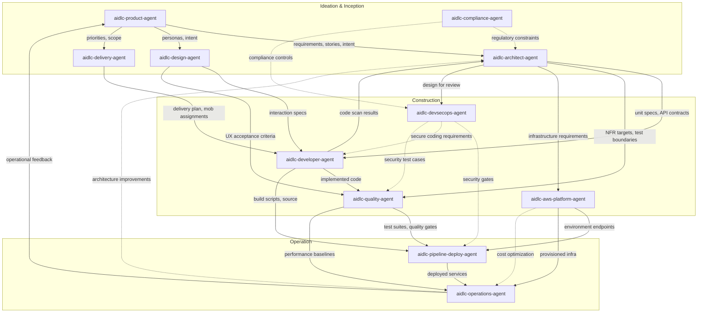

# Agent Reference

Technical reference for AI-DLC's 14-agent roster: 11 domain experts, 2
review-only agents, and the adaptive-workflows composer.

For design philosophy and rationale, see the
[Agents chapter in the User Guide](../../guide/06-agents.md).

---

## The 14 Agents (11 domain experts + 2 reviewers + composer)

| # | Agent | Domain |
|---|-------|--------|
| 1 | [aidlc-product-agent](product-agent.md) | Requirements, scope, user stories, market research |
| 2 | [aidlc-design-agent](design-agent.md) | UX/UI, wireframes, interaction design, accessibility |
| 3 | [aidlc-delivery-agent](delivery-agent.md) | Team formation, capacity planning, delivery sequencing |
| 4 | [aidlc-architect-agent](architect-agent.md) | Application design, domain modelling, NFRs, decomposition |
| 5 | [aidlc-aws-platform-agent](aws-platform-agent.md) | AWS infrastructure, IaC, FinOps, environment provisioning |
| 6 | [aidlc-compliance-agent](compliance-agent.md) | GRC, regulatory mapping, data classification, risk |
| 7 | [aidlc-devsecops-agent](devsecops-agent.md) | Threat modelling, security pipeline, secure design review |
| 8 | [aidlc-developer-agent](developer-agent.md) | Code generation, workspace detection, reverse engineering |
| 9 | [aidlc-quality-agent](quality-agent.md) | Test strategy, test generation, performance validation |
| 10 | [aidlc-pipeline-deploy-agent](pipeline-deploy-agent.md) | CI/CD pipelines, deployment strategy, release execution |
| 11 | [aidlc-operations-agent](operations-agent.md) | Observability, incident response, feedback loops |
| 12 | aidlc-product-lead-agent | Review-only: requirements / user-story / UX quality gate (balanced tier) |
| 13 | aidlc-architecture-reviewer-agent | Review-only: technical-design soundness / implementability gate (balanced tier) |
| 14 | aidlc-composer-agent | Adaptive workflow composition: proposes tailored stage plans and pending-stage reshapes |

---

## Shared Configuration

All 14 agents share a common configuration baseline defined in their frontmatter. None declares a `tools:` allowlist, so every agent inherits the **full session toolset** — all of Claude Code's built-in tools plus any MCP tools provisioned to the session. The one shipped restriction is `disallowedTools: Task`.

### The session toolset (inherited by every agent)

Every agent inherits the built-in Claude Code tools, including:

| Claude Code Tool | Purpose |
|------------------|---------|
| Read | Read files from the filesystem |
| Edit | Perform exact string replacements in files |
| Write | Write files to the filesystem |
| Glob | Fast file pattern matching |
| Grep | Content search using ripgrep |
| AskUserQuestion | Interactive user prompts (main-thread stages only) |

### Common Disallowed Claude Code Tools

| Claude Code Tool | Reason |
|------------------|--------|
| Task | Agents operate as delegated workers. The conductor (the live `/aidlc` session) performs the `Task` call that runs an agent; agents themselves never spawn subagents. `disallowedTools: Task` avoids cascading subagent chains. |

### Tools each persona is expected to exercise

Every agent *can* reach Bash and WebSearch by inheritance; the table records which personas the methodology **expects** to use them, not a per-agent grant. To genuinely restrict a persona, add an optional `tools:` allowlist (which drops inherited MCP unless `mcp__<server>__<tool>` ids are also listed) — this implementation ships no such restrictions.

| Claude Code Tool | Expected to exercise it |
|------------------|---------------------|
| Bash | aidlc-aws-platform-agent, aidlc-devsecops-agent, aidlc-developer-agent, aidlc-quality-agent, aidlc-pipeline-deploy-agent, aidlc-operations-agent |
| WebSearch | aidlc-product-agent, aidlc-design-agent, aidlc-compliance-agent |

### Agent Tiers

| Tier | Agents |
|------|--------|
| judgment | aidlc-architect-agent, aidlc-product-agent, aidlc-design-agent, aidlc-developer-agent, aidlc-quality-agent, aidlc-devsecops-agent, aidlc-compliance-agent, aidlc-aws-platform-agent, aidlc-composer-agent |
| balanced | aidlc-architecture-reviewer-agent, aidlc-product-lead-agent |
| templated | aidlc-delivery-agent, aidlc-pipeline-deploy-agent, aidlc-operations-agent |

Every shipped agent declares a `tier:` in its authored frontmatter; the
packager projects it into each harness's native model/effort keys (on Claude
Code: judgment -> `model: inherit` with no effort pin, balanced -> `model:
sonnet` with no effort pin, templated -> `model: sonnet` + `effort: medium`).
A judgment agent is therefore never downgraded below the session's own model
and effort. An agent is templated only when its output is dominantly
pattern-following — delivery plans, CI/CD YAML, observability and runbook
scaffolding — and the methodology is already encoded in the agent's knowledge
files.

The nine judgment agents share one property: their work requires
multi-constraint reasoning whose decisions cascade downstream. Architectural
boundaries, interpretation of ambiguous intent, UX trade-offs, code synthesis
under dense context, risk-based test strategy, threat prioritisation,
regulatory edge-cases, and cloud architecture trade-offs all fall in this
category. The two balanced reviewers evaluate novel input against explicit
criteria — the checklist encodes the method, so a mid-size model at session
effort suffices. See the projection table and the `tier_cap` override in
[Agent System](../05-agent-system.md).

---

## Agent Summary Table

| Agent | Lead Stages | Support Stages | Tier | Tools Expected to Exercise |
|-------|-------------|----------------|-------|------------------------------|
| [aidlc-product-agent](product-agent.md) | intent-capture, market-research, scope-definition, requirements-analysis, user-stories | rough-mockups, approval-handoff, refined-mockups | judgment | WebSearch |
| [aidlc-design-agent](design-agent.md) | rough-mockups, refined-mockups | user-stories, application-design | judgment | WebSearch |
| [aidlc-delivery-agent](delivery-agent.md) | team-formation, approval-handoff, delivery-planning | scope-definition, units-generation | templated | -- |
| [aidlc-architect-agent](architect-agent.md) | feasibility, application-design, units-generation, functional-design, nfr-requirements, nfr-design | intent-capture, reverse-engineering (synthesis), delivery-planning | judgment | -- |
| [aidlc-aws-platform-agent](aws-platform-agent.md) | infrastructure-design, environment-provisioning | feasibility, application-design, nfr-design, feedback-optimization | judgment | Bash |
| [aidlc-compliance-agent](compliance-agent.md) | (none) | feasibility, nfr-requirements, infrastructure-design, environment-provisioning | judgment | WebSearch |
| [aidlc-devsecops-agent](devsecops-agent.md) | (none) | practices-discovery, nfr-requirements, infrastructure-design, build-and-test, environment-provisioning | judgment | Bash |
| [aidlc-developer-agent](developer-agent.md) | reverse-engineering (code scan), code-generation | practices-discovery, functional-design, deployment-execution | judgment | Bash |
| [aidlc-quality-agent](quality-agent.md) | build-and-test, performance-validation | practices-discovery, nfr-requirements | judgment | Bash |
| [aidlc-pipeline-deploy-agent](pipeline-deploy-agent.md) | practices-discovery, ci-pipeline, deployment-pipeline, deployment-execution | (none) | templated | Bash |
| [aidlc-operations-agent](operations-agent.md) | observability-setup, incident-response, feedback-optimization | (none) | templated | Bash |

---

## Agent Comparison Matrix

| Agent | Bash | WebSearch | Tier | Lead Stages | Support Stages | Total Stage Involvement |
|-------|------|-----------|------|-------------|----------------|-------------------------|
| aidlc-product-agent | No | Yes | judgment | 5 | 3 | 8 |
| aidlc-design-agent | No | Yes | judgment | 2 | 2 | 4 |
| aidlc-delivery-agent | No | No | templated | 3 | 2 | 5 |
| aidlc-architect-agent | No | No | judgment | 6 | 3 | 9 |
| aidlc-aws-platform-agent | Yes | No | judgment | 2 | 4 | 6 |
| aidlc-compliance-agent | No | Yes | judgment | 0 | 4 | 4 |
| aidlc-devsecops-agent | Yes | No | judgment | 0 | 5 | 5 |
| aidlc-developer-agent | Yes | No | judgment | 2 | 3 | 5 |
| aidlc-quality-agent | Yes | No | judgment | 2 | 2 | 4 |
| aidlc-pipeline-deploy-agent | Yes | No | templated | 4 | 0 | 4 |
| aidlc-operations-agent | Yes | No | templated | 3 | 0 | 3 |

**Observations:**
- The aidlc-architect-agent has the broadest stage involvement (9 stages across 3 phases), reflecting its role as the central design authority.
- Across the full 14-agent roster, nine agents carry the `judgment` tier and five step down (the two `balanced` reviewers plus the three `templated` planners); the stepped-down agents produce reviews against explicit checklists or dominantly templated planning, CI/CD, and runbook work. The matrix above covers the 11 domain-expert agents.
- The aidlc-compliance-agent operates purely in an advisory capacity (4 support stages across Ideation, Construction, and Operation; no lead stages).
- Six of 11 agents have Bash access, all in roles that need CLI interaction (infrastructure, security, development, testing, deployment, operations).
- Three agents have WebSearch access for research tasks (product, design, compliance).

---

## Phase Participation

This table shows which agents are active in which phases, and whether they
serve as lead (L) or support (S) in that phase.

| Agent | Initialization (Phase 0) | Ideation (Phase 1) | Inception (Phase 2) | Construction (Phase 3) | Operation (Phase 4) |
|-------|--------------------------|---------------------|---------------------|------------------------|---------------------|
| aidlc-product-agent | -- | L (intent-capture, market-research, scope-definition), S (rough-mockups, approval-handoff) | L (requirements-analysis, user-stories), S (refined-mockups) | -- | -- |
| aidlc-design-agent | -- | L (rough-mockups) | L (refined-mockups), S (user-stories, application-design) | -- | -- |
| aidlc-delivery-agent | -- | L (team-formation, approval-handoff), S (scope-definition) | L (delivery-planning), S (units-generation) | -- | -- |
| aidlc-architect-agent | -- | L (feasibility), S (intent-capture) | L (application-design, units-generation), S (reverse-engineering, delivery-planning) | L (functional-design, nfr-requirements, nfr-design) | -- |
| aidlc-aws-platform-agent | -- | S (feasibility) | S (application-design) | L (infrastructure-design), S (nfr-design) | L (environment-provisioning), S (feedback-optimization) |
| aidlc-compliance-agent | -- | S (feasibility) | -- | S (nfr-requirements, infrastructure-design) | S (environment-provisioning) |
| aidlc-devsecops-agent | -- | -- | S (practices-discovery) | S (nfr-requirements, infrastructure-design, build-and-test) | S (environment-provisioning) |
| aidlc-developer-agent | -- | -- | L (reverse-engineering), S (practices-discovery) | L (code-generation), S (functional-design) | S (deployment-execution) |
| aidlc-quality-agent | -- | -- | S (practices-discovery) | L (build-and-test), S (nfr-requirements) | L (performance-validation) |
| aidlc-pipeline-deploy-agent | -- | -- | L (practices-discovery) | L (ci-pipeline) | L (deployment-pipeline, deployment-execution) |
| aidlc-operations-agent | -- | -- | -- | -- | L (observability-setup, incident-response, feedback-optimization) |

---

## Agent Collaboration Map



### Text Fallback

```
aidlc-product-agent
  |-- requirements, stories --> aidlc-architect-agent
  |-- personas, intent -------> aidlc-design-agent
  |-- priorities, scope ------> aidlc-delivery-agent

aidlc-design-agent
  |-- interaction specs ------> aidlc-developer-agent
  |-- UX acceptance criteria -> aidlc-quality-agent

aidlc-architect-agent
  |-- unit specs, API contracts --> aidlc-developer-agent
  |-- NFR targets, test boundaries --> aidlc-quality-agent
  |-- infrastructure requirements --> aidlc-aws-platform-agent
  |-- design for review -----------> aidlc-devsecops-agent

aidlc-compliance-agent
  |-- regulatory constraints ....> aidlc-architect-agent
  |-- compliance controls .......> aidlc-devsecops-agent

aidlc-devsecops-agent
  |-- security gates ............> aidlc-pipeline-deploy-agent
  |-- secure coding requirements > aidlc-developer-agent
  |-- security test cases .......> aidlc-quality-agent

aidlc-delivery-agent
  |-- delivery plan, mob assignments --> aidlc-developer-agent

aidlc-developer-agent
  |-- code scan results --> aidlc-architect-agent
  |-- implemented code ---> aidlc-quality-agent
  |-- build scripts ------> aidlc-pipeline-deploy-agent

aidlc-quality-agent
  |-- test suites, quality gates --> aidlc-pipeline-deploy-agent
  |-- performance baselines ------> aidlc-operations-agent

aidlc-aws-platform-agent
  |-- environment endpoints --> aidlc-pipeline-deploy-agent
  |-- provisioned infra -----> aidlc-operations-agent

aidlc-pipeline-deploy-agent
  |-- deployed services --> aidlc-operations-agent

aidlc-operations-agent
  |-- operational feedback -------> aidlc-product-agent  (CLOSES THE LOOP)
  |-- architecture improvements .> aidlc-architect-agent
```

---

## Cross-References

- [Architecture Overview](../01-architecture.md)
- [Orchestrator](../03-orchestrator.md)
- [Agent System](../05-agent-system.md)
- [Stage Documentation](../04-stages/)
- [Agents chapter in the User Guide (philosophy and rationale)](../../guide/06-agents.md)
- [SKILL.md (Conductor)](../../../dist/claude/.claude/skills/aidlc/SKILL.md) -- the forwarding loop that acts on engine directives; carries a human-readable stage-graph mirror
