# AI-DLC Workflow Diagrams

This document contains all Mermaid diagrams that visualize the AI-DLC (AI-Driven Development Life Cycle) methodology. Each section includes a brief explanation followed by a rendered diagram. These diagrams are derived from the engine and conductor (`aidlc-orchestrate.ts` + `SKILL.md`), stage protocol (`stage-protocol.md`), stage files, and agent definitions.

> **Note:** These diagrams are also embedded inline in their relevant reference chapters. This file serves as a consolidated index of all diagrams in one place. `<record>/` in the diagrams below = the active intent's record dir, `aidlc/spaces/<space>/intents/<YYMMDD>-<label>/`.
>
> - Diagrams 1 and 7: [Architecture](01-architecture.md)
> - Diagram 8: [Orchestrator](03-orchestrator.md) -- Session Management section
> - Diagram 9: [Orchestrator](03-orchestrator.md) -- Scope Routing section
> - Diagram 10: [Knowledge System](10-knowledge-system.md)
> - Diagram 11: [Stage Protocol](04-stage-protocol.md) -- Approval Gates section
> - Diagram 12: [Orchestrator](03-orchestrator.md) -- State Tracking section

---

## 1. End-to-End Lifecycle

The AI-DLC methodology organizes work into five sequential phases. Each phase has a verification gate at its boundary that must pass before the next phase begins. The full lifecycle spans 32 stages across the five phases, with scope determining which stages actually execute.

```mermaid
graph LR
    subgraph INITIALIZATION["INITIALIZATION (0.1-0.3)"]
        Z1["Workspace Scaffold"]
        Z4["State Init"]
        Z1 -.->|"3 stages"| Z4
    end

    subgraph IDEATION["IDEATION (1.1-1.7)"]
        I1["Intent Capture"]
        I7["Approval & Handoff"]
        I1 -.->|"7 stages"| I7
    end

    subgraph INCEPTION["INCEPTION (2.1-2.8)"]
        N1["Reverse Engineering"]
        N7["Delivery Planning"]
        N1 -.->|"8 stages"| N7
    end

    subgraph CONSTRUCTION["CONSTRUCTION (3.1-3.7)"]
        C1["Functional Design"]
        C7["CI Pipeline"]
        C1 -.->|"3.1-3.5 per Bolt; 3.6-3.7 once after all Bolts"| C7
    end

    subgraph OPERATION["OPERATION (4.1-4.7)"]
        O1["Deployment Pipeline"]
        O7["Feedback & Optimization"]
        O1 -.->|"7 stages"| O7
    end

    Z4 -->|"auto-proceed"| I1
    I7 -->|"Verification Gate 1"| N1
    N7 -->|"Verification Gate 2"| C1
    C7 -->|"Verification Gate 3"| O1
    O7 -.->|"Feedback Loop"| I1

    style INITIALIZATION fill:#f3e5f5,stroke:#9c27b0
    style IDEATION fill:#e8f5e9,stroke:#4caf50
    style INCEPTION fill:#e3f2fd,stroke:#2196f3
    style CONSTRUCTION fill:#fff3e0,stroke:#ff9800
    style OPERATION fill:#fce4ec,stroke:#e91e63
```

---

## 2. Ideation Flow

The Ideation phase captures business intent, validates feasibility, defines scope, forms the team, creates rough mockups, and produces an initiative brief for approval. Stages marked ALWAYS execute for every scope; CONDITIONAL stages are skipped for certain scopes (e.g., poc, bugfix, refactor skip Market Research). Solid arrows indicate ALWAYS routing; dashed arrows indicate CONDITIONAL routing.

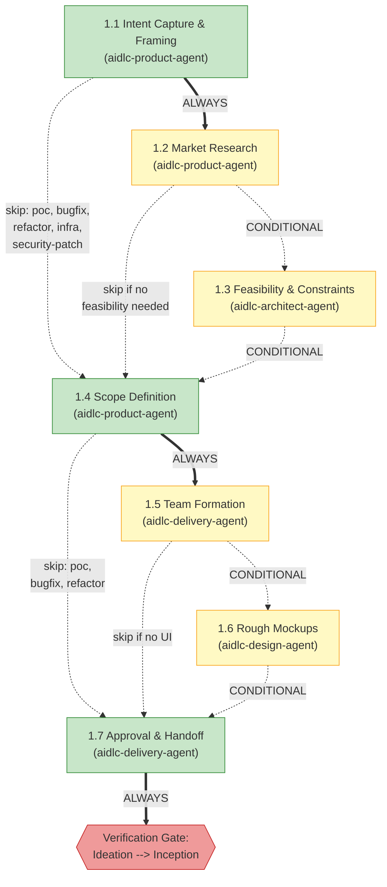

---

## 3. Inception Flow

The Inception phase analyzes the codebase (for brownfield projects), discovers team practices, elicits requirements, produces user stories and mockups, designs the application architecture, decomposes into implementation units, and plans delivery. Stage 2.1 (Reverse Engineering) runs as a pipeline (2-link chain) and is shown in a hexagonal shape: first a developer subagent scans the code, then an architect subagent synthesizes the results and writes the artifacts.

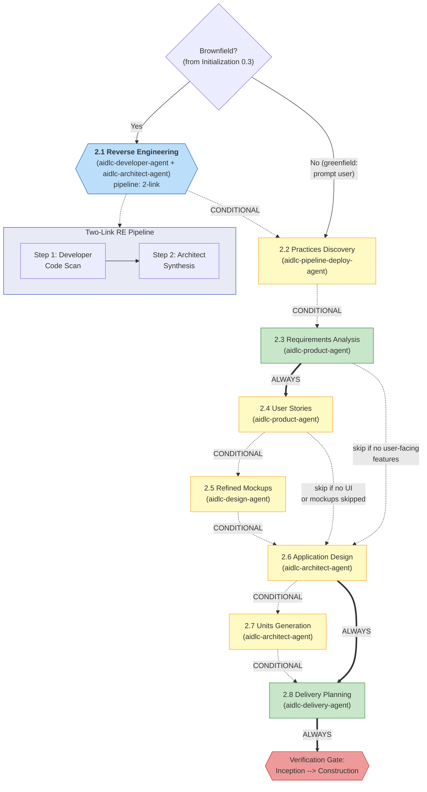

---

## 4. Construction Flow

The Construction phase executes Bolt-by-Bolt per `bolt-plan.md`. Each Bolt covers a coherent slice of one or more Units of Work and runs stages 3.1–3.5 once. The walking-skeleton Bolt always runs first as a single-Bolt batch; subsequent Bolts may run in parallel batches as the dependency graph allows. After the final Bolt, stages 3.6 (Build and Test) and 3.7 (CI Pipeline) run once across all Bolts. Stage 3.5 (Code Generation) runs as a subagent and is shown in a hexagonal shape.

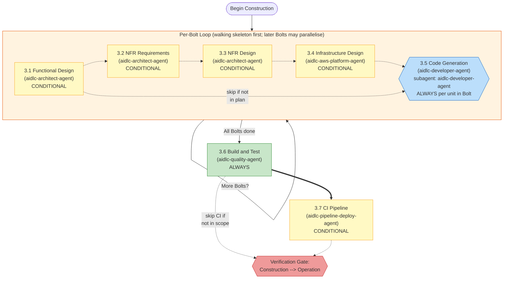

---

## 5. Operation Flow

The Operation phase covers deployment, environment provisioning, observability, incident response, performance validation, and feedback. All seven stages are CONDITIONAL (the entire phase may be skipped for poc and bugfix scopes). All stages run inline. Stage 4.7 is the terminal stage; upon approval, the workflow is complete or a new Ideation cycle can begin.

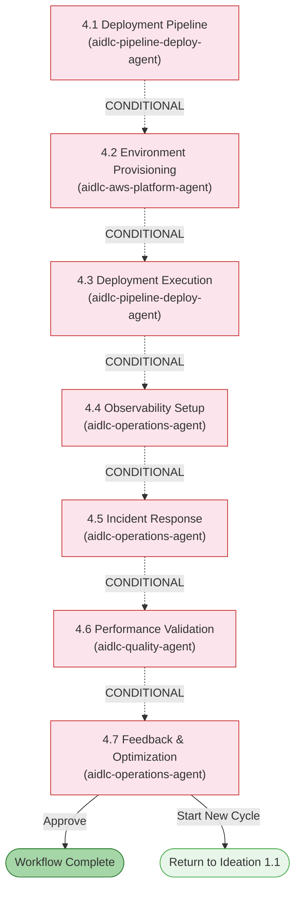

---

## 6. Agent Collaboration Map

The full 14-agent roster comprises 11 domain agents, 2 review-only agents, and
the adaptive-workflows composer. This diagram intentionally covers the 11
domain agents and their primary artifact flows. The review-only agents perform
independent product and architecture checks, while the composer proposes and
reshapes adaptive stage plans; see the [Agent Reference](agents/README.md) and
[Reviewer Invocation](04-stage-protocol.md#reviewer-invocation).

The conductor (SKILL.md) performs each agent invocation as the engine directs;
agents never invoke each other directly. Information flows between agents
through artifacts stored in the intent's record dir
(`aidlc/spaces/<space>/intents/<YYMMDD>-<label>/`). The diagram culminates in
the feedback loop from aidlc-operations-agent back to aidlc-product-agent.

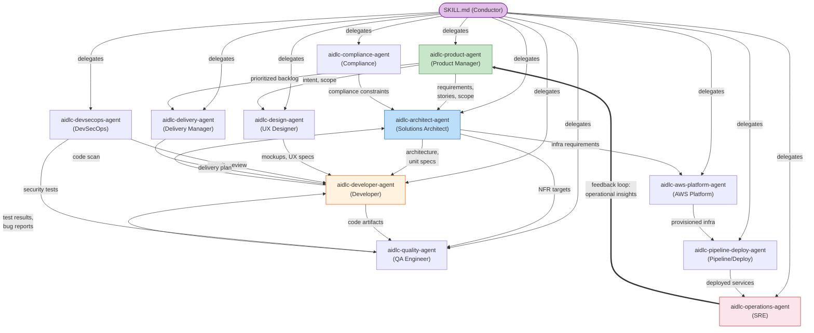

---

## 7. Execution Model

This implementation uses four active execution modes for stages. **Inline** stages execute directly within the orchestrator conversation (user can interact). **Subagent** stages delegate to a single agent via the Claude Code Task tool (hub-and-spoke when the stage declares support agents). **Pipeline** stages chain agents sequentially, each link advancing the work product (Reverse Engineering is the shipped example). **Mob** stages convene all support agents in parallel rounds (User Stories is the shipped example).

```mermaid
flowchart LR
    subgraph INLINE["Mode 1: Inline"]
        direction TB
        IN1["Orchestrator reads\nstage file"]
        IN2["Load agent persona\n+ knowledge"]
        IN3["Execute stage steps\ndirectly in conversation"]
        IN4["User interaction\navailable"]
        IN5["Approval gate\n(AskUserQuestion)"]
        IN1 --> IN2 --> IN3 --> IN4 --> IN5
    end

    subgraph SUBAGENT["Mode 2: Subagent (simple)"]
        direction TB
        SA1["Orchestrator reads\nstage file"]
        SA2["Prepare context:\nartifacts + persona"]
        SA3["Task tool call\n(subagent_type specified)"]
        SA4["Subagent executes\n(no user interaction)"]
        SA5["Return structured\nsummary to orchestrator"]
        SA6["Orchestrator presents\ncompletion + approval"]
        SA1 --> SA2 --> SA3 --> SA4 --> SA5 --> SA6
    end

    subgraph TWOSTEP["Mode 3: Pipeline (2-link RE chain)"]
        direction TB
        TS1["Orchestrator reads\nRE stage file"]
        TS2["Task: aidlc-developer-agent\ncode scan"]
        TS3["Developer returns\nscan results"]
        TS4["Task: aidlc-architect-agent\nsynthesis"]
        TS5["Architect produces\n9 artifacts"]
        TS6["Orchestrator presents\ncompletion + approval"]
        TS1 --> TS2 --> TS3 --> TS4 --> TS5 --> TS6
    end

    subgraph MOB["Mode 4: Mob (parallel rounds)"]
        direction TB
        MB1["Orchestrator reads\nstage file"]
        MB2["Lead drafts the\nartifacts inline"]
        MB3["Parallel Tasks: all\nsupport agents, blind"]
        MB4["Each writes its\ncontribution file"]
        MB5["Lead integrates;\nobjection triage\n(judgment -> human,\nknowledge -> round 2)"]
        MB6["Orchestrator presents\ncompletion + approval"]
        MB1 --> MB2 --> MB3 --> MB4 --> MB5 --> MB6
    end

    style INLINE fill:#e8f5e9,stroke:#4caf50
    style SUBAGENT fill:#e3f2fd,stroke:#2196f3
    style TWOSTEP fill:#fff3e0,stroke:#ff9800
    style MOB fill:#f3e5f5,stroke:#9c27b0
```

---

## 8. Session Resume Flow

When the user invokes `/aidlc`, the orchestrator checks for an active intent's `aidlc-state.md`. If found, it offers four resume options. If not found, it births the first intent. The orchestrator also checks for `.aidlc-recovery.md` to detect possible state corruption from context compaction.

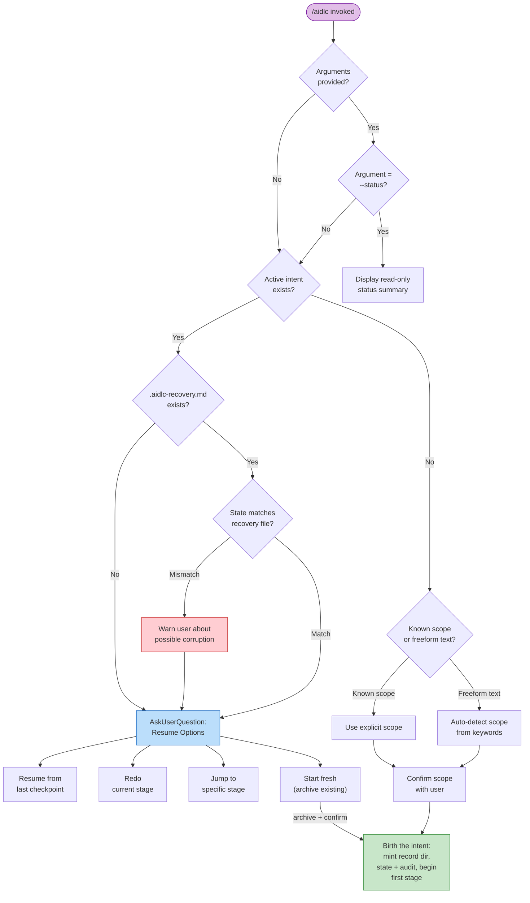

---

## 9. Scope Routing

> Scope routing table: see [Orchestrator Reference -- Scope Mapping](03-orchestrator.md#scope-to-stage-mapping).

---

## 10. Knowledge Loading Order

Each stage loads knowledge in a strict 6-step order. This ensures guardrails take precedence, followed by shared methodology, then agent-specific knowledge, then team customizations, and finally prior stage artifacts. The sequence diagram below shows the loading order for any stage activation.

> **Note:** Steps 1-5 are agent knowledge loading (defined in each agent file); Step 6 (prior stage artifacts) is context added by the orchestrator at runtime, not a file-loading step.

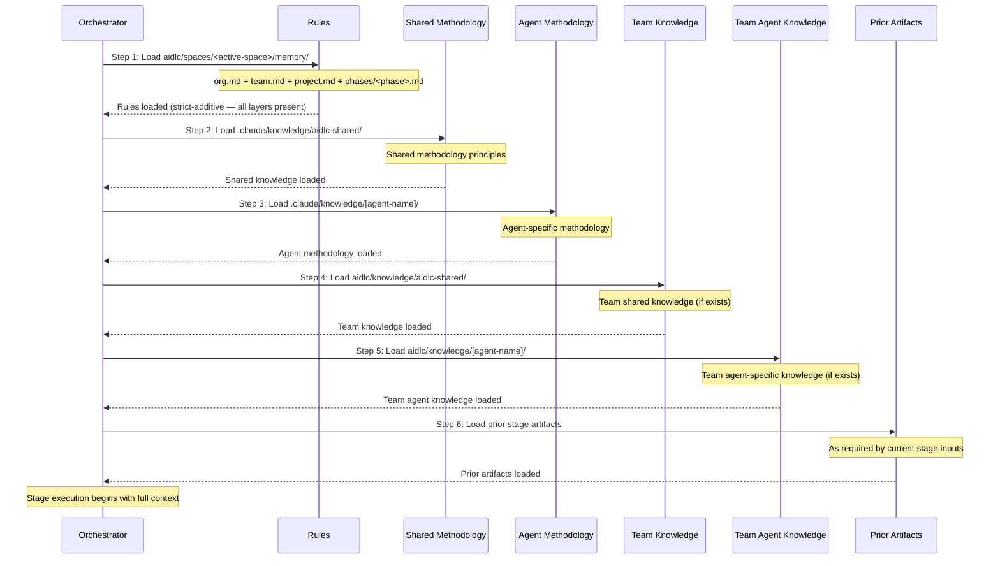

---

## 11. Approval Gate Flow

Every stage (except the 3 Initialization stages) ends with an approval gate. The orchestrator logs the options to the audit trail before presenting them to the user, then logs the user's response afterward. After 3 revision cycles, an "Accept as-is" escape hatch becomes available. Ideation and Inception stages may also include a conditional third option to add a previously skipped stage.

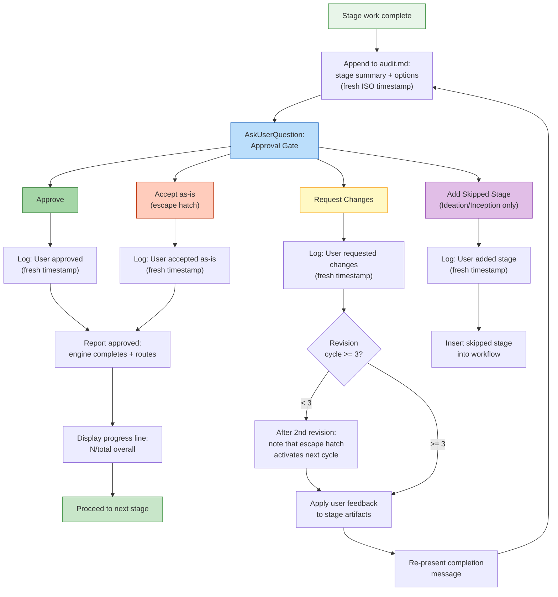

---

## 12. State Tracking

The `aidlc-state.md` file tracks each stage with checkbox notation: `[ ]` (not
started), `[-]` (in progress), `[?]` (awaiting approval), `[R]` (revising),
`[x]` (completed), and `[S]` (skipped). The engine owns these transitions;
conductors report outcomes rather than editing checkbox state. The diagram also
shows the side flows for skip, redo, and jump operations.

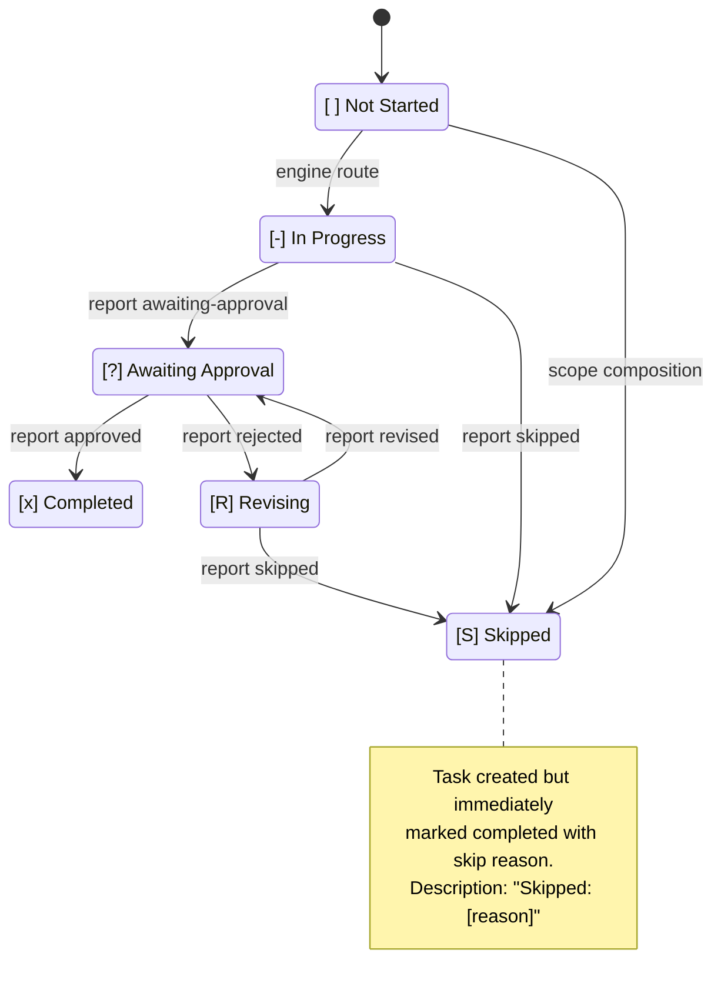

```mermaid
flowchart TD
    subgraph NORMAL["Normal Flow"]
        direction LR
        NS1["[ ] Not Started"]
        IP1["[-] In Progress"]
        AW1["[?] Awaiting Approval"]
        CO1["[x] Completed"]
        NS1 -->|"engine route"| IP1
        IP1 -->|"report gate open"| AW1
        AW1 -->|"report approved"| CO1
    end

    subgraph SKIP["Skip Flow"]
        direction LR
        NS2["[ ] Not Started"]
        SK2["[S] Skipped"]
        NS2 -->|"scope composition"| SK2
    end

    subgraph REDO["Redo Flow"]
        direction LR
        CO3["[x] Completed\nor [-] In Progress"]
        NS3["[ ] Not Started"]
        IP3["[-] In Progress"]
        CO3 -->|"user requests redo\n(delete artifacts)"| NS3
        NS3 -->|"re-execute stage"| IP3
    end

    subgraph JUMP["Jump Flow"]
        direction LR
        IP4["[-] In Progress\n(stage A)"]
        NS4["[ ] Not Started\n(stage B)"]
        IP4B["[-] In Progress\n(stage B)"]
        IP4 -->|"user requests jump\n(warn about skipped stages)"| NS4
        NS4 -->|"begin target stage"| IP4B
    end

    style NORMAL fill:#e8f5e9,stroke:#4caf50
    style SKIP fill:#fff9c4,stroke:#f9a825
    style REDO fill:#e3f2fd,stroke:#2196f3
    style JUMP fill:#fce4ec,stroke:#e91e63
```

---

## Summary of Execution Modes by Stage

This reference table maps every stage to its execution mode and lead agent for quick lookup.

| Stage | Name | Mode | Lead Agent |
|-------|------|------|------------|
| 0.1 | Workspace Scaffold | inline (auto-proceed) | orchestrator |
| 0.2 | Workspace Detection | inline (auto-proceed, deterministic scanner) | orchestrator |
| 0.3 | State Init | inline (auto-proceed) | orchestrator |
| 1.1 | Intent Capture | inline | aidlc-product-agent |
| 1.2 | Market Research | inline | aidlc-product-agent |
| 1.3 | Feasibility | inline | aidlc-architect-agent |
| 1.4 | Scope Definition | inline | aidlc-product-agent |
| 1.5 | Team Formation | inline | aidlc-delivery-agent |
| 1.6 | Rough Mockups | inline | aidlc-design-agent |
| 1.7 | Approval & Handoff | inline | aidlc-delivery-agent |
| 2.1 | Reverse Engineering | pipeline (2-link) | aidlc-developer-agent + aidlc-architect-agent |
| 2.2 | Practices Discovery | subagent | aidlc-pipeline-deploy-agent |
| 2.3 | Requirements Analysis | inline | aidlc-product-agent |
| 2.4 | User Stories | mob | aidlc-product-agent |
| 2.5 | Refined Mockups | inline | aidlc-design-agent |
| 2.6 | Application Design | inline | aidlc-architect-agent |
| 2.7 | Units Generation | inline | aidlc-architect-agent |
| 2.8 | Delivery Planning | inline | aidlc-delivery-agent |
| 3.1 | Functional Design | inline | aidlc-architect-agent |
| 3.2 | NFR Requirements | inline | aidlc-architect-agent |
| 3.3 | NFR Design | inline | aidlc-architect-agent |
| 3.4 | Infrastructure Design | inline | aidlc-aws-platform-agent |
| 3.5 | Code Generation | subagent (aidlc-developer-agent) | aidlc-developer-agent |
| 3.6 | Build and Test | inline | aidlc-quality-agent |
| 3.7 | CI Pipeline | inline | aidlc-pipeline-deploy-agent |
| 4.1 | Deployment Pipeline | inline | aidlc-pipeline-deploy-agent |
| 4.2 | Environment Provisioning | inline | aidlc-aws-platform-agent |
| 4.3 | Deployment Execution | inline | aidlc-pipeline-deploy-agent |
| 4.4 | Observability Setup | inline | aidlc-operations-agent |
| 4.5 | Incident Response | inline | aidlc-operations-agent |
| 4.6 | Performance Validation | inline | aidlc-quality-agent |
| 4.7 | Feedback & Optimization | inline | aidlc-operations-agent |
